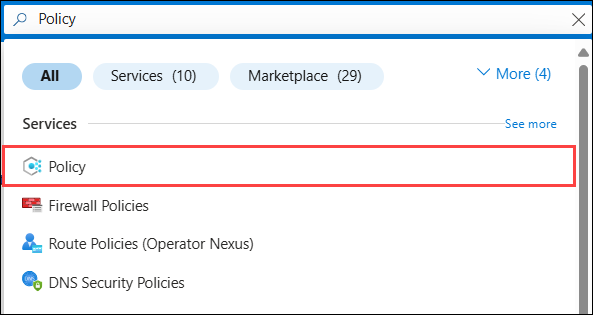
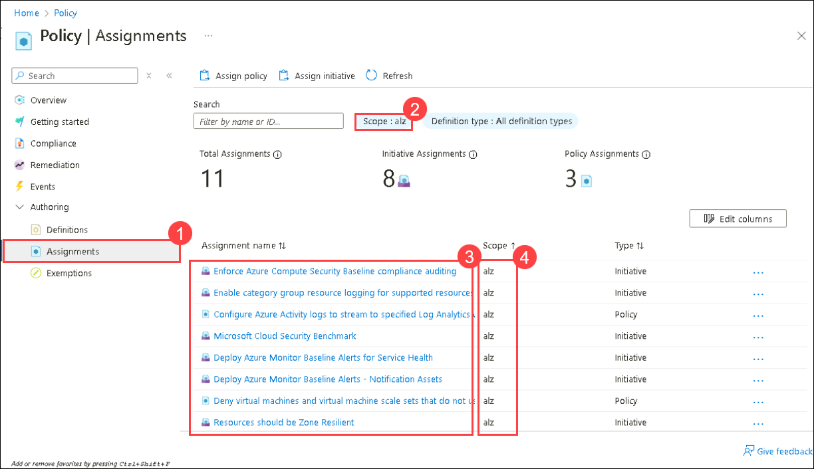
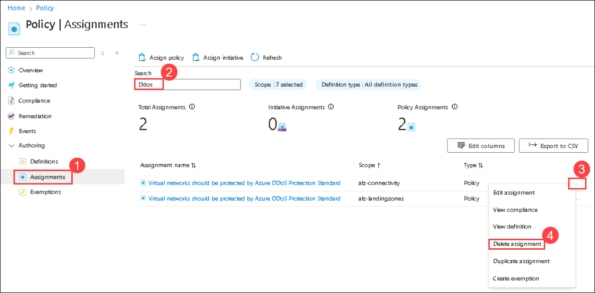

#### **Review Policy Assignments**

1. In the **Azure Portal**, use the search bar to search and select **Policy** under Services.

     

1. Navigate to the **Assignments (1)** under the Authoring section within the Policy and make sure that the scope is set to **alz (2)**, then review the list of **policy assignments (3)** applied **Management Group (4)** level.

    >**Note:** You may see a varying number of policy assignments depending on your deployment type.

     

1. In the **Assignments** page, search for **DDoS (2)** and hit enter.

1. Now you should see policies with the name **Virtual networks should be protected by Azure DDoS Protection Standard**, click on the **ellipsis (...) (3)** next to each policy, then from the list click on **Delete assignment (4)**. Click **Yes** on the delete popup.

    
