## Exercise 1: Introduction to Azure Landing Zone and Deployment Options

### Estimated Duration: 120 Minutes

## Overview
In this exercise, you will explore the **Azure Landing Zone (ALZ) framework**, its governance components (Management Groups, Policies, and Subscriptions), and the benefits of automation. You will then deploy ALZ using either ARM or Bicep templates (as per your preference), setting up prerequisites and executing the deployment via the Azure Portal and Azure DevOps services.

## Objectives
In this exercise, you will complete the following tasks:
   - Task 1: Understanding Azure Landing Zone (ALZ) Concepts 
   - Task 2: Deploying Azure Landing Zone

### Task 1: Understanding Azure Landing Zone (ALZ) Concepts 
In this task, you will learn about Azure Landing Zone (ALZ) concepts, which create scalable, secure, and modular environments for cloud deployments, divided into platform and application-specific zones.

#### **Overview of Enterprise-Scale ALZ Framework**
The Azure Landing Zone (ALZ) is a well-architected and scalable environment designed to help enterprises adopt Azure in a structured and governed manner. It follows Microsoft’s Cloud Adoption Framework (CAF) to establish a foundation that supports various workloads while ensuring security, compliance, and operational excellence.

An Azure landing zone consists of platform landing zones and application landing zones:
- **Platform Landing Zone**: A subscription that provides shared services like identity, connectivity, and management for all applications. These are managed by central IT teams. Examples include Identity, Management, and Connectivity subscriptions.
- **Application Landing Zone**: A subscription dedicated to hosting specific applications. These are pre-configured with policies and controls through management groups. Examples include `Landing Zone A1` and `Landing Zone A2` subscriptions, which are the two applications.

### ALZ is built on the following principles:
 * Modular Architecture – Supports different workloads with a flexible design.
 * Security & Compliance – Enforces Azure policies, RBAC, and governance controls.
 * Networking & Connectivity – Implements hub-and-spoke, Virtual WAN, or hybrid models.
 * Automation & Infrastructure as Code (IaC) – Uses Bicep, ARM, or Terraform for deployment.

### Role of Management Groups (MGs), Policies, and Subscriptions
To ensure consistency across multiple workloads, Azure Landing Zones leverage Management Groups (MGs), Policies, and Subscriptions:
 * **Management Groups (MGs):**
   * Organize multiple Azure subscriptions under a hierarchical structure.
   * Help apply governance policies consistently across all workloads.
   * Example:
        ```
        Root Management Group
        └── alz
            ├── alz-decommissioned
            ├── alz-landingzones
            │   ├── alz-corp
            │   ├── alz-online
            │   └── alz-platform
            ├── alz-connectivity
            │   └── alz-identity
            ├── alz-management
            └── alz-sandboxes
        ```

  * **Azure Policies:**
    * Enforce security best practices (e.g., restrict public IPs, enforce encryption).
    * Automate governance with compliance controls for workloads.
    * Example policies:
        * Enforce HTTPS-only for App Services.
        * Restrict deployment of unapproved VM SKUs.
        
  * **Subscriptions:**
    * Act as billing units and provide resource isolation.
    * Mapped to business units or environments (e.g., Prod, Dev, Test).

### Benefits of Governance and Automation in ALZ
 * Security & Compliance – Enforce centralized security and compliance control at scale.
 * Operational Efficiency – Automate resource provisioning via Bicep/Terraform. It supports CI/CD for infrastructure to enhance efficiency.
 * Scalability – Support multi-region, multi-team deployment and enforce standardized architecture.
 * Cost Management – Optimize spending using Azure Cost Management + Budgets.

### Task 2: Deploying Azure Landing Zone.
In this task, you will deploy an Azure Landing Zone (ALZ) using ARM or Bicep templates. You will set up the foundational Management Groups (MGs), Subscriptions, and Governance policies required for an enterprise-scale environment.

#### Choosing Between ARM and Bicep for Deployment
 * ARM Templates – Azure's native JSON-based Infrastructure as Code (IaC) approach.
 * Bicep – A declarative, modular, and human-readable language that simplifies deployment while still compiling down to ARM.

#### **Enable Required Permissions**
Before deploying ALZ, you must have elevated access at the tenant level.

1. If you have already logged in to the Azure portal, then search for **Microsoft Entra (1)** and select **Microsoft Entra ID (2)** under Services.

   >**Note:** If you have not logged on already, please follow the steps on the previous page of the guide and come back to this step.

   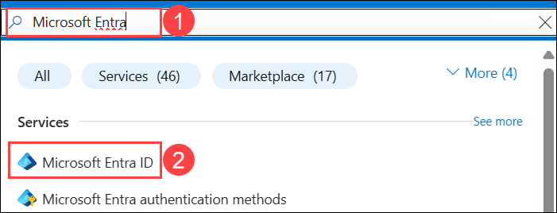

1. On the left pane, under the Manage section, click on **Properties (1)**, locate Access management for Azure resources, and **enable the toggle  (2)** for elevated access and click on **Save (3)**.

    

1. Navigate to **Cloud Shell** from the top right corner menu in the Azure portal.

    

1. In **Welcome to Azure Cloud Shell** page, select **PowerShell**.

    

1. On the Getting started page, select **Mount storage account (1)** and select the **Azure HOL (SUFFIX) (2)** subscription from the dropdown and click on **Apply (3)**.

    

    >**Note:** The SUFFIX value in the subscription name is a unique identifier assigned to you for this lab environment, which will be different for each user. Please select the one that you see in the dropdown list. 

1. On the Mount storage account page, select **We will create storage account for you (1)**, then click on **Next (2)**. Wait for the deployment to complete.

    

1. Once the **CloudShell** opens, run the following command to assign yourself Owner access at the tenant scope on Root management:

   ```powershell
   New-AzRoleAssignment -SignInName "<inject key="AzureAdUserEmail"></inject>" -Scope "/" -RoleDefinitionName "Owner"
   ```
    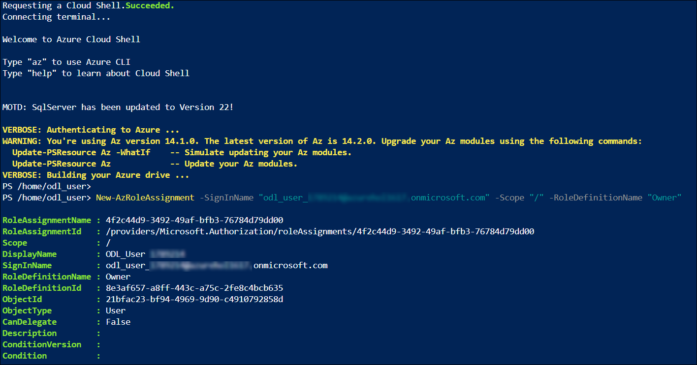

    > **Note:** You may see a warning like: 
    >
    > `"WARNING: You're using Az version 13.4.0. The latest version of Az is 14.1.0..."`
    >
    > This warning can be safely **ignored**. It does not affect the functionality or execution of the commands.

> **Congratulations** on completing the task! Now, it's time to validate it. Here are the steps:
> - Hit the Validate button for the corresponding task. If you receive a success message, you can proceed to the next task. 
> - If not, carefully read the error message and retry the step, following the instructions in the lab guide.
> - If you need any assistance, please contact us at cloudlabs-support@spektrasystems.com. We are available 24/7 to help you out.
<validation step="75747fcf-2474-48d7-a6ba-bd830141c9a6" />

#### **Deploying the Azure Landing Zone (ALZ)**

You have two options for deploying ALZ: 

You can choose your preferred method of deployment!

Click on the drop-down arrow ▶ for the deployment type you want to proceed with.

<details>
  <summary>1. ARM Template via the Azure portal</summary>

To deploy the Landing Zone using the ARM template:

1. Open a new tab in your web browser inside the LabVM and navigate to the following URL to access the ARM template for ALZ deployment:

   ```
   https://aka.ms/caf/ready/accelerator
   ```

1. On the **Custom deployment** blade, in the **Deployment settings** section, select the Region as `EastUS` **(1)** and click on **Next (2)**.

    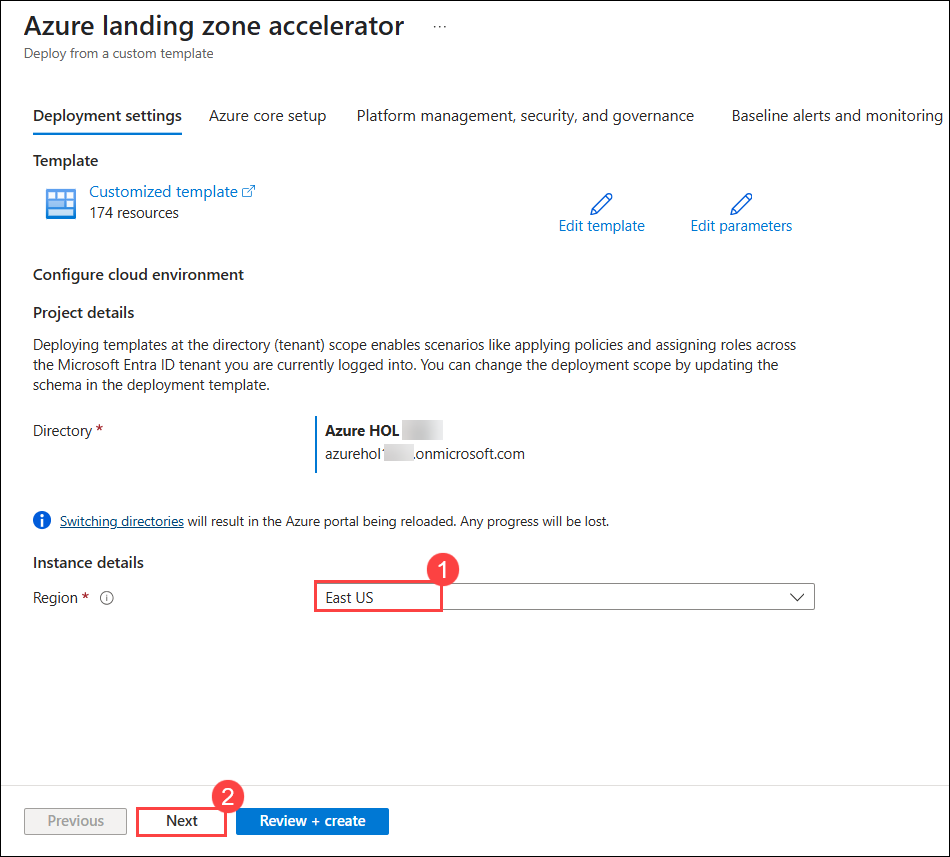

1. In the **Azure core setup** section, enter the following details and click on **Next (4)**. 

   - Resource prefix (Root ID): **alz (1)** 
   - Deploy in a secondary region: **No (2)** 
   - Prevent the deployment of classic resources: **No (3)**

     

1. In the **Platform management, security, and governance** section, enter the following details and click on **Next (5)**.

    - Enforce Key Vault recommended guardrails: **No (1)**
    - Enforce Backup and Recovery recommended guardrails: **No (2)**
    - Management subscription: **L3 - ES Management Sub - SUFFIX (3)**
    - Deploy Microsoft Defender for Cloud and enable security monitoring for your platform and resources: **No (4)**

        

        

1. In the **Alerts and Monitoring** section, enter the following details and click on **Next (4)**.

   - Deploy Service Health Alerts via built-in policy: **No (1)**
   - Deploy one or more Azure Monitor Baseline Alerts: **No (2)**
   - Deploy Service Health Alerts via AMBA: **No (3)**

      

1. In **Network Topology and connectivity** select the below options and click on **Next (11)**:

   - Deploy networking topology: **Hub and spoke with Azure Firewall (1)**
   - Connectivity subscription: **L1 - Connectivity Sub - SUFFIX (2)**
   - Address space (required for hub virtual network): **10.100.0.0/16 (3)**
   - Enable DDoS Network Protection: **No (4)**
   - Create Private DNS Zones for Azure PaaS services: **No (5)**
   - Deploy Azure Firewall: **Yes (6)**
   - Select Azure firewall tier: **Basic (7)**
   - Select Availability Zones for the Azure Firewall: **Unselect the selected zones (8)**
   - Subnet for Azure Firewall: **10.100.0.0/24 (9)**
   - Subnet for Azure Firewall Mgmt: **10.100.2.0/24 (10)**

      

1. Under **Identity** select **No (1)** for **Assign recommended policies to govern identity and domain controllers** and select **L2 - Identity Sub - SUFFIX (2)**  for Identity subscription and click on **Next (3)**.

    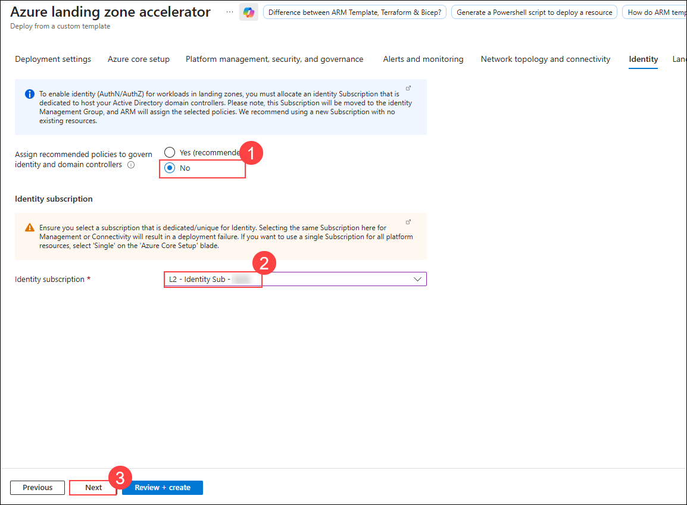

1. In **Landing zones configuration** enter the following details and click on **Review + Create (8)**.

    - Prevent inbound management ports from internet: **No (1)**
    - Ensure subnets are associated with NSG: **No (2)**
    - Ensure Azure SQL is enabled with transparent data encryption: **No (3)**
    - Ensure Azure SQL Threat Detection is enabled: **No (4)**
    - Ensure auditing is enabled on Azure SQL: **No (5)**
    - Enforce Key Vault recommended guardrails: **No (6)**
    - Enforce Backup and Recovery recommended guardrails: **No (7)** 

       

1. After the template has passed the validation, click **Create**. 
   
   >**Note:** This will deploy the initial Management Group structure together with the required Policy/PolicySet definitions. It will also move the subscription under the right Management Group and will deploy a Log Analytics Workspace and enable platform monitoring. This process will take around **20-25 minutes** to complete.

    

   >**Note:** **If your deployment gets stuck at `alz-Msg-eastus-XXXX` and does not go through after `5 MINUTES`, please follow the below steps**.
   >    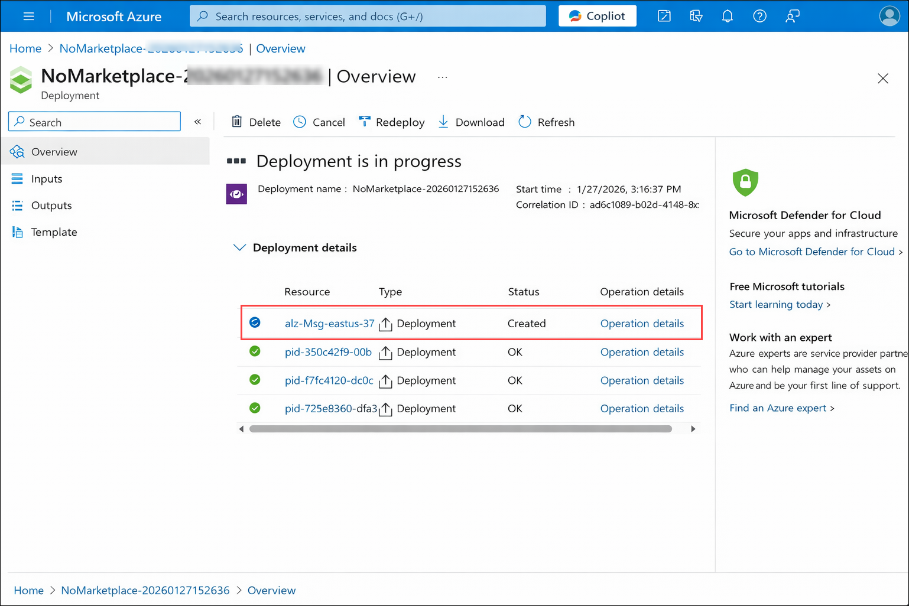
   > 1. Click on **Cancel** button on the deployments page.
   >    
   > 2. Select **Cancel deployment** and then follow the steps from Step 1 to redeploy the template
   >    

1. Once the operation is complete, you can review your progress and proceed to the next exercise.

</details>

<details>
  <summary>2. Bicep Template via Azure CLI</summary>


To deploy the Landing Zone using the Bicep template:
  
1. Navigate to **Cloud Shell** from the top right corner menu in the Azure portal if you have closed it.

    

1. Paste the code below in the PowerShell console to grant access to the App registration.

    ```powershell
    New-AzRoleAssignment `
    -ObjectId "<inject key="Service Principal App ObjectId"></inject>" `
    -RoleDefinitionName "Owner" `
    -Scope "/"
    ```

1. Minimize the **Cloud Shell** and then search and navigate to **Subscriptions**.

    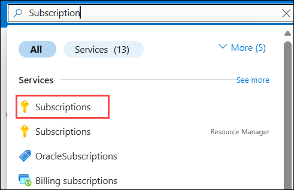

1. Select **L1 - Connectivity Sub - SUFFIX (1)** and copy the **Subscription ID (2)** and paste it in the notepad for future use. Repeat the same for **L2 - Governance Sub - SUFFIX**, **L2 - Identity Sub - SUFFIX**,**L3 - ES Landing Zone Sub - SUFFIX** and  **L3 - ES Management Sub - SUFFIX** Subscriptions.

    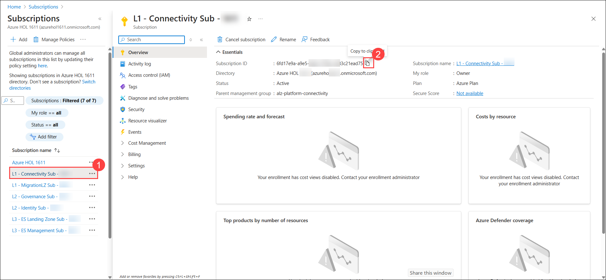

     

1. Open to **Cloud Shell** in the Azure portal and click on **Switch to Bash**.

    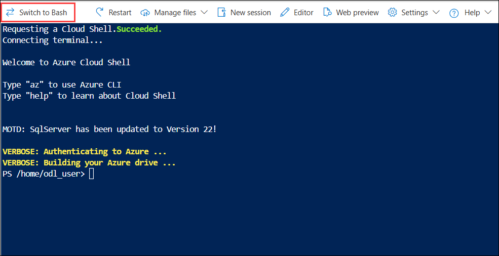

1. On the **Switch to Bash in Cloud Shell** click on **Confirm**.

    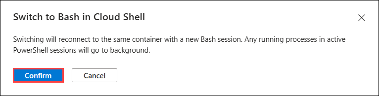

1. Click on **Settings (1)** dropdown list, select **Go to Classic version (2)**.  

    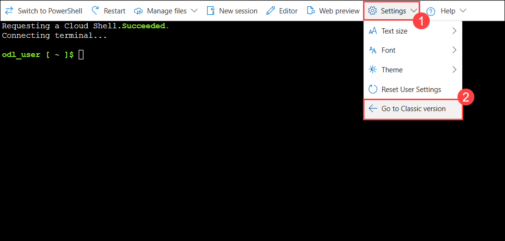

1. Enter the command below to open the code editor.

    ```bash
    code .
    ```
    

1. Click on **Upload/Download files (1)** and then click on **Upload (2)**.

    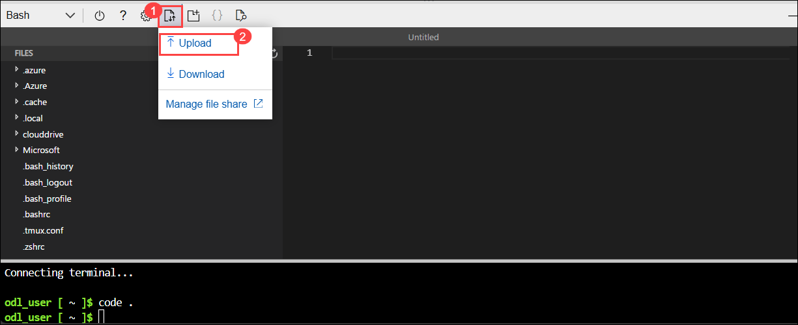

1. Navigate to `C:\LabFiles`**(1)** and select the **alzbicep (2)** zip file and click on **Open (3)**.

    

1. Run the below command in the **Bash terminal** to **unzip (1)** the file that you uploaded, and once the command is executed, go to the code editor and click on **Refresh (2)** button.

    ```bash
    unzip alzbicep.zip
    ```

    

1. Navigate to `alzbicep/infra-as-code/bicep/modules/roleAssignments/parameters/roleAssignmentManagementGroup.servicePrincipal.parameters.all.json` **(1)** in the code editor and then paste **<inject key="Service Principal App ObjectId"></inject>** in the `parAssigneeObjectId` **(2)** parameter value as shown in the image below.

    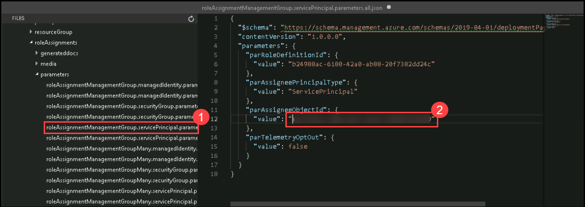

1. Save the file by pressing **Ctrl + S** on your keyboard.

1. Now go to `alzbicep/infra-as-code/bicep/modules/subscriptionPlacement/parameters/subscriptionPlacement.parameters.1.json` **(1)** in the code editor and then paste the Subscription IDs of **L1 - Connectivity Sub - SUFFIX (2)** into the `parSubscriptionIds` parameter value that you have copied in the notepad in **Step 4**.

    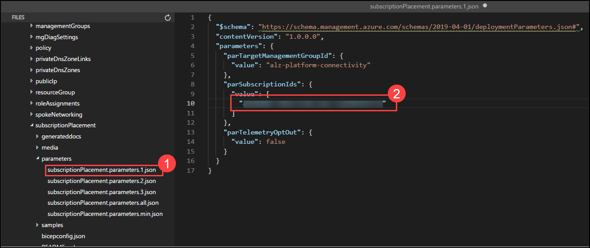

1. Save the file by pressing **Ctrl + S** on your keyboard.

1. Now go to `alzbicep/infra-as-code/bicep/modules/subscriptionPlacement/parameters/subscriptionPlacement.parameters.2.json` **(1)** in the code editor and then paste the Subscription IDs of **L2 - Identity Sub - SUFFIX (2)** into the `parSubscriptionIds` parameter value that you have copied in the notepad in **Step 4**.

    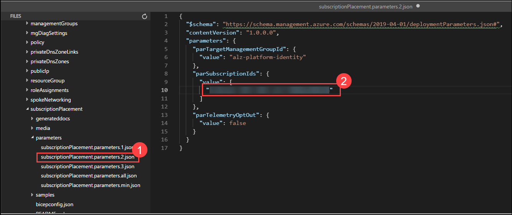

1. Save the file by pressing **Ctrl + S** on your keyboard.

1. Now go to `alzbicep/infra-as-code/bicep/modules/subscriptionPlacement/parameters/subscriptionPlacement.parameters.3.json` **(1)** in the code editor and then paste the Subscription IDs of **L3 - ES Management Sub - SUFFIX (2)** into the `parSubscriptionIds` parameter value that you have copied in the notepad in **Step 4**.

    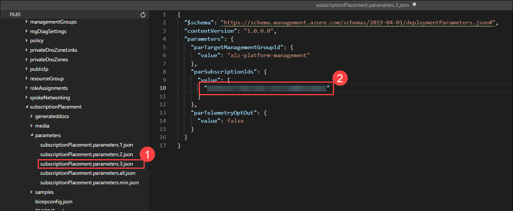

1. Save the file by pressing **Ctrl + S** on your keyboard.

1. Navigate to `alzbicep/infra-as-code/bicep/modules/policy/assignments/alzDefaults/parameters/alzDefaultPolicyAssignments.parameters.all.json` **(1)** and then paste the Subscription ID of **L3 - ES Management Sub - SUFFIX** that you have copied in the notepad in **Step 4** in place of **xxxxxxxx-xxxx-xxxx-xxxx-xxxxxxxxxxxx** **(2)** as shown in the image below:

    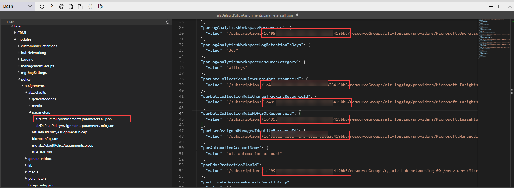

1. Save the file by pressing **Ctrl + S** on your keyboard.

1. Go back to the **Bash terminal** in the Azure portal and paste the following script to deploy **Management Groups**.

    ```bash
    dateYMD=$(date +%Y%m%dT%H%M%S%NZ)
    NAME="alz-MGDeployment-${dateYMD}"
    LOCATION="eastus"
    TEMPLATEFILE="alzbicep/infra-as-code/bicep/modules/managementGroups/managementGroups.bicep"
    PARAMETERS="@alzbicep/infra-as-code/bicep/modules/managementGroups/parameters/managementGroups.parameters.all.json"

    az deployment tenant create --name ${NAME:0:63} --location $LOCATION --template-file $TEMPLATEFILE --parameters $PARAMETERS
    ```

    > **Note:** If this step takes more than **10 minutes**, please click on Ctrl + C to stop the execution and re-run the above script again.

1. After the successful execution of the above script, run the following script to deploy **Policy definitions**, which deploys all necessary policies required for the management group. 

    ```bash
    dateYMD=$(date +%Y%m%dT%H%M%S%NZ)
    NAME="alz-PolicyDefsDefaults-${dateYMD}"
    LOCATION="eastus"
    MGID="alz"
    TEMPLATEFILE="alzbicep/infra-as-code/bicep/modules/policy/definitions/customPolicyDefinitions.bicep"
    PARAMETERS="@alzbicep/infra-as-code/bicep/modules/policy/definitions/parameters/customPolicyDefinitions.parameters.all.json"

    az deployment mg create --name ${NAME:0:63} --location $LOCATION --management-group-id $MGID --template-file $TEMPLATEFILE --parameters $PARAMETERS
    ```
    > **Note:** If you encounter the error shown below during this step, you can safely ignore it and continue with the next step.

        

1. After successfully executing the above script, run the following script to deploy the **Hub Networking resources**. This will provision all required components for connectivity. Ensure you replace the **ConnectivitySubscriptionId** value with the Subscription ID of **L1 - Connectivity Sub - SUFFIX** in the script below, which you copied in Step 4.

    
   ```bash
   ConnectivitySubscriptionId="L1 - Connectivity Sub - SUFFIX"
   az account set --subscription "$ConnectivitySubscriptionId"
   dateYMD=$(date +%Y%m%dT%H%M%S%NZ)
   NAME="alz-HubNetworkingDeploy-${dateYMD}"
   LOCATION="eastus"
   MGID="alz"
   GROUP="rg-$MGID-hub-networking-001"
   TEMPLATEFILE="alzbicep/infra-as-code/bicep/modules/hubNetworking/hubNetworking.bicep"
   PARAMETERS="@alzbicep/infra-as-code/bicep/modules/hubNetworking/parameters/hubNetworking.parameters.all.json"
   az group create --location "$LOCATION" \
   --name "$GROUP"
   az deployment group create --name "${NAME:0:63}" --resource-group "$GROUP" --template-file "$TEMPLATEFILE" --parameters "$PARAMETERS"
   ```

    > **Note:** This step may take around **45-60 minutes** to complete.

1. After the successful execution of the above script, run the following script to deploy **Custom Role definitions**, which are essential for assigning specific permissions to users or groups within the management group.

    ```bash
    MGID="alz"

    LOCATION="eastus"

    dateYMD=$(date +%Y%m%dT%H%M%S%NZ)
    NAME="alz-CustomRoleDefsDeployment-${dateYMD}"
    TEMPLATEFILE="alzbicep/infra-as-code/bicep/modules/customRoleDefinitions/customRoleDefinitions.bicep"
    PARAMETERS="@alzbicep/infra-as-code/bicep/modules/customRoleDefinitions/parameters/customRoleDefinitions.parameters.all.json"

    az deployment mg create --name ${NAME:0:63} --location $LOCATION --management-group-id $MGID --template-file $TEMPLATEFILE --parameters $PARAMETERS
    ```

1. After successfully executing the above script, run the next script to deploy **Role Assignments**, which grant necessary permissions across management groups, subscriptions, and Users.  

    ```bash
    #!/bin/bash

    location="eastus"
    managementGroupId="alz"
    runNumber=$(date +%Y%m%d%H%M%S)
    template="alzbicep/infra-as-code/bicep/modules/roleAssignments/roleAssignmentManagementGroup.bicep"
    parameters="@alzbicep/infra-as-code/bicep/modules/roleAssignments/parameters/roleAssignmentManagementGroup.servicePrincipal.parameters.all.json"

    # Deploy role assignment to management group
    az deployment mg create \
    --template-file $template \
    --parameters $parameters \
    --location $location \
    --management-group-id $managementGroupId \
    --name create_role_assignment-$runNumber
    ```

1. After the successful execution of the above script, run the next script to deploy **Subscription Placements**, ensuring proper organization and alignment across management groups and subscriptions.

    ```bash
    #!/bin/bash
    
    location="eastus"
    timestamp=$(date +%Y%m%dT%H%M%S%NZ)
    template="alzbicep/infra-as-code/bicep/modules/subscriptionPlacement/subscriptionPlacement.bicep"
    
    declare -A deployments=(
    ["connectivity"]="subscriptionPlacement.parameters.1.json alz-platform-connectivity"
    ["identity"]="subscriptionPlacement.parameters.2.json alz-platform-identity"
    ["management"]="subscriptionPlacement.parameters.3.json alz-platform-management"
    )
    
    for key in "${!deployments[@]}"; do
    IFS=' ' read -r paramFile mgId <<< "${deployments[$key]}"
    name="subscriptionPlacement-${key}-${timestamp}"
    
    az deployment mg create \
        --name ${name:0:63} \
        --location $location \
        --management-group-id $mgId \
        --template-file $template \
        --parameters @alzbicep/infra-as-code/bicep/modules/subscriptionPlacement/parameters/$paramFile
    done
    ```

1. After successfully executing the above script, run the next script to deploy **Policy Assignments**, ensuring the proper application of governance and compliance policies across management groups and subscriptions.

    ```bash
    dateYMD=$(date +%Y%m%dT%H%M%S%NZ)
    NAME="alz-alzPolicyAssignmentDefaults-${dateYMD}"
    LOCATION="eastus"
    MGID="alz"
    TEMPLATEFILE="alzbicep/infra-as-code/bicep/modules/policy/assignments/alzDefaults/alzDefaultPolicyAssignments.bicep"
    PARAMETERS="@alzbicep/infra-as-code/bicep/modules/policy/assignments/alzDefaults/parameters/alzDefaultPolicyAssignments.parameters.all.json"

    az deployment mg create --name ${NAME:0:63} --location $LOCATION --management-group-id $MGID --template-file $TEMPLATEFILE --parameters $PARAMETERS
    ```

    > **Note:** If this step takes more than **10 minutes**, please click on Ctrl + C to stop the execution and re-run the above script again.

1. Once the deployment is complete, all essential resources required for Platform Landing Zone will be successfully provisioned.

</details>

> **Congratulations** on completing the task! Now, it's time to validate it. Here are the steps:
> - Hit the Validate button for the corresponding task. If you receive a success message, you can proceed to the next task. 
> - If not, carefully read the error message and retry the step, following the instructions in the lab guide.
> - If you need any assistance, please contact us at cloudlabs-support@spektrasystems.com. We are available 24/7 to help you out.

<validation step="5c8ae1b1-d60d-412c-9855-325f1c616f18" />

## Summary
In this exercise, you have gained a comprehensive understanding of the Azure Landing Zone (ALZ) framework, including its core components such as Management Groups, Policies, and Subscriptions. You have also explored the benefits of governance and automation in ALZ. 

Finally, you have successfully deployed an Azure Landing Zone using either ARM or Bicep templates, setting up the foundational infrastructure for a secure and scalable cloud environment.

### You have successfully completed the exercise!
### Click the **Next >>** button to proceed to Exercise 2.


