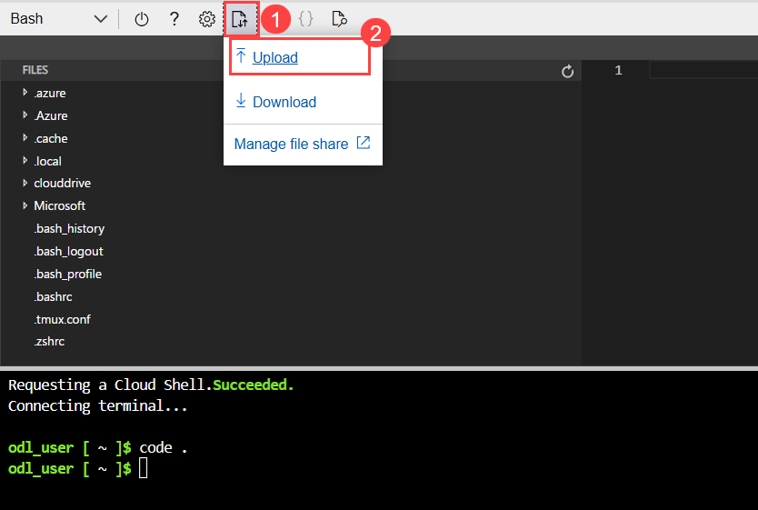
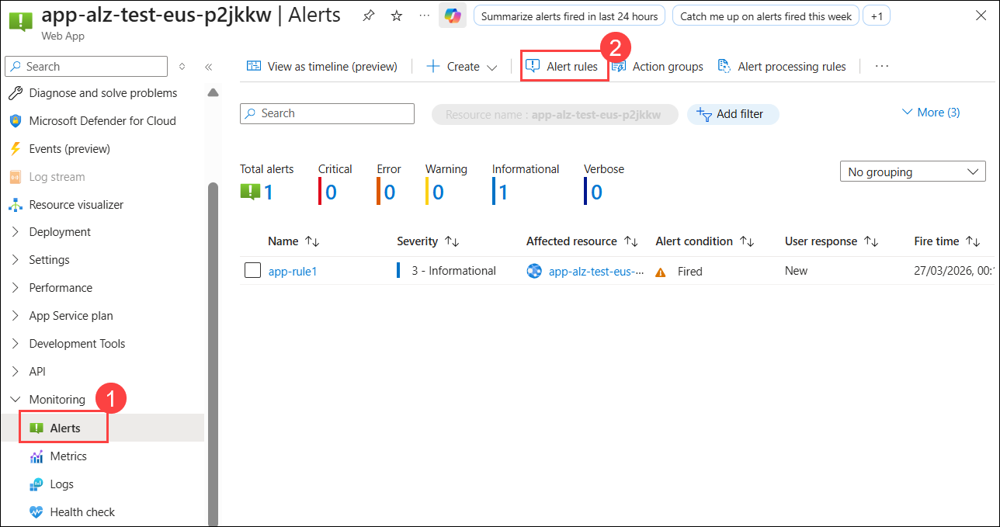
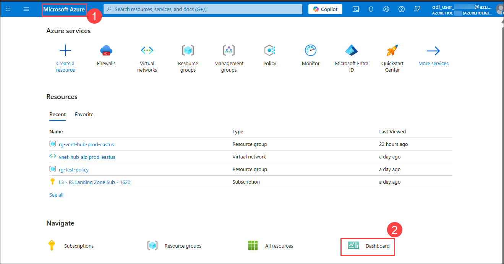
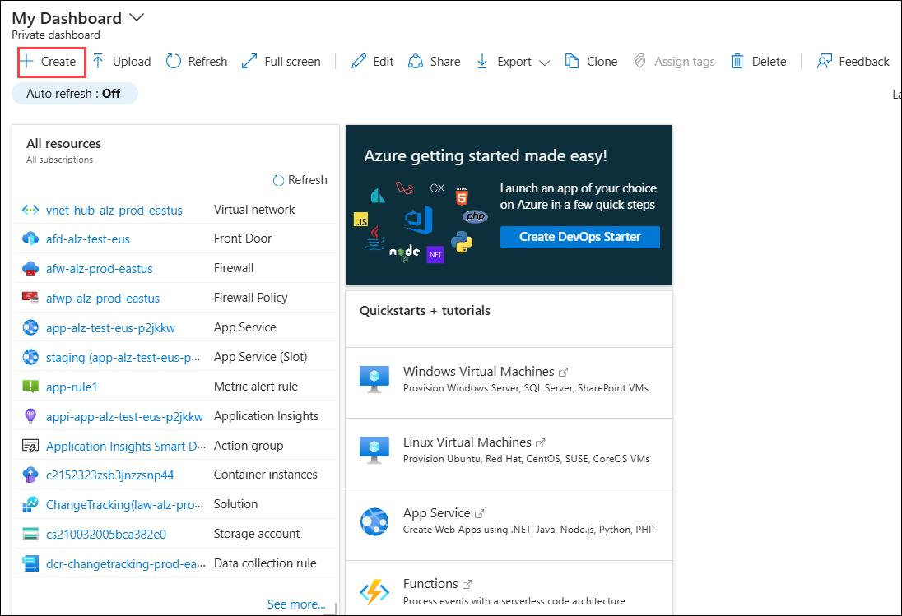

## Exercise 6: Monitoring and Observability in Azure Landing Zone with Azure Monitor Baseline Alerts (AMBA)

### Estimated Duration: 135 Minutes

## Overview

In this exercise, you will delve into the powerful capabilities of Azure Monitor Baseline Alerts (AMBA) to enhance monitoring, logging, and observability for the App Service Landing Zone (ALZ). You'll learn to configure proactive monitoring tools, create dynamic alert rules using machine learning-based thresholds, analyze logs efficiently using Kusto Query Language (KQL), and adopt best practices for scalability and cost optimization. By leveraging preconfigured Log Analytics Workspaces and centralized log analysis, you will ensure the reliability, performance, and security of Azure App Services while mastering techniques to troubleshoot and simulate issues effectively.

### Objectives
In this exercise, you will complete the following tasks:
   - Task 1: Deploying AMBA
   - Task 2: Reviewing Monitoring and Log Analytics Configurations
   - Task 3: Configuring and Managing Azure Monitor Baseline Alerts (AMBA)
   - Task 4: Operational Insights and Best Practices.

### Task 1: Deploying AMBA
In this task, you will deploy AMBA (Azure Monitor Baseline Alerts), which helps establish baseline monitoring and alerting to ensure visibility and proactive management of the App Service environment.

You have two options for deploying App Service Landing Zone Accelerator: 

You can choose your preferred method of deployment!

Click on the drop-down arrow ▶ for the deployment type you want to proceed with.

<details>
  <summary>1. ARM Template via the Azure portal</summary>

1. Copy the URL below and open a new tab in the Web Browser where you have logged in to Azure and paste it there, and hit the enter button on your keyboard.

    ```
    https://portal.azure.com/#view/Microsoft_Azure_CreateUIDef/CustomDeploymentBlade/uri/https%3A%2F%2Fraw.githubusercontent.com%2FAzure%2Fazure-monitor-baseline-alerts%2F2025-04-04%2Fpatterns%2Falz%2FalzArm.json/uiFormDefinitionUri/https%3A%2F%2Fraw.githubusercontent.com%2FAzure%2Fazure-monitor-baseline-alerts%2F2025-04-04%2Fpatterns%2Falz%2Falz-portal.json
    ```

1. On the **Deployment Settings** page, enter the following details, then click on **Next (3).**

    - Management group under Project details: **alz (1)**
    - Management Subscription Id: **L3 - ES Management Sub - SUFFIX** **(2)**

      

1. On the **Management Group Settings** page, enter the following details, then click on **Review + Create (7)**.
    - Enterprise Scale Company Management Group: **alz (1)**
    - Platform Management Group: **alz-platform (2)**
    - Connectivity Management Group: **alz-connectivity (3)**
    - Identity Management Group: **alz-identity (4)**
    - Management Management Group: **alz-management (5)**
    - Landing Zone Management Group: **alz-landingzones (6)**

      

1. On the **Review + Create** page, verify the details and click on **Create.**
> **Note:** The deployment may take a few minutes to complete. 
</details>

<details>
  <summary>2. ARM Template via Azure CLI</summary>

1. Navigate to **Cloud Shell** from the top right corner menu in the Azure portal.

    

1. Click on **Settings (1)** dropdown list, select **Go to Classic version (2)**.  

    

1. Enter the command below to open the code editor.

    ```bash
    code .
    ```
    

1. Click on **Upload/Download files (1)** and then click on **Upload (2)**.

    

1. Navigate to `C:\LabFiles`**(1)** and select the **alzArm.param (2)** file and click on **Open (3)**.

    

1. Now run the below command in the **Bash terminal** to deploy the AMBA template.

    ```bash
    location="eastus"
    pseudoRootManagementGroup="alz"
    az deployment mg create --name "amba-MainDeployment" --template-uri https://raw.githubusercontent.com/Azure/azure-monitor-baseline-alerts/main/patterns/alz/alzArm.json --location $location --management-group-id $pseudoRootManagementGroup --parameters "@alzArm.param.json"
    ```

1. When prompted, enter the details below and hit enter after each entry.
    - Please provide string value for 'enterpriseScaleCompanyPrefix' (? for help): **alz (1)**
    - Please provide string value for 'platformManagementGroup' (? for help): **alz-platform (2)**
    - Please provide string value for 'IdentityManagementGroup' (? for help): **alz-platform-identity (3)**
    - Please provide string value for 'managementManagementGroup' (? for help): **alz-platform-management (4)**
    - Please provide string value for 'connectivityManagementGroup' (? for help): **alz-platform-connectivity (5)**
    - Please provide string value for 'LandingZoneManagementGroup' (? for help): **alz-landingzones (6)**
    - Please provide string value for 'managementSubscriptionId' (? for help): `Replace with L3 - ES Management Sub - SUFFIX Subscription ID` **(7)**

       

      >**Note:** The deployment may take a few minutes to complete. 

</details>


### Task 2: Reviewing Monitoring and Log Analytics Configurations
In this task, you will review the monitoring and Log Analytics configurations to ensure proper telemetry and diagnostics. This includes simulating downtime, verifying the provided RBAC for monitoring, assigning the Monitoring Contributor role, configuring Log Analytics Workspaces for the App Service, and enabling networking to support secure and reliable connectivity.

#### **Log Analytics Workspaces for App service**

Log Analytics brings together logs, metrics, and diagnostics from Azure resources, making it easier to query and analyze data efficiently. In this scenario, the Log Analytics workspace is preconfigured with the app service, allowing you to effectively monitor and troubleshoot.

1. Navigate back to your **App Service** and select **Logs (2)** from the left pane under Monitoring.

    

1. Select **KQL mode (1)** in the *New Query 1* tab.
   >**Note:** Close any pop-up that appears while opening the Logs

    

1. **Run** the below query to retrieve HTTP request and response logs from your Azure App Service. The logs typically include information such as the request method (GET, POST), status codes, URL, response time, and more.

    ```kusto
    AppServiceHTTPLogs | take 10
    ```
    

    >**Note:** If this query doesn't return any results, go back to the Overview page, open the application link in your browser, and check the logs after 5 mintues.

    >**Note:** While closing the Logs page, if you encounter any pop-up, click on **Ok**.

#### **Provide RBAC for Monitoring Contributor**

1. Navigate to **Management groups** and select **alz** Management group from the Azure portal.  

    

1. Click on **Access control (IAM) (1)** and select **+ Add (2)** and **Add role assignments (3)**.  

    

1. In the **Add role assignments** page, search and select **Monitoring Contributor (1)** and click on **Next (2).**

    

1. On the next page, select **Users, group or service principal (1)** in the Assign access to: and click on **+ Select members (2).** 

1. In the Select members pane, select **User 2 (3)** and then click on **Select (4).**

    

1. Click **Next** twice and **Review + assign** to assign the role.  

#### **Verify the Provided RBAC for Monitoring**

1. Once the assignment is complete, navigate to **New InPrivate window**(if you are using Edge) and search and navigate to the Azure portal from the link below

    ```
    https://portal.azure.com/
    ```
1. On the **Sign in to Microsoft Azure** tab, you will see the login screen. In that enter the following email/username, and click on **Next (2).** 

    * **Email/Username**: <inject key="User 02 UPN"></inject> **(1)**
   
        
     
1. Now enter the following password and click on **Sign in (2)**.
   
    * **Password**: <inject key="User 02 Password"></inject> **(1)**

      

1. At the **Let's keep your account secure** window, select **Next**.

    

1. On the Install Microsoft Authenticator app page, install the app in your phone if you do not have it and, select **Next**.

1. On the **Set up your account in app** page, select **Next**. 
1. A **QR code** will be displayed on your computer screen.

1. In the Authenticator app, select **Scan a QR code** and scan the code displayed on your screen.

1. After scanning, click **Next** to proceed.

    

1. On your phone, enter the number shown on your computer screen in the Authenticator app and select **Next**.
       
1. If prompted to stay signed in, you can click **No**.

    

1. If a **Welcome to Microsoft Azure** popup window appears, click **Cancel** to skip the tour.

1. After logging in, search and navigate to **Management groups** in the Azure portal and select the **alz** Management group and click on **Access control (IAM) (1)** and then **View my access (2)** and Notice that User 2 only has **Monitoring contributor (3)** role.

    

1. Search and navigate to the **All resources** section in the Azure portal. 

    

1. On the **All resources** page,  you'll see the resources that are related to monitoring resources, such as alerts, Log Analytics workspaces, etc.

    

1. **Minimize** the InPrivate window and return to the main browser window.

### Task 3: Configuring and Managing Azure Monitor Baseline Alerts (AMBA)
In this task, you will configure and manage Azure Monitor Baseline Alerts (AMBA) by setting up alert rules, fine-tuning thresholds, enabling anomaly detection, verifying notifications and logs, and creating alerts for App Service downtime and 4xx errors.

#### **Create an Alert for App Service Downtime**
Alerts notify you of critical conditions, like downtime, based on metrics or logs.

1. Navigate to the **App Service** page, go to **Alerts (1)** from the left menu under Monitoring and then click on **Create alert rule (2)**.

    

1. In the **Condition** section, add the following deatils, then click on **Next: Actions >  (3).**
   - **Signal name** - Select **HTTP 4xx  (1)**.
   - **Threshold**: **1** occurrence  **(2)**.

        

1. In the **Actions** section, choose **Use action groups (1)**, then select **Application Insights Smart Detection (2)**. After that, click **Select (3)** and proceed by clicking **Next: Details > (4)**.  

    

    > **Note:** If you don't see the option, it might be due to a recent UI change. The options may now appear as shown in the image below.
    upd.png)

1. Name the alert `app-rule1` **(1)** and click on **Review + Create (2).**

    

1. On the **Review + Create** page click on **Create.**

1. Once the alert is created, you will be navigated back to the Alerts page. 

1. On the Alerts page, select **Action groups.**

    
    
1. Select **Application Insights Smart Detection (1)** and click on **Edit (2).**

    

1. From the dropdown, select **Email/SMS message/Push/Voice (1)**, make sure that Email option is checked and enter **<inject key="User 02 UPN"></inject>** **(2)** and enter the name of the alert as **User 2 Email (3)** and click on **Ok (4)**. Click anywhere outside the dropdown and then **Save changes (5)** and close the page.

    

#### **Real-Time Downtime Monitoring: 4xx Error Alert**

1. Navigate to **Overview (1)** page in the **App service** and copy **Default domain (2)** URL and replace it with <your-app> in the below link.

    ```
    https://<your-app>/doesnotexist
    ```
    

1. Paste the edited link into a new browser tab, press **Enter**, it will throw an error as shown in the image below, **refresh** the page to gather a few logs and alerts

    

#### **Verify Alert notifications and logs**

1. Now, navigate back to **Alerts (1)** from App service and notice the **alert generated (2)** due to **Http 4xx error.**

    

    > **Note:** If the alert does not show up, wait for 2-5 minutes and refresh the page or try the *doesnotexist* link in a new tab.

1. Navigate back to window where you are logged in with  **User 2's** account (InPrivate window), and search for the link below in a new tab

    ```
    https://outlook.office365.com/mail/
    ```

1. Select the **User 2** account to go to the Inbox page.

    

1. In the Inbox page, select any mail, and you will see the alert triggered due to the **Http 4xx** error.

    

1. Navigate to your **app service** from **User 2** and go to **Logs (1)** from the left pane and **paste (2)** the below KQL query and click on **Run (3)**, you will see a list of **Http 4xx logs** as a result.

    ```kusto 
        AppServiceHTTPLogs
        | where ScStatus in (403, 404)
        | project
            TimeGenerated,
            ScStatus,
            CsMethod,
            CsUriStem,
            CsUriQuery,
            CsHost,
            Referer,
            UserAgent,
            CsUsername,
            CIp,
            TimeTaken,
            ComputerName,
            Result
        | order by TimeGenerated desc
    ```
    

#### **Fine-Tuning Alert Thresholds & Anomaly Detection**

1. Navigate to your App Service and click on **Alerts (1)** under Monitoring and click on **Alert rules (2)**.

    

1. Select **app-rule1** and click on **Edit**.

    

1. In the **Edit alert rule** page, click on **Condition** tab.

1. In the condition tab, we can modify various conditions that are required for your app, where we can modify 
    - **Threshold type:**
      - **Static**: Fixed values
      - **Dynamic**: AI-based, adapts to historical patterns (e.g., detects anomalies in request rates).
    - **Threshold**
    - **Frequency**
    - Click **Review + save** if you have made any changes to your App.

        


### Task 4: Operational Insights and Best Practices
In this task, you will create a monitoring dashboard, analyze metrics and logs for performance tuning, use Central Log Analytics with Resource Graph Explorer, and apply best practices to optimize App Service operations.

#### **Create a Monitoring Dashboard for App Service**
Dashboards provide a visual overview of your App Service’s health.

1. In the Azure portal, click on the **Microsoft Azure (1)** button in the top left corner of the screen, which navigates you to the Homepage of Azure, and then click on **Dashboard (2)**.

        

1. Click on **+ Create** in the **My Dashboard** page. 

    

1. Select **App Service tracking** on the Create a dashboard page.

    

1. Name the Dashboard as **AppService Dashboard (1)** and **L3 - ES Landing Zone Sub - SUFFIX (2)** as the subscription and the App Service **app-alz-test-eus-xxxxxx (3)** as the resource and **Submit (4).**

   >**Note:** If the **Submit** button becomes disabled after selecting the web app, switch the Subscription to a different one, then reselect **L3 - ES Landing Zone Sub - SUFFIX**. 

    

1. We can now see the tiles that are related to the App Service. You can arrange tiles as desired.

    

#### **Analyzing Metrics, Logs, and Telemetry for Performance Tuning**

1. In the search bar of the Azure portal, search and select **Monitor**. 

    

1. On the Monitor page, navigate to **Metrics (1)** from the left-hand menu.

1. On the **Select a scope (2)** page, expand  **L3- ES Landing Zone Sub - Suffix (3)**, **rg-spoke-alz-test-eastus (4)** and select **app-alz-test-eus-xxxxxx (5)** and click on **Apply (6).**

    

1. In the chart settings select **CPU time (1)** as the *Metric* and **Count (2)** as *Aggregation* and click on **Add metric (3).**

     

1. Select **Data In (1)** as the *Metric* and **Count (2)** as *Aggregation*. This chart shows that the app service is consistently using CPU resources throughout the day, while incoming data traffic is relatively low with occasional spikes, indicating steady backend activity with light or infrequent external requests. 

     
    >**Note:** You can also add other metrics and save them to the dashboard that you created in the earlier tasks to easily access them.

#### **Central Log Analytics with Resource Graph Explorer**

1. From the Azure portal, search and navigate to **Resource Graph Explorer.**

    

1. Make sure that the Directory is **Azure HOL SUFFIX (1)** and **paste (2)** the below query in the query editor and click on **Run query (3).**

    ```kusto
    Resources
    | where type =~ 'microsoft.web/sites'
    | project name, location, resourceGroup, id
    ```

    

1. Observe the output once the query is executed, it returns all App Services with SKU (pricing tier) and other basic details.

    

1. You can use the retrieved data to refine alert rules, optimize resource usage, or design dashboards for actionable insights at an enterprise scale.

## Summary 

In this exercise, you have configured and managed Azure Monitor Baseline Alerts (AMBA) for your App Service Landing Zone. You created alert rules for monitoring downtime and 4xx errors, fine-tuned thresholds, enabled anomaly detection, and verified notifications and logs. Additionally, you created a monitoring dashboard, analyzed metrics and logs for performance tuning, and utilized Central Log Analytics with Resource Graph Explorer to gain insights into your App Service environment. These practices are essential for maintaining the reliability, performance, and security of your applications hosted in Azure.

## Conclusion

By completing this Azure Landing Zone lab, you have gained hands-on experience in deploying an Azure Landing Zone (ALZ) with Management Groups and Subscriptions to establish a well-structured and governed cloud environment. You deployed a secure App Service workload using the ALZ Accelerator and validated networking and connectivity.

You also implemented monitoring and observability using Azure Monitor, Log Analytics, and alerts, while applying governance and security controls through Azure Policy and RBAC. Additionally, you deployed and secured an application within an App Landing Zone subscription.

Overall, you now have a solid understanding of how to design, deploy, and manage Azure Landing Zones with governance, security, and monitoring best practices.

## You have successfully completed the lab!

