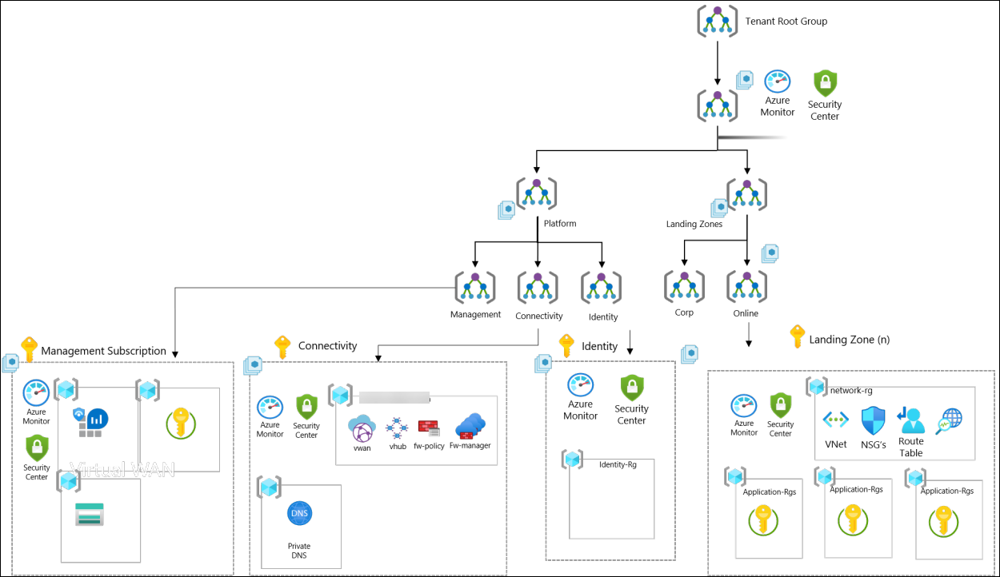
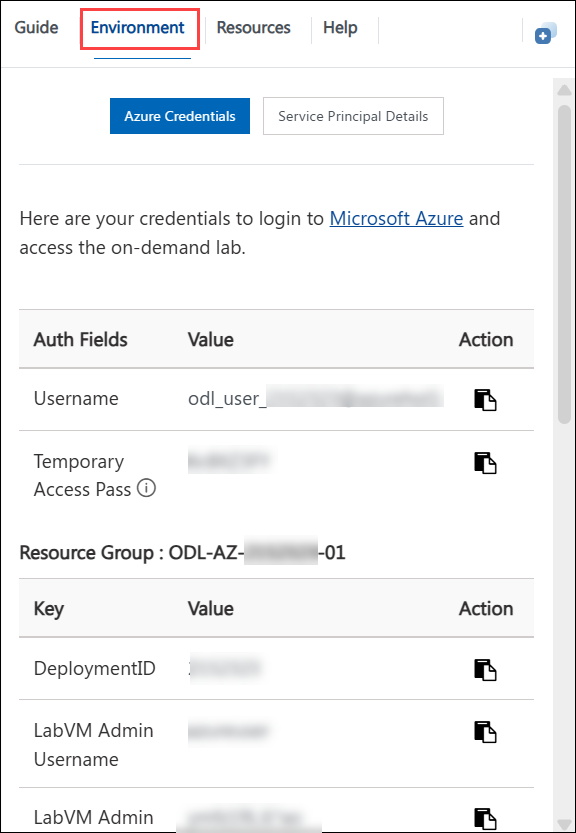

# Azure Landing Zone

### Overall Estimated Duration: 8 Hours

## Overview

In this lab, you will deploy an **Azure Landing Zone (ALZ)** with **Management Groups (MGs)** and **Subscriptions** to establish a well-structured cloud environment. You will utilize the **App Service ALZ Accelerator** for a secure and scalable App Service deployment, ensuring best practices for workload hosting. You will validate the network foundation for the deployed landing zone — including VNet peering, private DNS zones, Network Security Groups (NSGs), and App Service connectivity — and enable App Service public access for testing. Additionally, you will implement **Azure Monitor Baseline Alerts (AMBA)** for proactive monitoring and alerting, helping to maintain system health. **Governance and security controls** will be enforced by applying Azure Policies, role-based access control (RBAC), and compliance measures. You will also deploy and secure an application workload within a new App Landing Zone (LZ) subscription while configuring Azure Monitor, Log Analytics, and operational dashboards to gain visibility into system performance and security.

## Objective

Understand how to design, deploy, monitor, and manage an **Azure Landing Zone (ALZ)** for enterprise-scale cloud adoption. By the end of the lab, you will have practical experience with the platform foundation, deployment accelerators, governance, and observability. Specifically, you will learn to:

- **Deploy an Azure Landing Zone (ALZ) with Management Groups (MGs) and Subscriptions**
  Learn how to structure and deploy an Azure Landing Zone using Management Groups and Subscriptions to establish governance, security, and scalability best practices.
- **Use the App Service ALZ Accelerator to deploy secure, scalable App Service workloads**
  Leverage the App Service ALZ Accelerator to deploy and manage secure, enterprise-ready web applications while aligning to organizational policies.
- **Validate network configuration and App Service connectivity**
  Verify VNet peering between hub and spoke, confirm private DNS zone links, review NSGs for micro-segmentation, and enable App Service public network access for validation and testing.
- **Deploy and configure Azure Monitor Baseline Alerts (AMBA) for monitoring and observability**
  Deploy AMBA, create machine-learning-based/dynamic alert rules, configure Log Analytics, write Kusto (KQL) queries for telemetry, and validate alerting and dashboards to maintain system health.
- **Apply Azure Policy, Role-Based Access Control (RBAC), and governance controls**
  Enforce security and compliance by implementing Azure Policy initiatives, RBAC role assignments, and subscription management best practices.
- **Deploy and secure an application workload within an App Landing Zone subscription**
  Provision application resources in the App Landing Zone, enable Managed Identity and Key Vault integration, and apply network and security controls.
- **Configure Azure Monitor, Log Analytics, KQL-based troubleshooting, and operational dashboards**
  Collect and analyze telemetry from App Services and platform resources, build queries and dashboards, and use operational insights to troubleshoot and optimize the environment.

## Pre-requisites

Participants should have:

- Basic understanding of Azure Services and Azure DevOps.
- Working knowledge of GitHub.
- Familiarity with Bicep.

## Architecture

**Azure Landing Zone (ALZ)** defines the enterprise-scale cloud framework, enabling governance, automation, and subscription management. **ARM or Bicep templates** facilitate deployment, setting up the Azure environment and executing provisioning through **Azure Portal, CLI, or DevOps Pipelines**. **Management Groups (MGs)** organize subscriptions and enforce policies, ensuring compliance and security controls. **Role-based access control (RBAC), governance policies, and security baselines** secure new subscriptions under the **App Landing Zone (LZ) Management Group**.  

## Architecture Diagram

## Explanation of Components

- **Azure Monitor:** Azure Monitor is a comprehensive monitoring service that collects, analyzes, and visualizes telemetry data from Azure resources, enabling proactive performance tracking and issue detection.

- **Azure Log Analytics:** Azure Log Analytics is a powerful tool within Azure Monitor that collects and queries logs from various Azure services, providing insights into application health, performance, and security.

- **Azure Landing Zones:** Azure Landing Zones are scalable and secure environments that provide a foundational framework for deploying and managing workloads in Azure, incorporating best practices for governance, networking, identity, and security.

- **Virtual Networks (VNet):** Azure Virtual Network is the fundamental building block for private networking in Azure, allowing secure communication between Azure resources, on-premises environments, and the internet through subnets, IP addressing, and routing.

- **Alerts:** Azure Alerts notify users about critical conditions or changes in Azure resources by triggering automated actions or sending notifications based on defined metrics or log queries, supporting proactive monitoring and issue resolution.

- **CLI (Command-Line Interface):** The Azure CLI is a cross-platform command-line tool that enables users to manage Azure resources and services using scripts or interactive commands, supporting automation and DevOps workflows.

- **Management Groups:** Azure Management Groups allow you to organize and manage access, policy, and compliance across multiple Azure subscriptions by grouping them hierarchically for unified governance at scale.

- **Azure Policy:** Azure Policy helps enforce organizational standards and assess compliance by defining rules and effects for resource properties, ensuring that all deployed resources follow corporate governance and regulatory requirements.

- **Azure RBAC (Role-Based Access Control):** Azure RBAC provides fine-grained access control to Azure resources by assigning built-in or custom roles to users, groups, and applications, ensuring secure and least-privilege access management.

- **App Service:** Azure App Service is a fully managed platform for building, deploying, and scaling web apps, APIs, and mobile backends, with built-in support for DevOps, custom domains, and secure authentication.

- **Key Vault:** Azure Key Vault is a secure cloud service that safeguards cryptographic keys, secrets, and certificates, enabling secure access and management of sensitive data used by cloud applications and services.

- **WAF (Web Application Firewall):** Azure Web Application Firewall protects web applications from common threats and vulnerabilities like SQL injection and cross-site scripting by filtering and monitoring HTTP traffic at the application layer.

- **DDoS Protection:** Azure DDoS Protection provides advanced defence mechanisms against Distributed Denial of Service attacks, automatically detecting and mitigating threats to maintain application availability and performance.

- **Azure Firewall:** Azure Firewall is a managed, cloud-native network security service that protects Azure Virtual Network resources through stateful traffic inspection, logging, filtering, and threat intelligence.

## Getting Started with Lab
Once you're ready to dive in, your virtual machine and lab guide will be right at your fingertips within your web browser.

## Virtual Machine & Lab Guide
Your virtual machine is your workhorse throughout the workshop. The lab guide is your roadmap to success.

## Exploring Your Lab Resources
To get a better understanding of your lab resources and credentials, navigate to the **Environment Details** tab.

## Utilizing the Split Window Feature
For convenience, you can open the lab guide in a separate window by selecting the Split Window button from the top right corner.

## Managing Your Virtual Machine
Feel free to **Start, Restart, or Stop (2)** your virtual machine as needed from the **Resources (2)** tab. Your experience is in your hands!

## Lab Guide Zoom In/Zoom Out

To adjust the zoom level for the environment page, click the **A↕ : 100%** icon located next to the timer in the lab environment.

 

## Let's Get Started with Azure Portal
 
1. On your virtual machine, click on the **Azure Portal** icon as shown below:

   

1. On the **Sign in to Microsoft Azure** tab, you will see the login screen. Enter the following email/username, and click on **Next (2)**. 

   * **Email/Username**: <inject key="AzureAdUserEmail"></inject> **(1)**
   
      
     
1. Now enter the following password and click on **Sign in (2)**.
   
   * **Temporary Access Pass**: <inject key="AzureAdUserPassword"></inject> **(1)**
   
      

1. When prompted to stay signed in, you can click **Yes**.

1. If a **Welcome to Microsoft Azure** popup window appears, select **Maybe Later** to skip the tour.

## Support Contact

The CloudLabs support team is available 24/7, 365 days a year, via email and live chat to ensure seamless assistance at any time. We offer dedicated support channels tailored specifically for both learners and instructors, ensuring that all your needs are promptly and efficiently addressed.

Learner Support Contacts:

- Email Support: cloudlabs-support@spektrasystems.com
- Live Chat Support: https://cloudlabs.ai/labs-support

Click **Next** from the bottom right corner to embark on your Lab journey!

### Happy Learning!!
