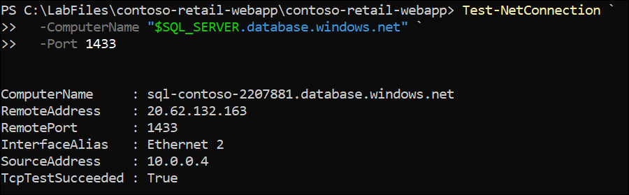

# Challenge 1: Migration Design (CAF)

## Overview

In this challenge, you take on the role of a **Cloud Solutions Architect**. Your Windows Server VM - running the Contoso Retail app on `http://localhost:8080` - represents the on-premises data center. Your Azure subscription is the migration target.

Before any migration execution begins, you complete a **design phase** following the Microsoft Cloud Adoption Framework (CAF). This challenge produces three artefacts that drive all remaining challenges:

- A discovery report of the current environment
- A documented migration strategy
- A provisioned Azure Landing Zone

> **Note**: All steps are performed either in the **Azure portal** or in **PowerShell on your Windows Server VM** via RDP.

**Estimated Duration**: 60 minutes

**Prerequisites**:
- Exercise 0 completed - Contoso Retail app running on the VM at `http://localhost:8080`
- Azure CLI installed on the VM (`az --version` returns a version number)
- Azure SQL Database `contosodb` provisioned with 10 products

## Task 1: Discover and Document the Existing Environment

All steps are run inside the **Windows Server VM** via **PowerShell (Admin)**.

1. Open **PowerShell as Administrator** on your VM.

2. Run the following discovery script. It collects all environment details and saves the output automatically to `C:\LabFiles\discovery-report.txt`:

   ```powershell
   $report = @()
   $report += "CONTOSO RETAIL - ENVIRONMENT DISCOVERY REPORT"
   $report += "Generated: $(Get-Date -Format 'yyyy-MM-dd HH:mm')"
   $report += "=" * 50

   # OS and hardware
   $os  = Get-CimInstance Win32_OperatingSystem
   $cpu = Get-CimInstance Win32_Processor
   $ram = [math]::Round($os.TotalVisibleMemorySize / 1MB, 1)
   $report += "`nOS:       $($os.Caption) $($os.OSArchitecture)"
   $report += "Version:  $($os.Version)"
   $report += "CPU:      $($cpu.Name) ($($cpu.NumberOfCores) cores)"
   $report += "RAM:      $ram GB"

   # Disk
   $disk  = Get-CimInstance Win32_LogicalDisk -Filter "DriveType=3" | Select-Object -First 1
   $used  = [math]::Round(($disk.Size - $disk.FreeSpace) / 1GB, 1)
   $total = [math]::Round($disk.Size / 1GB, 1)
   $report += "Disk C:   $used GB used / $total GB total"

   # Runtime
   $report += "`nNode.js:  $(node --version)"
   $report += "npm:      $(npm --version)"

   # App dependencies
   $report += "`nAPPLICATION DEPENDENCIES"
   $report += "-" * 30
   Set-Location "C:\LabFiles\contoso-retail-webapp\contoso-retail-webapp"
   $report += (npm list --depth=0 2>$null)

   # Listening port
   $report += "`nLISTENING ON PORT 8080"
   $report += "-" * 30
   $report += (netstat -ano | findstr :8080)

   # .env contents
   $report += "`nENVIRONMENT CONFIGURATION (.env)"
   $report += "-" * 30
   $report += (Get-Content "C:\LabFiles\contoso-retail-webapp\contoso-retail-webapp\.env")

   # Save and display
   New-Item -ItemType Directory -Path "C:\LabFiles" -Force | Out-Null
   $report | Out-File -FilePath "C:\LabFiles\contoso-retail-webapp\discovery-report.txt" -Encoding utf8

   Write-Host "Discovery complete. Report saved to C:\LabFiles\contoso-retail-webapp\contoso-retail-webapp\discovery-report.txt" -ForegroundColor Green
   $report
   ```

3. Verify the report was created:

   ```powershell
   Get-Item "C:\LabFiles\contoso-retail-webapp\discovery-report.txt"
   ```

## Task 2: Define the Migration Strategy

In this task, you select the migration strategy using the **CAF 7 Rs** framework and save your decision as a formal strategy document.

1. Run the following to create and save the strategy document:

   ```powershell
   @"
   MIGRATION STRATEGY RECORD
   ==========================
   Application : Contoso Retail Web App
   Date        : $(Get-Date -Format 'yyyy-MM-dd')

   Selected Strategy : Rehost -> Replatform (PaaS-first)
   Target Service    : Azure App Service (Standard S1)
   Migration Method  : Azure CLI zip deploy

   Phase 1 - Challenge 2:
     - Deploy app to Azure App Service
     - Move .env values to App Service Application Settings
     - Enforce HTTPS-only
     - Validate at azurewebsites.net URL

   Phase 2 - Challenges 3 and 4:
     - VNet Integration for private SQL connectivity
     - Credentials moved to Azure Key Vault
     - Managed Identity for SQL authentication
     - Backup, DR, and regional failover
     - Azure Policy and RBAC governance

   Risks:
     - SQL firewall rules must be updated post-migration
     - .env file must NOT be included in the deployment zip
     - Port changes from 8080 (VM) to 443 (App Service HTTPS)

   Decision: APPROVED FOR EXECUTION
   "@ | Out-File -FilePath "C:\LabFiles\contoso-retail-webapp\migration-strategy.txt" -Encoding utf8

   Write-Host "Strategy saved to C:\LabFiles\contoso-retail-webapp\migration-strategy.txt" -ForegroundColor Green
   ```

The migration strategy is defined and saved.

---

## Task 3: Provision the Azure Landing Zone

1. Sign in to Azure CLI on the VM:

   ```powershell
   az login
   ```

   A browser window opens inside the VM. Sign in with your Azure credentials.

2. Set environment variables. Replace `<DeploymentID>` with your lab deployment ID. **Keep this PowerShell window open** - these variables are reused in all subsequent challenges:

   ```powershell
   $DEPLOYMENT_ID = "<DeploymentID>"
   $LOCATION      = "<inject key="Region" enableCopy="false"></inject>"
   $RG_CORE       = "rg-migration-lab"
   $RG_APP        = "rg-migration-lab-app"
   $VNET_NAME     = "vnet-migration-lab"
   $NSG_NAME      = "nsg-contoso-app"
   $APP_NAME      = "app-contoso-$DEPLOYMENT_ID"
   $APP_PLAN_NAME = "asp-contoso-$DEPLOYMENT_ID"
   $SQL_SERVER    = "sql-contoso-$DEPLOYMENT_ID"
   $LAW_NAME      = "law-contoso-$DEPLOYMENT_ID"
   $AI_NAME       = "ai-contoso-$DEPLOYMENT_ID"

   Write-Host "Variables set. App name: $APP_NAME" -ForegroundColor Green
   ```

   > **Important**: These variables exist only for the current PowerShell session. If you close this window at any point, re-run this step before continuing.

3. Create the application resource group:

   ```powershell
   az group create `
     --name $RG_APP `
     --location $LOCATION `
     --tags Environment=Lab Project=ContosoMigration
   ```

4. Verify both resource groups exist:

   ```powershell
   az group list `
     --query "[?contains(name,'migration-lab')]" `
     --output table
   ```

   You should see `rg-migration-lab` and `rg-migration-lab-app` both listed as `Succeeded`.

5. Verify the VNet and subnets from Exercise 0 are in place:

   ```powershell
   az network vnet subnet list `
     --resource-group $RG_CORE `
     --vnet-name $VNET_NAME `
     --output table
   ```

   Confirm all three subnets - `snet-appservice`, `snet-private`, `snet-default` - are listed.

6. Create the Network Security Group:

   ```powershell
   az network nsg create `
     --resource-group $RG_CORE `
     --name $NSG_NAME `
     --location $LOCATION `
     --tags Environment=Lab Project=ContosoMigration
   ```
7. Add an inbound rule for HTTPS (port 443):

   ```powershell
   az network nsg rule create `
     --resource-group $RG_CORE `
     --nsg-name $NSG_NAME `
     --name "Allow-HTTPS-Inbound" `
     --protocol Tcp `
     --direction Inbound `
     --priority 100 `
     --source-address-prefix Internet `
     --source-port-range "*" `
     --destination-address-prefix "*" `
     --destination-port-range 443 `
     --access Allow
   ```

8. Add an inbound rule for HTTP (port 80) for redirect purposes:

   ```powershell
   az network nsg rule create `
     --resource-group $RG_CORE `
     --nsg-name $NSG_NAME `
     --name "Allow-HTTP-Inbound" `
     --protocol Tcp `
     --direction Inbound `
     --priority 110 `
     --source-address-prefix Internet `
     --source-port-range "*" `
     --destination-address-prefix "*" `
     --destination-port-range 80 `
     --access Allow
   ```

9. Associate the NSG with the `snet-appservice` subnet:

   ```powershell
   az network vnet subnet update `
     --resource-group $RG_CORE `
     --vnet-name $VNET_NAME `
     --name snet-appservice `
     --network-security-group $NSG_NAME
   ```

10. Confirm the association:

    ```powershell
    az network vnet subnet show `
      --resource-group $RG_CORE `
      --vnet-name $VNET_NAME `
      --name snet-appservice `
      --query "networkSecurityGroup.id" `
      --output tsv
    ```

    The output should end with `/networkSecurityGroups/nsg-contoso-app`.

The Landing Zone is provisioned.

## Task 4: Map Application Dependencies

In this task, you produce a **Dependency Map** for Contoso Retail and save the App Service settings needed in Challenge 2.

1. Test SQL connectivity from the VM to confirm the database is reachable:

   ```powershell
   Test-NetConnection `
     -ComputerName "$SQL_SERVER.database.windows.net" `
     -Port 1433
   ```

    

   Confirm `TcpTestSucceeded : True`.

   > **If False**: In the Azure portal, go to the SQL Server - **Networking** - add the VM's public IP under **Firewall rules** - **Save**.

2. Save the App Service Application Settings to the strategy document for use in Challenge 2:

   ```powershell
   @"

   APP SERVICE APPLICATION SETTINGS (needed in Challenge 2)
   =========================================================
   DB_SERVER   = $SQL_SERVER.database.windows.net
   DB_NAME     = contosodb
   DB_USER     = sqladmin
   DB_PASSWORD = P@ssw0rd2026!
   PORT        = 8080
   "@ | Add-Content -Path "C:\LabFiles\contoso-retail-webapp\migration-strategy.txt"

   Write-Host "Settings saved to C:\LabFiles\contoso-retail-webapp\migration-strategy.txt" -ForegroundColor Green
   ```

The dependency map is complete and Challenge 2 inputs are saved.

## Task 5: Validate Landing Zone Readiness

1. Run the validation script:

   ```powershell
   Write-Host "=== LANDING ZONE READINESS CHECK ===" -ForegroundColor Cyan

   Write-Host "`n-- Resource Groups --" -ForegroundColor Yellow
   az group list `
     --query "[?contains(name,'migration-lab')]" `
     --output table

   Write-Host "`n-- VNet Subnets --" -ForegroundColor Yellow
   az network vnet subnet list `
     --resource-group $RG_CORE `
     --vnet-name $VNET_NAME `
     --output table

   Write-Host "`n-- NSG Rules --" -ForegroundColor Yellow
   az network nsg rule list `
     --resource-group $RG_CORE `
     --nsg-name $NSG_NAME `
     --output table

   Write-Host "`n-- NSG on snet-appservice --" -ForegroundColor Yellow
   az network vnet subnet show `
     --resource-group $RG_CORE `
     --vnet-name $VNET_NAME `
     --name snet-appservice `
     --query "{Subnet:name, NSG:networkSecurityGroup.id}" `
     --output table

   Write-Host "`n=== CHECK COMPLETE ===" -ForegroundColor Green
   ```

2. Confirm every item below matches your output before proceeding:

   | Resource | Expected Result |
   | --- | --- |
   | `rg-migration-lab` | `Succeeded` |
   | `rg-migration-lab-app` | `Succeeded` |
   | `snet-appservice`, `snet-private`, `snet-default` | All three listed |
   | `snet-appservice` delegation | `Microsoft.Web/serverFarms` |
   | NSG rules | `Allow-HTTPS-Inbound` and `Allow-HTTP-Inbound` both listed |
   | NSG on `snet-appservice` | Ends with `/nsg-contoso-app` |

3. Verify the strategy document is complete:

   ```powershell
   Get-Content "C:\LabFiles\contoso-retail-webapp\migration-strategy.txt"
   ```

   Confirm the file contains the migration strategy and the App Service Application Settings block.

   

The Landing Zone is validated and ready for Challenge 2.

## Success Criteria

- Discovery script executed and report auto-saved to `C:\apps\discovery-report.txt`.
- Migration strategy documented as **Rehost - Replatform (PaaS-first)** and saved to `C:\apps\migration-strategy.txt`.
- Resource group `rg-migration-lab-app` created and verified as `Succeeded`.
- VNet `vnet-migration-lab` confirmed with all three subnets from Exercise 0.
- `snet-appservice` confirmed delegated to `Microsoft.Web/serverFarms`.
- NSG `nsg-contoso-app` created with port 443 and port 80 inbound allow rules.
- NSG associated to `snet-appservice` and confirmed via CLI.
- SQL connectivity confirmed from the VM (`TcpTestSucceeded : True`).
- App Service Application Settings block saved to `C:\apps\migration-strategy.txt`.
- Readiness check executed with all resources showing `Succeeded`.

## Learning Outcomes

- Apply the CAF Migrate methodology - Assess, Plan, and Ready phases - to a real workload.
- Run automated environment discovery using PowerShell and produce a saved report.
- Select and justify a migration strategy using the CAF 7 Rs framework.
- Provision an Azure Landing Zone including resource groups, VNet verification, and NSG.
- Produce a dependency map and identify all pre-migration actions required.

---
