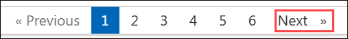

# Challenge 2 : Migration Execution (Web App Modernization)

## Estimated Duration : 120 Minutes

## Overview

In this challenge, you execute the migration. You will take the Contoso Retail application running on the Windows Server VM and deploy it to **Azure App Service** - converting it from a locally hosted Node.js process to a fully managed PaaS web application.

By the end of this challenge, you will have:

- A running Azure App Service hosting the Contoso Retail application
- Application settings migrated from the `.env` file to App Service configuration
- HTTPS enforced with an Azure-managed TLS certificate
- VNet integration configured for private outbound connectivity
- Application Insights connected and receiving live telemetry

> **Note**: This challenge uses a mix of the **Azure portal** and **Azure CLI on the VM**. Each task clearly states which method to use.

**Estimated Duration**: 75 minutes

**Prerequisites**:
- Challenge 1 completed - Landing Zone provisioned, `C:\apps\migration-strategy.txt` saved
- PowerShell session variables from Challenge 1 still set (`$APP_NAME`, `$RG_APP`, etc.)
- Contoso Retail app files at `C:\apps\contoso-retail`

> **If you opened a new PowerShell window**, re-run the variables block from Challenge 1, Task 3, Step 2 before continuing.

## Task 1: Create Monitoring Resources

1. In the **Azure portal**, create **Log Analytics workspaces**.

2. On the **Basics** tab, fill in the following details and select **Review + create**:
   - **Subscription**: select your Azure subscription **(1)**
   - **Resource group**: `rg-migration-lab-app` **(2)**
   - **Name**: `law-contoso-<inject key="DeploymentID" enableCopy="false"/> **(3)**
   - **Region**: <inject key="Region" enableCopy="false"></inject> **(4)**

3. Create Application Insights

4. On the **Basics** tab, fill in the following details and select **Review + create**:
   
   - **Subscription**: select your Azure subscription **(1)**
   - **Resource group**: `rg-migration-lab-app` **(2)**
   - **Name**: `ai-contoso-<inject key="DeploymentID" enableCopy="false"></inject>` **(3)**
   - **Region**: <inject key="Region" enableCopy="false"></inject> **(4)**
   - **Resource Mode**: **Workspace-based** **(5)**
   - **Log Analytics Workspace**: `law-contoso-<inject key="DeploymentID" enableCopy="false"></inject>` **(6)**
  
5. Copy the Instrumentation Key

## Task 2: Create the App Service Plan and App Service

1. In the **Azure portal**, search **App Services** and create **Web App**.

2. On the **Basics** tab, fill in the following details:

   - **Subscription**: select your Azure subscription **(1)**
   - **Resource group**: `rg-migration-lab-app` **(2)**
   - **Name**: `app-contoso-<inject key="DeploymentID" enableCopy="false"/> **(3)**
   - **Publish**: **Code** **(4)**
   - **Runtime stack**: **Node 20 LTS** **(5)**
   - **Operating System**: **Linux** **(6)**
   - **Region**: <inject key="Region" enableCopy="false"></inject> **(7)**
  
3. On the **Networking** tab, set **Enable public access** to **On** then navigate to **Monitoring** tab, configure as mentioned below, then click create

   - **Enable Application Insights**: **Yes** **(1)**
   - **Application Insights**: select **Select existing (2)** - choose `ai-contoso-<inject key="DeploymentID" enableCopy="false"></inject>` **(3)**
  
## Task 3: Configure Application Settings and HTTPS

1. In the App Service left navigation, select **Environment variables**.

2. Under the **App settings** tab, select **+ Add** for each of the following settings. Enter the **Name** and **Value** for each and select **Apply** after each one:

   | Name | Value |
   | --- | --- |
   | `DB_SERVER` | `sql-contoso-<inject key="DeploymentID" enableCopy="false"></inject>.database.windows.net` |
   | `DB_NAME` | `contosodb` |
   | `DB_USER` | `sqladmin` |
   | `DB_PASSWORD` | `P@ssw0rd2026!` |
   | `PORT` | `8080` |
   | `APPINSIGHTS_INSTRUMENTATIONKEY` | paste the value from `$AI_KEY` (saved in Task 1, Step 6) |
   | `WEBSITE_NODE_DEFAULT_VERSION` | `~20` |

3. Under Stack settings **Set the startup command**

      ```
      node src/app.js
      ```

8. Select **Settings** - **Configuration** - **General settings** Scroll to **Platform settings** and set **HTTPS Only** to **On**.

## Task 4: Package and Deploy the Application

1. Navigate to the application directory:

   ```powershell
   Set-Location "C:\LabFiles\contoso-retail-webapp\contoso-retail"
   ```

2. Create the deployment package, excluding `.env` and `node_modules`:

   ```powershell
   # Remove any previous zip
   Remove-Item "C:\LabFiles\contoso-retail-webapp\contoso-retail-deploy.zip" -ErrorAction SilentlyContinue

   # Collect files excluding .env and node_modules
   $files = Get-ChildItem -Path "C:\LabFiles\contoso-retail-webapp\contoso-retail-webapp" -Recurse |
   Where-Object {
      $_.FullName -notmatch "node_modules" -and
      $_.FullName -notmatch "\.env$" -and
      -not $_.PSIsContainer
   }

   # Create the zip
   Compress-Archive -Path $files.FullName `
   -DestinationPath "C:\LabFiles\contoso-retail-webapp\contoso-retail-webapp\contoso-retail-deploy.zip" `
   -Force

   Write-Host "Package created:" -ForegroundColor Green
   Get-Item "C:\LabFiles\contoso-retail-webapp\contoso-retail-webapp\contoso-retail-deploy.zip" | Select-Object Name, Length
   ```
3. Deploy the zip package to App Service:

   ```powershell
   az webapp deploy `
     --name $APP_NAME `
     --resource-group $RG_APP `
     --src-path "C:\LabFiles\contoso-retail-webapp\contoso-retail-webapp\contoso-retail-deploy.zip" `
     --type zip
   ```

   Deployment takes approximately 1-2 minutes. You will see a progress indicator in the terminal.

## Task 5: Configure App Service Networking

1. Select **Settings** - **Networking**. Under **Outbound traffic configuration**, select **VNet integration**.

2. In the **Add VNet Integration** panel, fill in the following and select **Connect**:

   - **Virtual Network**: `vnet-migration-lab` **(1)**
   - **Subnet**: `snet-appservice` **(2)**
  
3. **Configure Access Restrictions**
   
   - **Name**: `Allow-AzureFrontDoor` **(1)**
   - **Action**: **Allow** **(2)**
   - **Priority**: `100` **(3)**
   - **Type**: **Service Tag** **(4)**
   - **Service Tag**: **AzureFrontDoor.Backend** **(5)**
  
## Task 6: Validate the Migrated Application

1. **Verify the application**

   | Page | URL | Expected Result |
   | --- | --- | --- |
   | Home page | `https://app-contoso-<ID>.azurewebsites.net` | Shows "Welcome to Contoso Retail" |
   | Products page | `https://app-contoso-<ID>.azurewebsites.net/products` | Shows 10 products from Azure SQL |
   | HTTPS redirect | `http://app-contoso-<ID>.azurewebsites.net` | Automatically redirects to HTTPS |

2. **Verify Application Insights telemetry**

3. **Run the migration summary**

7. Back in **PowerShell on the VM**, run the following to print a before/after migration summary:

   ```powershell
   Write-Host "=== MIGRATION SUMMARY ===" -ForegroundColor Cyan
   Write-Host ""
   Write-Host "BEFORE (On-Premises VM):" -ForegroundColor Yellow
   Write-Host "  URL       : http://localhost:8080"
   Write-Host "  Protocol  : HTTP (no TLS)"
   Write-Host "  Runtime   : Node.js process on Windows Server VM"
   Write-Host "  Config    : .env file on disk"
   Write-Host "  Monitoring: None"
   Write-Host ""
   Write-Host "AFTER (Azure App Service):" -ForegroundColor Green
   $APP_URL = az webapp show `
     --name $APP_NAME `
     --resource-group $RG_APP `
     --query defaultHostName `
     --output tsv
   Write-Host "  URL       : https://$APP_URL"
   Write-Host "  Protocol  : HTTPS (Azure-managed TLS)"
   Write-Host "  Runtime   : Node.js on Azure App Service (PaaS)"
   Write-Host "  Config    : App Service Application Settings"
   Write-Host "  Monitoring: Application Insights ($AI_NAME)"
   Write-Host ""
   Write-Host "Migration Status: COMPLETE" -ForegroundColor Green
   ```

   

## Success Criteria

- Log Analytics Workspace `law-contoso-<DeploymentID>` deployed in `rg-migration-lab-app`.
- Application Insights `ai-contoso-<DeploymentID>` deployed and linked to the workspace.
- App Service Plan `asp-contoso-<DeploymentID>` created at Standard S1 tier with Linux OS.
- App Service `app-contoso-<DeploymentID>` created with Node.js 20 LTS runtime.
- All 7 application settings configured in App Service Environment variables.
- HTTPS-only enforced - HTTP requests redirect to HTTPS automatically.
- Startup command set to `node src/app.js`.
- Deployment zip created without `.env` and `node_modules` and deployed via zip deploy.
- Home page and products page load correctly at the `azurewebsites.net` URL.
- VNet integration active and showing `Connected` on `snet-appservice`.
- Application Insights Live Metrics showing incoming request telemetry.

Now, click on **Next** from the lower right corner to move on to the next page.

   