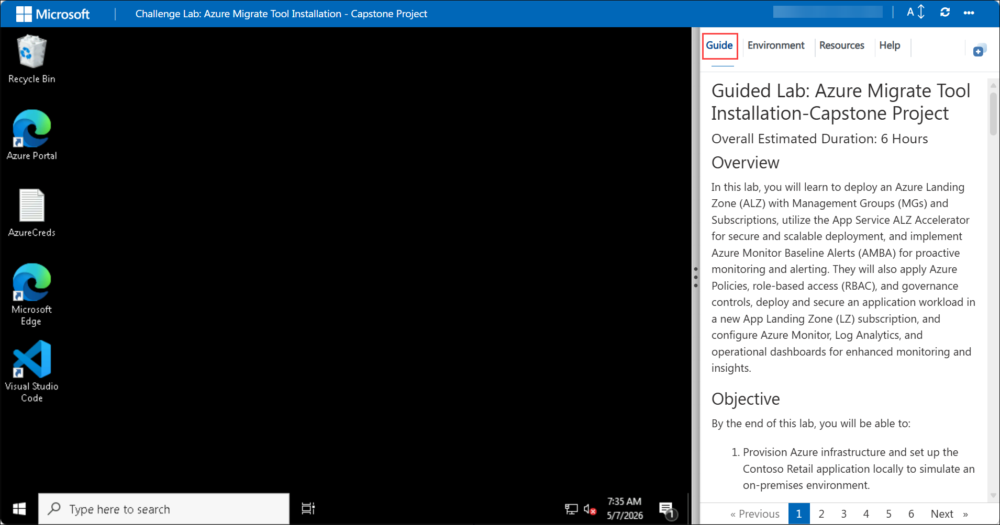
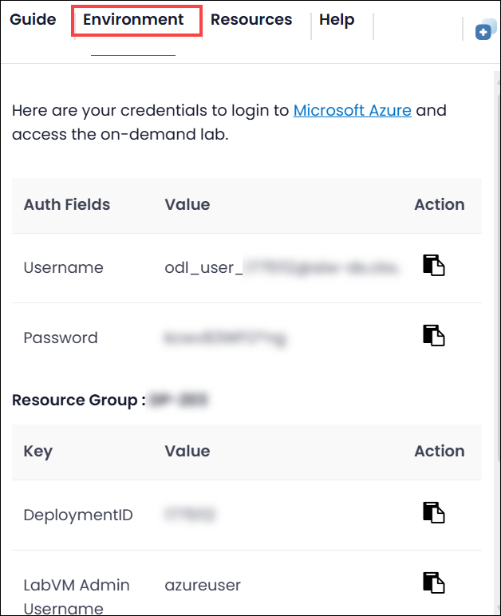
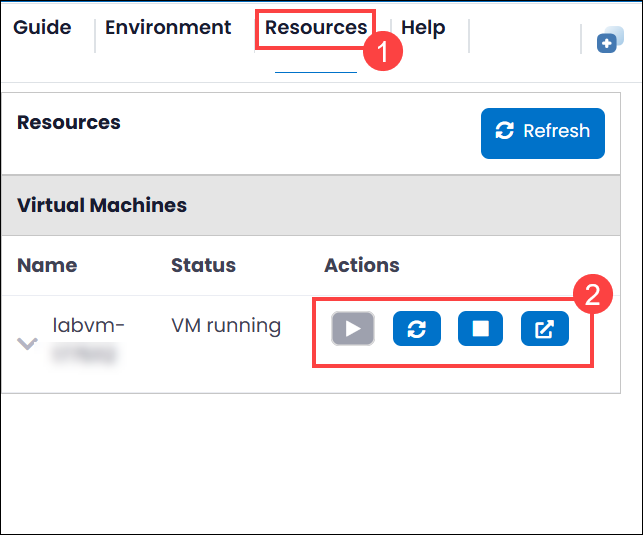
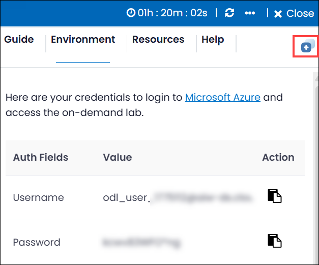
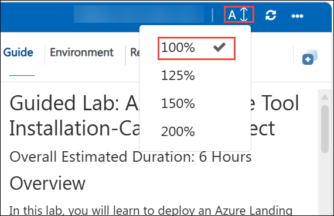
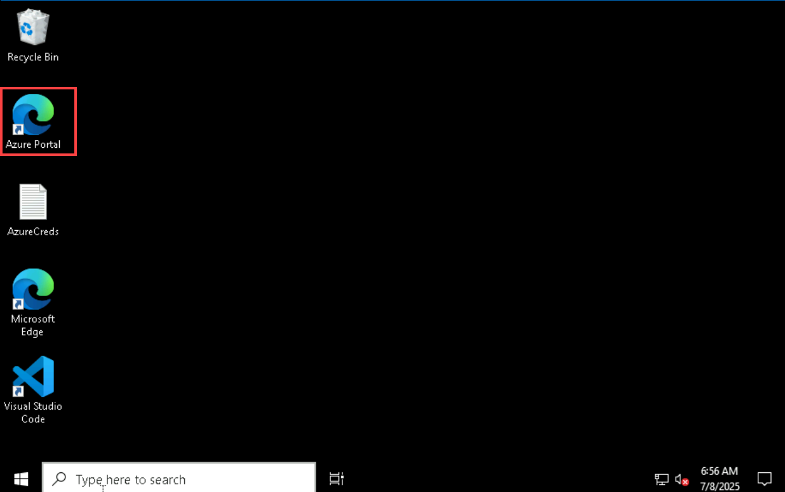
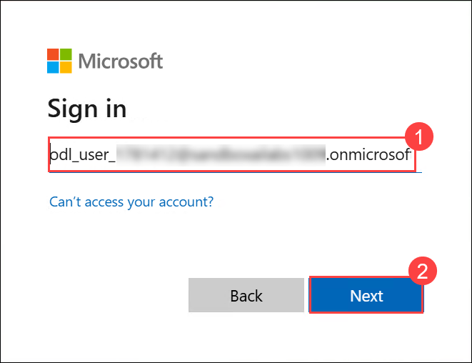
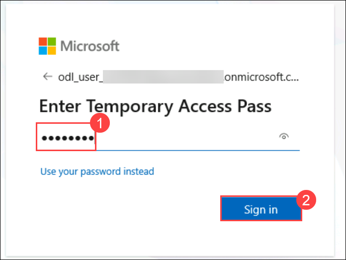

# Guided Lab: Azure Migrate Tool Installation-Capstone Project

### Overall Estimated Duration: 6 Hours

## Overview

In this lab, you will learn to deploy an Azure Landing Zone (ALZ) with Management Groups (MGs) and Subscriptions, utilize the App Service ALZ Accelerator for secure and scalable deployment, and implement Azure Monitor Baseline Alerts (AMBA) for proactive monitoring and alerting. They will also apply Azure Policies, role-based access (RBAC), and governance controls, deploy and secure an application workload in a new App Landing Zone (LZ) subscription, and configure Azure Monitor, Log Analytics, and operational dashboards for enhanced monitoring and insights.

## Objective

By the end of this lab, you will be able to:

1. Provision Azure infrastructure and set up the Contoso Retail application locally to simulate an on-premises environment.  

2. Assess the current environment, define a migration strategy using CAF, and prepare the Azure landing zone.  

3. Migrate the application to Azure App Service, configure settings, enable HTTPS, and validate application functionality with monitoring.  

4. Implement hybrid connectivity and disaster recovery using Azure Arc, backup, and Traffic Manager for failover.  

5. Secure and govern the application using Azure Policy, RBAC, Defender for Cloud, monitoring alerts, and Azure Key Vault for secrets management.  

## Pre-requisites

1. Active Azure subscription with required permissions to create and manage resources.

2. Windows Server VM with RDP access and Azure CLI installed (`az --version` working).

3. Contoso Retail application files available on the VM and running locally (`http://localhost:8080`).  

4. Azure SQL Database (`contosodb`) created with sample data and firewall access configured.  

5. Stable PowerShell session with required variables set (e.g., `$APP_NAME`, `$RG_APP`, `$DEPLOYMENT_ID`).  

## Getting Started with the Lab

Welcome to Unlock Innovation with Agentic AI in Copilot-Studio Hands-On-Lab! , We've prepared a seamless environment for you to explore and learn. Let's begin by making the most of this experience.

>**Note:** If a PowerShell window appears once the environment is active, please don't close it. Minimize it instead of closing it and proceed with the tasks.

## Accessing Your Lab Environment
 
Once you're ready to dive in, your virtual machine and lab guide will be right at your fingertips within your web browser.

   

## Virtual Machine & Lab Guide
 
Your virtual machine is your workhorse throughout the workshop. The lab guide is your roadmap to success.
 
## Exploring Your Lab Resources
 
To get a better understanding of your lab resources and credentials, navigate to the **Environment** tab.
 
   

## Managing Your Virtual Machine
 
Feel free to start, stop, or restart your virtual machine as needed from the **Resources** tab. Your experience is in your hands!
 

 
## Utilizing the Split Window Feature
 
For convenience, you can open the lab guide in a separate window by selecting the **Split Window** button from the Top right corner.
 
 

## Lab Guide Zoom In/Zoom Out

To adjust the zoom level for the environment page, click the A↕ : 100% icon located next to the timer in the lab environment.

## Let's Get Started with Azure Portal

1. In the LabVM, click on **Azure portal** shortcut of Microsoft Edge browser which is created on desktop.

   

2. On the Sign into Microsoft Azure tab, you will see the login screen. Enter the provided **Email or username (1)**, and click **Next (2)** to proceed.

   - **Email/Username:** <inject key="AzureAdUserEmail"></inject>

     

3. Now, enter the following **Temporary Access Pass (1)** and click on **Sign in (2)**.

   - **Temporary Access Pass:** <inject key="AzureAdUserPassword"></inject> 

      

4. If you see the pop-up **Stay Signed in?**, click **No**.

6. If a **Welcome to Microsoft Azure** popup window appears, click **Cancel** to skip the tour.

## Support Contact

The CloudLabs support team is available 24/7, 365 days a year, via email and live chat to ensure seamless assistance at any time. We offer dedicated support channels tailored specifically for both learners and instructors, ensuring that all your needs are promptly and efficiently addressed.

Learner Support Contacts:

- Email Support: cloudlabs-support@spektrasystems.com
- Live Chat Support: https://cloudlabs.ai/labs-support

Now, click on **Next** from the lower right corner to move on to the next page.

   

## Happy Learning!!
