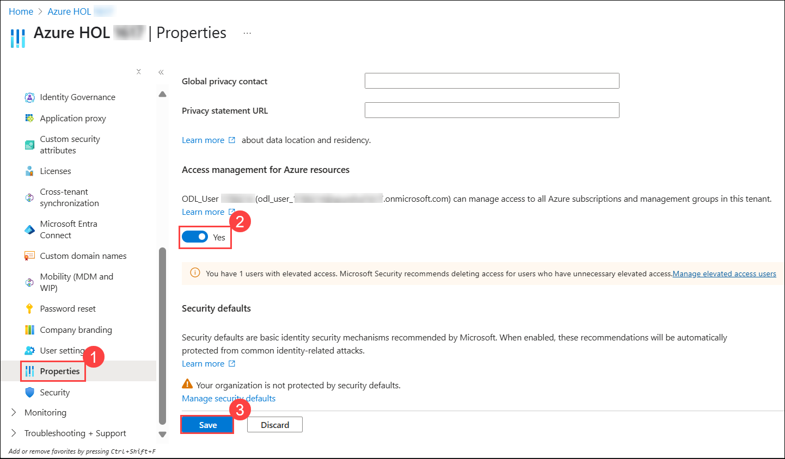
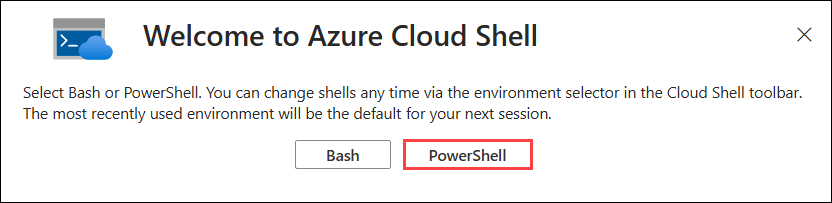
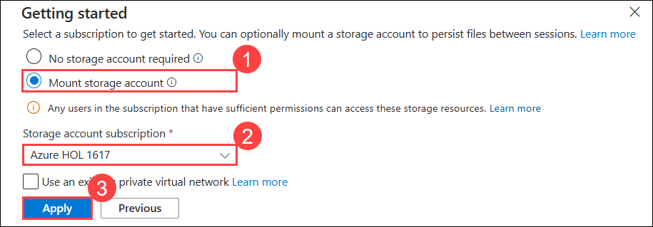
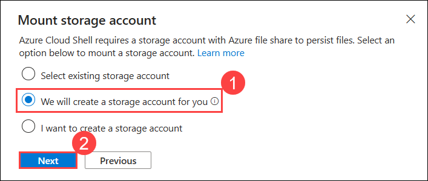
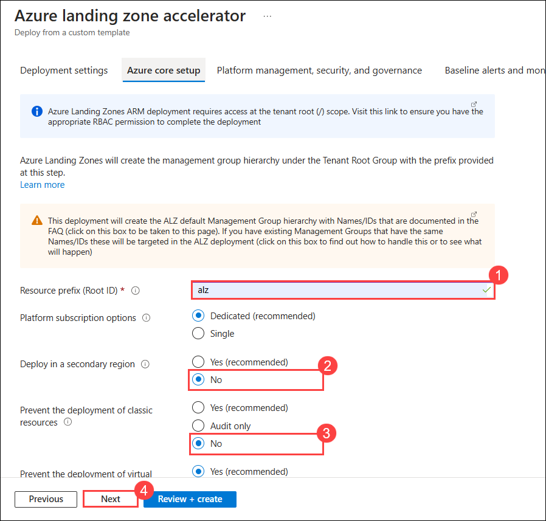
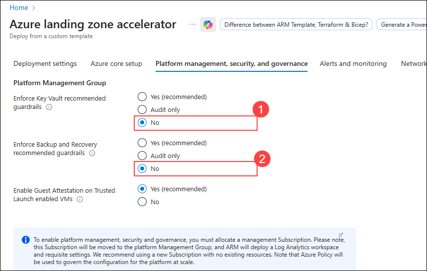
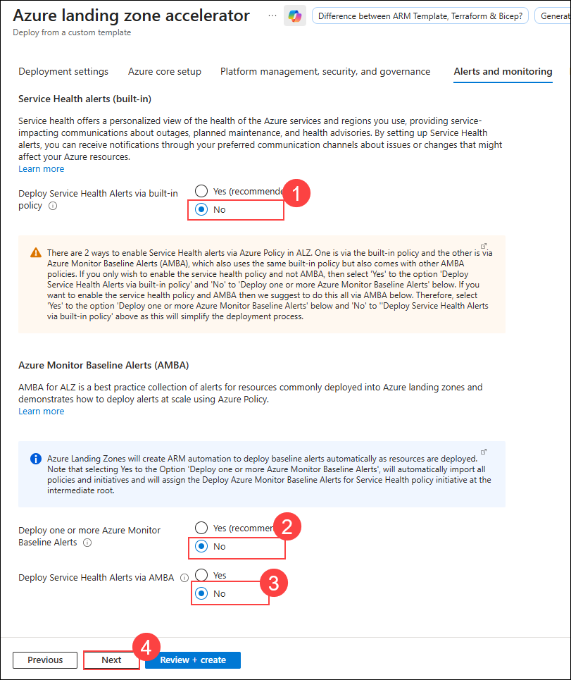
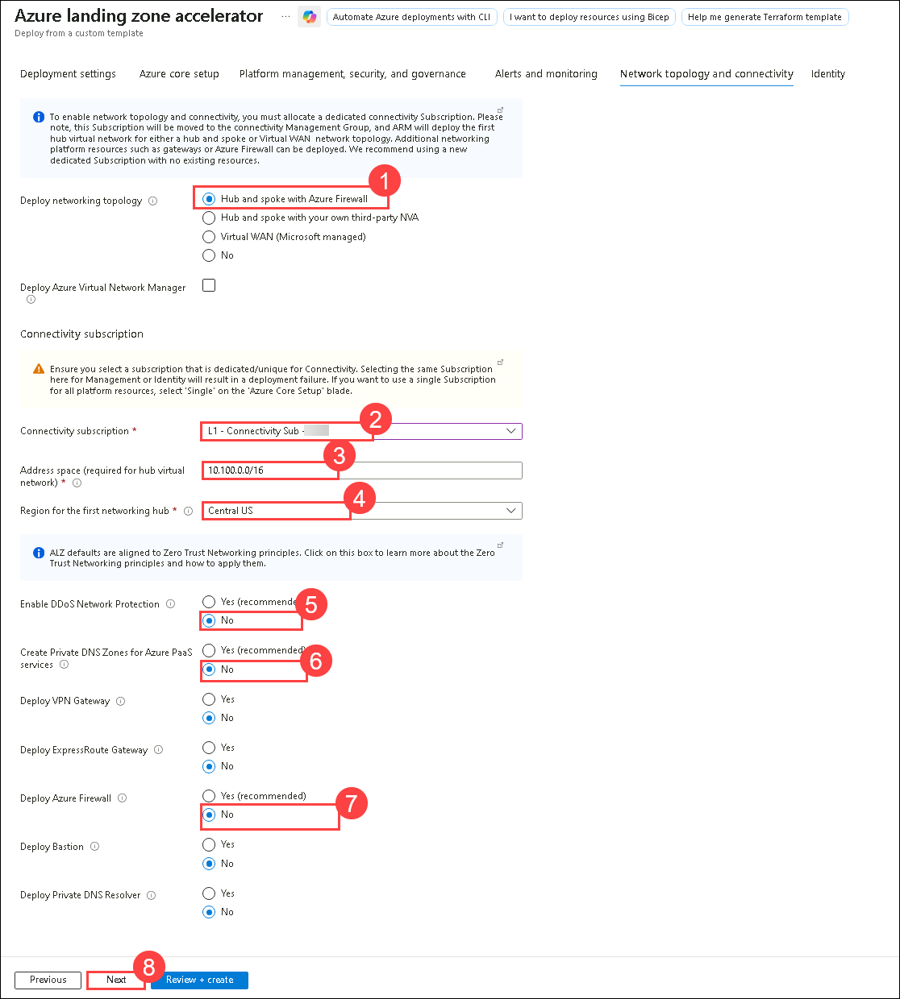
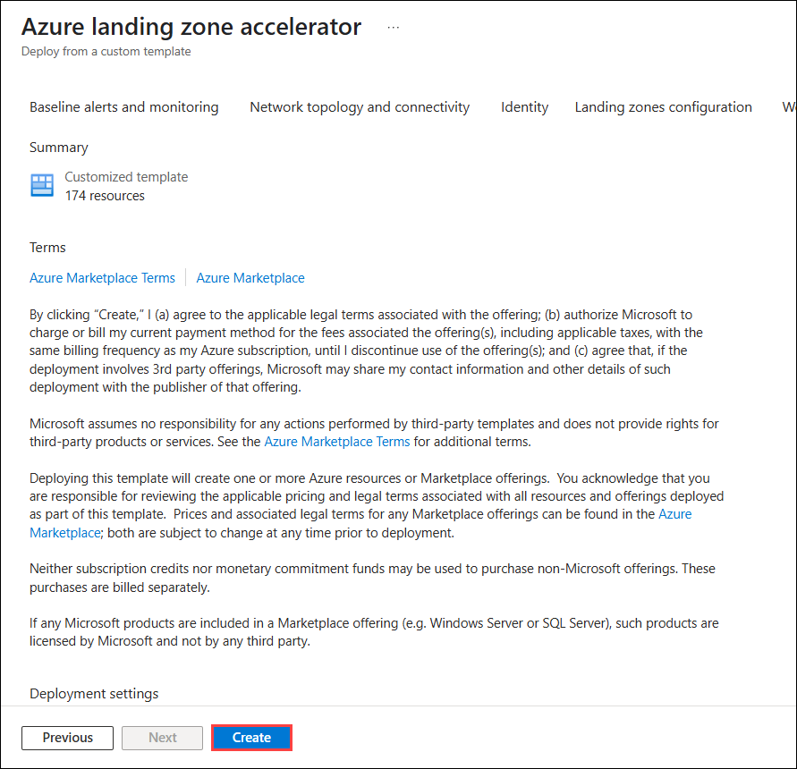

## Exercise 1: Introduction to Azure Landing Zone and Deployment Options

### Estimated Duration: 120 Minutes

## Overview
In this exercise, you will explore the **Azure Landing Zone (ALZ) framework**, its governance components (Management Groups, Policies, and Subscriptions), and the benefits of automation. You will then deploy ALZ using ARM templates, setting up prerequisites and executing the deployment via the Azure Portal and Azure DevOps services.

## Objectives
In this exercise, you will complete the following tasks:
   - Task 1: Understanding Azure Landing Zone (ALZ) Concepts 
   - Task 2: Deploying Azure Landing Zone

### Task 1: Understanding Azure Landing Zone (ALZ) Concepts 
In this task, you will learn about Azure Landing Zone (ALZ) concepts, which create scalable, secure, and modular environments for cloud deployments, divided into platform and application-specific zones.

#### **Overview of Enterprise-Scale ALZ Framework**
The Azure Landing Zone (ALZ) is a well-architected and scalable environment designed to help enterprises adopt Azure in a structured and governed manner. It follows Microsoft’s Cloud Adoption Framework (CAF) to establish a foundation that supports various workloads while ensuring security, compliance, and operational excellence.

An Azure landing zone consists of platform landing zones and application landing zones:
- **Platform Landing Zone**: A subscription that provides shared services like identity, connectivity, and management for all applications. These are managed by central IT teams. Examples include Identity, Management, and Connectivity subscriptions.
- **Application Landing Zone**: A subscription dedicated to hosting specific applications. These are pre-configured with policies and controls through management groups. Examples include `Landing Zone A1` and `Landing Zone A2` subscriptions, which are the two applications.

### ALZ is built on the following principles:
 * Modular Architecture – Supports different workloads with a flexible design.
 * Security & Compliance – Enforces Azure policies, RBAC, and governance controls.
 * Networking & Connectivity – Implements hub-and-spoke, Virtual WAN, or hybrid models.
 * Automation & Infrastructure as Code (IaC) – Uses ARM templates for deployment.

### Role of Management Groups (MGs), Policies, and Subscriptions
To ensure consistency across multiple workloads, Azure Landing Zones leverage Management Groups (MGs), Policies, and Subscriptions:
 * **Management Groups (MGs):**
   * Organize multiple Azure subscriptions under a hierarchical structure.
   * Help apply governance policies consistently across all workloads.
   * Example:
        ```
        Root Management Group
        └── alz
            ├── alz-decommissioned
            ├── alz-landingzones
            │   ├── alz-corp
            │   ├── alz-online
            │   └── alz-platform
            ├── alz-connectivity
            │   └── alz-identity
            ├── alz-management
            └── alz-sandboxes
        ```

  * **Azure Policies:**
    * Enforce security best practices (e.g., restrict public IPs, enforce encryption).
    * Automate governance with compliance controls for workloads.
    * Example policies:
        * Enforce HTTPS-only for App Services.
        * Restrict deployment of unapproved VM SKUs.
        
  * **Subscriptions:**
    * Act as billing units and provide resource isolation.
    * Mapped to business units or environments (e.g., Prod, Dev, Test).

### Benefits of Governance and Automation in ALZ
 * Security & Compliance – Enforce centralized security and compliance control at scale.
 * Operational Efficiency – Automate resource provisioning via ARM templates. It supports CI/CD for infrastructure to enhance efficiency.
 * Scalability – Support multi-region, multi-team deployment and enforce standardized architecture.
 * Cost Management – Optimize spending using Azure Cost Management + Budgets.

### Task 2: Deploying Azure Landing Zone.
In this task, you will deploy an Azure Landing Zone (ALZ) using ARM templates. You will set up the foundational Management Groups (MGs), Subscriptions, and Governance policies required for an enterprise-scale environment.

#### ARM Templates for Deployment
 * ARM Templates – Azure's native JSON-based Infrastructure as Code (IaC) approach, providing comprehensive infrastructure deployment capabilities.

#### **Enable Required Permissions**
Before deploying ALZ, you must have elevated access at the tenant level.

1. If you have already logged in to the Azure portal, then search for **Microsoft Entra (1)** and select **Microsoft Entra ID (2)** under Services.

   >**Note:** If you have not logged on already, please follow the steps on the previous page of the guide and come back to this step.

   

1. On the left pane, under the Manage section, click on **Properties (1)**, locate Access management for Azure resources, and **enable the toggle  (2)** for elevated access and click on **Save (3)**.

    

1. Navigate to **Cloud Shell** from the top right corner menu in the Azure portal.

    

1. In **Welcome to Azure Cloud Shell** page, select **PowerShell**.

    

1. On the Getting started page, select **Mount storage account (1)** and select the **Azure HOL (SUFFIX)/Sub - (SUFFIX) (2)** subscription from the dropdown and click on **Apply (3)**.

    

    >**Note:** The SUFFIX value in the subscription name is a unique identifier assigned to you for this lab environment, which will be different for each user. Please select the one that you see in the dropdown list. 

1. On the Mount storage account page, select **We will create storage account for you (1)**, then click on **Next (2)**. Wait for the deployment to complete.

    

1. Once the **CloudShell** opens, run the following command to assign yourself Owner access at the tenant scope on Root management:

   ```powershell
   New-AzRoleAssignment -SignInName "<inject key="AzureAdUserEmail"></inject>" -Scope "/" -RoleDefinitionName "Owner"
   ```
    

    > **Note:** You may see a warning like: 
    >
    > `"WARNING: You're using Az version 13.4.0. The latest version of Az is 14.1.0..."`
    >
    > This warning can be safely **ignored**. It does not affect the functionality or execution of the commands.

> **Congratulations** on completing the task! Now, it's time to validate it. Here are the steps:
> - Hit the Validate button for the corresponding task. If you receive a success message, you can proceed to the next task. 
> - If not, carefully read the error message and retry the step, following the instructions in the lab guide.
> - If you need any assistance, please contact us at cloudlabs-support@spektrasystems.com. We are available 24/7 to help you out.
<validation step="75747fcf-2474-48d7-a6ba-bd830141c9a6" />

#### **Deploying the Azure Landing Zone (ALZ)**

1. Open a new tab in your web browser inside the LabVM and navigate to the following URL to access the ARM template for ALZ deployment:

   ```
   https://aka.ms/caf/ready/accelerator
   ```

1. On the **Custom deployment** blade, in the **Deployment settings** section, select the Region as `(US) Central US` **(1)** and click on **Next (2)**.

    

1. In the **Azure core setup** section, enter the following details and click on **Next (4)**. 

   - Resource prefix (Root ID): **alz (1)** 
   - Deploy in a secondary region: **No (2)** 
   - Prevent the deployment of classic resources: **No (3)**

     

1. In the **Platform management, security, and governance** section, enter the following details and click on **Next (5)**.

    - Enforce Key Vault recommended guardrails: **No (1)**
    - Enforce Backup and Recovery recommended guardrails: **No (2)**
    - Management subscription: **L3 - ES Management Sub - SUFFIX (3)**
    - Deploy Microsoft Defender for Cloud and enable security monitoring for your platform and resources: **No (4)**

        

1. In the **Alerts and Monitoring** section, enter the following details and click on **Next (4)**.

   - Deploy Service Health Alerts via built-in policy: **No (1)**
   - Deploy one or more Azure Monitor Baseline Alerts: **No (2)**
   - Deploy Service Health Alerts via AMBA: **No (3)**

      

1. In **Network Topology and connectivity** select the below options and click on **Next (8)**:

   - Deploy networking topology: **Hub and spoke with Azure Firewall (1)**
   - Connectivity subscription: **L1 - Connectivity Sub - SUFFIX (2)**
   - Address space (required for hub virtual network): **10.100.0.0/16 (3)**
   - Region for first networking hub: **Central US (4)**
   - Enable DDoS Network Protection: **No (5)**
   - Create Private DNS Zones for Azure PaaS services: **No (6)**
   - Deploy Azure Firewall: **No (7)**

      

1. Under **Identity** select **No (1)** for **Assign recommended policies to govern identity and domain controllers** and select **L2 - Identity Sub - SUFFIX (2)**  for Identity subscription and click on **Next (3)**.

    

1. In **Landing zones configuration** enter the following details and click on **Review + Create (8)**.

    - Prevent inbound management ports from internet: **No (1)**
    - Ensure subnets are associated with NSG: **No (2)**
    - Ensure Azure SQL is enabled with transparent data encryption: **No (3)**
    - Ensure Azure SQL Threat Detection is enabled: **No (4)**
    - Ensure auditing is enabled on Azure SQL: **No (5)**
    - Enforce Key Vault recommended guardrails: **No (6)**
    - Enforce Backup and Recovery recommended guardrails: **No (7)** 

       

1. After the template has passed the validation, click **Create**. 
   
   >**Note:** This will deploy the initial Management Group structure together with the required Policy/PolicySet definitions. It will also move the subscription under the right Management Group and will deploy a Log Analytics Workspace and enable platform monitoring. This process will take around **20-25 minutes** to complete.

    

   >**Note:** **If your deployment gets stuck at `alz-Msg-centralus-XXXX` and does not go through after `5 MINUTES`, please follow the below steps**.
   >    
   > 1. Click on **Cancel** button on the deployments page.
   >    
   > 2. Select **Cancel deployment** and then follow the steps from Step 1 to redeploy the template
   >    

1. Once the operation is complete, you can review your progress and proceed to the next exercise.

> **Congratulations** on completing the task! Now, it's time to validate it. Here are the steps:
> - Hit the Validate button for the corresponding task. If you receive a success message, you can proceed to the next task. 
> - If not, carefully read the error message and retry the step, following the instructions in the lab guide.
> - If you need any assistance, please contact us at cloudlabs-support@spektrasystems.com. We are available 24/7 to help you out.

<validation step="5c8ae1b1-d60d-412c-9855-325f1c616f18" />

## Summary
In this exercise, you have gained a comprehensive understanding of the Azure Landing Zone (ALZ) framework, including its core components such as Management Groups, Policies, and Subscriptions. You have also explored the benefits of governance and automation in ALZ. 

Finally, you have successfully deployed an Azure Landing Zone using either ARM or Bicep templates, setting up the foundational infrastructure for a secure and scalable cloud environment.

### You have successfully completed the exercise!
### Click the **Next >>** button to proceed to Exercise 2.


