## Exercise 2: Reviewing the Deployed Landing Zone Foundation

### Estimated Duration: 30 Minutes

## Overview
This exercise focuses on validating the key governance and compliance artifacts deployed through the Azure Landing Zone (ALZ). Participants will explore the Management Group (MG) hierarchy, verify subscription assignments, and review Azure Policy configurations and compliance states. These are foundational elements that ensure proper governance, security, and operational control across an enterprise-scale Azure environment.

### Objectives
In this exercise, you will complete the following tasks:
- Task 1: Exploring the Management Group (MG) Hierarchy and Subscriptions
- Task 2: Review Azure Policy assignments and assess compliance and security posture

### Task 1: Exploring the Management Group (MG) Hierarchy and Subscriptions
In this task, you will familiarize yourself with the structure and purpose of Azure Management Groups deployed as part of the ALZ, ensuring that subscriptions are correctly assigned for governance and management.

1. In the Azure portal, use the search bar at the top to type **Management groups** and select it.

     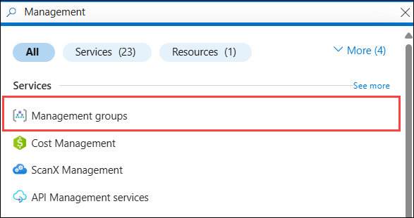

1. Expand the **alz** Management group under the Root Management Group. You should see the following management groups:

    - **alz** – The primary parent group for all ALZ-related management groups **(1)**.
    - **alz-decommissioned** –  For resources or subscriptions no longer in active use **(2)**.
    - **alz-landingzones** – For enterprise workloads and landing zones (e.g., production and development) **(3)**.
    - **alz-platform** – Hosts shared services such as identity, connectivity, and management resources **(4)**.
    - **alz-sandboxes** – Used for non-production, testing, or experimentation purposes **(5)**.

      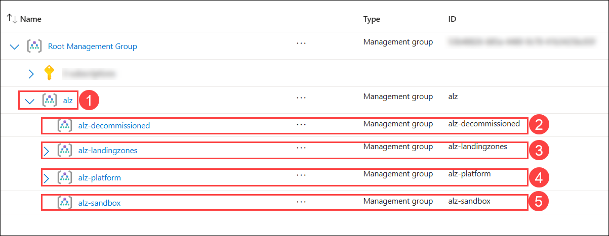

1. Click on the arrow next to **alz-platform (1)** management group and expand the **alz-connectivity (2)**, **alz-identity (3)** and **alz-management (4)** individually and review the **subscriptions** pre-assigned under them.

    - **alz-connectivity** :  **L1 - Connectivity Sub - SUFFIX**
    - **alz-identity** :  **L2 - Identity Sub - SUFFIX**
    - **alz-management** : **L3 - ES Management Sub - SUFFIX**

      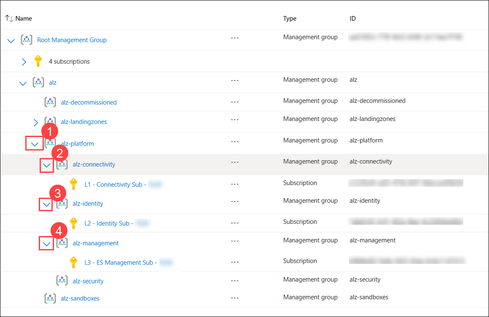

> **Congratulations** on completing the task! Now, it's time to validate it. Here are the steps:
> - Hit the Validate button for the corresponding task. If you receive a success message, you can proceed to the next task. 
> - If not, carefully read the error message and retry the step, following the instructions in the lab guide.
> - If you need any assistance, please contact us at cloudlabs-support@spektrasystems.com. We are available 24/7 to help you out.
<validation step="dfa3d6a9-445b-41bb-a9bc-e96373afe2f8" />

<validation step="3c8aeede-55a0-4c8a-a791-621fc2ea6c77" />

### Task 2:  Review Azure Policy assignments and assess compliance and security posture
In this task, you will review policy assignments across management groups and subscriptions, ensuring governance and security standards are enforced. You will also verify compliance status, identify non-compliant resources, and understand the scope and impact of applied policies.

In this task, you will review policy assignments across management groups and subscriptions, ensuring governance and security standards are enforced. You will also verify compliance status, identify non-compliant resources, and understand the scope and impact of applied policies.

#### **Review Policy Assignments**

1. In the **Azure Portal**, use the search bar to search for **Policy (1)** and select **Policy (2)** under Services.

    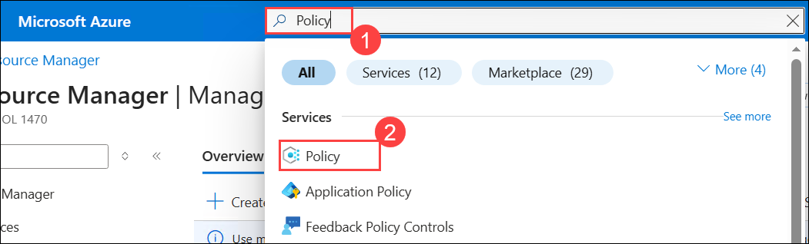 

1. Navigate to the **Assignments (1)** under the Authoring section within the Policy. Select **Scope (2)**, then set the scope to **alz (3)**, and then **Select (4)**.

    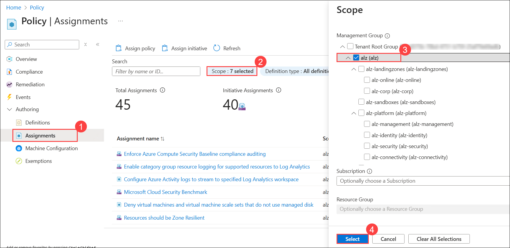 

1. Then, review the list of policy assignments **(1)** that are applied at the **alz (2)** management group level.

    >**Note:** You may see a varying number of policy assignments depending on your deployment type.

    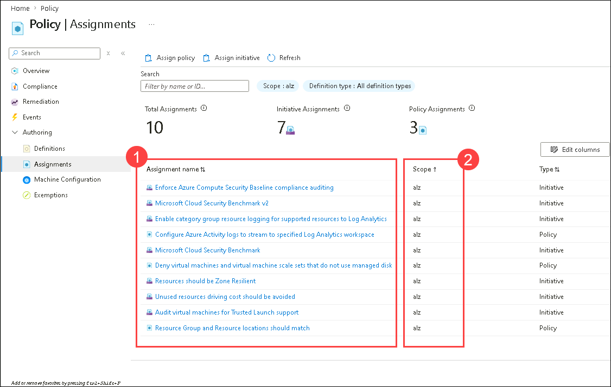 

#### **Validate Policy Enforcement and Compliance**

1. Click on **Scope (1)** and select **alz (2)** Management group and select **L2 - Identity Sub - SUFFIX (3)** to view the policies that are assigned to that subscription and click on **Select (4)**.

    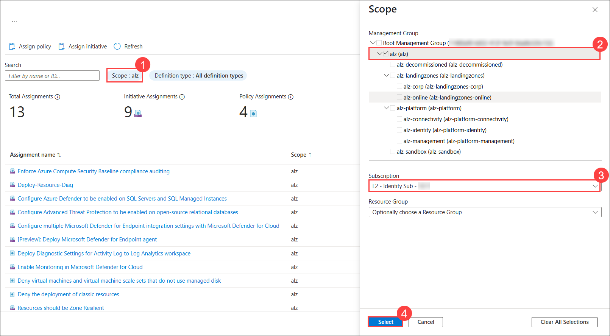

    >**Note:** You can also review the policies assigned at other Management group levels.

1. From the left navigation pane in the policy page, click on **Compliance (1)**.

1. Review compliance results, like
    - Overall resource compliance **(2)**
    - Resources by compliance state, it will show how many resources are:
        - Compliant **(3)**
        - Non-compliant **(4)**
    - Non-compliant initiatives **(5)**
    - Non-compliant policies (**6)**

        >**Note:** It would take a few minutes for the compliance, and you may see different Overall resource compliance and other metrics depending on your deployment type.
            
        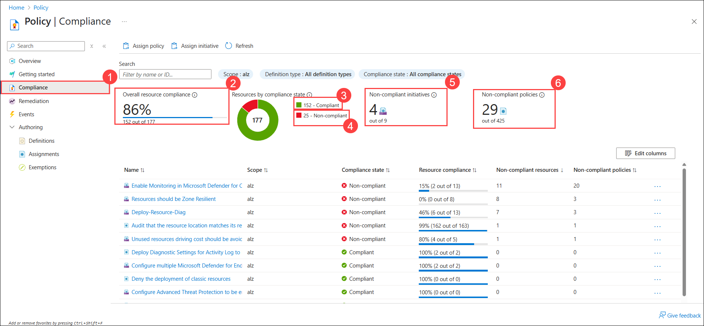

3. Locate the **non-compliant initiatives** from the list and select any one of them.  

    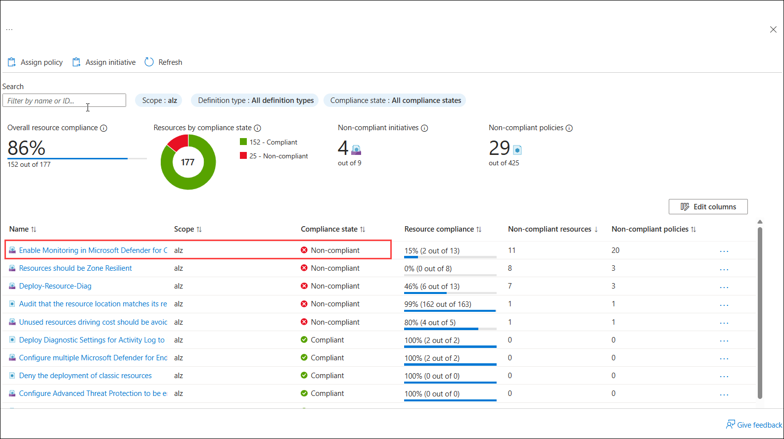

1. On the **non-compliant  groups** page, examine the listed **initiatives (1)** and their **compliance state (2)**. Then, select any initiative to view its associated policy groups.  

    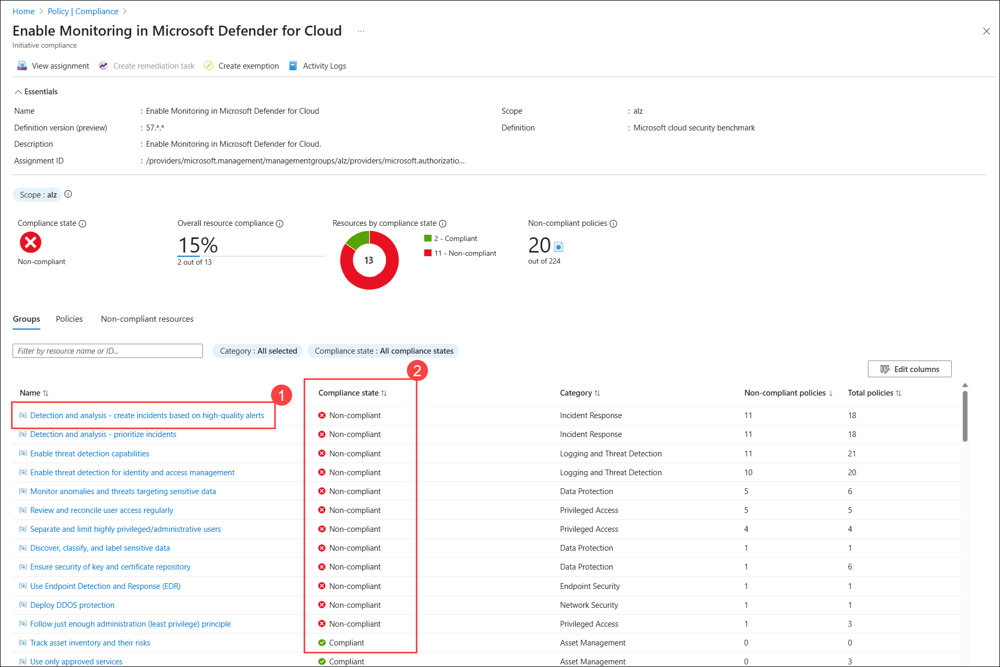

1. Within the initiative group's compliance section, click on **Policies (1)**, examine the **policies(2)** along with their **compliance status (3)**. Select any group to explore the policies it contains.  

    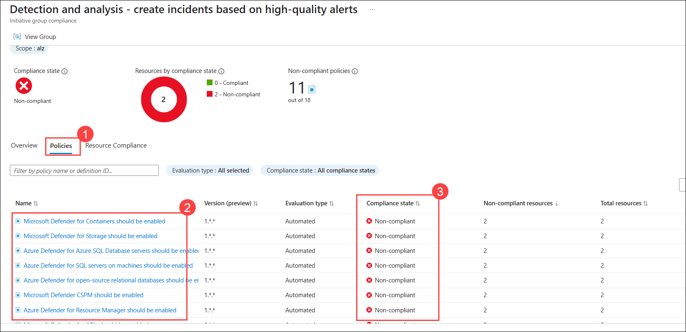

1. After opening a policy group, select any non-compliant policy, review the following details: 
    - The **affected resources (1)** associated with the policy.  
    - To identify the specific **reason** for non-compliance, click on **Details (2)** next to any affected resource. This will display the **non-compliance message** and the detailed **Reason for non-compliance (3)**.

        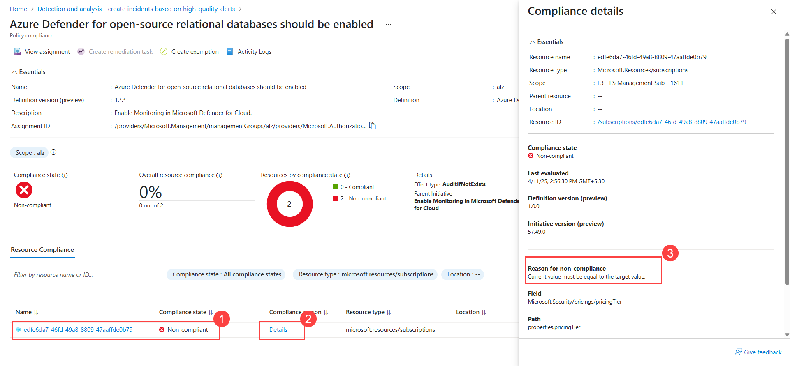 

### Task 3: Review Azure Role assignments for the Management Groups

1. From the Azure portal, navigate to **Management groups** and go to **alz** Management group.

    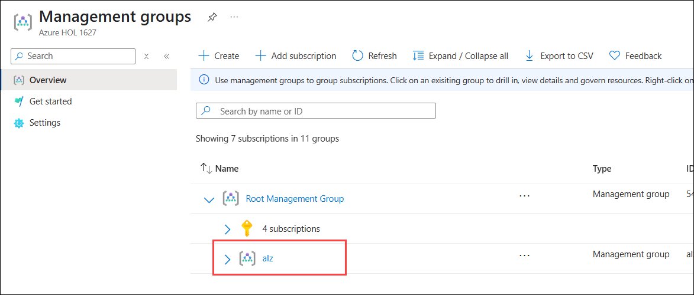 

1. In the **alz** Management group, select **Access control (IAM) (1)** from the left-hand menu and click on **View my access (2)**. 

1. Review the **Roles (3)** that are assigned to the Management group for the user:

    I. **Owner**: Grants comprehensive access to manage all resources. This includes permissions to create, modify, and delete resources, as well as to assign roles to others. Typically, there are two Owner role assignments:

    - One inherited from the Root user.
    - Another is assigned when the Landing Zone Accelerator is deployed.

    II. **User Access Administrator**: Allows the management of user access to resources. With this role, you can assign roles to other users, even if you do not have the permissions to manage the resources directly. This role is created as part of **Task 1 in Exercise 1**.

    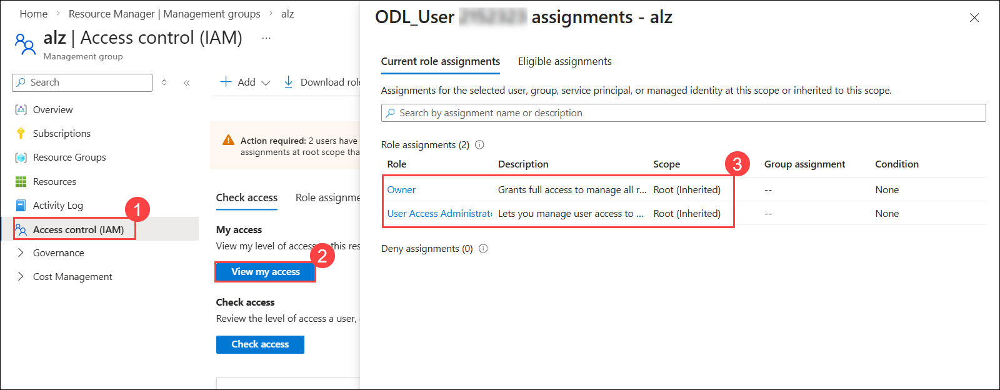 

> **Congratulations** on completing the task! Now, it's time to validate it. Here are the steps:
> - Hit the Validate button for the corresponding task. If you receive a success message, you can proceed to the next task. 
> - If not, carefully read the error message and retry the step, following the instructions in the lab guide.
> - If you need any assistance, please contact us at cloudlabs-support@spektrasystems.com. We are available 24/7 to help you out.
<validation step="1a45f29f-e8ae-4ba9-96f4-175566215d1d" />

## Summary

In this exercise, you have explored the Management Group hierarchy and verified subscription assignments within the Azure Landing Zone (ALZ) framework. You have also reviewed Azure Policy assignments, assessed compliance status, and identified non-compliant resources to understand the governance and security posture of the deployed landing zone.

### You have successfully completed the exercise!
### Click the **Next >>** button to proceed to Exercise 3.

 
