## Exercise 3: Adding a Subscription in the App Landing Zone Management Group

### Estimated Duration: 45 Minutes

## Overview
In this exercise, you will add an available subscription to the created management groups and assign a policy to it.

### Objectives
In this exercise, you will complete the following tasks:
   - Task 1: Adding a Subscription to App LZ Management Group
   - Task 2: Governance and Security for the Landing Zone Management group

### Task 1: Adding a Subscription to App LZ Management Group
In this task, you will add a subscription to the Application Landing Zone Management Group to align it with the organization’s governance structure. This allows for consistent application of policies, role-based access control, and compliance requirements across all resources.

1. From the Azure Portal, search and navigate to **Management groups** from the search bar.

     

1. Locate the top-level **Tenant Root Group** and find the **alz** Management group.

    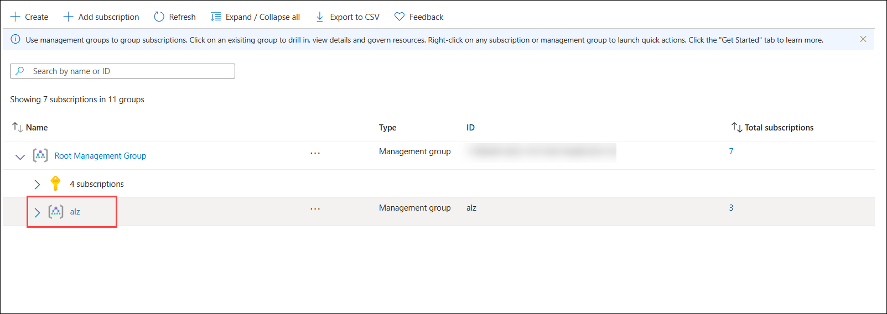

1. Click on the arrow next to the **alz** Management group and view its structure and subscriptions under it.

    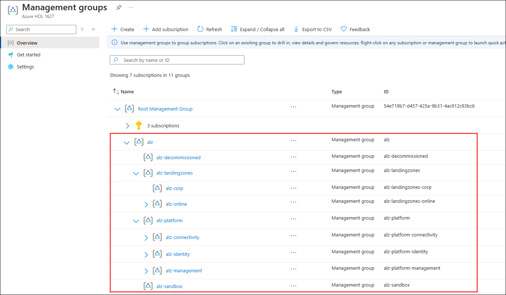

    >**Note:** If all the subscriptions are not visible, you can click on the **arrow next to Essentials** to collapse the details view and display the subscription list below.

    >    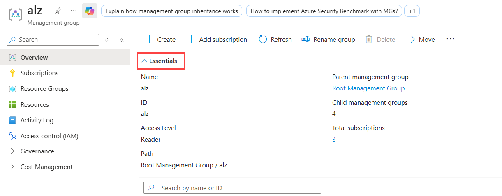

1. Note that there are no subscriptions under the **alz-landingzones** Management group.

1. From the Management Groups page, expand **alz-landingzones (1)**, then click the **ellipsis (...) (2)** next to **alz-online**, and select **+Add subscription here (3)**.

    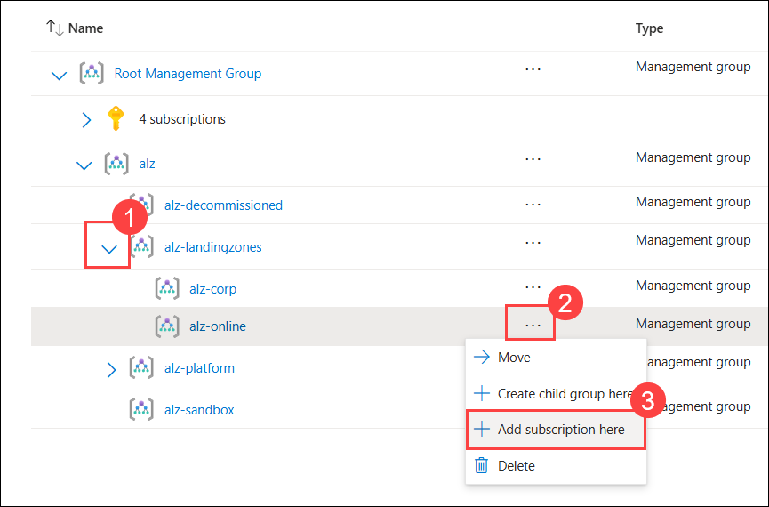

1. On the **Add subscription** page, select the subscription **L3- ES Landing Zone Sub - Suffix (1)** from the dropdown list. Click **Save (2)** to add the subscription to the Management Group and wait for the operation to complete.

    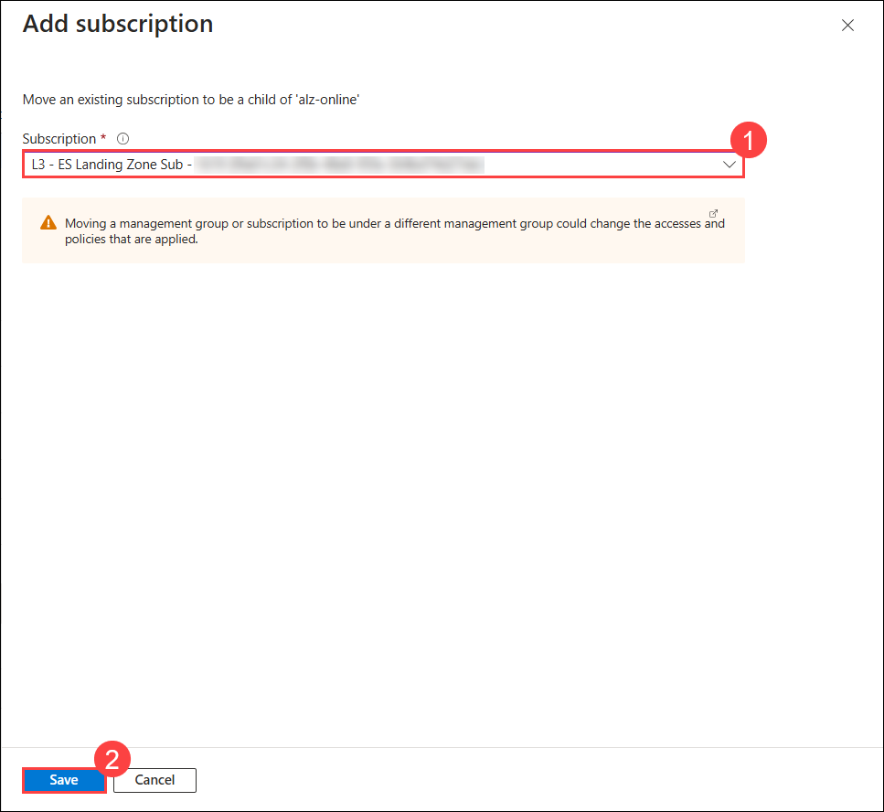

1. **Refresh** the Management Group view to confirm that the subscription now appears under the App Landing Zone Management Group.

1. Navigate to the newly added subscription **L3- ES Landing Zone Sub - Suffix** from the Management groups page.

    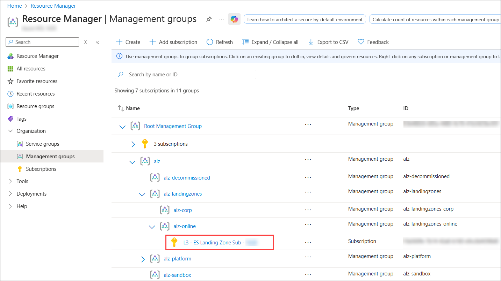

1. Select **Access control (IAM) (1)** from the left menu and click **View my access (2)** to see the role assignments **(3)** that have been inherited from the Management groups.

    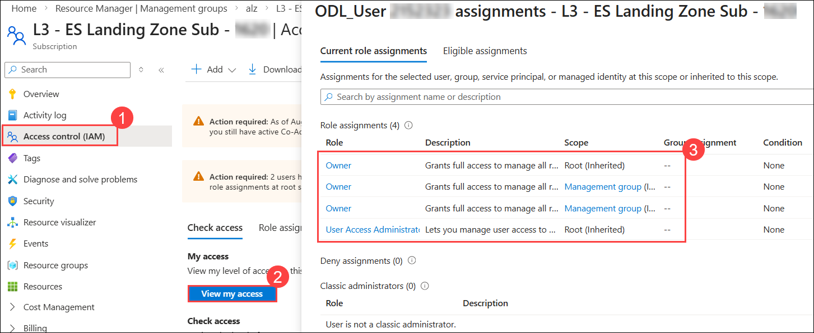

> **Congratulations** on completing the task! Now, it's time to validate it. Here are the steps:
> - Hit the Validate button for the corresponding task. If you receive a success message, you can proceed to the next task. 
> - If not, carefully read the error message and retry the step, following the instructions in the lab guide.
> - If you need any assistance, please contact us at cloudlabs-support@spektrasystems.com. We are available 24/7 to help you out.
<validation step="bb58a21f-947a-4209-bd50-3864c568fded" />

### Task 2: Governance and Security for the Management group
In this task, you will assign a policy and implement governance to the Landing Zone (LZ) Management Group to enforce organizational standards, ensure compliance, and manage resources effectively. 

1. Search and navigate to **Management groups** under Services from the Azure portal.

    

1. On the Management groups page, expand **alz** management group and select the **alz-landingzones**.

    upd1.png)

1. In the **alz-landingzones** management group page, select **Policy** from the left menu under **Governance**.

    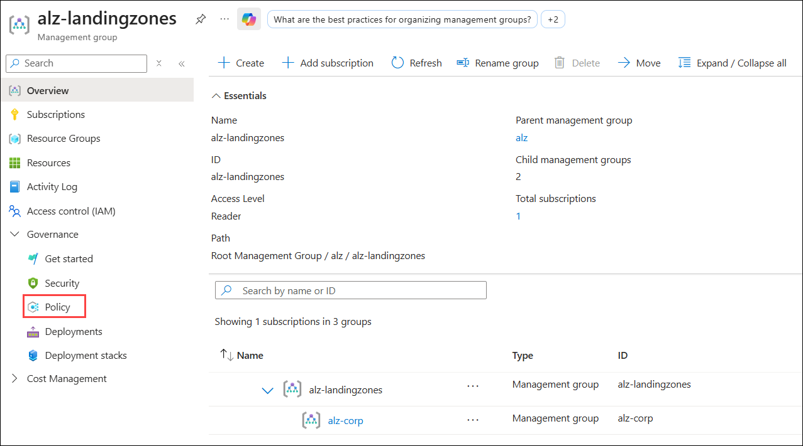

1. Click on **Assignments (1)** under Authoring and click on **Assign policy (2)** to create a new policy assignment.

    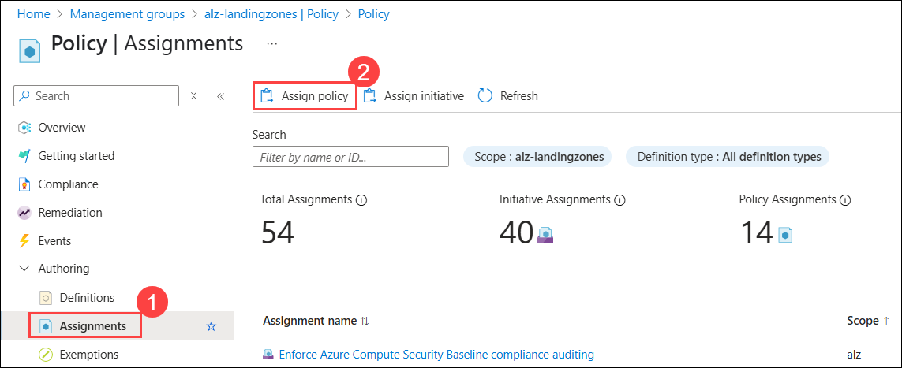

1. On the **Assign policy** page, ensure that **alz-landingzones** is selected in the **Scope** field. If it is not, click the **ellipsis (...) (1)** next to **Scope** and choose the **alz-landingzones** management group.

    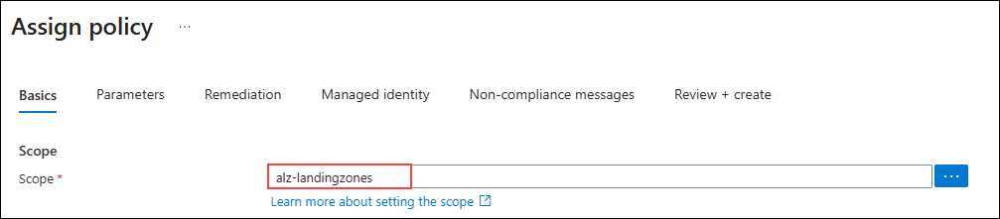

1. **Disable (1)** the **Policy enforcement** and click on the **ellipsis (...) (2)** next to **Policy definition** to select a policy.

    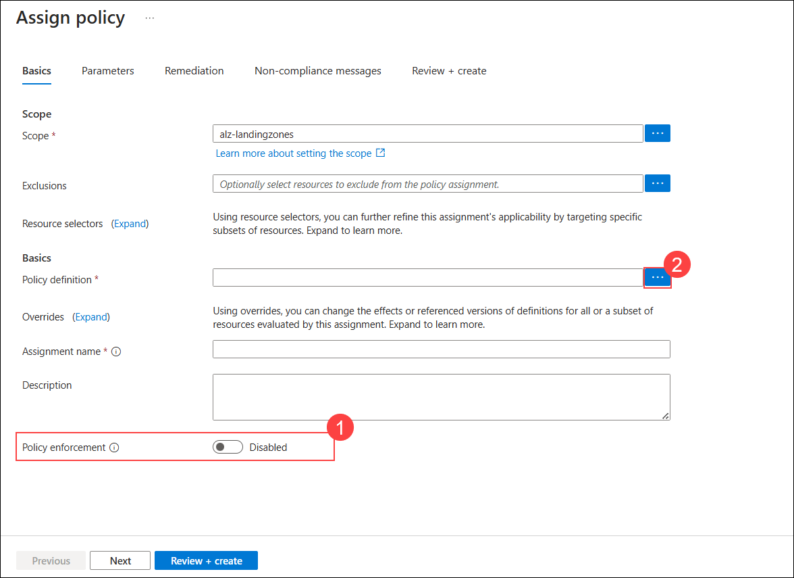

1. Search for **Require a tag (1)** policy, and select **Require a tag on resource groups (2)** policy and then click on **Add(3)**. Click on **Next** in the **Assign policy** page.

    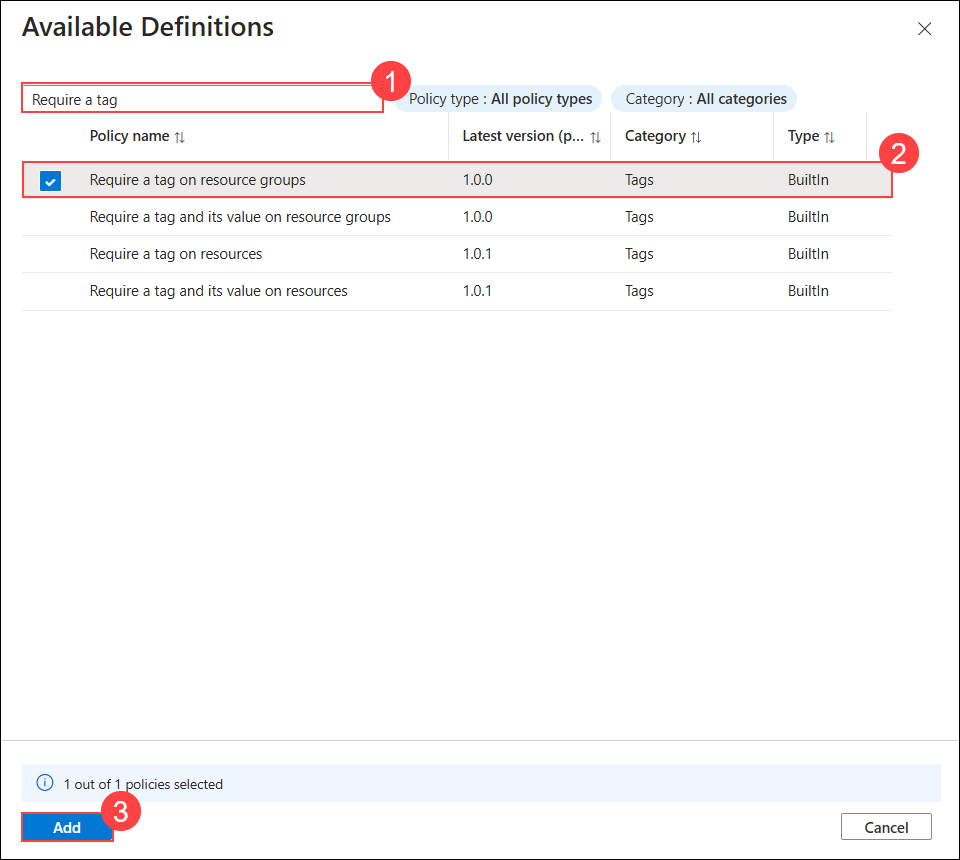

1. Go to the **Parameters (1)** page enter the tag name as **DeploymentId (2)** and then click on **Review + create (3)** and then **Create**.

    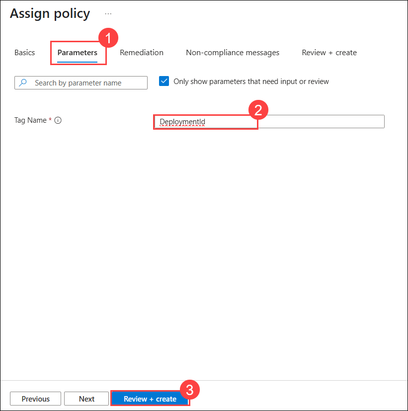

1. Navigate back to **Landing Zones** management groups page and select **Resource Groups (1)** from the left menu and click on **+ Create (2)**.

    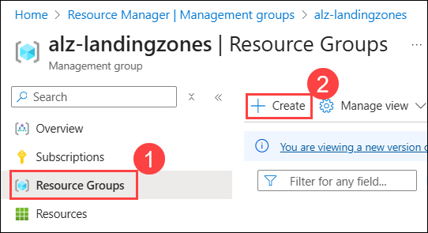

1. In **Create a resource group** page, select **L3- ES Landing Zone Sub - Suffix (1)** as the subscription and name the resouce group as **rg-test-policy (2)** and click on **Review + create (3)** and **Create**.

    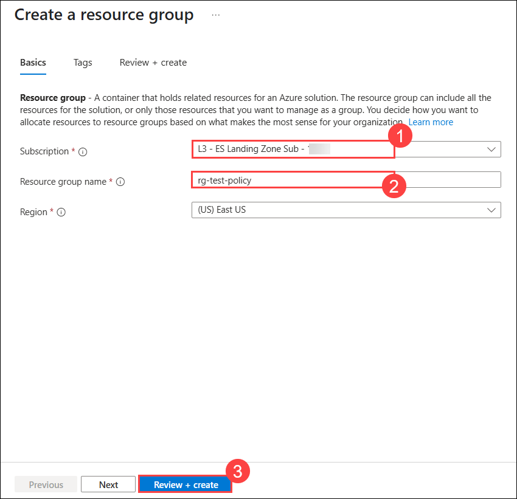

1. Once the resource group is created, navigate back to Policies in **L3- ES Landing Zone Sub - Suffix** subscription and under compliance, locate the **Require a tag on resource groups** policy to check the compliance.

    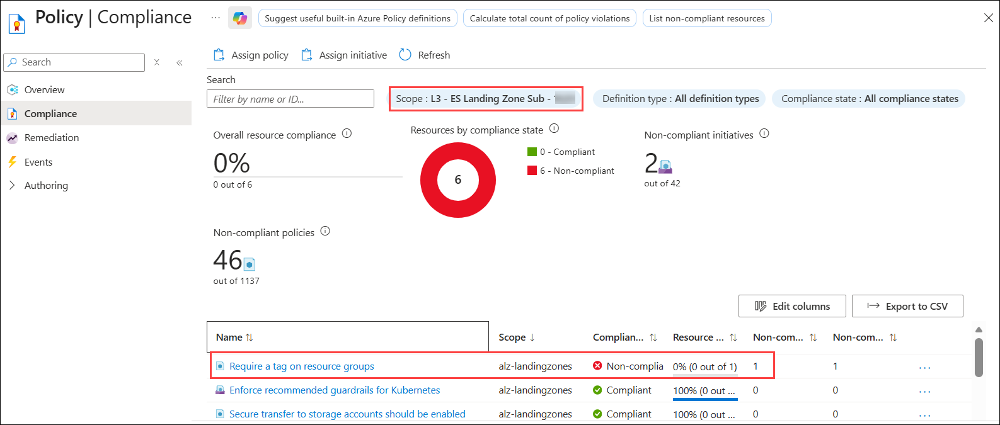

1. We can see that the compliance state is **Not Compilant** since we have not added any tags while creating the resource group
    >**Note:** The compliance state will take some time to appear. Do not wait; you can proceed with the next steps and check back later.

1. Navigate to **Resource groups** and select **rg-test-policy (1)** and click on **Add tags (1)** next to tags.

    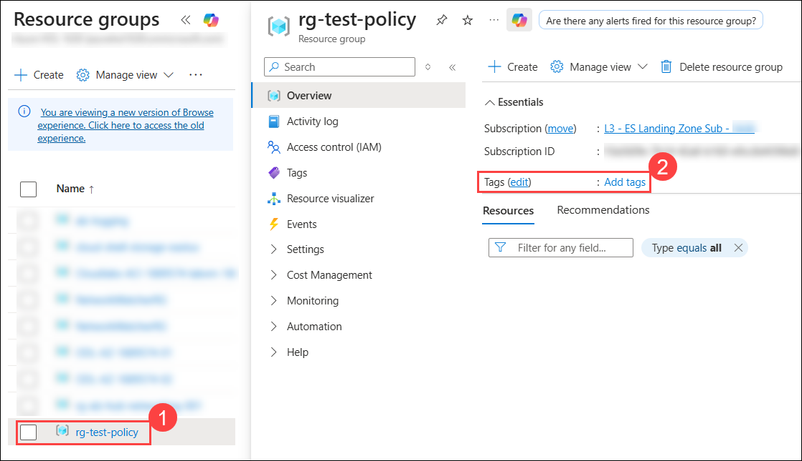

1. Add the tag name as **DeploymentId (1)** from the dropdown list and then select the **Deployment ID** as  **<inject key="DeploymentID" />  (2)**, and click on **Save (3).**

    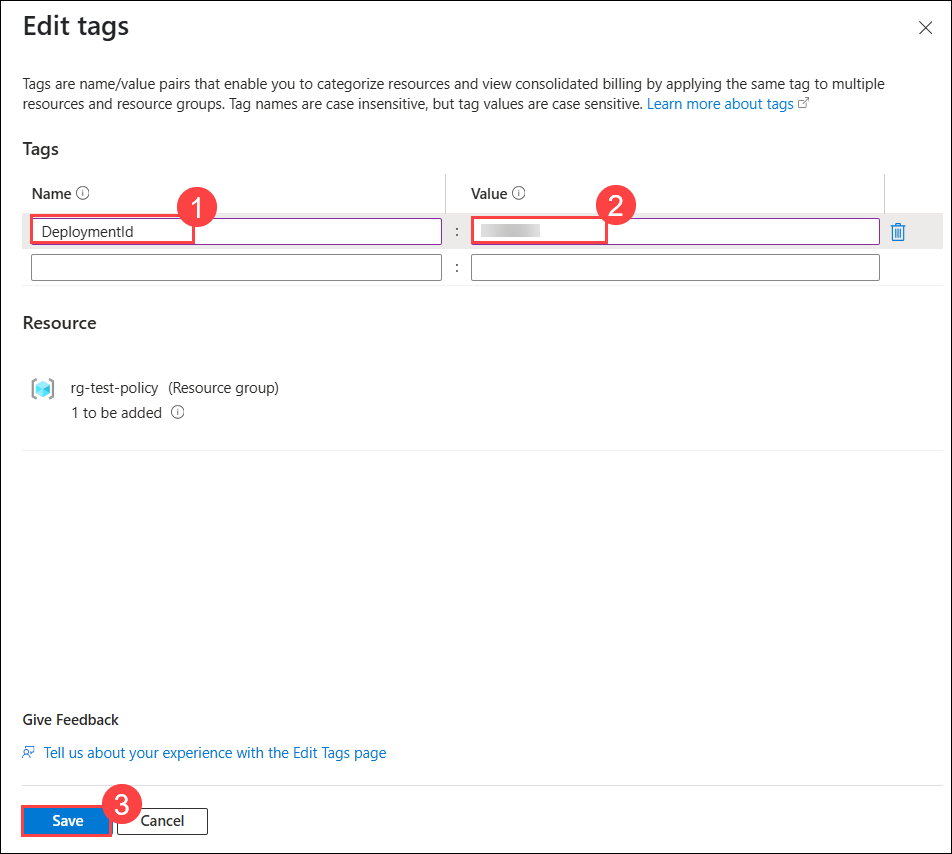

1. Verify policy compliance by selecting **Policy** from the subscription menu and clicking on **Compliance** to view the status, and now we can see that the status has changed to **Compilant**.

    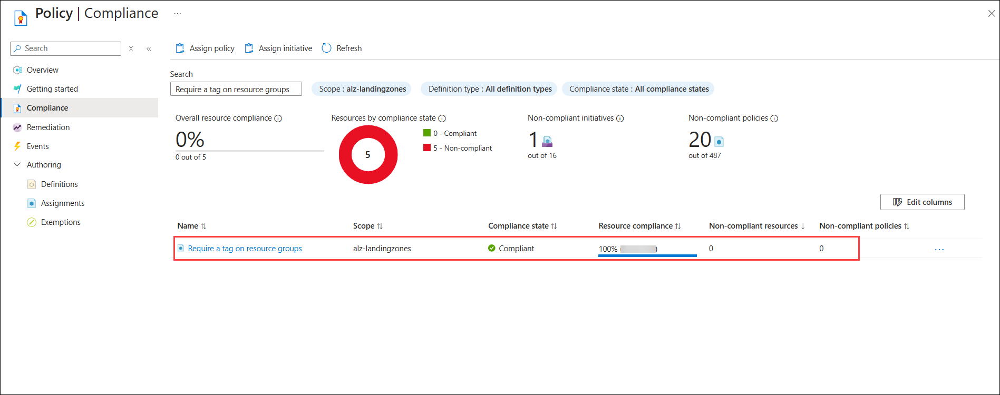
    >**Note:** The compliance state will take some time to appear. Do not wait; you can proceed with the next steps and check back later.

> **Congratulations** on completing the task! Now, it's time to validate it. Here are the steps:
> - Hit the Validate button for the corresponding task. If you receive a success message, you can proceed to the next task. 
> - If not, carefully read the error message and retry the step, following the instructions in the lab guide.
> - If you need any assistance, please contact us at cloudlabs-support@spektrasystems.com. We are available 24/7 to help you out.
<validation step="a7b1d886-ad42-492c-9c07-2c8dd6e2a8d4" />

## Summary

In this exercise, you have added a subscription to the Application Landing Zone Management Group and applied a policy to enforce tagging on resource groups. This exercise demonstrated how to manage subscriptions within management groups and implement governance policies to ensure compliance across your Azure environment.

### You have successfully completed the exercise!
### Click the **Next >>** button to proceed to Exercise 4.

 
