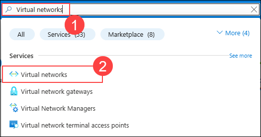
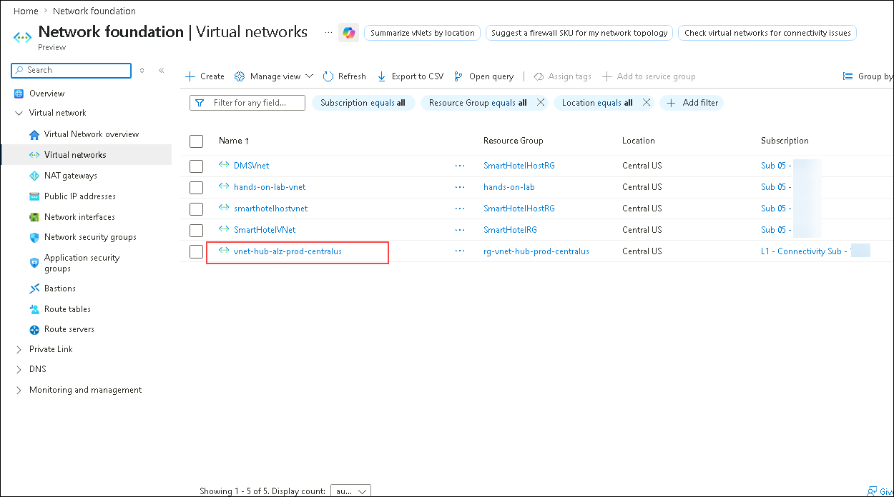
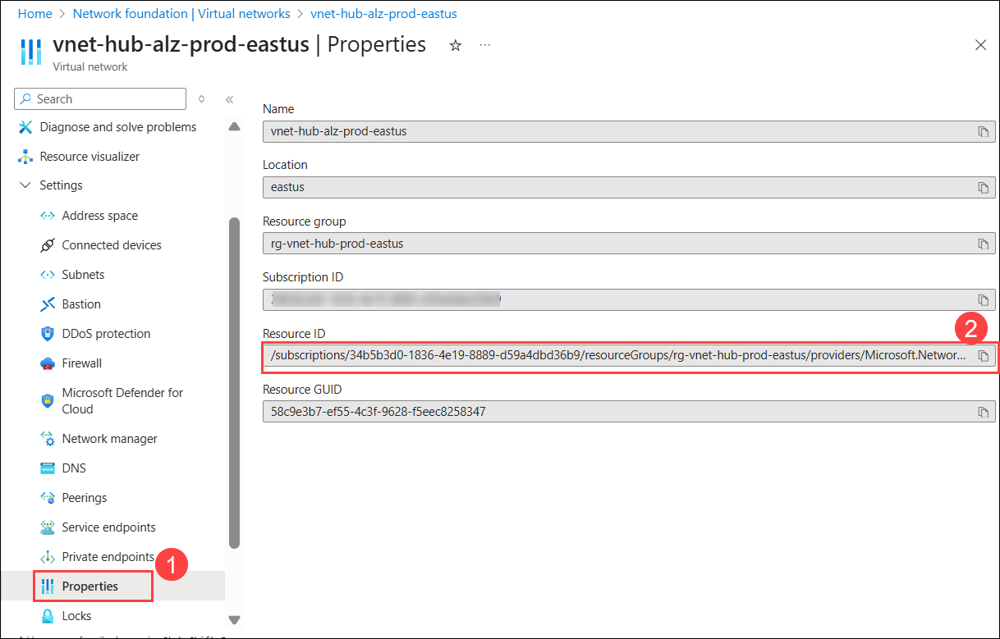
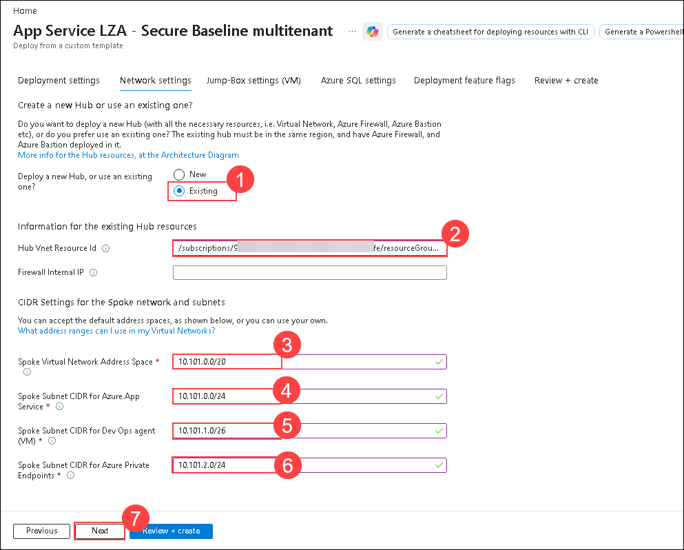
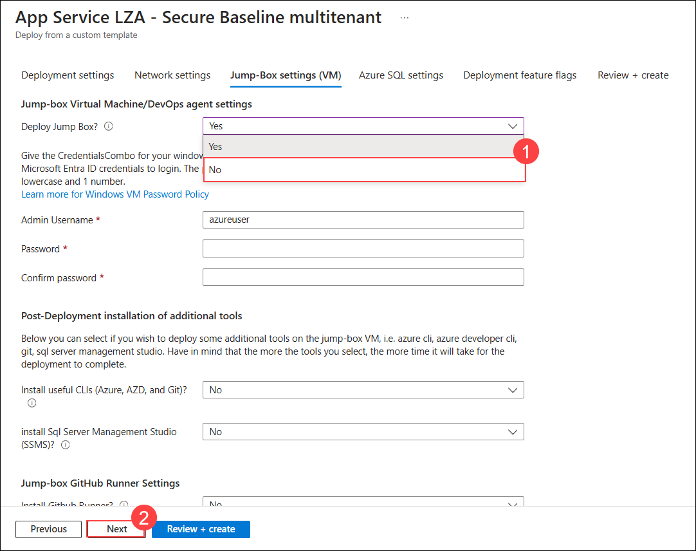
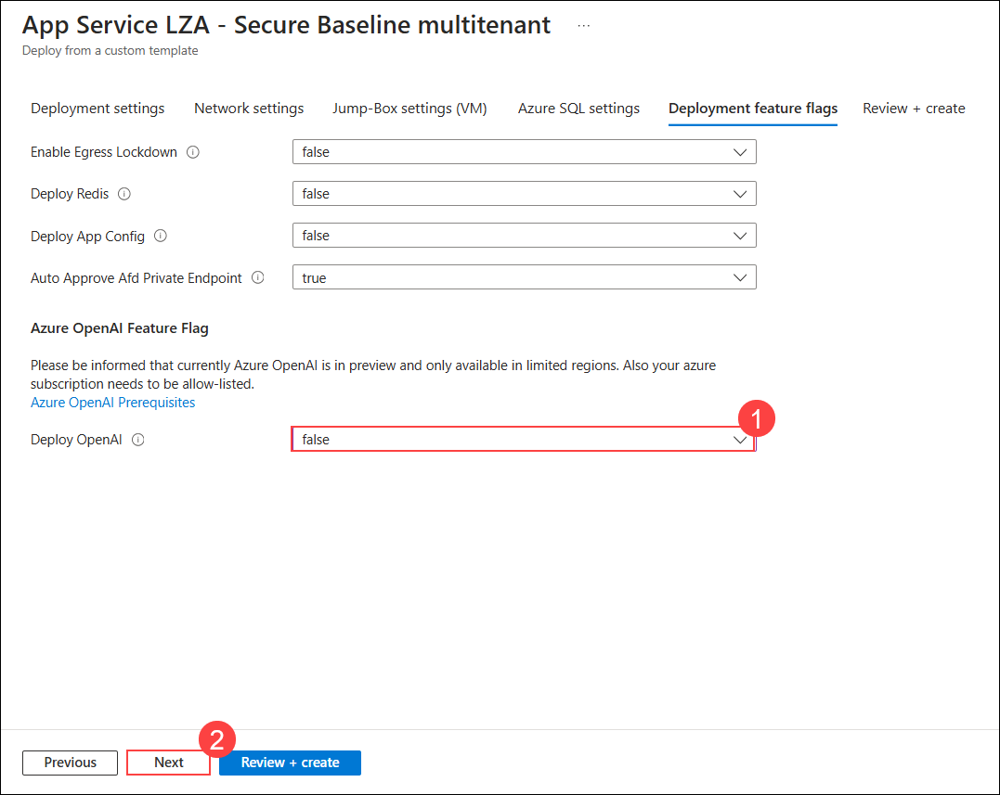

## Exercise 4: Deploying an Application Workload in the App Service Landing Zone Accelerator

### Estimated Duration: 150 Minutes

## Overview
The App Service Landing Zone (ALZ) Accelerator is a Microsoft-recommended deployment framework designed to provide a secure, scalable, and enterprise-ready environment for hosting web applications in Azure. It integrates security best practices such as RBAC, Azure Policy, Managed Identity (MSI), and Key Vault, ensuring compliance and data protection. With networking features like VNet integration, Private Endpoints, and App Service Environment (ASE), it enables secure hybrid connectivity. The accelerator also supports autoscaling, global distribution, and deployment slots for high availability and performance. Built-in monitoring and logging enhance governance and resilience, making it ideal for enterprise web applications and cloud modernization. 

### Objectives
In this exercise, you will complete the following task:
   - Task 1: Deploying the App Service Landing Zone Accelerator

### Task 1: Deploying the App Service Landing Zone Accelerator
In this task, you will deploy the App Service Landing Zone Accelerator to establish a standardized and scalable foundation for hosting web applications. The accelerator automates the deployment of key Azure resources and configurations, aligning with best practices for security, governance, and operational efficiency within the Application Landing Zone.

You will deploy the App Service Landing Zone Accelerator using an ARM template via the Azure portal. Ensure you have completed Exercise 1 (Azure Landing Zone deployment) before proceeding.

1. In the Azure portal, search for **Virtual networks (1)** and select **Virtual networks (2)** under Services.

    

1. Navigate to **Virtual Networks** and click on **vnet-hub-alz-prod-centralus** Virtual Network from the list.

    

1. Click on **Properties (1)** from the left menu under **Settings** tab and copy the **Resource ID (2)** of the Virtual Network and paste it into Notepad.

    

1. Copy the URL below and open a new tab in the Web Browser where you have logged in to Azure and paste it there, and hitthe  enter button on your keyboard.

   ```
   https://portal.azure.com/#view/Microsoft_Azure_CreateUIDef/CustomDeploymentBlade/uri/https%3A%2F%2Fraw.githubusercontent.com%2Fazure%2Fappservice-landing-zone-accelerator%2Fmain%2Fscenarios%2Fsecure-baseline-multitenant%2Fazure-resource-manager%2Fmain.json/uiFormDefinitionUri/https%3A%2F%2Fraw.githubusercontent.com%2Fazure%2Fappservice-landing-zone-accelerator%2Fmain%2Fscenarios%2Fsecure-baseline-multitenant%2Fazure-resource-manager%2Fmain-portal-ux.json
   ```

1. On the **Deployment settings** page enter the below settings and click on **Next (4)**.
   - **Subscription**: **L3- ES Landing Zone Sub - SUFFIX (1)**  
   - **Workload Name**: **alz (2)**
   - **Web App Plan Sku**: **S1 (3)**

     

1. On the **Network settings** page, make sure that **Existing (1)** is selected in **Deploy a new Hub, or use an existing one?** and enter the below details:

    - **Hub VNet Resource id (2)** : Paste the copied Resource ID of the **vnet-hub-alz-prod-centralus** Virtual Network from notepad.
    - **Firewall internal IP** - **LEAVE IT EMPTY**
    - **Spoke Virtual Network Address Space (3)**: 10.101.0.0/20
    - **Spoke Subnet CIDR for Azure App Service (4)**: 10.101.0.0/24
    - **Spoke Subnet CIDR for Dev Ops agent (VM) (5)**: 10.101.1.0/26
    - **Spoke Subnet CIDR for Azure Private Endpoints (6)**: 10.101.2.0/24
    - Click on **Next (7)** to continue.

      

1. On the **Jump-Box settings (VM)** page, select **No (1)** from the dropdown of **Deploy Jump Box?** and click on **Next (2)**.

    

1. On the **Azure SQL settings** page, ensure that **No** is selected from the **Deploy Azure SQL Server?** dropdown. Then, click **Next** to continue.

1. On the **Deployment feature flags** page, select **false (1)** in the dropdown of **Deploy OpenAI** and click on **Next (2)**

    

1. On the **Review + create** page, then click on **Create**.

1. Wait for the deployment to complete. This process will take around **25-30 minutes** to complete.

> **Congratulations** on completing the task! Now, it's time to validate it. Here are the steps:
> - Hit the Validate button for the corresponding task. If you receive a success message, you can proceed to the next task. 
> - If not, carefully read the error message and retry the step, following the instructions in the lab guide.
> - If you need any assistance, please contact us at cloudlabs-support@spektrasystems.com. We are available 24/7 to help you out.
<validation step="04c7ecd6-44c5-43e3-ae59-30a439f3a06b" />

## Summary

In this exercise, you have successfully deployed the App Service Landing Zone Accelerator to establish a secure and scalable environment for hosting web applications. The accelerator provides a standardized foundation with key Azure resources and configurations aligned with enterprise best practices. 

### You have successfully completed the exercise!
### Click the **Next >>** button to proceed to Exercise 5.
 


