## Exercise 4: Deploying an Application Workload in the App Service Landing Zone Accelerator

### Estimated Duration: 150 Minutes

## Overview
The App Service Landing Zone (ALZ) Accelerator is a Microsoft-recommended deployment framework designed to provide a secure, scalable, and enterprise-ready environment for hosting web applications in Azure. It integrates security best practices such as RBAC, Azure Policy, Managed Identity (MSI), and Key Vault, ensuring compliance and data protection. With networking features like VNet integration, Private Endpoints, and App Service Environment (ASE), it enables secure hybrid connectivity. The accelerator also supports autoscaling, global distribution, and deployment slots for high availability and performance. Built-in monitoring and logging enhance governance and resilience, making it ideal for enterprise web applications and cloud modernization. 

### Objectives
In this exercise, you will complete the following tasks:
   - Task 1: Deploying the App Service Landing Zone Accelerator
   - Task 2: Configuring Security, Networking, and Governance for App Service

### Task 1: Deploying the App Service Landing Zone Accelerator
In this task, you will deploy the App Service Landing Zone Accelerator to establish a standardized and scalable foundation for hosting web applications. The accelerator automates the deployment of key Azure resources and configurations, aligning with best practices for security, governance, and operational efficiency within the Application Landing Zone.

You have two options for deploying App Service Landing Zone Accelerator: 

If you have deployed Azure Landing Zone using ARM template in Exercise 1, you can proceed with **Option 1: ARM Template via the Azure portal**, else you can proceed with **Option 2: Bicep Template via Azure CLI**.

Click on the drop-down arrow ▶ for the deployment type you want to proceed with.

<details>
  <summary>1. ARM Template via the Azure portal</summary>

1. In the Azure portal, search for **Virtual networks (1)** and select **Virtual networks (2)** under Services.

    

1. Navigate to **Virtual Networks** and click on **vnet-hub-alz-prod-eastus** Virtual Network from the list.

    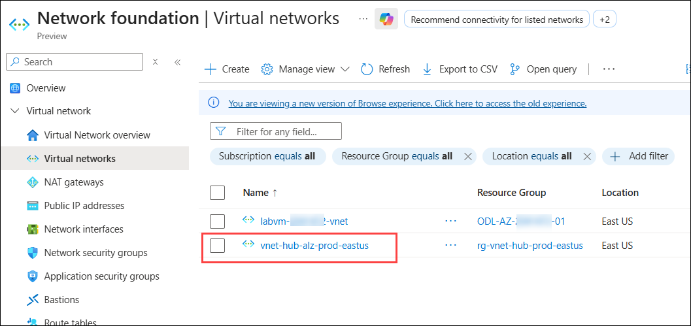

1. Click on **Properties (1)** from the left menu and copy the **Resource ID (2)** of the Virtual Network and paste it into Notepad.

    

1. Now, search and navigate to **Firewalls** from the search bar and click on **afw-alz-prod-eastus** Firewall from the list.

    

1. On the **Overview** page, copy the **Private IP** of the Firewall and paste it into Notepad.

    

1. Copy the URL below and open a new tab in the Web Browser where you have logged in to Azure and paste it there, and hitthe  enter button on your keyboard.

   ```
   https://portal.azure.com/#view/Microsoft_Azure_CreateUIDef/CustomDeploymentBlade/uri/https%3A%2F%2Fraw.githubusercontent.com%2Fazure%2Fappservice-landing-zone-accelerator%2Fmain%2Fscenarios%2Fsecure-baseline-multitenant%2Fazure-resource-manager%2Fmain.json/uiFormDefinitionUri/https%3A%2F%2Fraw.githubusercontent.com%2Fazure%2Fappservice-landing-zone-accelerator%2Fmain%2Fscenarios%2Fsecure-baseline-multitenant%2Fazure-resource-manager%2Fmain-portal-ux.json
   ```

1. On the **Deployment settings** page enter the below settings and click on **Next (4)**.
   - **Subscription**: **L3- ES Landing Zone Sub - SUFFIX (1)**  
   - **Workload Name**: **alz (2)**
   - **Web App Plan Sku**: **S1 (3)**

     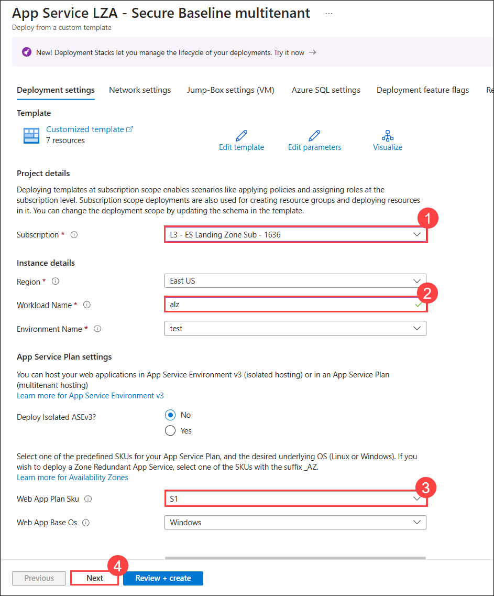

1. On the **Network settings** page, make sure that **Existing (1)** is selected in **Deploy a new Hub, or use an existing one?** and enter the below details:

    - **Hub VNet Resource id (2)** : Paste the copied Resource ID of the **vnet-hub-alz-prod-eastus** Virtual Network from notepad.
    - **Firewall internal IP (3)** : Paste the copied Private IP of the **afw-alz-prod-eastus** Firewall from notepad.
    - **Spoke Virtual Network Address Space (4)**: 10.101.0.0/20
    - **Spoke Subnet CIDR for Azure App Service (5)**: 10.101.0.0/24
    - **Spoke Subnet CIDR for Dev Ops agent (VM) (6)**: 10.101.1.0/26
    - **Spoke Subnet CIDR for Azure Private Endpoints (7)**: 10.101.2.0/24
    - Click on **Next (8)** to continue.

      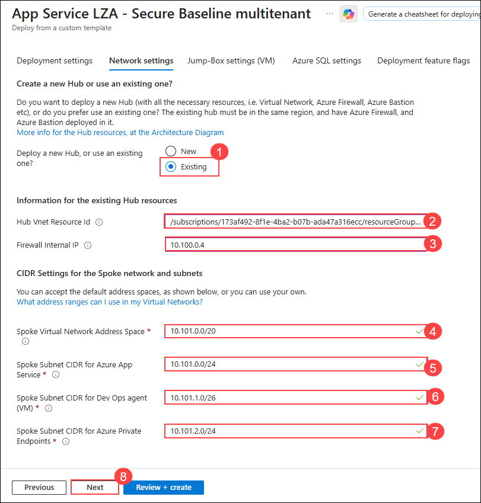

1. On the **Jump-Box settings (VM)** page, select **No (1)** from the dropdown of **Deploy Jump Box?** and click on **Next (2)**.

    

1. On the **Azure SQL settings** page, ensure that **No** is selected from the **Deploy Azure SQL Server?** dropdown. Then, click **Next** to continue.

1. On the **Deployment feature flags** page, select **false (1)** in the dropdown of **Deploy OpenAI** and click on **Next (2)**

    

1. On the **Review + create** page, then click on **Create**.

1. Wait for the deployment to complete. This process will take around **25-30 minutes** to complete.
</details>

<details>
  <summary>2. Bicep Template via Azure CLI</summary>

1. From the Azure Portal, search and navigate to **Virtual Networks** and click on **alz-hub-eastus** Virtual Network from the list.

    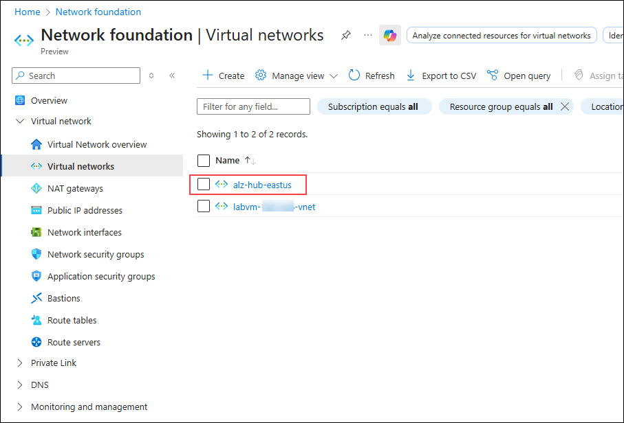

1. Click on **Properties (1)** under settings from the left menu and copy the **Resource ID (2)** of the Virtual Network and paste it into Notepad.

    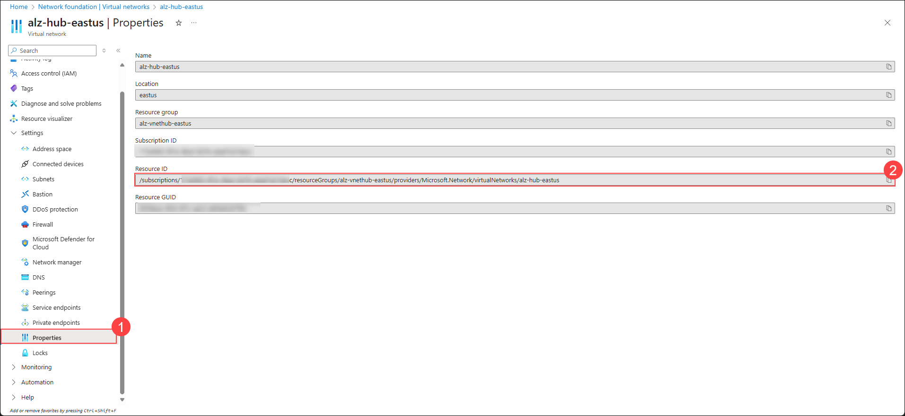

1. Now, search and navigate to **Firewalls** from the search bar and click on **alz-fw-eastus** Firewall from the list.

    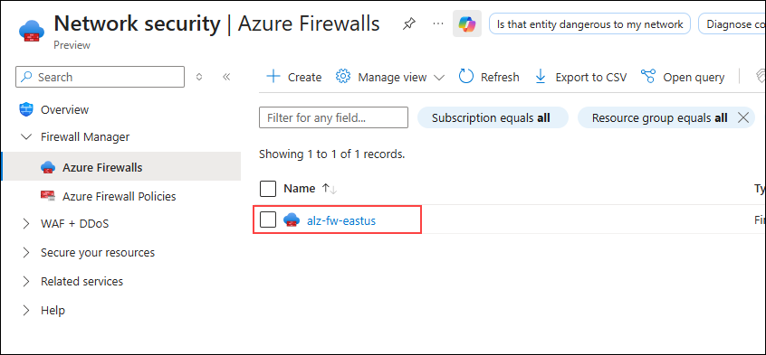

1. On the **Overview** page, copy the **Private IP (1)** of the Firewall and paste it into Notepad.

    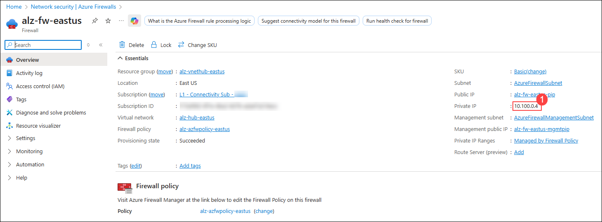

1. Open the Cloud Shell from the top-right corner of the Azure portal.

1. If PowerShell is open, switch to the Bash terminal.

1. Click on **Settings (1)** dropdown list, select **Go to Classic version (2)**.  

    

1. Enter the command below to open the code editor.

    ```bash
    code .
    ```
    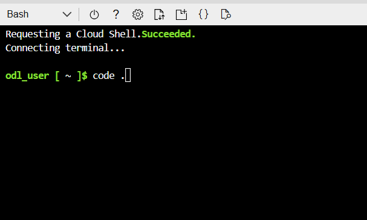

1. Click on **Upload/Download files (1)** and then click on **Upload (2)**.

    

1. Navigate to `C:\LabFiles`**(1)** and select the **appservicebicep (2)** zip file and click on **Open (3)**.

    

1. Run the below command in the **Bash terminal** to **unzip (1)** the file that you uploaded, and once the command is executed, go to the code editor and click on the **Refresh (2)** button.

    ```bash
    unzip appservicebicep.zip
    ```
        
    

1. Navigate to `appservicebicep/scenarios/secure-baseline-multitenant/bicep/main.parameters.jsonc` **(1)** in the code editor and then paste the VNet Resource ID, which you copied in Notepad, in the `vnetHubResourceId` **(2)** parameter value and the Firewall Private IP in the `firewallInternalIp` **(3)** parameter value as shown in the image below.

    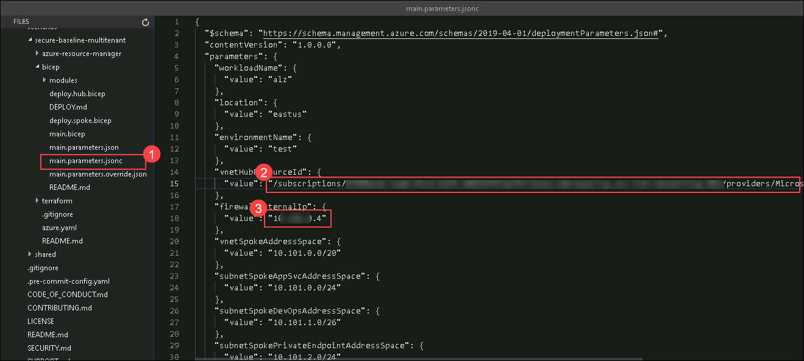

1. Save the file by pressing **Ctrl + S** on your keyboard.

1. Go back to the **Bash terminal** in the Azure portal and paste the following script to deploy the **App Service Landing Zone**. Make Sure to replace `Your Landing Zone Subscription` in line 1 with your `L3 - ES Landing Zone Sub - SUFFIX`, which you have copied in Notepad in Exercise 1.

    ```bash
    SUBSCRIPTION_NAME="Your Landing Zone Subscription"
    RESOURCE_GROUP_NAME="rg-spoke-alz-test-eastus"
    LOCATION="eastus"
    WORKLOAD_NAME="alz"
    ENVIRONMENT="test"
    az account set --subscription "$SUBSCRIPTION_NAME"
    az group create \
    --name "$RESOURCE_GROUP_NAME" \
    --location "$LOCATION"
    az deployment sub create \
    --name "AppServiceLZA-$(date +%Y%m%d-%H%M%S)" \
    --location "$LOCATION" \
    --template-file appservicebicep/scenarios/secure-baseline-multitenant/bicep/main.bicep \
    --parameters "@appservicebicep/scenarios/secure-baseline-multitenant/bicep/main.parameters.jsonc"
    ```

1. When you see a prompt that states **Please provide securestring value for parameter 'adminPassword':**, enter the password below and hit enter.

    ```
    Pa$$w0rd1234
    ```
    > **Note:** This step may take around **25-30 minutes** to complete.

1. Once the deployment is complete, navigate to **Resource groups** from the Azure portal and verify that **rg-spoke-alz-test-eastus** resource group is created.
</details>

> **Congratulations** on completing the task! Now, it's time to validate it. Here are the steps:
> - Hit the Validate button for the corresponding task. If you receive a success message, you can proceed to the next task. 
> - If not, carefully read the error message and retry the step, following the instructions in the lab guide.
> - If you need any assistance, please contact us at cloudlabs-support@spektrasystems.com. We are available 24/7 to help you out.
<validation step="04c7ecd6-44c5-43e3-ae59-30a439f3a06b" />

### Task 2: Configuring Security, Networking, and Governance for App Service
In this task, you will configure security, networking, and governance for the App Service by applying policies, enabling Managed Identity (MSI), integrating with Azure Key Vault, assigning RBAC roles for least privilege access, and enforcing RBAC compliance with Azure Policy.

#### **Enable Managed Identity (MSI) for Secure Authentication**

1. Search and Navigate to **App Services** from Azure portal and select **app-alz-test-eus-xxxxxx** App. 

    

1. Click on **Identity (1)** under Settings and toggle **System-assigned Managed Identity** to **On (2)** and **Save (3)**.

    

    > **Note:** Click on **Yes** if Enable system assigned managed identity pop-up appears.

1. Copy the **Object (principal) ID** (used to grant permissions in Key Vault) into Notepad.

    

#### **Integrate App Service with Azure Key Vault**

1. Search and select to **Key Vault** from Azure portal and select **kv-alz-test-eus-xxxxxx** Key Vault.  

    

1. Click on **Access control (IAM) (1)** and select **+ Add (2)** and **Add role assignment (3)**.  

    

1. In the **Add role assignments** page, search and select **Key Vault Secrets User (1)** and click on **Next (2).**

    

1. In the next page select **Managed Identity (1)** in the Assign access to: and click on **+ Select members (2) .** 

    

1. In the Select managed identities pane, select **App Service (2)** in the **Managed identity** dropdown and select **app-alz-test-eus-xxxxxx (3)** and then click on **Select (4)**.

    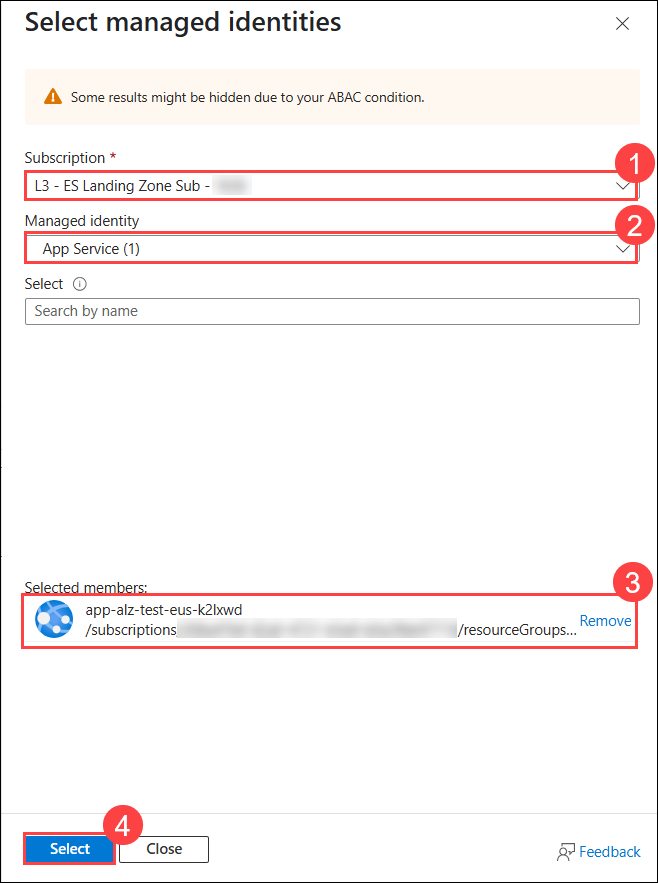

1. Click **Next** twice and **Review + assign** to assign the role.  

#### **Assign RBAC Roles for Least Privilege Access**
RBAC ensures that **only authorized users** can manage App Service settings.

1. Navigate to **App Services** from Azure portal and select **app-alz-test-eus-xxxxxx** App. 

    

1. Click on **Access control (IAM) (1)** and select **+ Add (2)** and **Add role assignments (3).**  

    

1. In the **Add role assignments** page, search and select **Reader (1)** and click on **Next (2).**

    
 
1. On the next page, in the Assign access to: User, group, or service principal, click on **+ Select members (1)**, in the Select members pane, select **User 1 (2)** in the list, then click on **Select (3).** 

    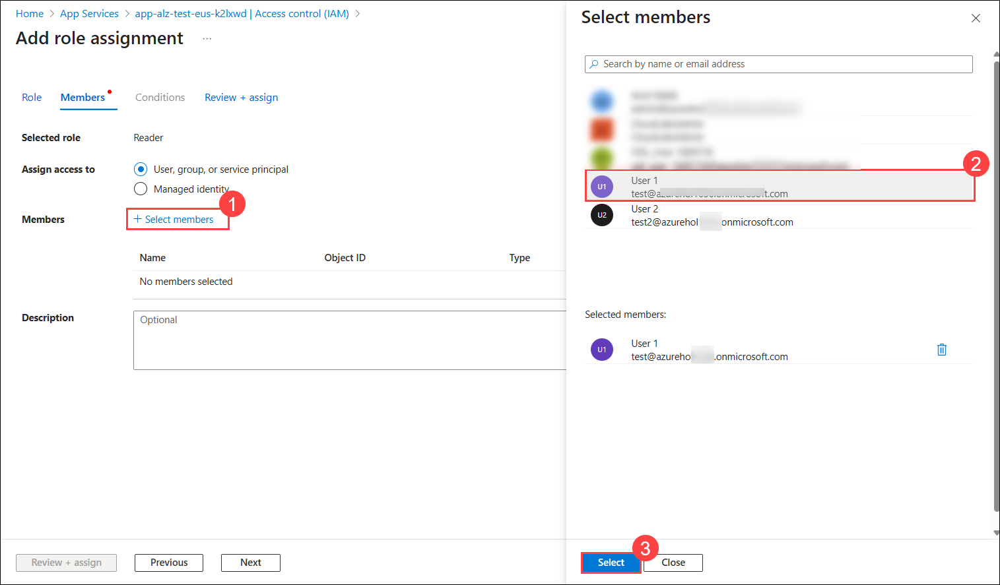

1. Click on **Review + Assign** twice to assign role to the user. 

1. Once the assignment is complete, navigate to **New InPrivate window**(if you are using Edge) and search and navigate to the Azure portal from the link below

    ```
    https://portal.azure.com/
    ```
1. On the **Sign in to Microsoft Azure** tab, you will see the login screen. In that enter the following email/username, and click on **Next (2).** 

    * **Email/Username**: <inject key="User 01 UPN"></inject> **(1)**
   
      
     
8. Now enter the following password and click on **Sign in (2).**
   
    * **Password**: <inject key="User 01 Password"></inject> **(1)**

       

1. On the Stay signed-in window, click on **No**.

9. At the **Let's keep your account secure** window, select **Next**.

      

1. On the Install Microsoft Authenticator app page, install the app on your phone if you do not have it and select **Next**.

1. On the **Set up your account in app** page, select **Next**. 

11. A **QR code** will be displayed on your computer screen.

1. In the Authenticator app, select **Scan a QR code** and scan the code displayed on your screen.

1. After scanning, click **Next** to proceed.

    

1. On your phone, enter the number shown on your computer screen in the Authenticator app and select **Next**.

1. On the **Authenticator Added** window, click on **Done**.       

1. If prompted to stay signed in, you can click **No**.

    

1. If a **Welcome to Microsoft Azure** popup window appears, click **Cancel** to skip the tour.

1. After logging in, search and navigate to the **All resources** section in the Azure portal. 

    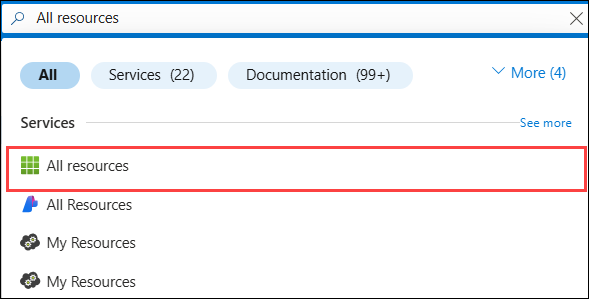

1. On the **All resources** page, you will only see the App services resources.

    

1. **Close** the InPrivate window.

#### **Enforce RBAC Compliance with Azure Policy**
To ensure security, you can enforce **RBAC compliance** using Azure Policy.

1. IN Azure portal, navigate to **Policy** and click on **Assignments (1)** and click on **Assign Policy (2)**.

    

1. On the Assign policy page, click on the **ellipsis (...) (1)** next to **Scope**.

1. On the Scope tab, select the **Landing Zone(alz-landingzone) (2)** Management group and Subscription **L3- ES Landing Zone Sub - Suffix (3)** and select **rg-spoke-alz-test-eastus (4)** and click on **Select (5)**. 

    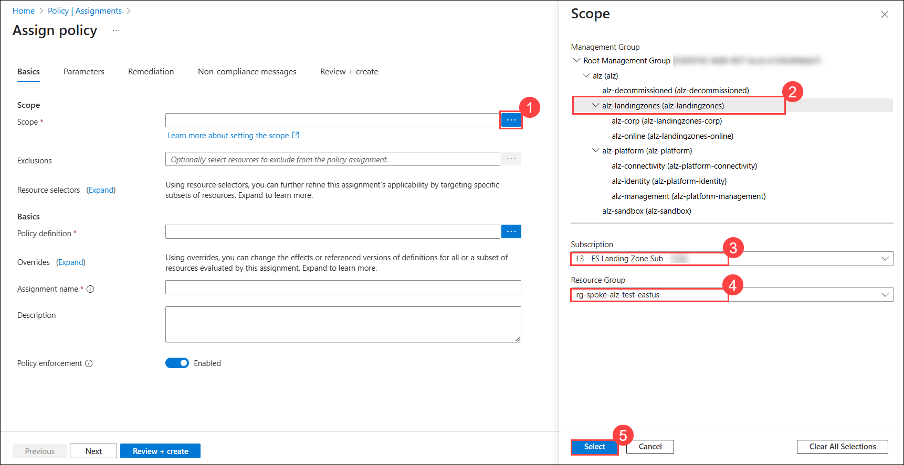

1. On the **Assign policy** page, **Disable (1)** the **Policy enforcement** and click on the **ellipsis (...) (2)** next to **Policy definition** to select a policy.

    

1. Search and select **Azure Key Vault should use RBAC permission model (1)** policy, then click on **Add(3)**.

    

1. Click **Review + Create** and then **Create**.  

## Summary

In this exercise, you have deployed the App Service Landing Zone Accelerator to establish a secure and scalable environment for hosting web applications. You also configured security by enabling Managed Identity (MSI) for the App Service, integrated it with Azure Key Vault for secure secret management, assigned RBAC roles to ensure least privilege access, and enforced RBAC compliance using Azure Policy. 

### You have successfully completed the exercise!
### Click the **Next >>** button to proceed to Exercise 5.
 


