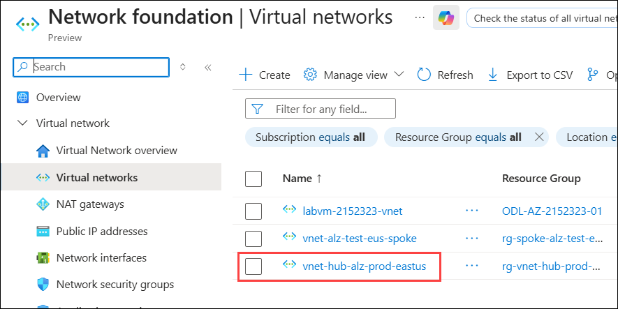
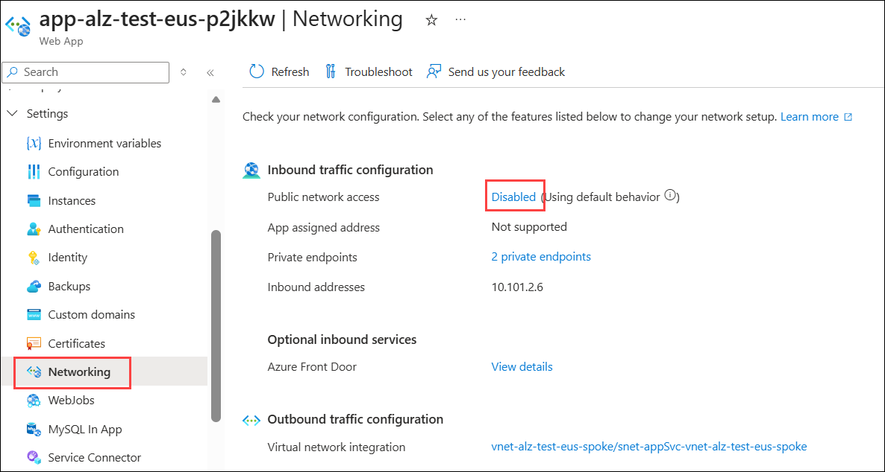
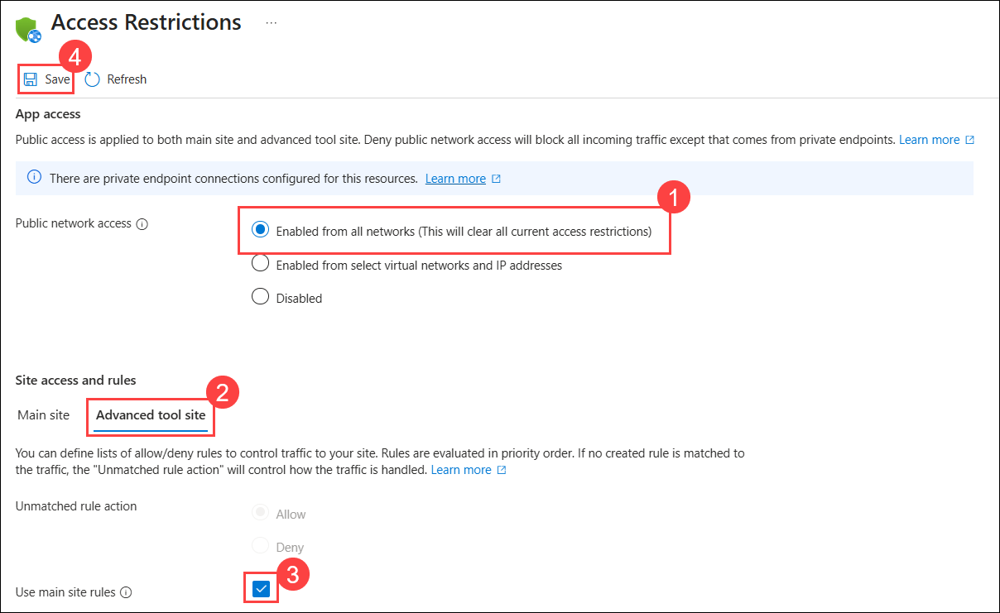
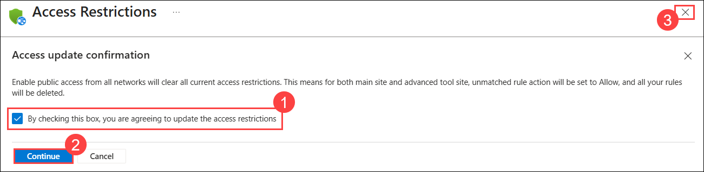
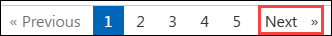

## Exercise 5: Network Validation and App Service Configuration in Azure Landing Zone

### Estimated Duration: 30 Minutes

## Overview
After deploying the App Service Landing Zone in Exercise 4, this exercise focuses on validating the network connectivity between your hub and spoke networks and configuring App Service public access. You'll verify VNet peering, validate private DNS zones, review network security groups, and enable public access for your App Service to ensure proper connectivity within your Azure Landing Zone architecture.

### Objectives
In this exercise, you will complete the following tasks:
   - Task 1: Validating VNet Peering Configuration
   - Task 2: Verifying Private DNS Zones and Name Resolution
   - Task 3: Reviewing Network Security Groups Configuration
   - Task 4: Enabling App Service Public Access and Connectivity

## Task 1: Validating VNet Peering Configuration
In this task, you will verify that VNet peering exists and is properly configured between the hub and spoke networks.

#### **Verify Existing VNet Peering**

1. In the Azure portal, search for **Virtual networks (1)** and select **Virtual setworks (2)** under Services.

    

1. Select the hub VNet **vnet-hub-alz-prod-eastus** in the **rg-vnet-hub-prod-eastus** resource group.

    

1. Click on **Peerings (1)** from the left menu to check for **peerTo-vnet-alz-test-eus-spoke (2)** peering connections.

    

1. Verify the Peering state shows **Connected** status.

    

1. Click on **peerTo-vnet-alz-test-eus-spoke** to view the peering settings and ensure the following options are enabled:
   - Allow 'alz-hub-eastus' to access 'vnet-alz-test-eus-spoke': **Checked (1)**
   - Allow 'alz-hub-eastus' to receive forwarded traffic from 'vnet-alz-test-eus-spoke': **Checked (2)**
   - Click **Save (3)** if you made any changes.

     

## Task 2: Verifying Private DNS Zones and Name Resolution
In this task, you will verify the configuration of private DNS zones for secure name resolution of Azure services.

#### **Verify Existing Private DNS Zones**

1. From the Azure Portal, search and navigate to **Private DNS zones**.

    

1. Verify that **privatelink.vaultcore.azure.net** and **privatelink.azurewebsites.net** exist.

    

#### **Verify Virtual Network Links for Private DNS Zones**

1. Click on **privatelink.azurewebsites.net (1)** and Select **Virtual network links (2)** under DNS Management from the left menu.

    

1. Verify that **alz-hub-eastus-link** and **vnet-alz-test-eus-spoke-link** are present and show **Completed** status for Link status.

    

1. You can repeat this verification for **privatelink.vaultcore.azure.net** private DNS zone.

## Task 3: Reviewing Network Security Groups Configuration
In this task, you will review the network security groups configuration to understand the micro-segmentation and security rules applied to your App Service environment.

#### **Review Network Security Groups**

1. From the Azure portal, search and navigate to **Network security groups** and click on one of the **NSGs** **nsg-alz-test-eus-SUFFIX**

    

1. On the Overview page, review the Security rules for the NSG.

    

## Task 4: Enabling App Service Public Access and Connectivity
In this task, you will enable public network access for your App Service to ensure proper connectivity for testing and validation purposes.

#### **Enable Networking for App Service**

1. Navigate to **App Service** from the Azure portal and select **app-alz-test-eus-xxxxx** app and go to **Networking (1)** from the left pane and click on **Disabled (2)** next to Public network access.

    

1. Now select **Enabled from all networks (This will clear all current access restrictions) (1)** and click on **Continue** on the Warning popup. 

1. Click on **Advanced tool site (2)** and **Check (3)** the box for Use main site rules and click on **Save (4).** 

    

1. On the Access update confirmation page, click on the **checkbox (1)** and click on **Continue (2)** and **Close (3)** the page.

    

1. In your **app-alz-test-eus-xxxxx** App Service, navigate to your **Overview (1)** page and click on **Default domain (2)** URL.

    

1. You will encounter a page similar to the image below, which indicates that no application has been hosted in this web app yet.

    

> **Congratulations** on completing the task! Now, it's time to validate it. Here are the steps:
> - Hit the Validate button for the corresponding task. If you receive a success message, you can proceed to the next task. 
> - If not, carefully read the error message and retry the step, following the instructions in the lab guide.
> - If you need any assistance, please contact us at cloudlabs-support@spektrasystems.com. We are available 24/7 to help you out.
<validation step="c414faa3-0693-45f3-88e7-514b147d2fcd" />

## Summary 

In this exercise, you have validated the network connectivity and configuration for your App Service Landing Zone. You verified VNet peering between the hub and spoke networks, ensured private DNS zones were properly linked for name resolution, reviewed NSG rules for security, and enabled public access for your App Service to confirm connectivity. These steps are crucial for ensuring that your Azure Landing Zone is configured correctly for secure and efficient application hosting.

### You have successfully completed the exercise!
### Click the **Next >>** button to proceed to Exercise 5.

 

