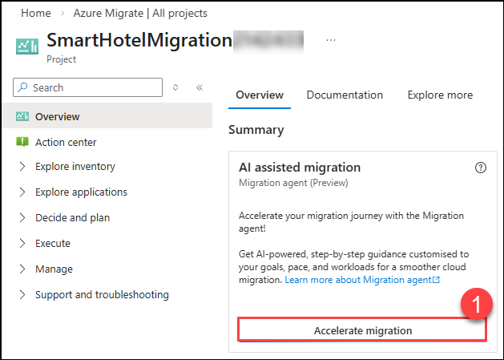
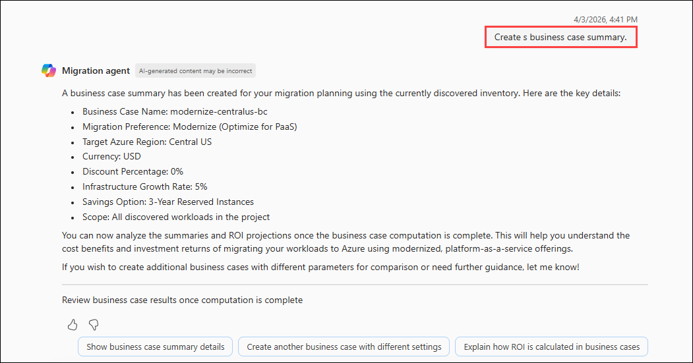
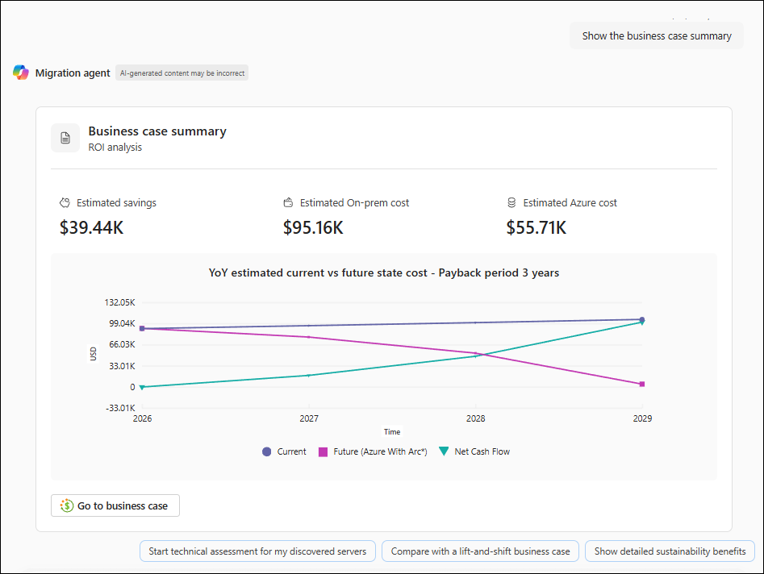
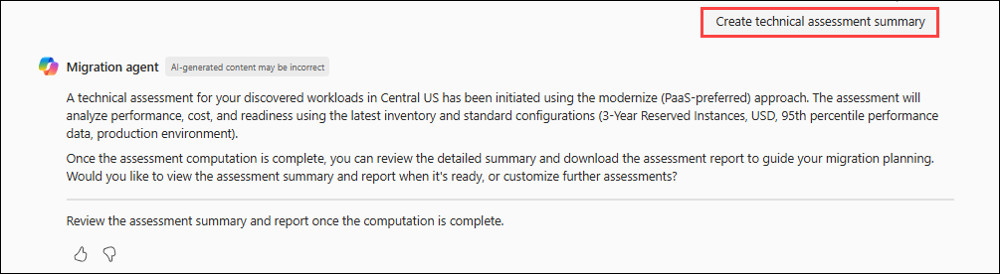
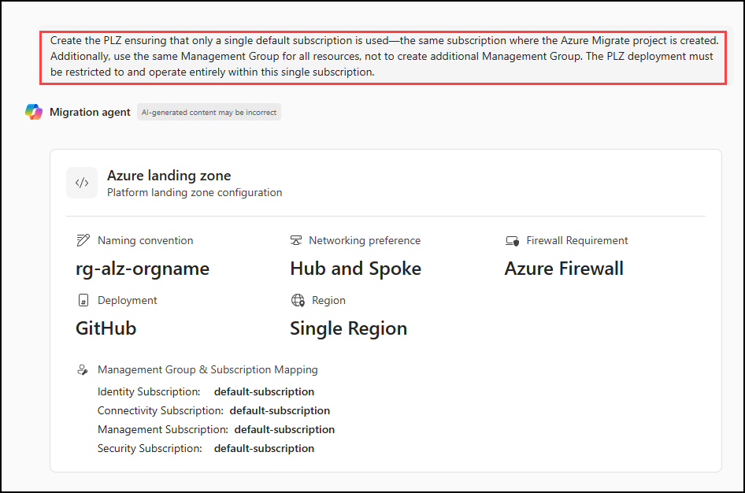
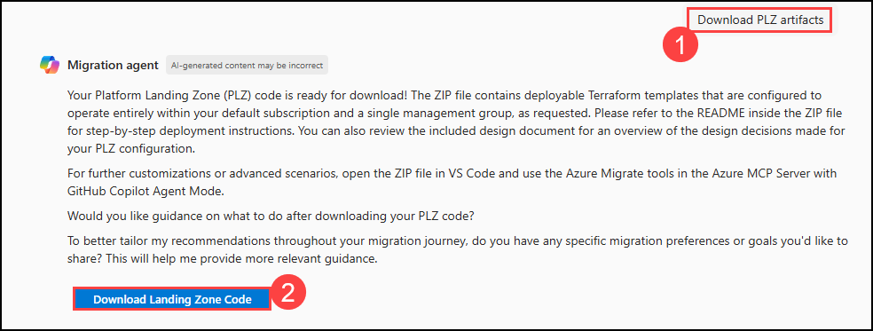

# Exercise 2: Business Value & ROI Justification with Azure Copilot (READ-ONLY)

### Estimated time: 40 Minutes

In this exercise, you will assess the migration readiness of the SmartHotel application using Azure Migrate with Copilot prompts. First, you will create an assessment for VMs, setting up and grouping them to generate a report that shows whether they're ready for migration to Azure.

Next, you will configure dependency visualization by installing monitoring agents on the VMs. This will help you map out and understand the dependencies between different application parts, ensuring everything works properly before migrating to Azure.

## Lab objectives

In this exercise, you will complete the following tasks:

- Task 1: Create a migration assessment with Azure Copilot

### Task 1: Create a migration assessment with Azure Copilot

In this task, you will use Azure Copilot to create a migration assessment for the SmartHotel application, using the data gathered during the discovery phase.

1. Return to the **LabVM**, then navigate to the **Azure Migrate** page in the Azure portal. From the left navigation pane, select **All projects**, and then choose **SmartHotelMigration<inject key="DeploymentID" enableCopy="false" />**. Then click on **Accelerate migration (1)** to view details in the old experience.

    

2.  Enter the prompt **Show discovered servers in this project**.

    

3. Enter the prompt **Create a business case summary**. It will create a Business Case to analyze ROI for the discovered server.

    

4. Enter the prompt **Show the business case summary**. It will show detailed Business case Summary, ROI, Estimated Cost for the discovered infrastructure. Scroll down and read the details for better understanding.

    
    
5. Enter the prompt **Create technical assessment summary**.

    

6. Enter the prompt **Show technical assessment summary**.

    
    
    
    
7. Enter the prompt below promt, click on **enter** and review the copilot reply.

    ```
    Create the PLZ ensuring that only a single default subscription is used—the same subscription where the Azure Migrate project is created. Additionally, use the same Management Group for all resources, not to create additional Management Group. The PLZ deployment must be restricted to and operate entirely within this single subscription.
    ```

    

8. Enter the prompt **Download PLZ artifacts (1)**, click on **Download Landing Zone Code (2)** to download the file.

    


### Summary 

In this exercise, you created and configured a migration assessment in Azure Migrate and its dependency visualization feature by creating a Log Analytics workspace and deploying the Azure Monitoring Agent and Dependency Agent on both Windows and Linux on-premises machines.

Click on **Next** from the lower right corner to move on to the next page.


