# Exercise 4: Review and Assess Legacy On-Prem Application

### Estimated Duration: 30 minutes

## Overview

Explore the structure and components of the Parts Unlimited .NET application hosted on a web server and connected to a SQL Server database. Understand the existing architecture to prepare for the migration process.

## Lab objectives

You will be able to complete the following tasks:

- Task 1: Review the Legacy On-Prem Application
- Task 2: Perform assessment for migration to Azure App Service

## Task 1: Review the Legacy On-Prem Application

In this task, you will examine the on-premises .NET application hosted on IIS and its SQL Server database to understand its architecture and dependencies.

1. From the provided VM, Click on **Start** or **Search (1)** button, Search for **RDP (2)** and select the **Remote Desktop Connection (3)** app.

   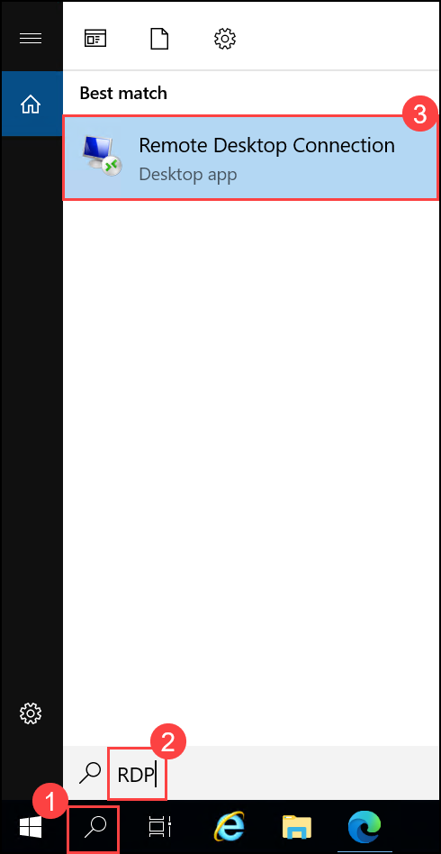

1. Paste the **WebVM DNS Name (1)** in the **Computer** field and click on **Connect (2)**.

   * **WebVM DNS Name**: **<inject key="WebVM DNS Name" style="color:blue" />**

     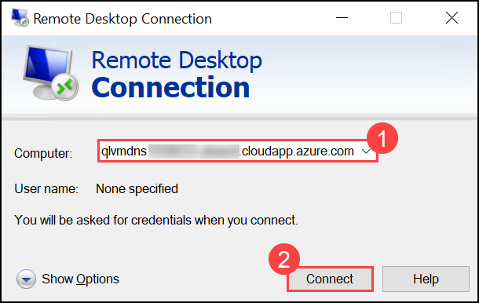

1. Now, enter the SQLVM **Username (1)**, and **Password (2)** provided below and then click on the **OK (3)** button. Please add the **dot** and **back-slash** `.\` before the Username.

   * **Username**: **<inject key="SQLVM Username"/>** 
   * **Password**: **<inject key="SQLVM Password"/>**
   
     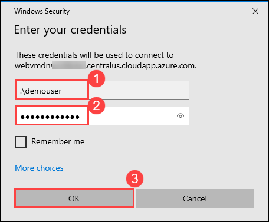 

1. Next, click on the **Yes** button to accept the certificate and add in trusted certificates.

   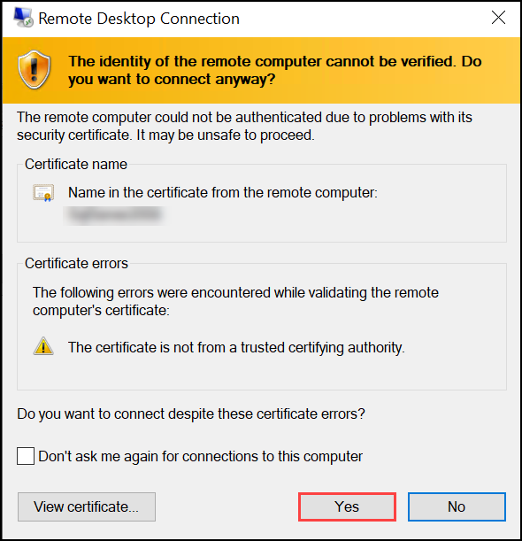

1. On the Microsoft Edge browser window, enter **localhost** and you will be redirected to the Parts Unlimited web application hosted on the web server.

   
   
1. Go through the web application. We will be migrating this web application from on-prem to Azure in future exercises.

1. From the provided VM, Click on **Start** or **Search (1)** button, Search for **RDP (2)** and select the **Remote Desktop Connection (3)** app.
   
   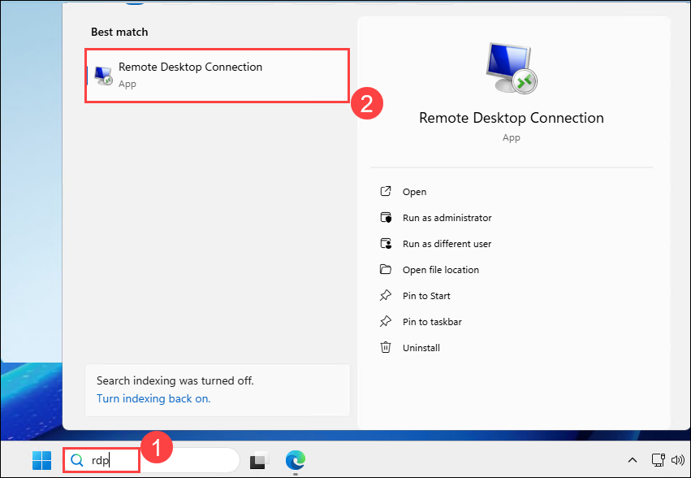

1. Paste the **SQLVM DNS Name (1)** in the **Computer** field and click on **Connect (2)**.

   * **SQLVM DNS Name**: **<inject key="SQLVM DNS Name" style="color:blue" />**

       
 
1. Now, enter the SQLVM **Username (1)**, and **Password (2)** provided below and then click on the **OK (3)** button. Please add the **dot** and **back-slash** `.\` before the Username.

   * **Username**: **<inject key="SQLVM Username"/>** 
   * **Password**: **<inject key="SQLVM Password"/>**
   
     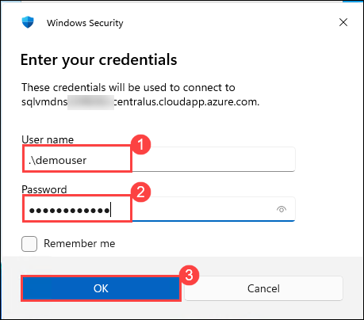 

1. Next, click on the **Yes** button to accept the certificate and add in trusted certificates.

   
   
1. Click the **Start** button on the SQLVM. 

    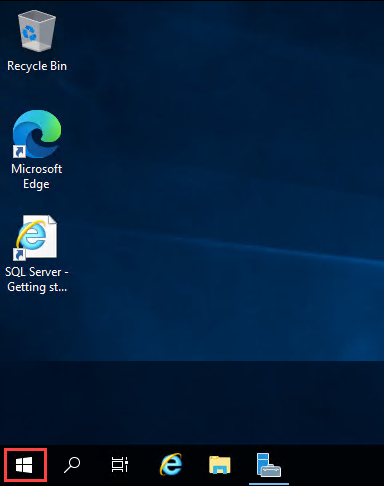

1. In the Start click on **search box (1)** , in the search box, type **SQL Server Management (2)**, then select **SQL Server Management studio 20 (3)** from the search results.

    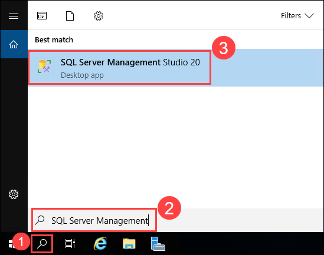
   
1. In the **Connect to Server** window, enter the **Server name** as `SqlServer2008` **(1)**, enable **Trust server certificate** **(2)**, and then click on **Connect** **(3)**.
   
   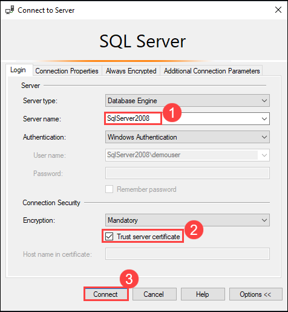
   
1. Once connected, expand the **Databases (1)**, and observe that the database is hosting the **Parts Unlimited (2)** web application.
   
   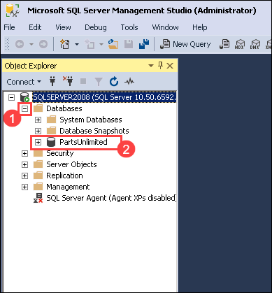
   
1. Minimize the remote session of the **SQL VM**. If the minimize button is not visible for SQL VM, resize or drag the control bar of the WebVM to access it. 

    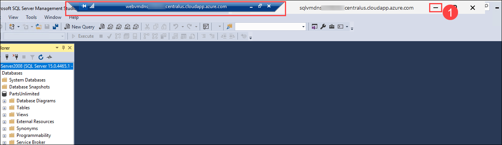

## Task 2: Perform assessment for migration to Azure App Service

Parts Unlimited would like an assessment to see what potential issues they might need to address in moving their application to Azure App Service. You will use the [App Service migration assistant](https://appmigration.microsoft.com/) to assess the application and run various readiness checks.

In this task, you will use the App Service Migration Assistant to assess the web application for compatibility with Azure App Service.

1. Click on the **Azure portal** shortcut that is available on the desktop and log in with the below Azure credentials.
    
    - Enter your **Username/Email:** <inject key="AzureAdUserEmail"></inject> in the **Sign in** field. Click **Next** to continue.
      
      
      
    - **Enter Password:** <inject key="AzureAdUserPassword"></inject> and click **Sign in**

      

1. In the Azure portal, navigate to your **WebVM** VM by selecting the **hands-on-lab** resource group, and select the **WebVM** VM from the list of resources.

    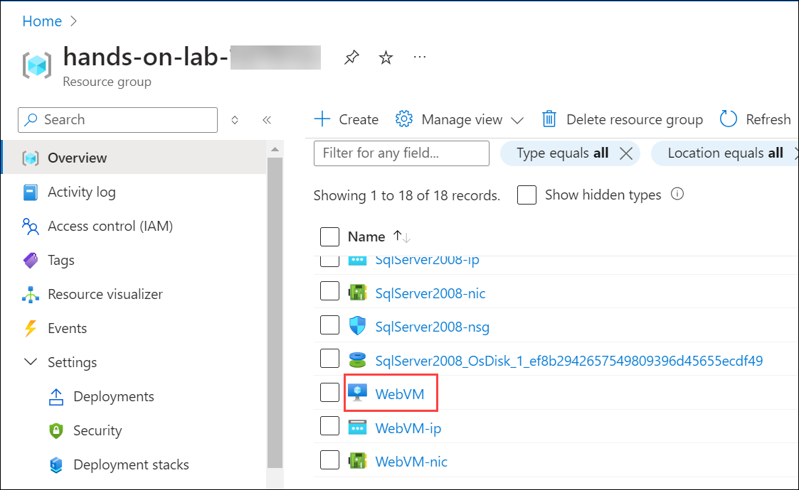

1. On the WebVM Virtual Machine's **Overview (1)** Blade, copy the **Public IP address (2)**.

    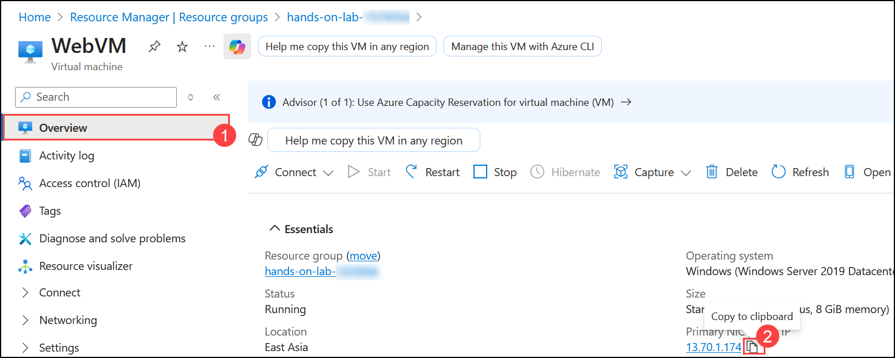

1. Open a new browser window and navigate to the **IP Address** you have copied. You may see a different image on the web app while accessing it, as there are multiple images moving on the web app page.

    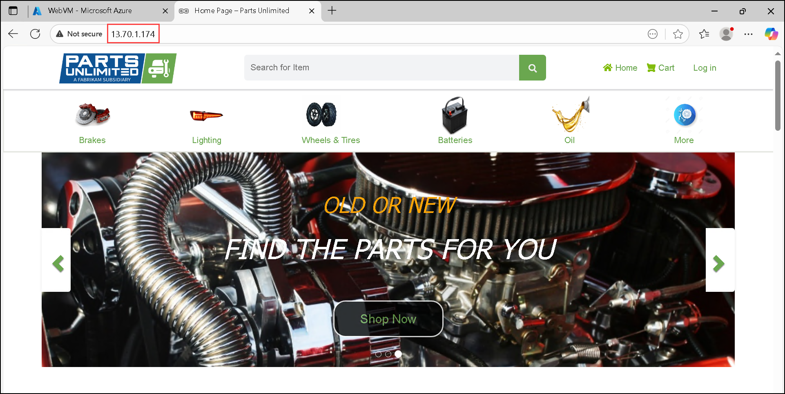

1. Minimize the browser window and open the **AppServiceMigrationAssistant** located on the Desktop.

    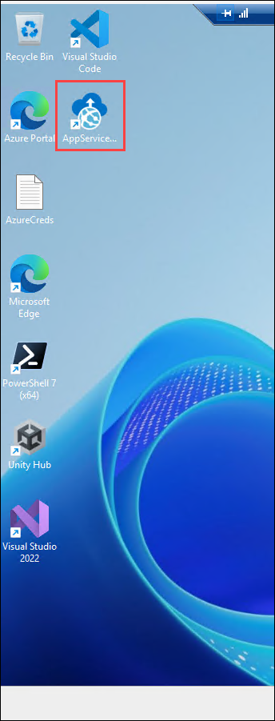

1. Once the App Service Migration Assistant discovers the websites available on the server, choose **Default Web Site (1)** for migration and select **Next (2)** to start the assessment.

    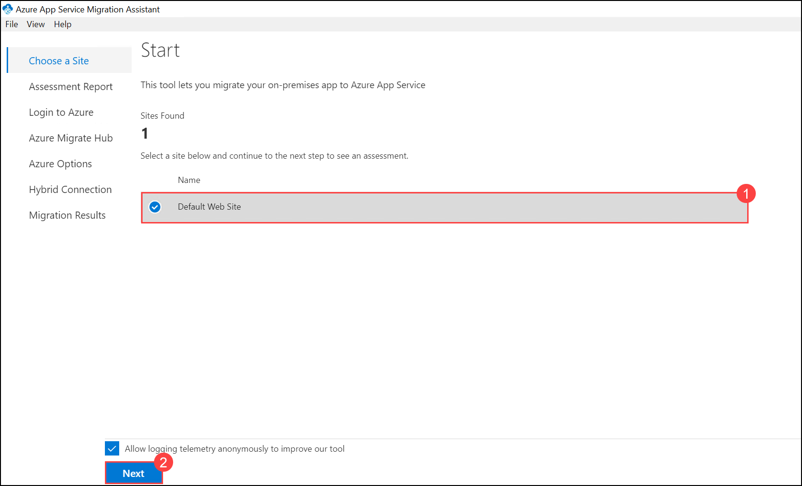

1. Observe the result of the assessment report. In our case, our application has successfully passed 13 tests **(1)** with no additional actions needed. Now that our assessment is complete, select **Next (2)** to proceed with the migration.

   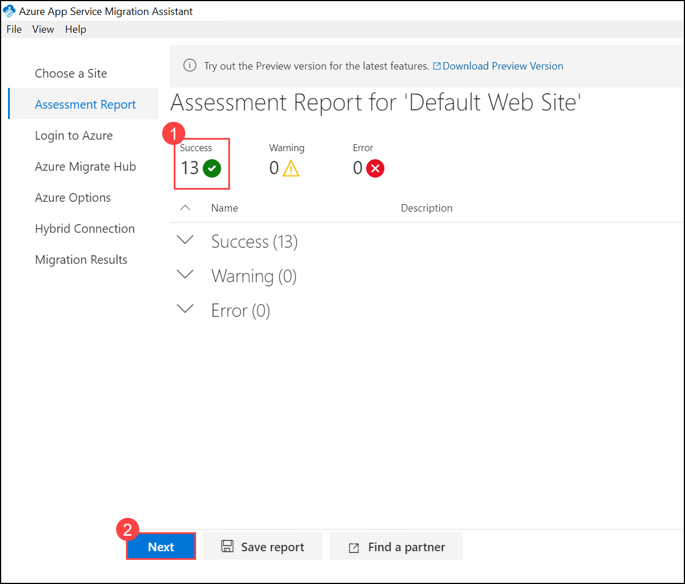

   > For the details of the readiness checks, see [App Service Migration Assistant documentation](https://github.com/Azure/App-Service-Migration-Assistant/wiki/Readiness-Checks).
   
1. Minimize the **App Service Migration Assistant** window to keep it running in the background.
   
## Summary

In this exercise, you have covered the following:
 
- Reviewed the legacy on-prem application and database.
- Performed assessment for migration to Azure App Service

### You have successfully completed the exercise

Now, click on **Next** from the lower right corner to move on to the next page.

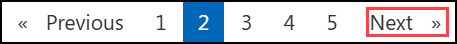
