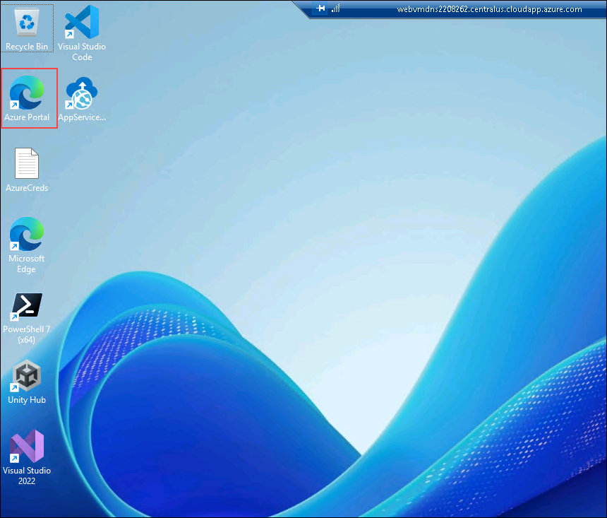
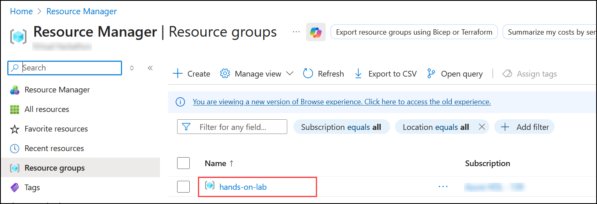
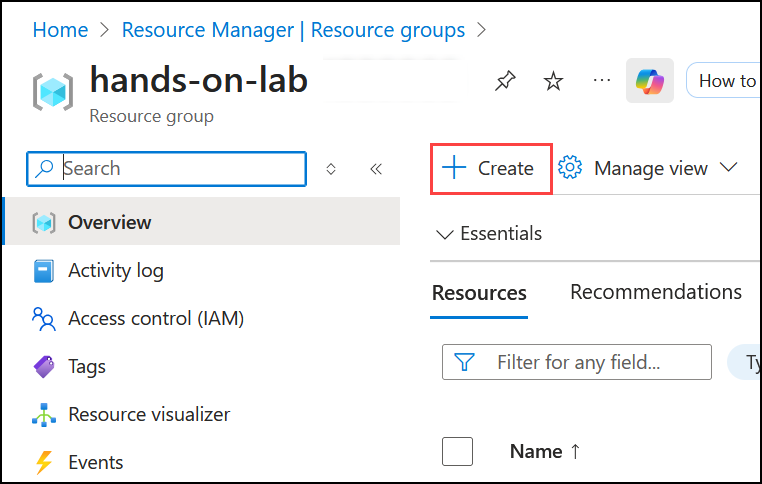
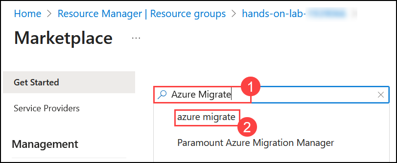
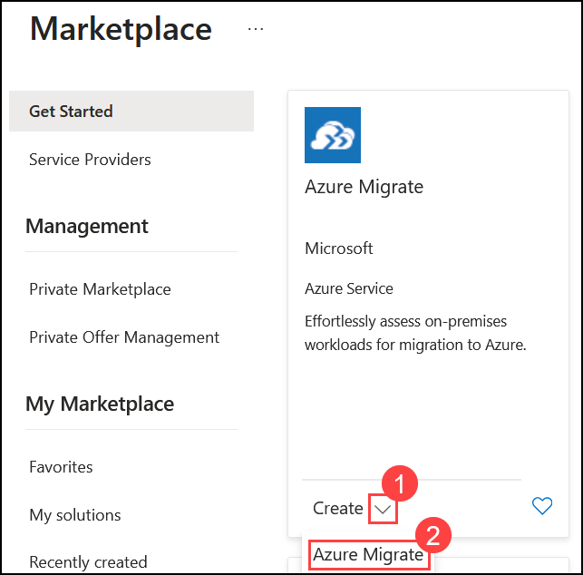
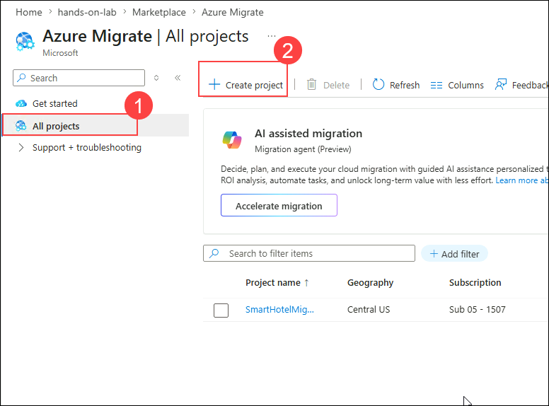
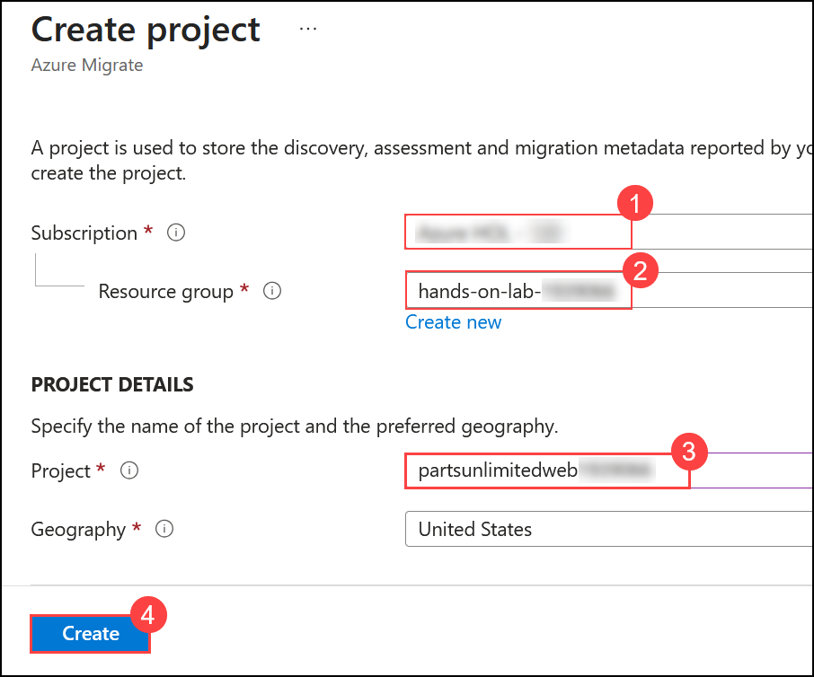

# Exercise 5: Setting up Azure Migrate for App Migration

### Estimated Duration: 15 minutes

## Overview

Azure Migrate provides a centralized hub to assess and migrate on-premises servers, infrastructure, applications, and data to Azure. It provides a single portal to start, run, and track your migration to Azure. Azure Migrate comes with a range of tools for assessment and migration that we will use during our lab. We will use Azure Migrate as the central location for our assessment and migration efforts.

## Lab objectives

You will be able to complete the following tasks:

- Task 1: Setting up Azure Migrate for App Migration

## Task 1: Setting up Azure Migrate for App Migration

In this task, you will configure Azure Migrate to assess the readiness of the application and database for migration to Azure services.

1. Open the **Azure portal** from the shortcut and log in to Azure. When prompted, use the below credentials to complete the login process.

    * Email/Username: <inject key="AzureAdUserEmail"></inject>
    * Password: <inject key="AzureAdUserPassword"></inject>

      

2. Select your **hands-on-lab** resource group. 

    

3. Select **+ Create** inside the resource group to add a new resource.
    
    

4. Type **Azure Migrate (1)** into the search box and select **Azure Migrate (2)** from the dropdown.

    

5. Select **Create (1)** and click on **Azure Migrate (2)** to continue.

    

    >**Note:** If you navigated to new version of Azure Migrate, you can create a project directly from the **Get Started** page. Click **Create** project and then follow the same steps.
    
6. Select **All projects** and click **(+)Create project** to create a project.

   

7. Select the following details and then click **Create (4)** to continue:

    *   **Subscription (1):** Azure HOL (SUFFIX) / Sub 05 - (SUFFIX)
    *   **Resource Group (2):** hands-on-lab
    *   **Project Name (3):** partsunlimitedweb\<inject key="DeploymentID" enableCopy="false"/>

    

> **Note (Updated for latest Azure Portal UI):**  
> In this lab, you may create an Azure Migrate project manually for visibility; however, the actual migration process does **not depend** on this project.  
> The lab environment already provides the required tools pre-installed on the web and database servers:
>
> - **Microsoft Data Migration Assistant (DMA)** – used for database assessment and migration.  
> - **App Service Migration Assistant** – used for web app assessment and migration.  
>
> Therefore, even if you create the Azure Migrate project, its role is limited to displaying assessment or migration data if uploaded by these tools.  
> You can safely proceed with the migration using the pre-installed tools directly.

 **Congratulations** on completing the task! Now, it's time to validate it. Here are the steps:	
  - Hit the Validate button for the corresponding task. If you receive a success message, you can proceed to the next task. 
  - If not, carefully read the error message and retry the step, following the instructions in the lab guide.
  - If you need any assistance, please contact us at cloudlabs-support@spektrasystems.com. We are available 24/7 to help you out.

<validation step="f5a6629c-297f-4a51-8eca-d19a011a3137" />

## Summary
 
In this exercise, you have set up Azure Migrate to assess and migrate on-premises servers, infrastructure, applications, and data to Azure.
  
Now, click on **Next** from the lower right corner to move on to the next page.

