# Exercise 7: Migrate the On-prem Database to Azure and configure it with your App service

Duration: 80 minutes

The next step of Part Unlimited's migration project is the assessment and migration of its database. Currently, the database lives on SQL Server 2008 R2 on a virtual machine. You will perform a compatibility assessment of the `PartsUnlimited` database using **SQL Server Management Studio (SSMS)** to confirm migration readiness to Azure SQL Database. After the assessment, you will migrate the database schema using the **SSMS Generate Scripts wizard**, and then migrate the data using the **Azure Database Migration Service (DMS)**. During the exercise, you will use a simulated on-premises environment hosted on virtual machines running on Azure.

## Lab objectives

You will be able to complete the following tasks:

- Task 1: Connect to your SqlServer2008 VM with RDP

- Task 2: Perform assessment for migration to Azure SQL Database

- Task 3: Retrieve connection information for SQL Databases (Optional)

- Task 4: Migrate the database schema using SQL Server Management Studio (SSMS)

- Task 5: Migrate the database using the Azure Database Migration Service

## Task 1: Connect to your SqlServer2008 VM with RDP

1. From your lab environment (**WebVM**), in the search bar, **Search (1)** for **RDP (2)** and **select** the **Remote Desktop Connection (3)** app.
   
   

1. Paste the **SQLVM DNS Name (1)** in the **Computer** field and click on **Connect (2)**.
   * **SQLVM DNS Name**: **<inject key="SQLVM DNS Name" style="color:blue" />**

   

1. Now, enter the SQLVM **Username (1)**, and **password (2)** provided below and then click on the **OK (3)** button. Please add the **dot** and **back-slash** `.\` before the username.
   * **username**: **<inject key="SQLVM Username" style="color:blue" />**
   * **password**: **<inject key="SQLVM Password" style="color:blue" />**

   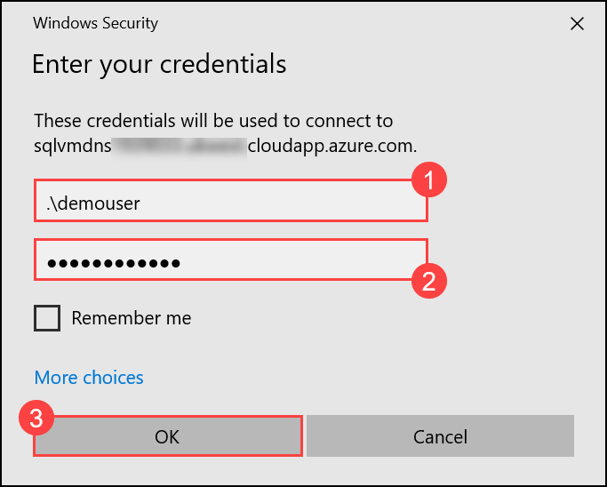

1. Next, click on the **Yes** button to accept the certificate and add in trusted certificates.

   

## Task 2: Perform assessment for migration to Azure SQL Database

Parts Unlimited would like an assessment to see what potential issues they might need to address in moving their database to Azure SQL Database. In this task, you will use **SQL Server Management Studio (SSMS)** to perform a compatibility pre-check on the `PartsUnlimited` database against Azure SQL Database. This assessment confirms migration readiness by reviewing the database compatibility level and auditing all schema objects for known unsupported features.

> **Note**: The Microsoft Data Migration Assistant (DMA) has been retired and is no longer available for use. The Azure Migrate portal database assessment requires a pre-configured discovery appliance which is outside the scope of this lab. The SSMS-based compatibility check used here provides equivalent migration readiness confirmation and is fully supported.

1. On the **SQLVM**, click on the **Start** menu. In the search box, type **sql server management (1)** and select **SQL Server Management Studio 20 (2)** (or the latest available version) from the search results.

   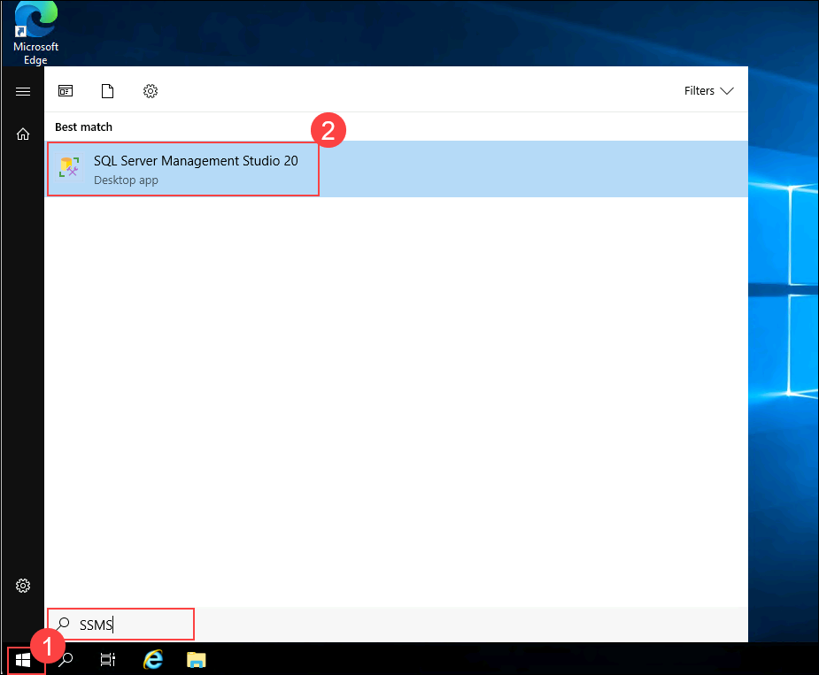

1. In the **Connect to Server** dialog, enter the following to connect to the source SQL Server instance:

   - **Server name**: Enter **SQLSERVER2008 (1)**
   - **Authentication**: Select **SQL Server Authentication (2)**
   - **Login**: Enter **PUWebSite (3)**
   - **Password**: Enter **<inject key="SQLVM Password" /> (4)**
   - Expand **Connection Properties**, check **Trust server certificate (5)**
   - Select **Connect (6)**

   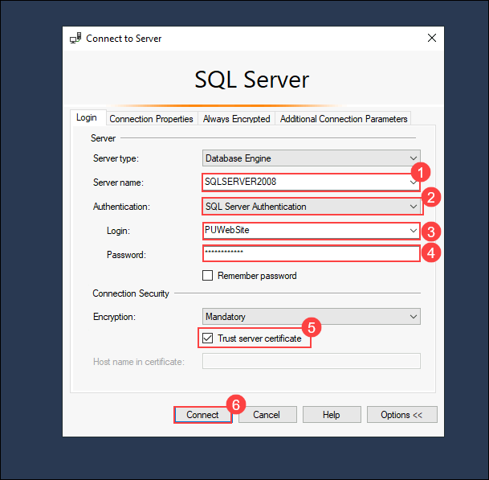

1. Select **New Query (1)** in the SSMS toolbar. **Paste (2)** and run the following script to audit all schema objects. Select **Execute (F5) (2)** to run the query.

   ```sql
   USE PartsUnlimited;
   SELECT
       OBJECT_NAME(object_id) AS ObjectName,
       type_desc               AS ObjectType
   FROM sys.objects
   WHERE type IN ('U','V','P','FN','IF','TF')
   ORDER BY type_desc, ObjectName;
   ```

   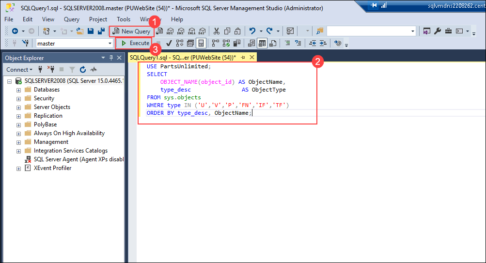

1. Review the results in the **Results** tab.

   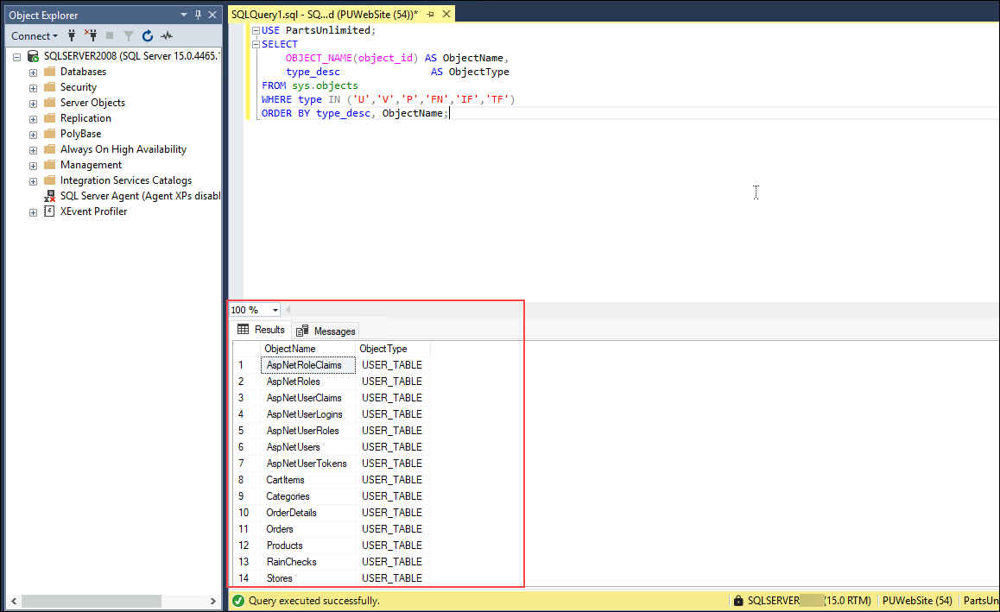

   > **Assessment Summary**: The `PartsUnlimited` database is confirmed as a candidate for migration to Azure SQL Database. No unsupported features or blocking compatibility issues exist. Proceed to the next task.

1. Minimize the **SQL VM** and return to the Azure portal.

## Task 3: Retrieve connection information for SQL Databases (Optional)

In this task, you will retrieve the Fully Qualified Domain Name for the Azure SQL Database. This information is needed to connect to the Azure SQL Database from Azure Database Migration Service and SQL Server Management Studio (SSMS).

1. On the [Azure portal](https://portal.azure.com), from the **Search resources, services, and docs** blade, search for and select **SQL database (1)**, and then select **Azure SQL database (2)** from the services.

   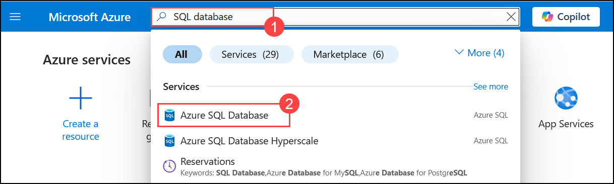

1. Navigate to your **SQL database** resource by selecting the **parts SQL database** resource from the resources list.

   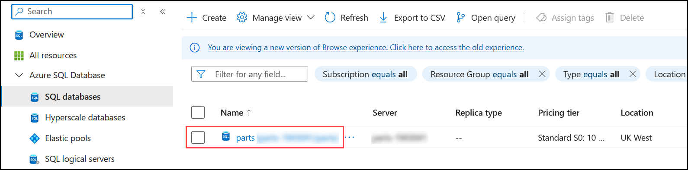

1. On the **Overview** Blade of your SQL database, copy the **Server name** and paste the value into a text editor, such as Notepad.exe, for later reference.

   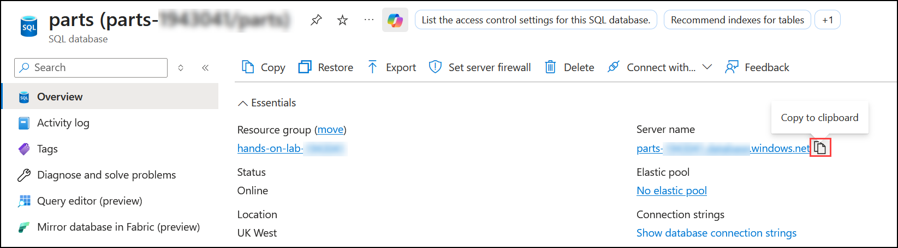

## Task 4: Migrate the database schema using SQL Server Management Studio (SSMS)

After reviewing the assessment results and confirming the database is a candidate for migration to Azure SQL Database, use the **SSMS Generate Scripts wizard** to export all schema objects from the source `PartsUnlimited` database and deploy them to the target Azure SQL Database. The wizard generates a Transact-SQL script covering all tables, views, stored procedures, users, and constraints, which is then executed against the target database.

> **Note**: The Data Migration Assistant (DMA) schema migration capability has been retired. The SSMS Generate Scripts wizard is the supported equivalent for schema-only migration and is available in all current versions of SSMS.

1. Return to **SQL Server Management Studio (SSMS)** on the **SQLVM**. Ensure you are still connected to **SQLSERVER2008** in Object Explorer. If the session has expired, reconnect using the same credentials from Task 2 Step 3.

1. In **Object Explorer**, expand **Databases (1)**, right-click **PartsUnlimited (2)**, point to **Tasks (3)**, and then select **Generate Scripts... (4)**.

   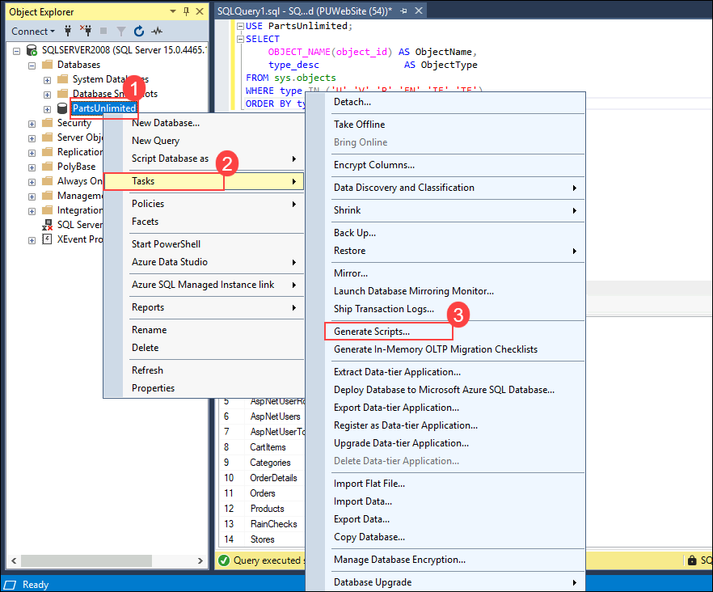

1. On the **Introduction** page of the Generate Scripts wizard, select **Next**.

1. On the **Choose Objects** page, ensure **Script entire database and all database objects (1)** is selected, and then select **Next (2)**.

   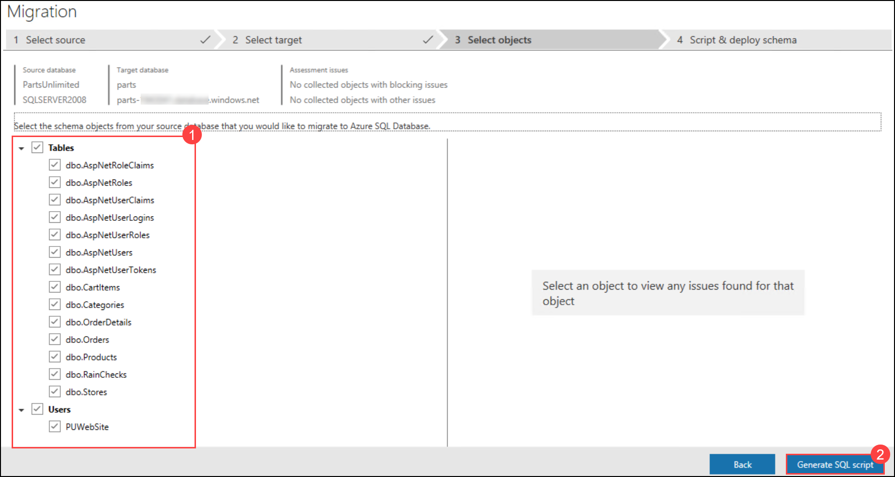

1. On the **Set Scripting Options** page, select **Advanced (1)**. In the **Advanced Scripting Options** dialog, scroll to find **Script for the database engine type** and change the value to **Microsoft Azure SQL Database (2)**. Select **OK (3)** to close the dialog.

   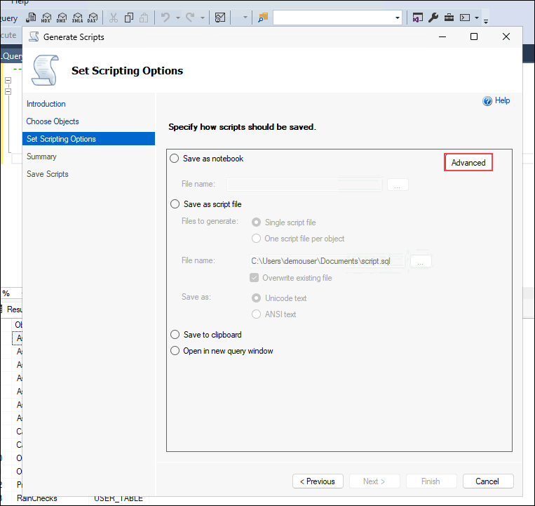

   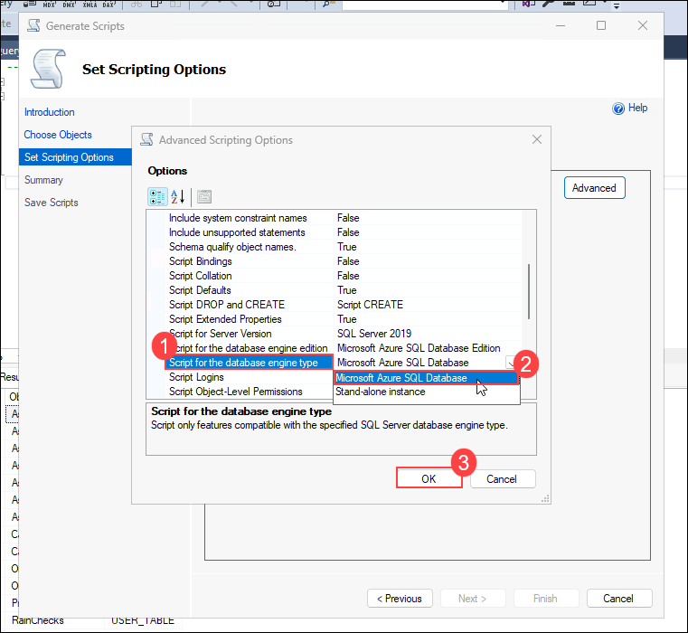

1. Back on the **Set Scripting Options** page, under **Specify how scripts should be saved**, select **Open in new query window (1)**, and then select **Next (2)**.

   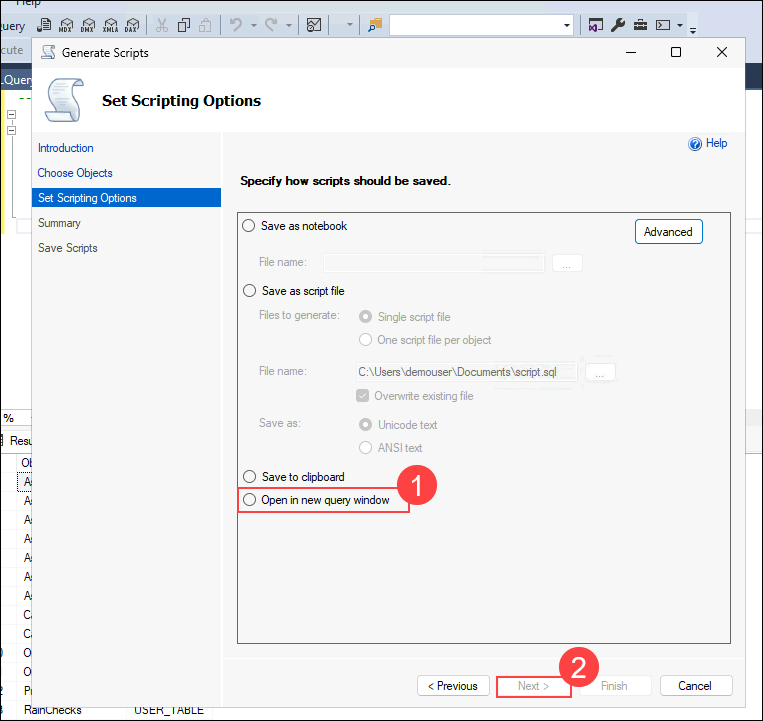

1. On the **Summary** page, review the listed objects and select **Next** to generate the script. Once generation completes, select **Finish**.

1. The script will open in a new query window. Before executing, you must remove database-level statements that are not supported in Azure SQL Database. Press **Ctrl+H** to open **Find and Replace**, then:

   - In the **Find** field, enter `ALTER DATABASE` **(1)**
   - Leave the **Replace with** field empty **(2)**
   - Select **Replace All (3)** and close the dialog

   

1. Next, scroll to the very top of the script. Locate and **manually delete** the following lines if present, along with their associated `GO` statements:

   ```sql
   USE [PartsUnlimited]
   GO

   CREATE DATABASE [PartsUnlimited]
   GO
   ```

1. At the very top of the now-cleaned script, add the following two lines to set the correct database context before any other statements:

   ```sql
   USE parts
   GO
   ```

   The top of your script should now begin with:

   ```sql
   USE parts
   GO

   /****** Object: Table [dbo].[AspNetRoleClaims] ... ******/
   SET ANSI_NULLS ON
   GO
   ...
   ```

   > **Important**: Always verify the **status bar at the bottom of SSMS** before executing. It should show `parts-<inject key="DeploymentID" enableCopy="false"/>.database.windows.net | demouser | parts`. If it shows `SQLSERVER2008` or `master`, you are connected to the wrong server or database — switch to the Azure SQL connection before proceeding.

1. Now connect SSMS to the Azure SQL Database target. In **Object Explorer**, select **Connect (1)** > **Database Engine (2)**.

   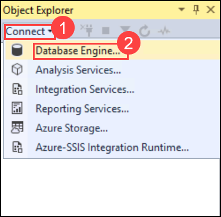

1. Enter the following into the **Connect to Server** dialog:

   - **Server name**: Enter the server name of your Azure SQL Database — **<inject key="sqlDatabaseName" enableCopy="false"/>.database.windows.net (1)**
   - **Authentication**: Select **SQL Server Authentication (2)**
   - **Login**: Enter **demouser (3)**
   - **Password**: Enter **<inject key="SQLVM Password" /> (4)**
   - **Remember password**: Check this box **(5)**
   - Select **Connect (6)**

   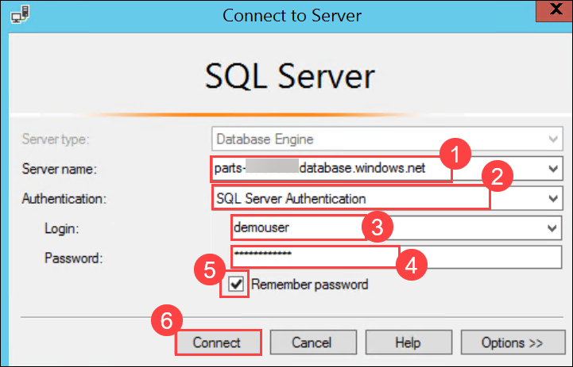

1. In the **Available Databases** dropdown in the query toolbar **(1)**, select **parts (2)** to confirm the database execution context is set correctly.

   

   > **Tip**: You can confirm your active context at any time by running `SELECT DB_NAME() AS CurrentDatabase` or checking the bottom status bar of SSMS. It should read `parts`.

1. Select **Execute (F5) (1)** to run the cleaned schema script against the `parts` database. Review the **Messages** tab **(2)**.

   - **Expected**: Completion message with optional index key length warnings for `PK_AspNetUserLogins`, `PK_AspNetUserRoles`, and `PK_AspNetUserTokens`. These warnings are **non-blocking** and expected — the `PartsUnlimited` app does not hit these limits in normal use.
   - **If you see `Msg 2714 — There is already an object named...`**: The schema was already deployed from a previous attempt. This is not an error. Proceed to Step 15 to verify the tables exist, then move on to Task 5.

   

1. After execution, expand **Databases (1)** → **parts (2)** → **Tables (3)** in Object Explorer and confirm all schema tables are present **(4)**.

   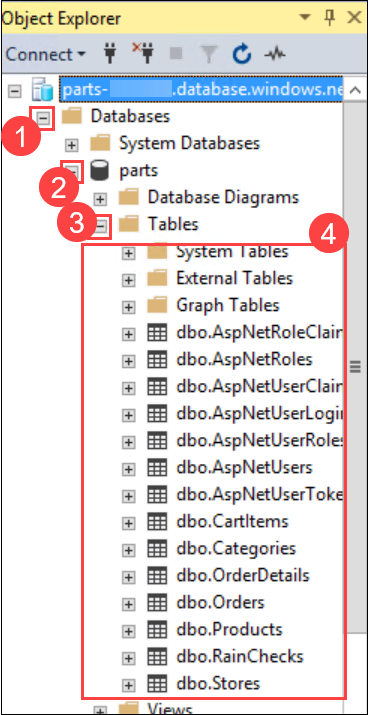

   > **Quick verification**: Right-click **parts** in Object Explorer and select **New Query**, then run the following to confirm all 14 tables are present before proceeding to Task 5:
   >
   > ```sql
   > SELECT TABLE_NAME
   > FROM INFORMATION_SCHEMA.TABLES
   > WHERE TABLE_TYPE = 'BASE TABLE'
   > ORDER BY TABLE_NAME;
   > ```
   > You should see: AspNetRoleClaims, AspNetRoles, AspNetUserClaims, AspNetUserLogins, AspNetUserRoles, AspNetUsers, AspNetUserTokens, CartItems, Categories, OrderDetails, Orders, Products, RainChecks, Stores.

1. Expand **Security (1)** > **Users (2)** to confirm that the database user **PUWebSite** has been migrated as well **(3)**.

   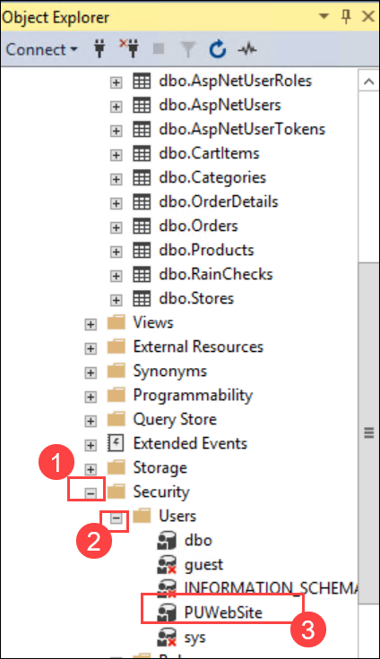

> **Note**: You can now disconnect from the **SQLVM** and perform the remaining steps from the **LabVM**.

## Task 5: Migrate the database using the Azure Database Migration Service

At this point, you have migrated the database schema using the SSMS Generate Scripts wizard. In this task, you will migrate the data from the `PartsUnlimited` database into the new Azure SQL Database using the **Azure Database Migration Service (DMS)**.

> The [Azure Database Migration Service](https://docs.microsoft.com/azure/dms/dms-overview) provides a comprehensive, highly available database migration solution. It supports offline (one-time) and online (minimal-downtime) migrations. During an offline migration, source database downtime begins when the migration starts. When the migration is complete, point your environment to the target Azure SQL Database instance.

1. In the [Azure portal](https://portal.azure.com), navigate to your Azure Database Migration Service by selecting the **hands-on-lab-<inject key="DeploymentID" enableCopy="false"/>** resource group, and then selecting the **parts-dms-<inject key="DeploymentID" enableCopy="false"/>** Azure Database Migration Service from the list of resources.

   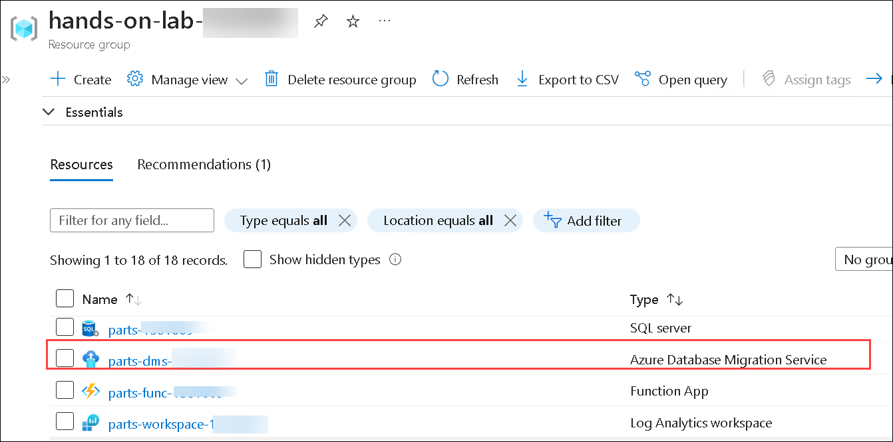

1. On the Azure Database Migration Service Blade, select **+ New Migration**.

   

1. On the **New migration** Blade, enter the following:

   - **Target server type**: Select **Azure SQL Database (1)**.
   - **Migration mode**: Select **Offline (2)**.
   - Select **Configure runtime settings (3)**.
   - When the **Configure integration runtime** pop-up appears, copy any one of the **two authentication keys (4)** to Notepad.

   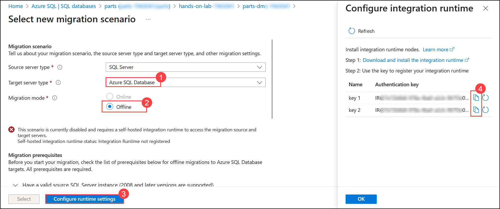

1. Navigate back to the **SQLVM** RDP session and click the **Start** button.

   

1. In the search box, type **Microsoft Integration Runtime (1)** and select **Microsoft Integration Runtime (2)** from the search results.

   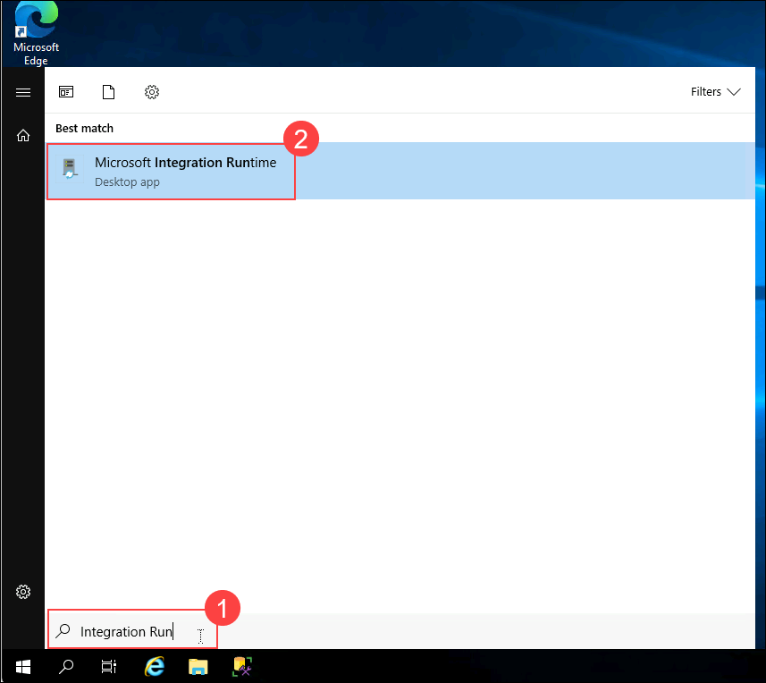

1. In the **Microsoft Integration Runtime Configuration Manager**, paste the authentication key copied from the Azure portal **(1)** and click **Register (2)**.

   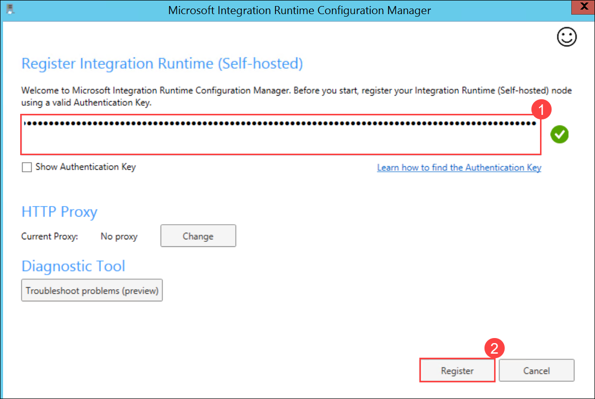

1. Click **Finish**.

   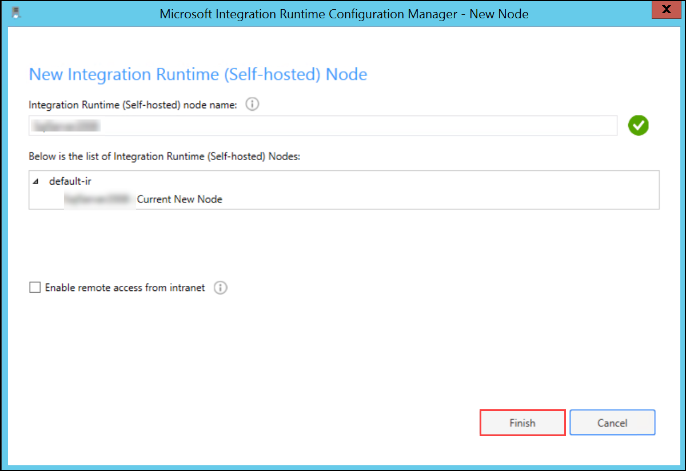

1. Once the Integration Runtime (Self-hosted) node shows as **registered successfully**, minimize the SQLVM RDP window.

   

1. Navigate back to **Azure Database Migration Service** in the Azure portal. In the **Configure integration runtime** pop-up, click **OK (1)** and then click **Select (2)**.

   

1. On the **Source details** step of the migration wizard, configure the following:

   - **Is your source SQL Server instance tracked in Azure?**: Select **Yes (1)**

     > **Important**: Select **Yes** here. The `sqlvm` was registered as an Azure Arc-enabled SQL Server resource during earlier lab steps. Selecting **No** will cause a validation error stating *"SQL Server instance already exists in location eastus under selected resource group."*

   - The form will change to **Select Azure resource that tracks the source SQL Server instance**. Fill in the following:
   - **Subscription**: Select your available Subscription **(2)**
   - **Resource group**: Select **hands-on-lab-<inject key="DeploymentID" enableCopy="false"/> (3)**
   - **Location**: Select **East US (4)**

     > **Note**: The location must match where the Arc-enabled SQL Server resource was registered. Select **East US** even if your other resources are in a different region.

   - **SQL Server Instance**: Select **sqlvm<inject key="DeploymentID" enableCopy="false"/> (5)** from the dropdown
   - Select **Next: Connect to source SQL Server >> (6)**

   

1. On the **Connect to source SQL Server** step, enter the following:

   - **Source SQL Server instance name**: Enter the **Private IP address** of SqlServer2008 **(1)**

     > **Note**: To find the private IP address, open a new browser tab, navigate to the Azure portal, search for and select **SqlServer2008** VM, go to **Networking settings** under the **Networking** section, and copy the **Private IP address** shown there.

   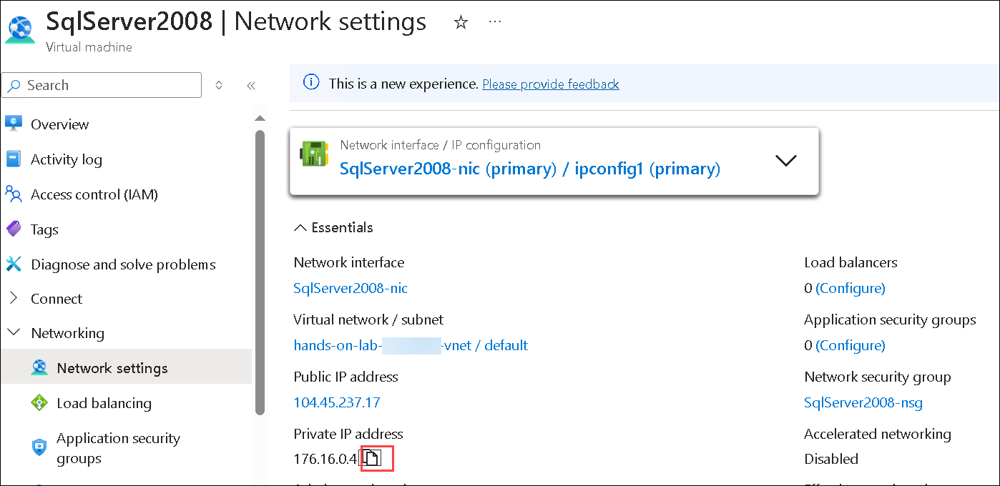

   - **Authentication type**: Select **SQL Authentication (2)**
   - **Username**: Enter **PUWebSite (3)**
   - **Password**: Enter **<inject key="SQLVM Password" /> (4)**
   - **Connection properties**: Check both **Encrypt connection** and **Trust server certificate (5)**
   - Select **Next: Select databases for migration >> (6)**

   

1. On the **Select databases for migration** step, check **PartsUnlimited (1)** and select **Next: Connect to target Azure SQL Database >> (2)**.

   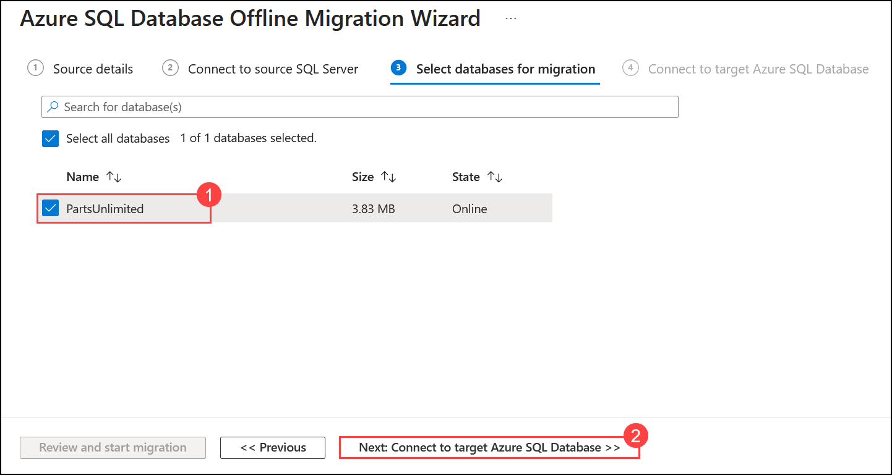

1. On the **Connect to target Azure SQL Database** step, enter the following:

   - **Subscription**: Leave the default Subscription **(1)**
   - **Resource Group**: Select **hands-on-lab-<inject key="DeploymentID" enableCopy="false"/> (2)**
   - **Target Azure SQL Database Server**: Select **<inject key="sqlDatabaseName" enableCopy="false"/> (3)**
   - **Target server name**: Enter **<inject key="sqlDatabaseName" enableCopy="false"/>.database.windows.net (4)**
   - **Authentication type**: Select **SQL Authentication (5)**
   - **Username**: Enter **demouser (6)**
   - **Password**: Enter **<inject key="SQLVM Password" /> (7)**
   - Select **Next: Map source and target databases >> (8)**

   

1. On the **Map to target databases** step, confirm that **PartsUnlimited (1)** is the source database and **parts (2)** is the mapped target database, then select **Next: Select database tables to migrate >> (3)**.

   

1. On the **Configure migration settings** step, expand the **PartsUnlimited** database and verify all tables are selected **(1)**, then select **Next: Database migration Summary >> (2)**.

   > **Note**: If some tables appear greyed out, the source table is empty. This is expected. Select only the tables that are not greyed out or that contain data.

   

1. On the **Summary** step, select **Start migration**. Monitor the migration status on the Database Migration Service overview page under **Migration Status**.

   

   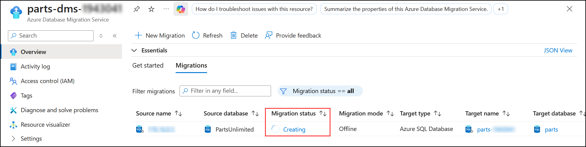

   > The migration takes approximately 2–3 minutes to complete.

1. When the migration is complete, the status will show **Succeeded**.

   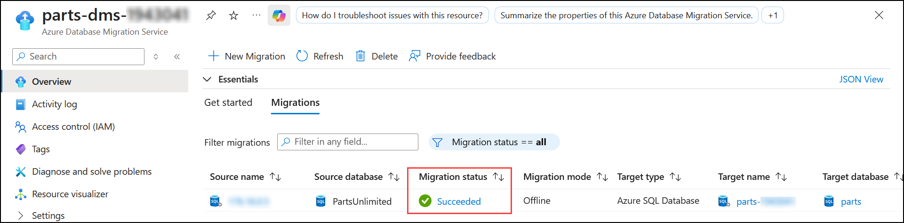

> **Congratulations** on completing the task! Now, it's time to validate it. Here are the steps:

  - Hit the Validate button for the corresponding task. If you receive a success message, you can proceed to the next task.
  - If not, carefully read the error message and retry the step, following the instructions in the lab guide.
  - If you need any assistance, please contact us at cloudlabs-support@spektrasystems.com. We are available 24/7 to help you out.

<validation step="ccf9af72-ea26-4f60-b49c-e6a8af3d0134" />

## Summary

In this exercise, you have migrated the on-premises database to Azure SQL Database.

### You have successfully completed the Exercise

**Click Next to proceed to the Next exercise**