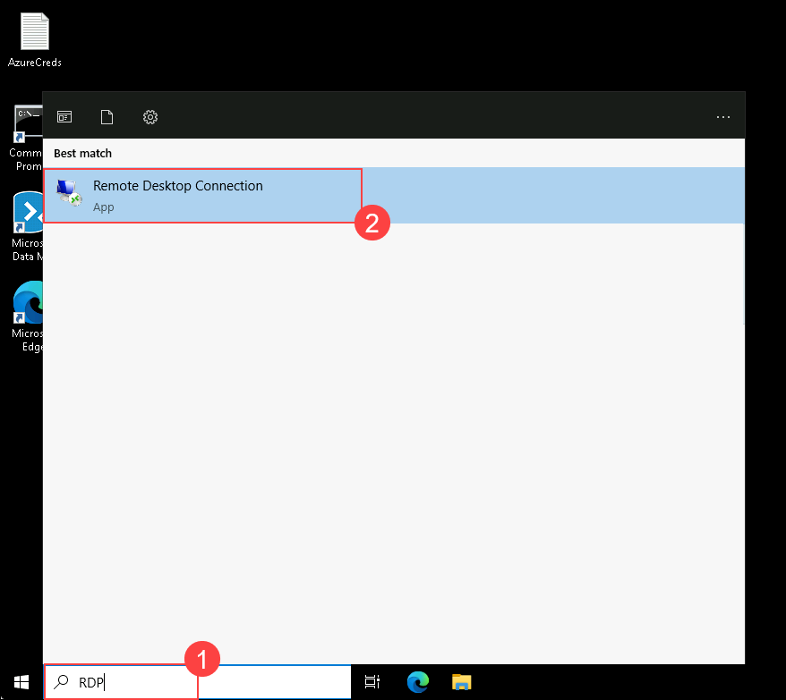
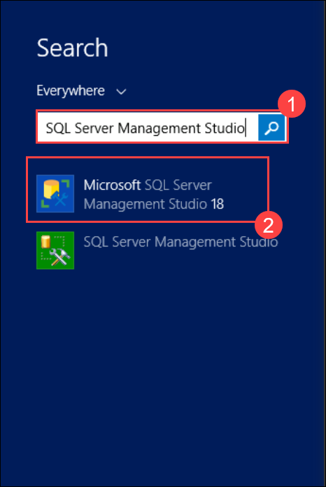
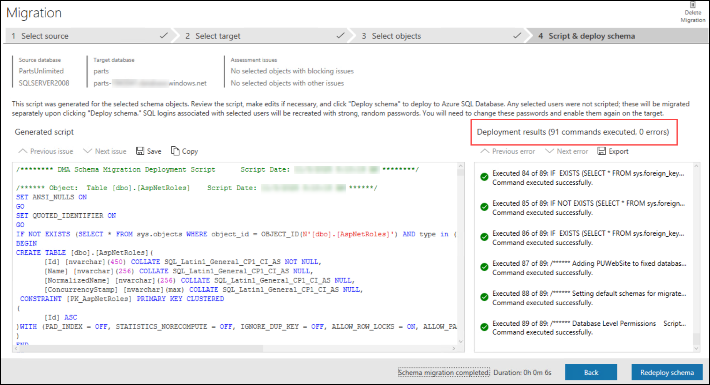

# Exercise 7: Migrate the On-prem Database to Azure and configure it with your App service

Duration: 80 minutes

The next step of Part Unlimited's migration project is the assessment and migration of its database. Currently, the database lives on SQL Server 2008 R2 on a virtual machine. You will perform a compatibility assessment of the `PartsUnlimited` database using **SQL Server Management Studio (SSMS)** to confirm migration readiness to Azure SQL Database. After the assessment, you will migrate the database schema using the **SSMS Generate Scripts wizard**, and then migrate the data using the **Azure Database Migration Service (DMS)**. During the exercise, you will use a simulated on-premises environment hosted on virtual machines running on Azure.

## Lab objectives

You will be able to complete the following tasks:

- Task 1: Connect to your SqlServer2008 VM with RDP

- Task 2: Perform assessment for migration to Azure SQL Database

- Task 3: Retrieve connection information for SQL Databases (Optional)

- Task 4: Migrate the database schema using SQL Server Management Studio (SSMS)

- Task 5: Migrate the database using the Azure Database Migration Service

## Task 1: Connect to your SqlServer2008 VM with RDP

1. From your lab environment (**WebVM**), in the search bar, **Search (1)** for **RDP (2)** and **select** the **Remote Desktop Connection (3)** app.
   
   

2. Paste the **SQLVM DNS Name (1)** in the **Computer** field and click on **Connect (2)**.
   * **SQLVM DNS Name**: **<inject key="SQLVM DNS Name" style="color:blue" />**

    
 
3. Now, enter the SQLVM **Username (1)**, and **password (2)** provided below and then click on the **OK (3)** button. Please add the **dot** and **back-slash** `.\` before the username.
   * **username**: **<inject key="SQLVM Username" style="color:blue" />** 
   * **password**: **<inject key="SQLVM Password" style="color:blue" />**
   
    

4. Next, click on the **Yes** button to accept the certificate and add in trusted certificates.

   

## Task 2: Perform assessment for migration to Azure SQL Database

Parts Unlimited would like an assessment to see what potential issues they might need to address in moving their database to Azure SQL Database. In this task, you will use **SQL Server Management Studio (SSMS)** to perform a compatibility pre-check on the `PartsUnlimited` database against Azure SQL Database. This assessment confirms migration readiness by reviewing the database compatibility level and auditing all schema objects for known unsupported features.

> **Note**: The Microsoft Data Migration Assistant (DMA) has been retired and is no longer available for use. The Azure Migrate portal assessment requires a pre-configured discovery appliance which is outside the scope of this lab. The SSMS-based compatibility check used here provides equivalent migration readiness confirmation and is fully supported.

1. On the **SQLVM**, click on the **Start** menu.

   

1. In the search box, type **sql server management (1)** and select **SQL Server Management Studio 19 (2)** (or the latest available version) from the search results.

   

1. In the **Connect to Server** dialog, enter the following to connect to the source SQL Server instance:

   - **Server name**: Enter **SQLSERVER2008 (1)**
   - **Authentication**: Select **SQL Server Authentication (2)**
   - **Login**: Enter **PUWebSite (3)**
   - **Password**: Enter **<inject key="SQLVM Password" /> (4)**
   - Expand **Connection Properties**, check **Trust server certificate (5)**
   - Select **Connect (6)**

   

1. In **Object Explorer**, expand **Databases (1)**, right-click **PartsUnlimited (2)**, and select **Properties (3)**.

   

1. In the **Database Properties** dialog, select **Options (1)** in the left pane. Note the **Compatibility level (2)** value — it will show **SQL Server 2008 (100)**. This confirms the source version being assessed for migration. Select **Cancel (3)** to close without making changes.

   

1. Select **New Query (1)** in the SSMS toolbar. Ensure the database context in the dropdown is set to **PartsUnlimited (2)**, then paste and run the following script to audit all schema objects:

   ```sql
   -- Audit all schema objects in PartsUnlimited for Azure SQL Database compatibility
   USE PartsUnlimited;
   SELECT
       OBJECT_NAME(object_id) AS ObjectName,
       type_desc               AS ObjectType
   FROM sys.objects
   WHERE type IN ('U','V','P','FN','IF','TF')
   ORDER BY type_desc, ObjectName;
   ```

   Select **Execute (F5) (3)** to run the query.

   

1. Review the results in the **Results** tab **(1)**. The `PartsUnlimited` database contains standard tables, views, and stored procedures — all of which are fully supported in Azure SQL Database. There are no unsupported features or blocking compatibility issues detected **(2)**.

   

   > **Assessment Summary**: The `PartsUnlimited` database is confirmed as a candidate for migration to Azure SQL Database. No unsupported features or blocking compatibility issues exist. Proceed to the next task.

1. Minimize the **SQL VM** and return to the Azure portal.

## Task 3: Retrieve connection information for SQL Databases (Optional)

In this task, you will retrieve the Fully Qualified Domain Name for the Azure SQL Database. This information is needed to connect to the Azure SQL Database from Azure Database Migration Service and SQL Server Management Studio (SSMS).

1. On the [Azure portal](https://portal.azure.com), from the **Search resources, services, and docs** blade, search for and select **SQL database (1)**, and then select **Azure SQL database (2)** from the services.

   

1. Navigate to your **SQL database** resource by selecting the **parts SQL database** resource from the resources list.

   

1. On the **Overview** Blade of your SQL database, copy the **Server name** and paste the value into a text editor, such as Notepad.exe, for later reference.

   

## Task 4: Migrate the database schema using SQL Server Management Studio (SSMS)

After reviewing the assessment results and confirming the database is a candidate for migration to Azure SQL Database, use the **SSMS Generate Scripts wizard** to export all schema objects from the source `PartsUnlimited` database and deploy them to the target Azure SQL Database. The wizard generates a Transact-SQL script covering all tables, views, stored procedures, users, and constraints, which is then executed against the target database.

> **Note**: The Data Migration Assistant (DMA) schema migration capability has been retired. The SSMS Generate Scripts wizard is the supported equivalent for schema-only migration and is available in all current versions of SSMS.

1. Return to **SQL Server Management Studio (SSMS)** on the **SQLVM**. Ensure you are still connected to **SQLSERVER2008** in Object Explorer. If the session has expired, reconnect using the same credentials from Task 2 Step 3.

1. In **Object Explorer**, expand **Databases (1)**, right-click **PartsUnlimited (2)**, point to **Tasks (3)**, and then select **Generate Scripts... (4)**.

   

1. On the **Introduction** page of the Generate Scripts wizard, select **Next**.

1. On the **Choose Objects** page, ensure **Script entire database and all database objects (1)** is selected, and then select **Next (2)**.

   

1. On the **Set Scripting Options** page, select **Advanced (1)**. In the **Advanced Scripting Options** dialog that appears, scroll to find **Script for the database engine type** and change the value to **Microsoft Azure SQL Database (2)**. Select **OK (3)** to close the dialog.

   

1. Back on the **Set Scripting Options** page, under **Specify how scripts should be saved**, select **Save to new query window (1)**, and then select **Next (2)**.

   

1. On the **Summary** page, review the listed objects and select **Next** to generate the script. Once generation completes, select **Finish**.

1. Review the generated script in the query editor window. Notice the output confirms there are no blocking issues **(1)**.

   

1. Now connect SSMS to the Azure SQL Database target. In **Object Explorer**, select **Connect (1)** > **Database Engine (2)**.

   

1. Enter the following into the **Connect to Server** dialog:

   - **Server name**: Enter the server name of your Azure SQL Database — **<inject key="sqlDatabaseName" enableCopy="false"/>.database.windows.net (1)**
   - **Authentication**: Select **SQL Server Authentication (2)**
   - **Login**: Enter **demouser (3)**
   - **Password**: Enter **<inject key="SQLVM Password" /> (4)**
   - **Remember password**: Check this box **(5)**
   - Select **Connect (6)**

   

1. Once connected to the Azure SQL Database, in the **Available Databases** dropdown in the query toolbar **(1)**, select **parts (2)** to set the correct database execution context.

   

1. Select **Execute (F5) (1)** to run the full schema script against the `parts` database. Review the **Messages** tab to confirm the deployment completed without errors **(2)**.

   

1. After execution, in **Object Explorer**, expand **Databases (1)**, then expand **parts (2)**, then expand **Tables (3)**, and observe the schema that has been created **(4)**.

   

1. Expand **Security (1)** > **Users (2)** to observe that the database user has been migrated as well **(3)**.

   

> **Note**: You can now disconnect from the **SQLVM** and perform the remaining exercises from the **LabVM**.

## Task 5: Migrate the database using the Azure Database Migration Service

At this point, you have migrated the database schema using the SSMS Generate Scripts wizard. In this task, you will migrate the data from the `PartsUnlimited` database into the new Azure SQL Database using the **Azure Database Migration Service (DMS)**.

> The [Azure Database Migration Service](https://docs.microsoft.com/azure/dms/dms-overview) provides a comprehensive, highly available database migration solution. It supports offline (one-time) and online (minimal-downtime) migrations. During an offline migration, source database downtime begins when the migration starts. When the migration is complete, point your environment to the target Azure SQL Database instance.

1. In the [Azure portal](https://portal.azure.com), navigate to your Azure Database Migration Service by selecting the **hands-on-lab-<inject key="DeploymentID" enableCopy="false"/>** resource group, and then selecting the **parts-dms-<inject key="DeploymentID" enableCopy="false"/>** Azure Database Migration Service from the list of resources.

   

1. On the Azure Database Migration Service Blade, select **+ New Migration**.

   

1. On the New migration project Blade, enter the following:

   - **Target server type**: Select **Azure SQL Database (1)**.
   - **Migration mode**: Select **Offline (2)**.
   - **Configure runtime settings (3)**.
   - When the **Configure integration runtime** pop-up appears, copy any one of the **two keys (4)** to notepad.

   

1. Navigate back to the SQLVM, click the **Start** button.

   

1. In the search box, type **Microsoft Integration Runtime (1)** then select **Microsoft Integration Runtime (2)** from the search results.

   

1. After successful installation, it will ask you for the authentication key which we copied from the Azure portal. Please provide the copied key **(1)** and click on **Register (2)**.

   

1. Click on **Finish**.

   

1. Once the Integration Runtime (Self-hosted) node has been **registered successfully**, minimize the SQLVM RDP window.

   

1. Navigate back to **Azure Database Migration Service** in the Azure portal. In the **Configure integration runtime** pop-up, click on **OK (1)** and then click on **Select (2)**.

   

1. On the Migration Wizard **Source details** Blade, enter the following:

   - **Source Infrastructure Type**: Select **Virtual Machine (1)**.
   - **Subscription**: Select the available Subscription **(2)**.
   - **Resource group**: Select **hands-on-lab-<inject key="DeploymentID" enableCopy="false"/> (3)**.
   - **Location**: Select **East US (4)**.
   - **SQL Server Instance Name**: Enter **sqlvm<inject key="DeploymentID" enableCopy="false"/> (5)**.
   - Select **Next: Connect to source SQL Server >> (6)**.

   

   > **Note**: If you encounter a validation error `Failed to create SQL Server instance. Insufficient permissions to register resource provider Microsoft.AzureArcData`, close the error and continue with the next step.

1. On the Migration Wizard **Select source** Blade, enter the following:

   - **Source SQL Server instance name**: Enter the Private IP address of SqlServer2008 **(1)**.
     > **Note**: To obtain the private IP address, search for and select **SqlServer2008** in the Azure portal. Navigate to **Networking settings** under the **Networking** section and copy the private IP address displayed there.

   

   - **Authentication type**: Select **SQL Authentication (2)**.
   - **Username**: Enter **PUWebSite (3)**.
   - **Password**: Enter **<inject key="SQLVM Password" /> (4)**.
   - **Connection properties**: Check both **Encrypt connection** and **Trust server certificate (5)**.
   - Select **Next: Select databases for migration (6)**.

   

1. Select **PartsUnlimited (1)** database. Select **Next: Connect to target Azure SQL Database >> (2)** to continue.

   

1. On the Migration Wizard **Select target** Blade, enter the following:

   - **Subscription**: Leave the default Subscription **(1)**.
   - **Resource Group**: Select your **hands-on-lab-<inject key="DeploymentID" enableCopy="false"/>** resource group **(2)**.
   - **Target Azure SQL Database Server**: Select **<inject key="sqlDatabaseName" enableCopy="false"/> (3)**.
   - **Target server name**: Enter the server name of your Azure SQL Database — **<inject key="sqlDatabaseName" enableCopy="false"/>.database.windows.net (4)**.
   - **Authentication type**: Select **SQL Authentication (5)**.
   - **Username**: Enter **demouser (6)**.
   - **Password**: Enter **<inject key="SQLVM Password" /> (7)**.
   - Select **Next: Map source and target databases >> (8)**.

   

1. On the Migration Wizard **Map to target databases** Blade, confirm that **PartsUnlimited (1)** is checked as the source database, and **parts (2)** is the target database on the same line, then select **Next: Select database tables to migrate >> (3)**.

   

1. On the Migration Wizard **Configure migration settings** Blade, expand the **PartsUnlimited** database, verify all the tables are selected **(1)** and select **Next: Database migration Summary >> (2)**.

   > **Note**: If you see that the table data cannot be migrated, the source table is empty. This is expected. Please select only the tables that are not greyed out or that contain data.

   

1. On the migration wizard **Summary** blade, select **Start migration** and monitor the migration status on the overview page of Database Migration Service at **Migration Status**.

   

   

   > The migration takes approximately 2–3 minutes to complete.

1. When the migration is complete, you should see the status as **Succeeded**.

   

> **Congratulations** on completing the task! Now, it's time to validate it. Here are the steps:

  - Hit the Validate button for the corresponding task. If you receive a success message, you can proceed to the next task.
  - If not, carefully read the error message and retry the step, following the instructions in the lab guide.
  - If you need any assistance, please contact us at cloudlabs-support@spektrasystems.com. We are available 24/7 to help you out.

<validation step="ccf9af72-ea26-4f60-b49c-e6a8af3d0134" />

## Summary

In this exercise, you have migrated the on-premises database to Azure SQL Database.

### You have successfully completed the Exercise

**Click Next to proceed to the Next exercise**