# Lab 3 - Exercise 3: Migrate your application with App Service Migration Assistant

## Lab overview

Azure Migrate is the Powerful tool which helps in assessing the machines readiness to migrate the Azure. this tool helps in migrate the machines, webapps and databases from on premise,hyper-v and different cloud providers.

## Lab scenario

The first step for Parts Unlimited is to assess whether their apps have dependencies on unsupported features on Azure App Service. In this exercise, you use an **Azure Migrate** tool called the App Service migration assistant to evaluate Parts Unlimited's web site for migration to Azure App Service. The assessment runs readiness checks and provides potential remediation steps for common issues. Once the assessment is successful, we will proceed with the migration as well. You will use a simulated on-premises environment hosted in virtual machines running on Azure.

## Lab objectives (Duration: 30 minutes)

In this lab, you will complete the following tasks:
+ Task 1: Perform assessment for migration to Azure App Service
+ Task 2: Migrate the web application to Azure App Service
+ Task 3: Configure the application connection to SQL Azure Database

## Architecture Diagram

   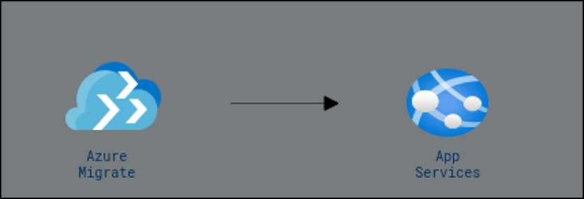

## Task 1: Perform assessment for migration to Azure App Service

Parts Unlimited would like an assessment to see what potential issues they might need to address in moving their application to Azure App Service. You will use the [App Service migration assistant](https://appmigration.microsoft.com/) to assess the application and run various readiness checks.

1. Observe the result of the assessment report. In our case, our application has successfully passed 13 tests with no additional actions needed. Now that our assessment is complete, select **Next** to proceed with migration.

   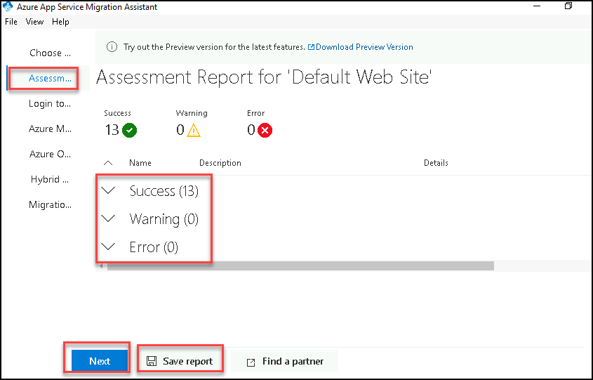

   > For the details of the readiness checks, see [App Service Migration Assistant documentation](https://github.com/Azure/App-Service-Migration-Assistant/wiki/Readiness-Checks).

## Task 2: Migrate the web application to Azure App Service

After reviewing the assessment results, you have ensured the web application is a good candidate for migration to Azure App Service. Now, we will continue the process with the migration of the application.

1. In order to continue with the migration of our website, Azure App Service Migration Assistant needs access to our Azure Subscription. Select **Copy Code & Open Browser** button to be redirected to the Azure Portal.

   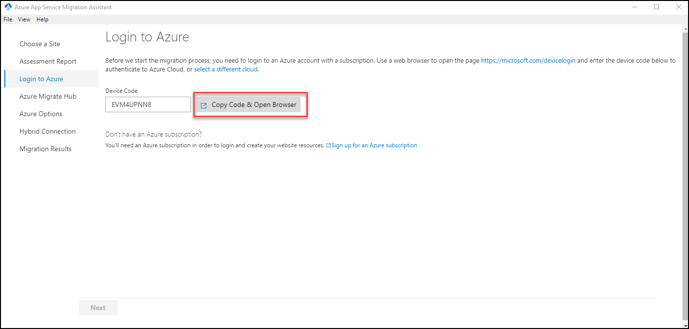

1. A new tab opens to the login page within the Edge browser. Right-click the text box and select **Paste (1)** to paste your login code. Select **Next (2)** to give subscription access to App Service Migration Assistant.

    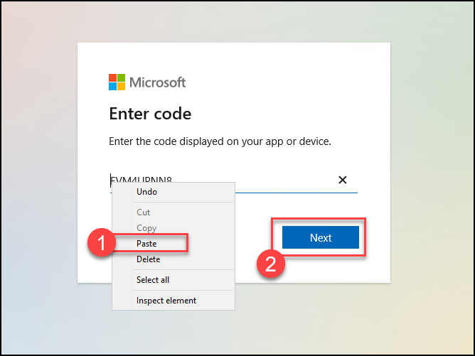

1. Continue the login process with your Azure Subscription credentials. When you see the message that says **You have signed in to the Azure App Service Migration Assistant application on your device**, close the browser tab and minimize the Edge browser window to return to the App Service Migration Assistant Window.

    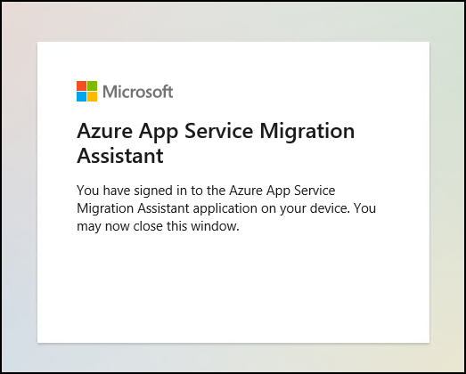

1. Select the Azure Migrate project we created **(1)** in the previous exercise to submit the results of our migration. Select **Next (2)** to continue.

    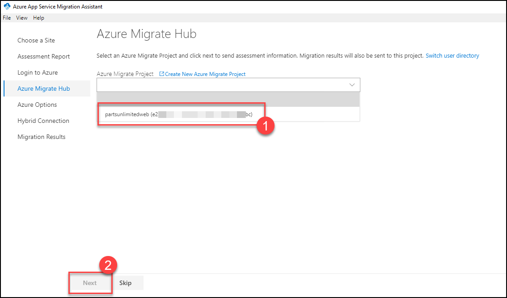

1. In order to migrate the Parts Unlimited website, we have to create an App Service Plan. The Azure App Service Migration Assistant will take care of all the requirements needed. Select **Use existing (1)** and select the resource group **MigrateServers** as your deployment target. App Service requires a globally unique Site Name, enter **partsunlimited-web-<inject key="DeploymentID" enableCopy="false"/>** **(3)** for **Destination Site Name**. Select the **<inject key="Region" enableCopy="false" />** **(4)** region. Click **Migrate** **(5)** to start the migration process.

    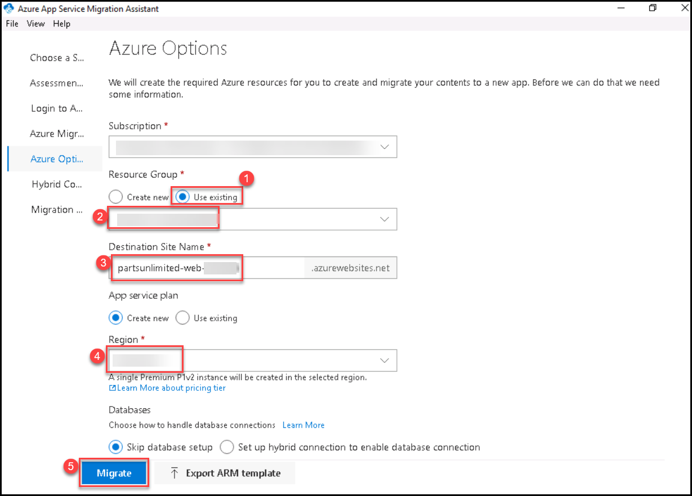

   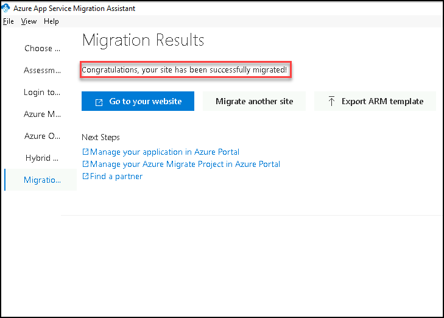

    > **WARNING:** If your migration fails with a **WindowsWorkersNotAllowedInLinuxResourceGroup (1)** It may be due to the incorrect region. Try the migration process again, but this time selecting the correct region.  
    >
    > 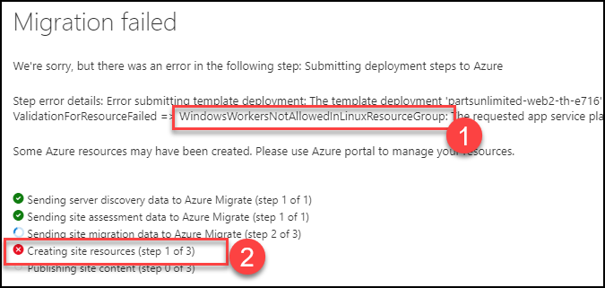

1. We have just completed the migration of the Parts Unlimited website which is hosted on IIS into a Virtual Machine to Azure App Service. Congratulations. Let's go back to the Azure Portal and look into Azure Migrate. Search for `migrate` **(1)** on the Azure Portal and select **Azure Migrate (2)**.*.

    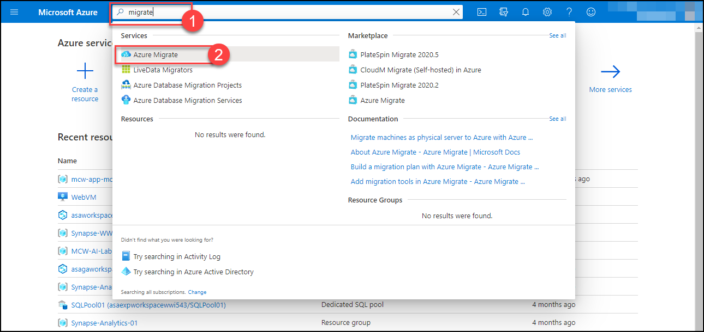

1. Switch to the **Web Apps (1)** section. See the number of discovered web servers, assessed websites **(2)** and migrated websites change **(3)**. Keep in mind that you might need to wait for 5 to 10 minutes for the results to show up. You can use the **Refresh** button on the page to see the latest status.

    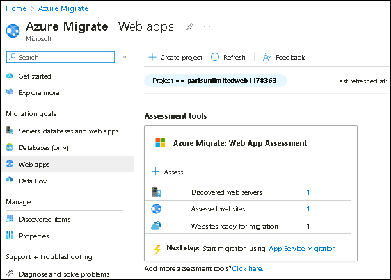

   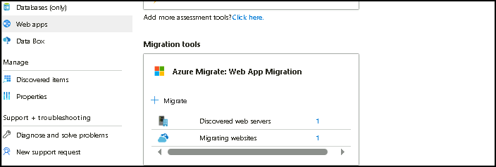

1. Verify the App service being created via migration using App Migration Assistant on azure portal. search for **App Services** click on App Services. if you see the app service being created then the migration is successful.

   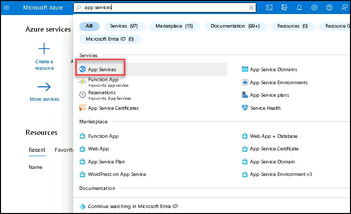

   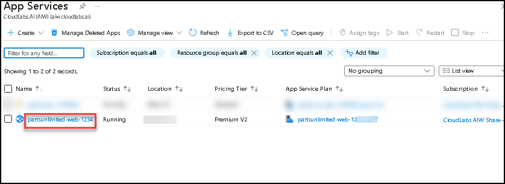

## Task 3: Configure the application connection to SQL Azure Database

Now that we have both our application and database migrated to Azure. It is time to configure our application to use the SQL Azure Database.

1. In the [Azure portal](https://portal.azure.com), navigate to your `parts` SQL Database resource by selecting **Resource groups** from Azure services list, selecting the **hands-on-lab-<inject key="DeploymentID" enableCopy="false"/>** resource group, and selecting the `parts` SQL Database from the list of resources.

   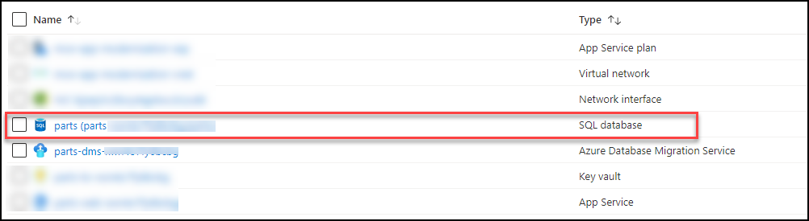

2. Switch to the **Connection strings** Blade, and copy the connection string under **ADO.NET(SQL authentication)** by selecting the copy button.

   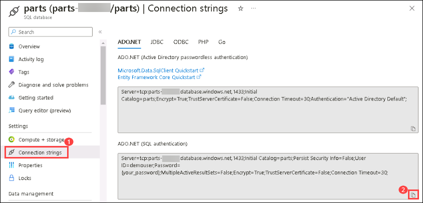

3. Paste the value into a text editor, such as Notepad.exe, to replace the Password placeholder. Replace the `{your_password}` section with **<inject key="SQLVM Password" />**. Copy the full connection string with the replaced password for later use.

   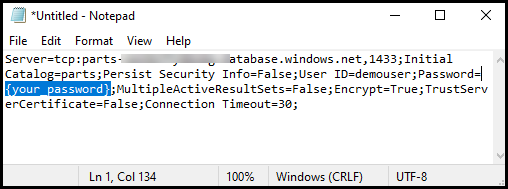

4. Go back to the resource list, navigate to your partsunlimited-<inject key="DeploymentID" enableCopy="false"/> App Service resource. You can search for `**partsunlimited-XX** to find your Web App and App Service Plan.

   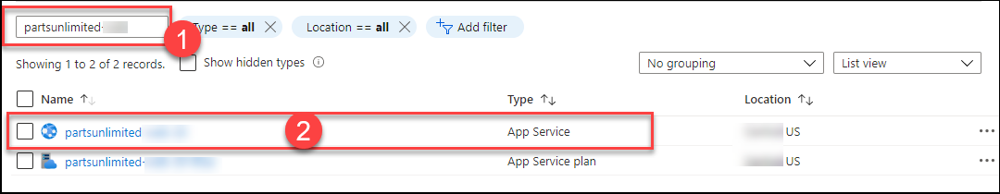

5. Switch to the **Configuration** Blade, and select **+New connection string**.

   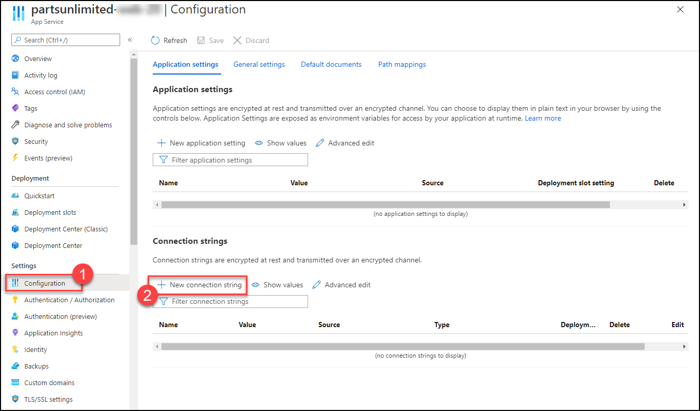

6. On the **Add/Edit connection string** panel, enter the following:

   - **Name**: Enter `DefaultConnectionString`
   - **Value**: Enter SQL Connection String you copied in Step 3.
   - **Type**: Select **SQLAzure**
   - **Deployment slot setting**: Check this option to make sure connection strings stick to a deployment slot. This will be helpful when we add additional deployment slots during the next exercises.
   - Select **OK**.

   

7. Select **Save** and **Continue** for the following confirmation dialog.

   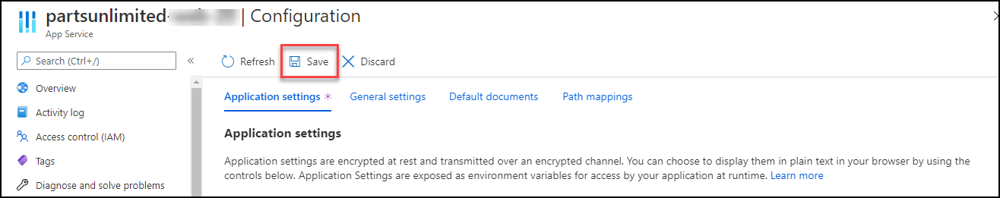

8. Switch to the **Overview** Blade, and select **Default domain** to navigate to the Parts Unlimited web site hosted in our Azure App Service using Azure SQL Database.

   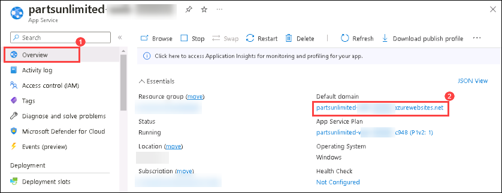

## Summary
 
In this exercise, you have migrated the on-prem web application to Azure using App Service Migration Assistant. 

