# Hands-On-Lab 1: Migrate Windows and Linux Servers to Azure

### Estimated Duration: 45 Minutes 

## Lab objectives

In this lab, you will complete the following tasks:

+ Task 1: Create a Storage Account
+ Task 2: Register the Hyper-V Host with Migration and Modernization
+ Task 3: Assign permissions for the Storage Account to the Recovery Service vault Managed Identity
+ Task 4: Enable Replication from Hyper-V to Azure Migrate
+ Task 5: Configure Networking
+ Task 6: Server Migration

##  Exercise 3: Replicate and Migrate On-premises Virtual Machines to Azure, leveraging Microsoft services and tools

In this exercise, you will learn how to register the machines, how to enable the replication, configure the networking for the newly migrated machines and verify the migrated servers.

### Task 1: Create a Storage Account

In this task, you will create a new Azure Storage Account that will be used by Migration and for storage of your virtual machine data during migration.

   > **Note:** This lab focuses on the technical tools required for workload migration. In a real-world scenario, more consideration should go into the long-term plan prior to migrating assets. The landing zone required to host VMs should also include considerations for network traffic, access control, resource organization, and governance. For example, the CAF Migration Blueprint and CAF Foundation Blueprint can be used to deploy a pre-defined landing zone, and demonstrate the potential of an Infrastructure as Code (IaC) approach to infrastructure resource management. For more information, see [Azure Landing Zones](https://docs.microsoft.com/azure/cloud-adoption-framework/ready/landing-zone/) and [Cloud Adoption Framework Azure Migration landing zone Blueprint sample](https://docs.microsoft.com/azure/governance/blueprints/samples/caf-migrate-landing-zone/).

1. On the Azure portal home page, click on **+ Create a resource**.

    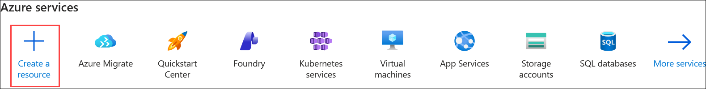

1. Click on  **Create under Storage Account (1)** from the list.

      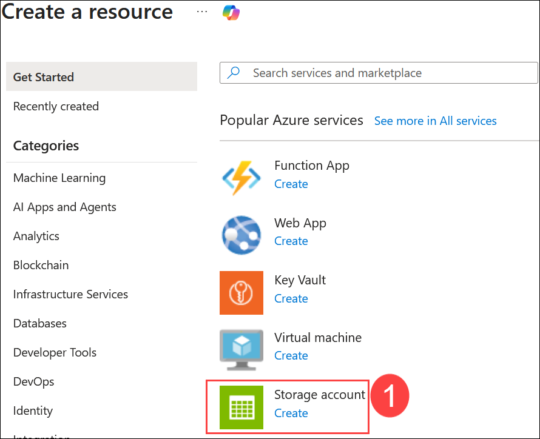

1. In the **Create a storage account** blade, on the **Basics** tab, provide the following values and click on **Next (6)**:

   - Subscription: **Select your Azure subscription**.
  
   - Resource group: **ODL-migrate-modernize-<inject key="deploymentID" enableCopy="false"></inject>-MigrateServers (1)**
  
   - Storage account name: **migrationstorage<inject key="DeploymentID" enableCopy="false" /> (2)**
     
   - Region: Select **<inject key="Region" enableCopy="false" /> (3)** from the dropdown.
  
   - Primary service: Select **Azure Blob Storage or Azure Data Lake Storage Gen 2 (4)** from the dropdown.
  
   - Redundancy: **Locally-redundant storage (LRS) (5)**
     
     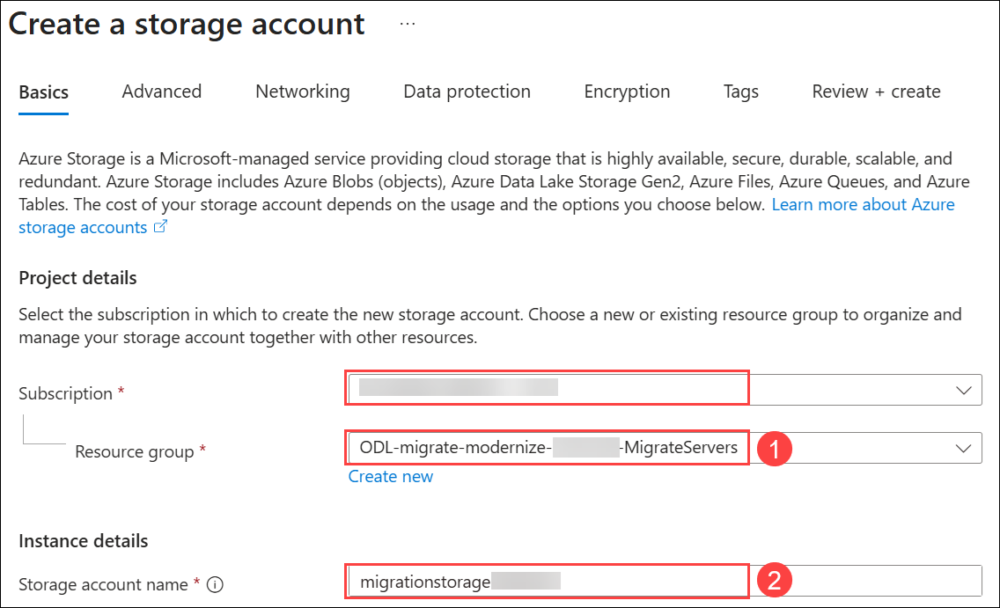

     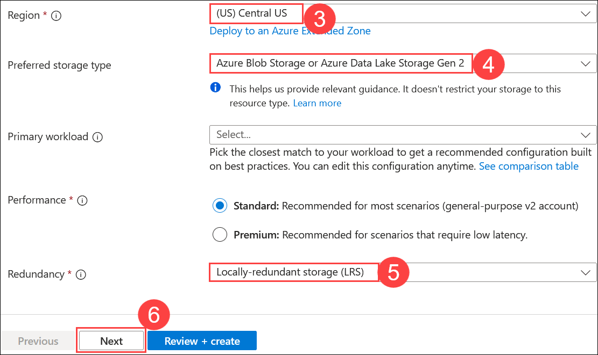

1. In the **Advanced** blade, Select on **Allow enabling anonymous access on individual containers** and click on **Next**.

1. In the **Networking** blade, click on **Next**.

1. In the **Data Protection** blade, uncheck the **Enable soft delete for blobs** **(1)** , **Enable soft delete for containers** **(2)** and **Enable soft delete for file shares** **(3)** and then click on **Review + create** **(4)**.

    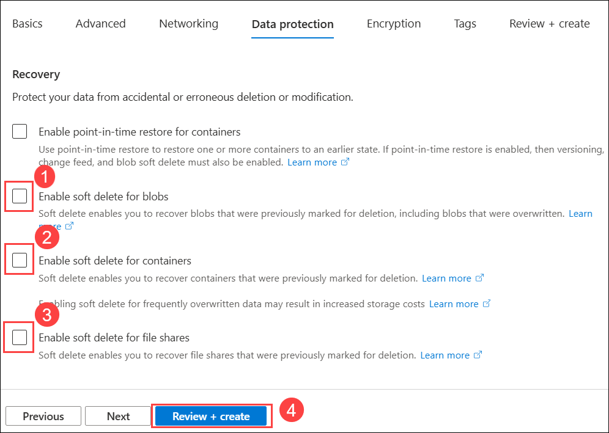

   > **Note:** We are unchecking the boxes to disable the soft delete on blobs and containers as the soft delete-enabled storage account is **not supported** for enabling replication on Virtual Machines.

1. Once the validation is passed, select **Create**. Now, you have created a storage account for replication.

### Task 2: Register the Hyper-V Host with Migration and modernization

In this task, you will register your Hyper-V host(LabVM) with the Migration and Modernization service. This service uses Azure Site Recovery as the underlying migration engine. As part of the registration process, you will deploy the Azure Site Recovery Provider on your Hyper-V host.

1. Search for **Azure Migrate (1)** and select it **Azure Migrate (2)** from the search results.

   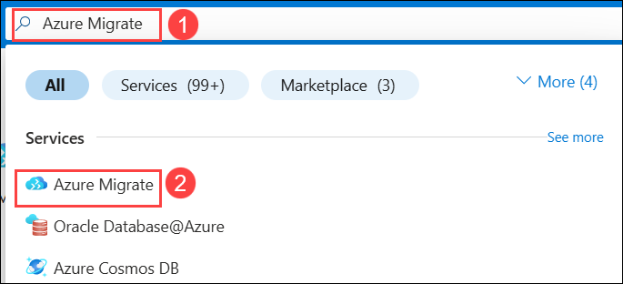

1. On **Azure Migrate | All Projects (1)** page, click on the **<inject key="Azure Migrate Project Name"></inject> (2)**.

      
   
1. On the **<inject key="Azure Migrate Project Name"></inject>** page in the Azure Portal, select **Migrations (1)** under **Execute** on the left. Under **Discovery for Migration**, click on **Discover more (2)**.
   
     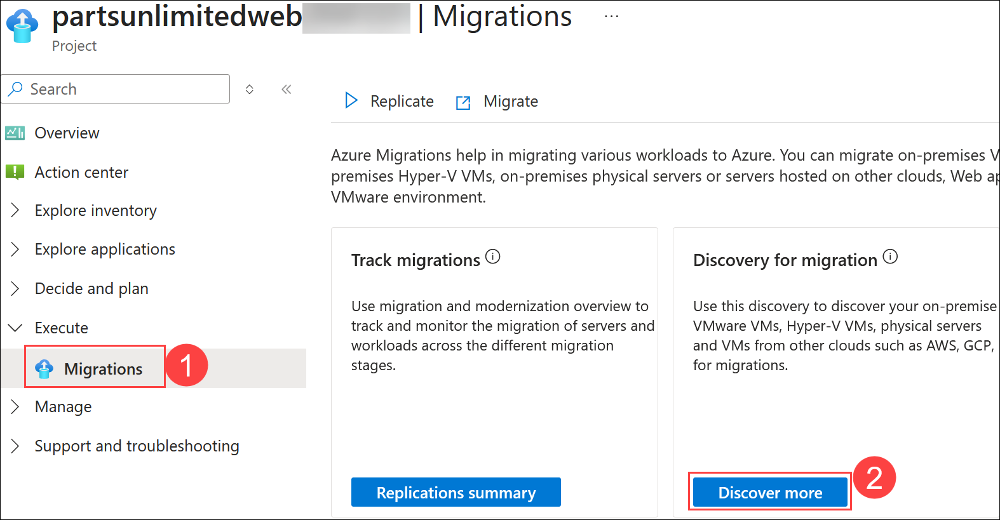

1. In the **Discover** panel, provide the following details:

   - **Where do you want to migrate to?** **Azure VM (1)**
   
   - Under **Are your machines virtualized**, select **Yes, with Hyper-V (2)**.
   
   - Under **Target region (3)** make sure to select the **<inject key="Region"></inject>** region as same the Resource Group's region.
   
   - Check the **Confirmation (4)** checkbox and select **Create resources (5)** to begin the deployment of the Azure Site Recovery resource used by Migration and modernization for Hyper-V migrations.

     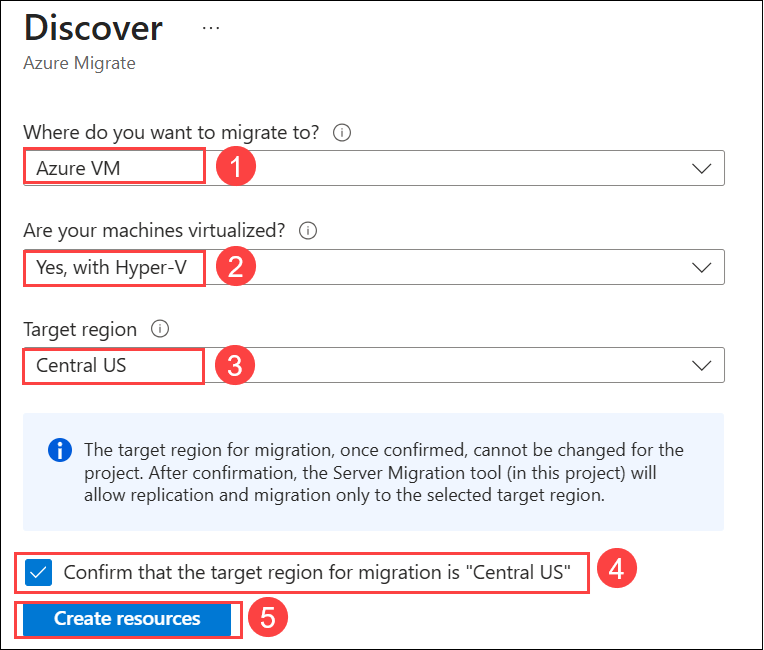
  
1. Click on the **Download** link for the Hyper-V replication provider software installer to download the Azure Site Recovery provider installer.

   

1. Return to the **Discover** page in your browser and select the blue **Download** button and download the registration key file.

   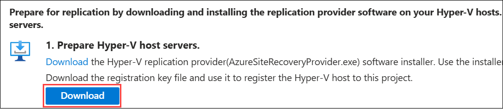

1. Open the **AzureSiteRecoveryProvider.exe** installer you downloaded a moment ago. On the **Microsoft Update** tab, select **Off (1)** and select **Next (2)**. Accept the default installation location and select **Install (3)**.

     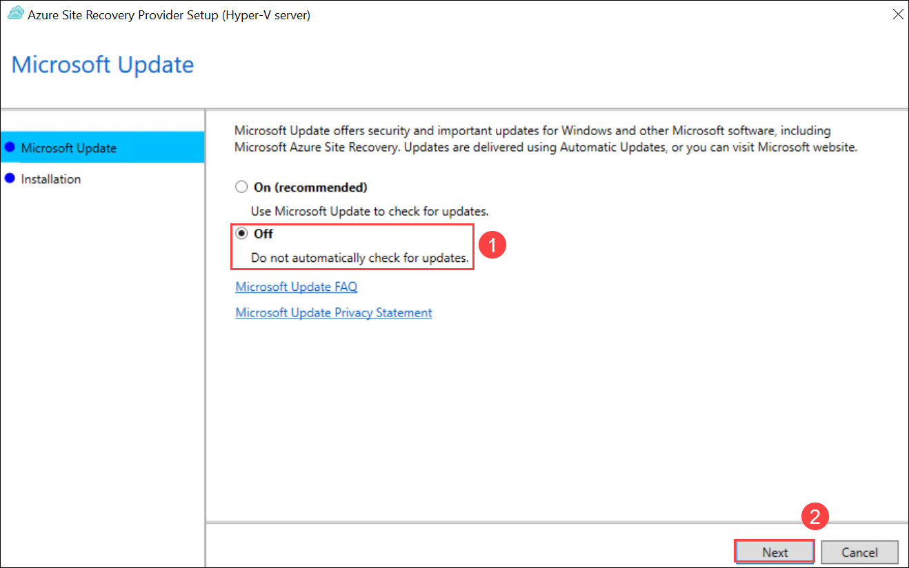

     
   
   > **Note:** If you are prompted with a pop-up like the latest version of the Provider is installed on this server. Would you like to proceed to registration? select **Yes**. (You can directly jump to the next step in that case.)
   
1. When the installation has completed select **Register (1)**. Select **Browse (2)** to the location of the key file you downloaded, select the key file and select **Open**. When the key is loaded select **Next (3)**.

   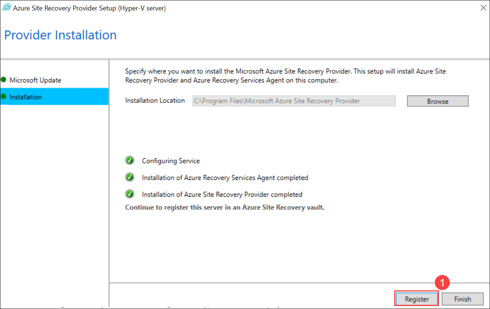

   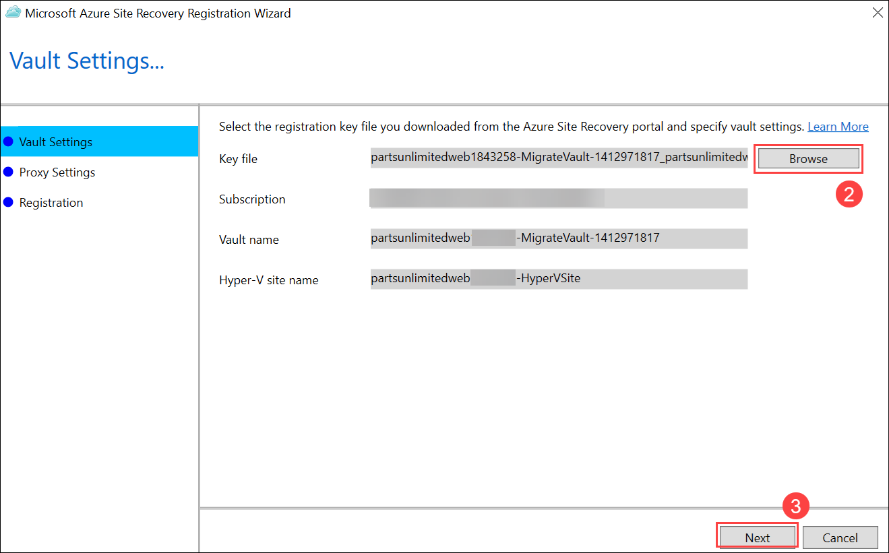

1. Select **Connect directly to Azure Site Recovery without a proxy server (1)** and select **Next (2)**. The registration of the Hyper-V host with Azure Site Recovery will begin.

    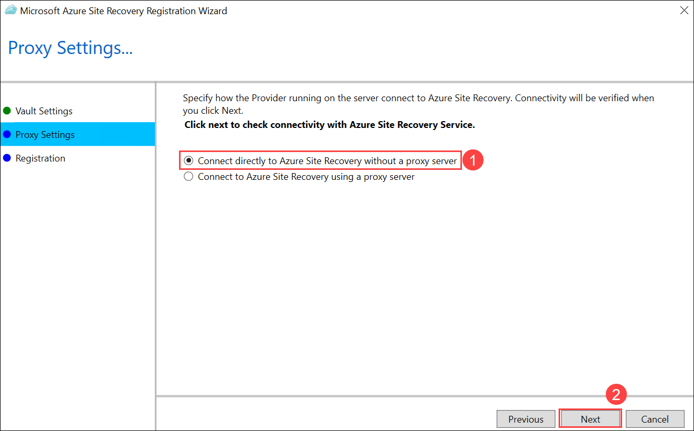

1. Wait for registration to complete (this may take several minutes). Then select **Finish**.

    

1. Return to the Azure Migrate browser window. **Refresh** your browser, then

   - **Where do you want to migrate to?** : **Azure VM (1)**
   
   - Under **Are your machines virtualized**, select **Yes, with Hyper-V (2)**
   
   - Do you want to install a new replication appliance or scale-out existing setup? : Select **Install a replication appliance (3)**
   
   - Select **Finalize registration (4)**, which should now be enabled
     
     

1. Azure Migrate will now complete the registration with the Hyper-V host. **Wait** for the registration to complete. This may take several minutes.
     

1. Once the registration is finalized, close the **Discover machines** panel using **X** button.
   
     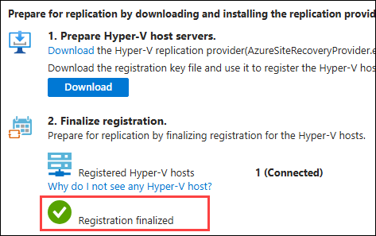

1. Navigate back to **<inject key="Azure Migrate Project Name"></inject>** page, select **Migrations (1)** under **Execute**, then click on **Replications summary (2)**, on the **Overview (3)** page, the panel should now show **5 Discovered servers (4)**.
   
   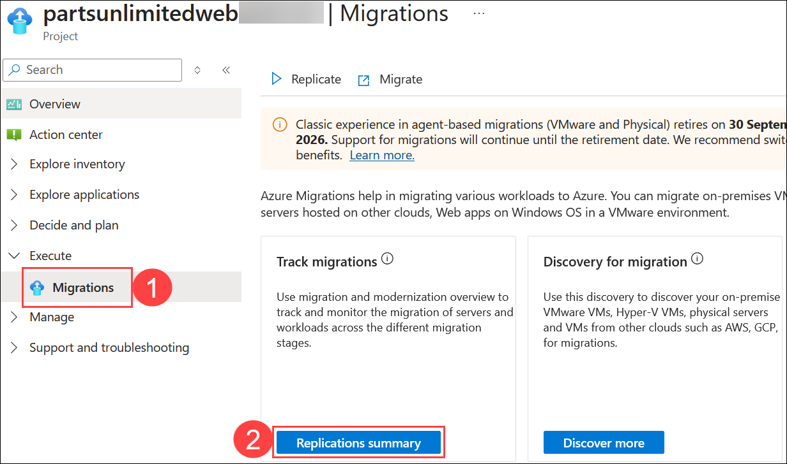
   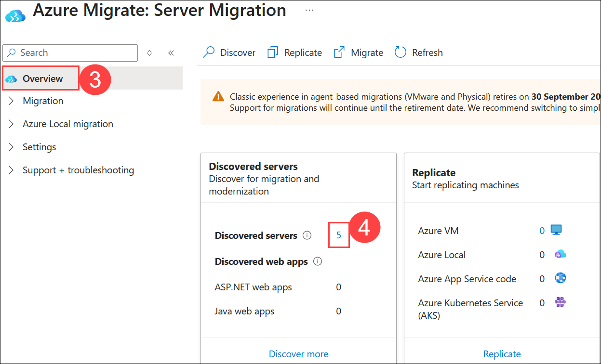

### Task 3: Assign permissions for the Storage Account to the Recovery Service vault Managed Identity

1. In the Azure portal, use the search bar at the top to search for **storage account (1)**, and then select it **(2)** from the Services section.

   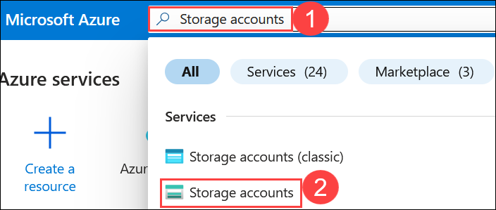

1. Select storage account named **migrationstorage<inject key="DeploymentID" enableCopy="false" /> (2)** from the list.

   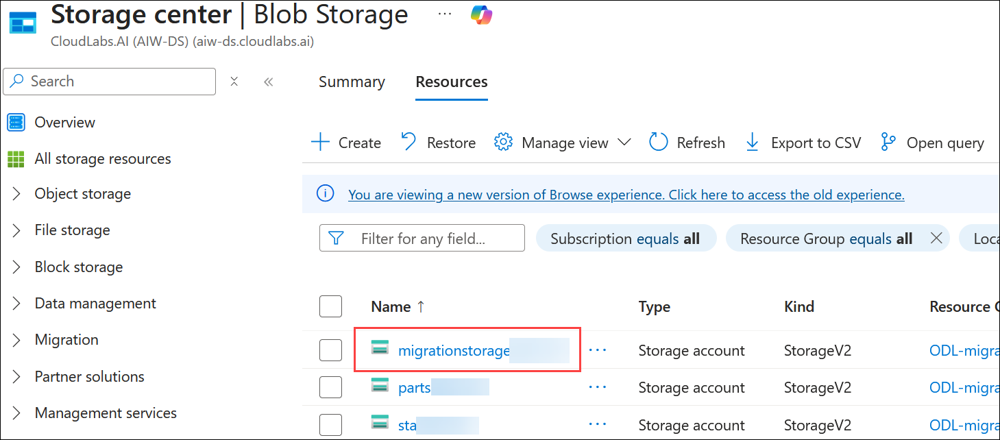

1. In the Storage account blade, select **Access control (IAM) (1)**, click **+ Add (2)**, and then choose **Add role assignment (3)**.

   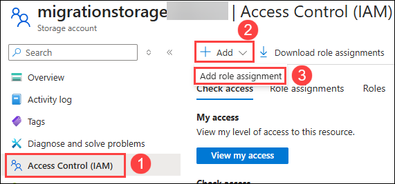

1. Under **Privileged administrator roles**, select **Contributor (2)**, and then select **Next (2)**.

   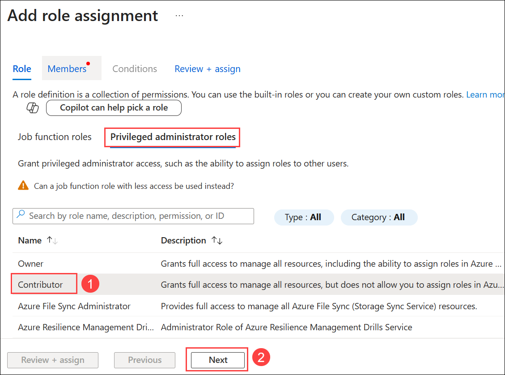

1. On the Add role assignment page,

      - Under Members tab, select **Managed identity (1)**
      
      - Click on **+ Select members (2)**
      
      - Managed identity: **Data replication vault(1) (3)**
      
      - Then, select replication vault starting with the name **partsunlimited (4)**
      
      - Click on **Select (5)**

        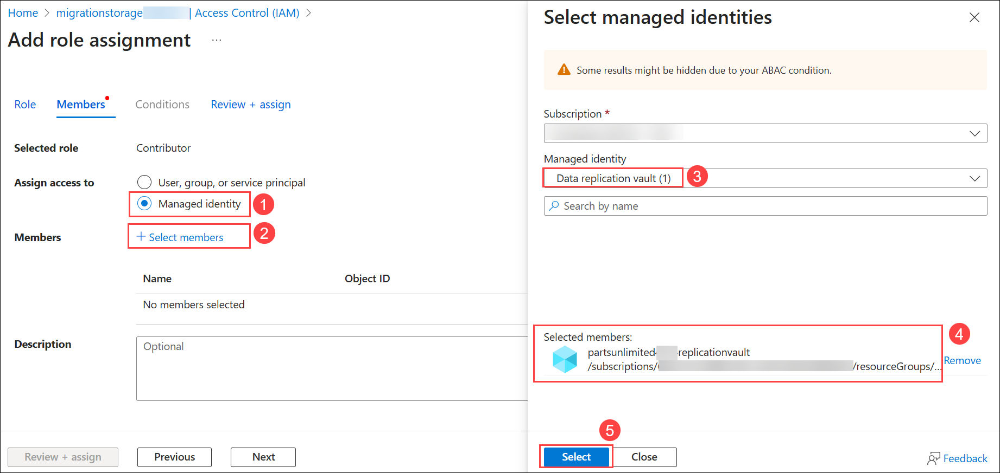
  
1. Click **Review + assign** twice to finalize the role assignment.

   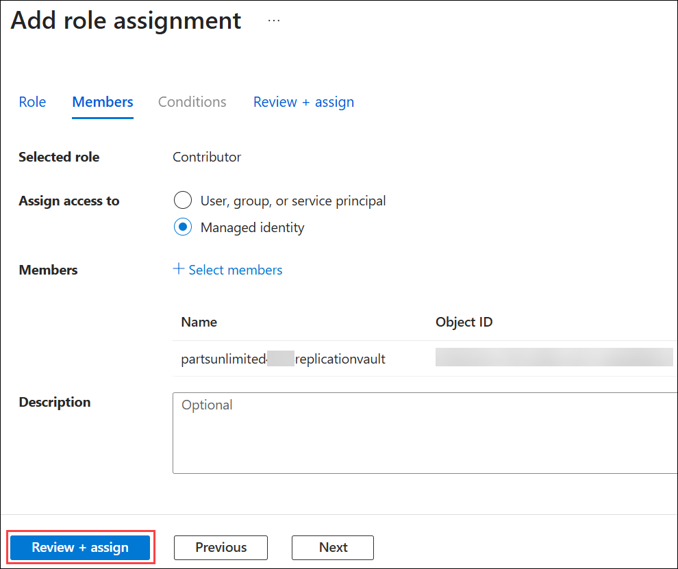

1. Now we need to assign the Storage Blob Data Contributor role. To do this, select **Access control (IAM) (1)**, click **+ Add (2)**, then choose **Add role assignment (3)**.

   

1. Under Job function roles, search for **Storage Blob Data Contributor (1)**, select it from the list **(2)** and then click on **Next (3)**.

   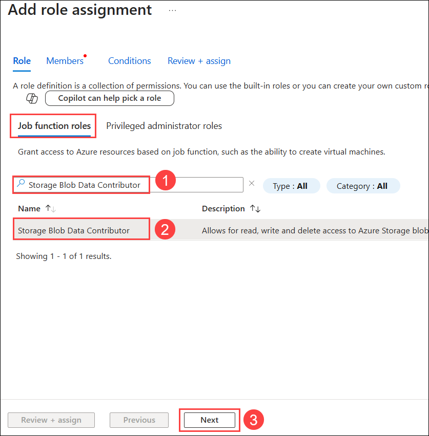

1.  On the Add role assignment page,

      - Under Members tab, select **Managed identity (1)**
      
      - Click on **+ Select members (2)**
      
      - Managed identity: **Data replication vault(1) (3)**
      
      - Then, select replication vault starting with the name **partsunlimited (4)**
      
      - Click on **Select (5)**
  
        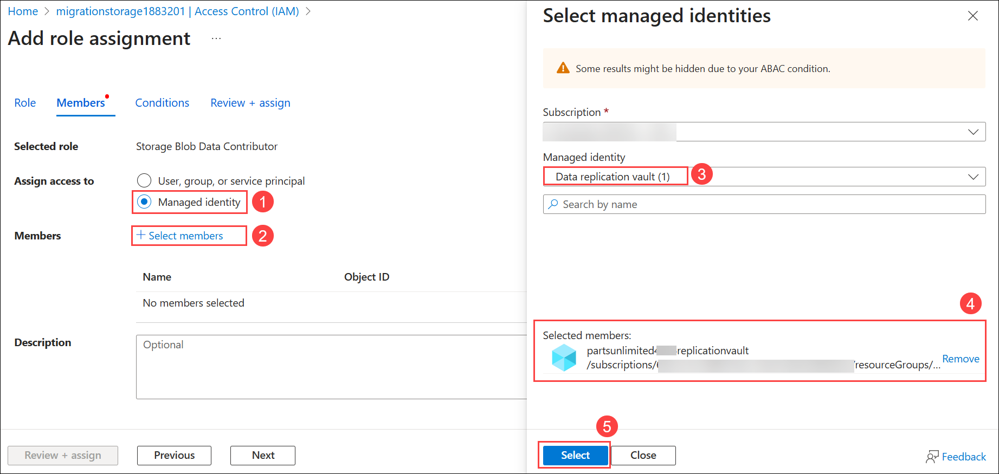
  
1. Click **Review + assign** twice to finalize the role assignment.

   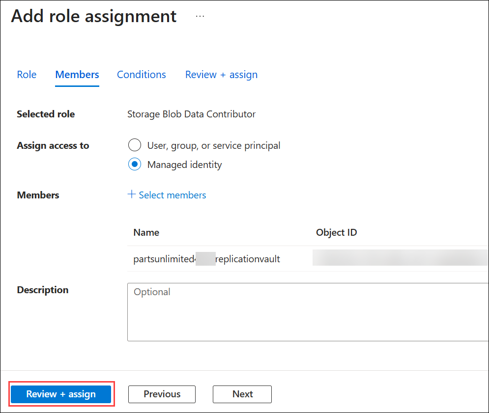

### Task 4: Enable Replication from Hyper-V to Azure Migrate

In this task, you will configure and enable the replication of your on-premises virtual machines from Hyper-V to the Azure Migrate Server Migration service.

1. Navigate back to the **<inject key="Azure Migrate Project Name"></inject>** page, select **Migrations (1)** under **Execute**, then click on **Replications summary (2)**
   
     

1. On the **Azure Migrate: Server Migration** page, select **Overview (1)**, click on **Replicate (2)** this opens the **Replicate** wizard.

     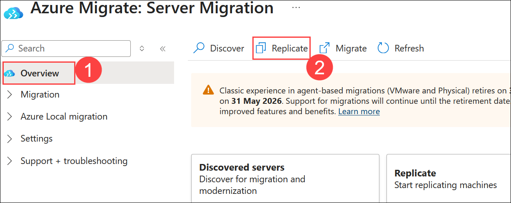
   
1. Under **Specific Intent** page, provide the below details:

    -  What do you want to migrate? : Select **Servers or Virtual machines (VM)** **(1)**
    -  Where do you want to migrate to? : Select **Azure VM** **(2)**
    -  Are your machines virtualized? : **Yes, with Hyper-V (3)**
    -  Click on **Continue (4)**

         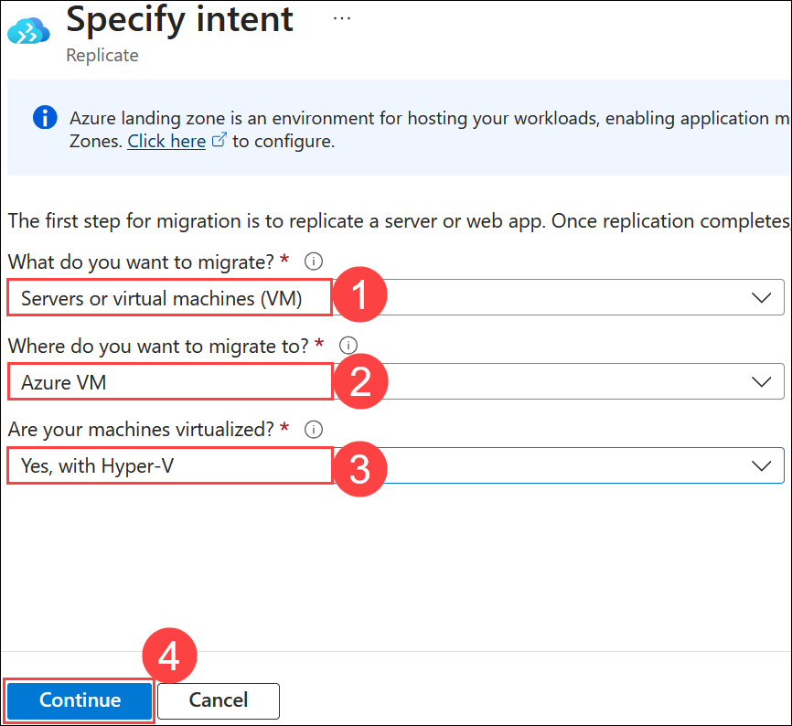

1. In the **Virtual machines** tab, under **Import migration settings from an assessment**, select **No, I'll specify the migration settings manually (1)**. Select the **UbuntuServer and WindowsServer (2)** virtual machines, then select **Next (3)**.

     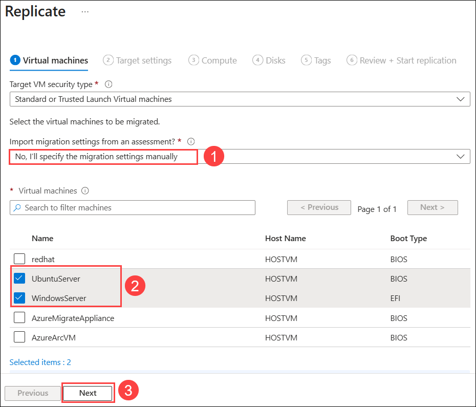

   > **Note:** Ensure the Windows VM is running in hyper-v in case of its absence while selecting.

     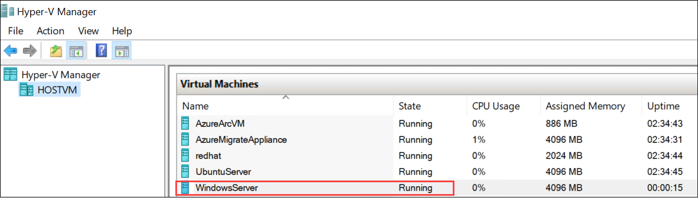
     
1. On the **Target settings** tab, select the below information,
   - **Resource Group:** **ODL-migrate-modernize-<inject key="deploymentID" enableCopy="false"></inject>-MigrateServers** **(1)** resource group.
   - **Cache storage account:** **Auto-create (default) (2)**  
   - **Virtual Network:** Select **hostvmvnet (3)**. 
   - **Subnet:** Select **MigrateSubnet (4)**. 
   - **Availability options:** Select **No infrastructure redundancy regquired**.
   - Leave other values as default and select **Next (5)**.
   
     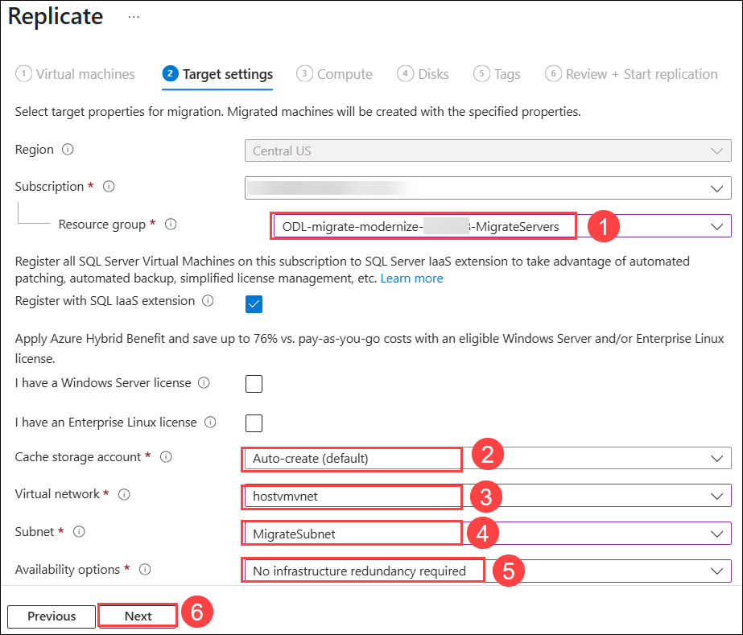
   
     >**Note:** The cache storage account will auto-created, if not please wait for 10-15 minutes, else reperform the previous step.
   
     > **Note:** For simplicity, in this lab you will not configure the migrated VMs for high availability, since each application tier is implemented using a single VM.

1. On the **Compute** tab, select and enter the below configuration:
   - Azure VM Name: **UbuntuWAF** and **smarthotelweb1** for the Ubuntu and the Windows virtual machines respectively **(1)**. 
    - Select the **Linux** and **Windows** OS type for the Ubuntu and the Windows virtual machines respectively **(2)**. 
   - Select the **Linux** and **Windows** operating system for the Ubuntu (Red Hat Enternprise Linux 7) and the Windows (Windows 10) virtual machines respectively **(3)**.
   - Click on **Next** **(4)**. 

     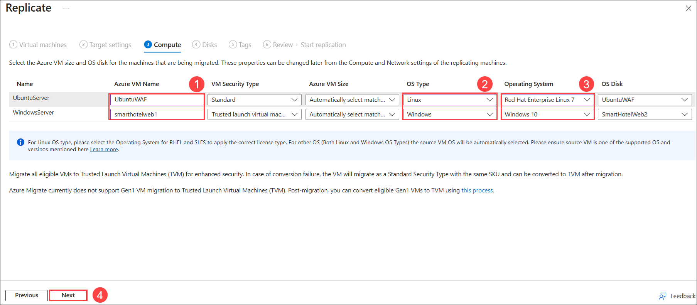
    
1. In the **Disks** tab, review the settings but do not make any changes. Select **Next** to go to Tags tab and then select **Next**, then on **Review + Start replication** tab select **Replicate** to start the server replication.

     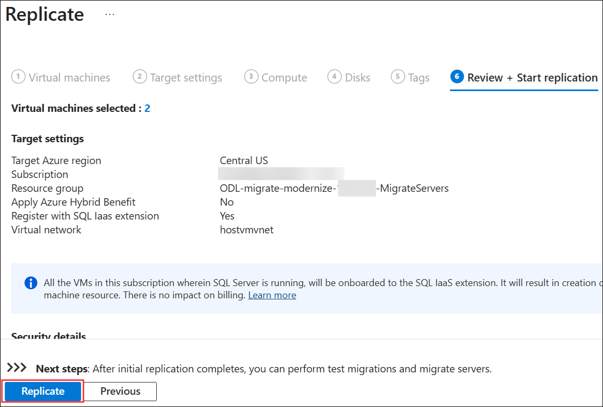

1. On the **Azure Migrate: Server Migration** page, select **Overview**, click on **Refresh (1)**.

     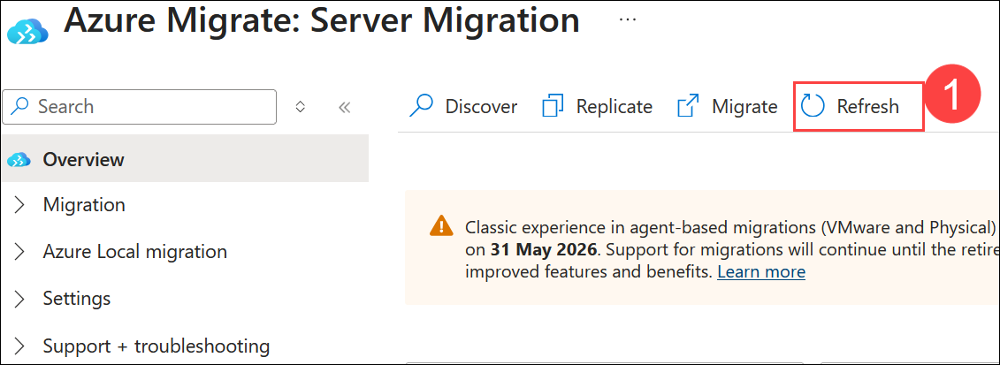
    
1. Confirm that the **2 machines (2)** are replicating.

     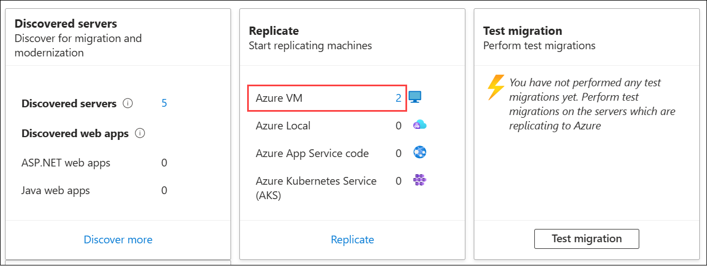

    > **Note**: In the event of a failure, click on the Failed state and select Restart. This will ensure the successful replication of both machines.

1. Select **Replications (1)** under **Migration** in the left navigation pane.  Select **Refresh** occasionally and wait until both two machines have a **Protected (2)** status, which shows the initial replication is complete. This will take 15-20 minutes.

    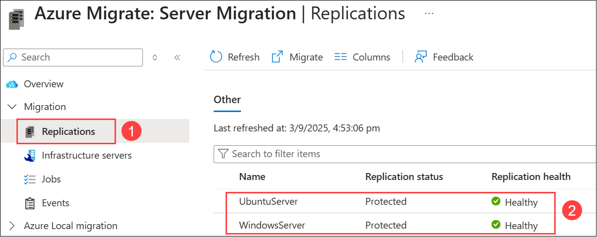

### Task 5: Configure Networking

In this task, you will modify the settings for each replicated VM to use a static private IP address that matches the on-premises IP addresses for that machine.

1. Still using the **Azure Migrate: Server Migration** page, select the **Replications** under **Migration** and select **WindowsServer** virtual machine. This opens a detailed migration and replication blade for this machine. Take a moment to study this information.

    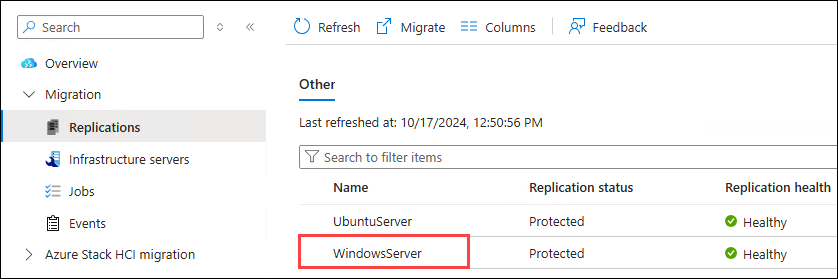

2. On the left menu, expand **General (1)** and select **Compute and Network (2)**. Under the Microsoft Azure column, verify the Size is set to **F2s_v2 (3)**.

     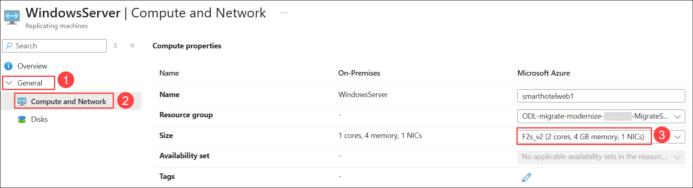

3. In the **Compute and Network** section, scroll down to the **Network interfaces**. Select the **pencil icon (✏️)** next to the NIC name.

     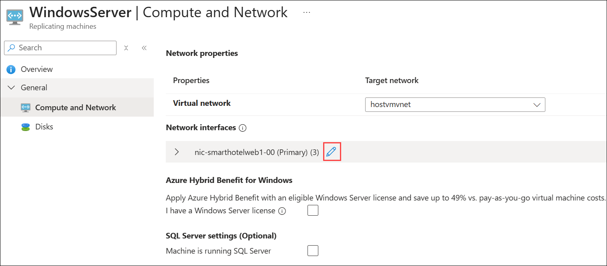

4. In the **Network interface** settings:

     - Under **IP address type**, select **Static (1)**.

     - In the **Private IP address** field, enter: `10.0.2.4` **(2)**.

     - Select **Apply (3)** to save the changes.
     
          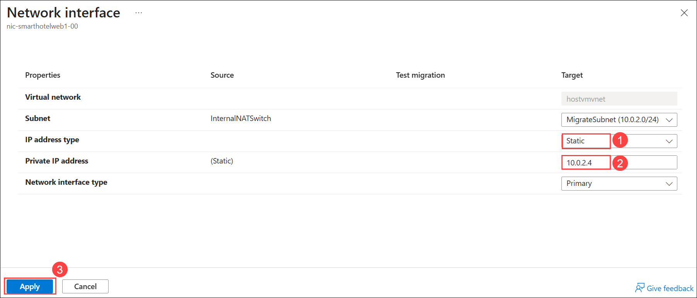

5. Select Save to apply the changes to the VM's configuration.

     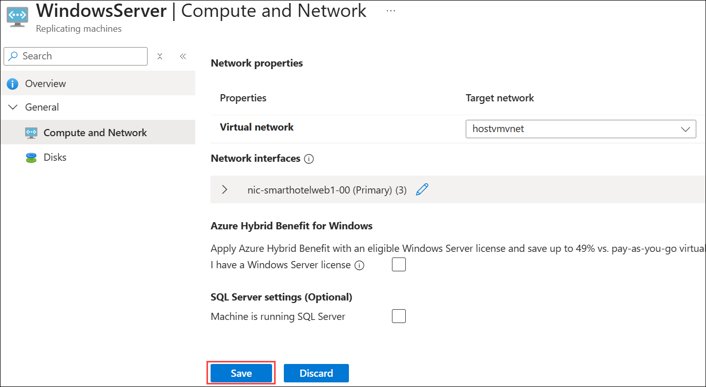

6. Repeat these steps to configure the private IP address for the **UbuntuWAF** VM.

     - Private IP address `10.0.2.5`

### Task 6: Server migration

In this task, you will perform a migration of the WindowsServer, and Linux machines to Azure.

1. Return to the **Azure Migrate: Server Migration** overview blade. Under **Migrate**, select **Migrate**.

    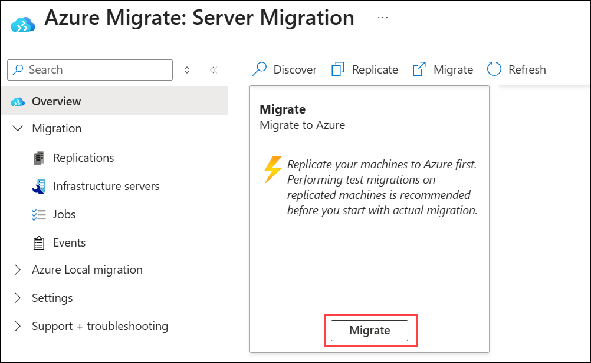
   
    > **Note**: In a real-world scenario, you would perform a test migration before the final migration. To save time, you will skip the test migration in this lab. The test migration process is very similar to the final migration.

1. On the Specify Intent page, ensure **Azure VM** is selected for **Where do you want to migrate to?** and click on **Conitnue**.

   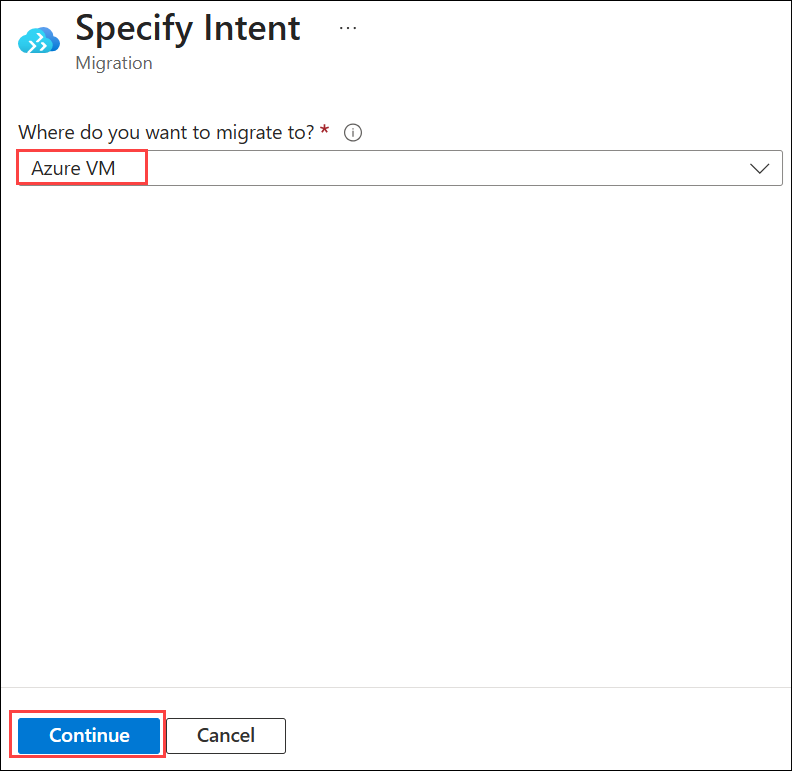

1. On the **Migrate** blade, select **2 virtual machines** **(1)**, then **Yes, shutdown machines(Ensures no data loss)(2)**  and click on **Migrate (3)** to start the migration process.

    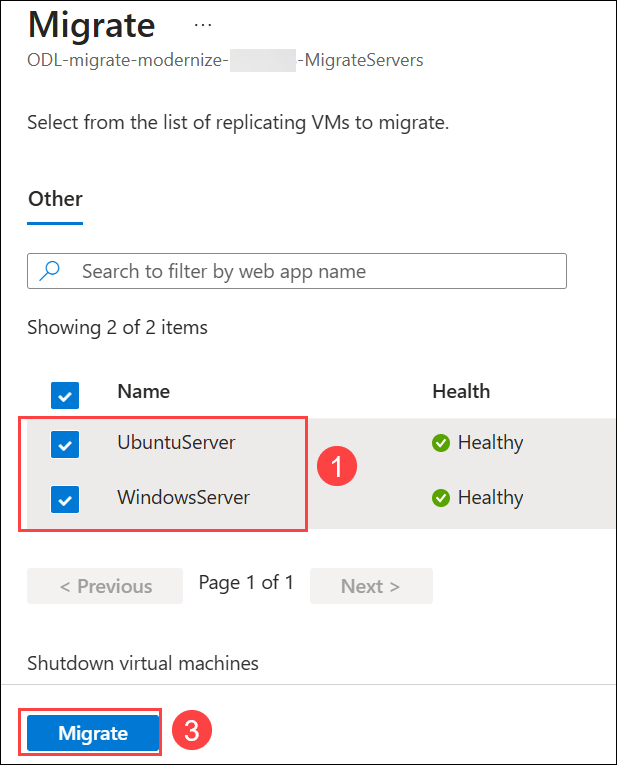

    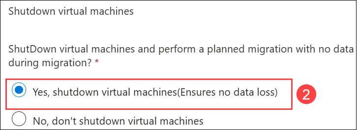

   > **Note**: You can optionally choose whether the on-premises virtual machines should be automatically shut down before migration to minimize data loss. Either setting will work for this lab.

3. The migration process will start.

    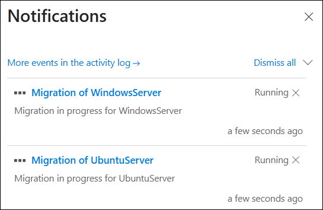

4. To monitor progress, select **Jobs** under **Manage** on the left and review the status of the three **Planned failover** jobs.

    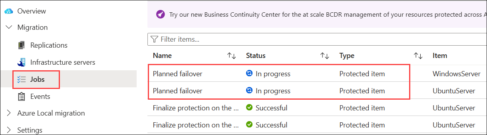

1. **Wait** until all two **Planned failover** jobs show a **Status** of **Successful**. Please don't refresh your browser. This could take up to 15-20 minutes.

    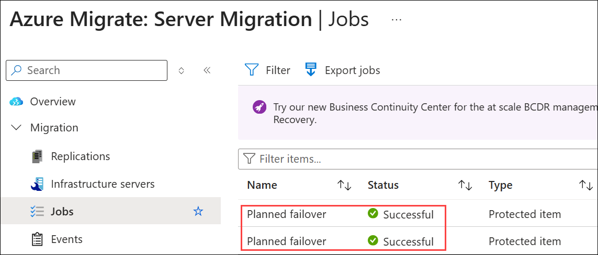

1. Navigate to the **ODL-migrate-modernize-<inject key="deploymentID" enableCopy="false"></inject>-MigrateServers**  resource group and check that the VM, network interface, and disk resources have been created for each of the virtual machines being migrated.

    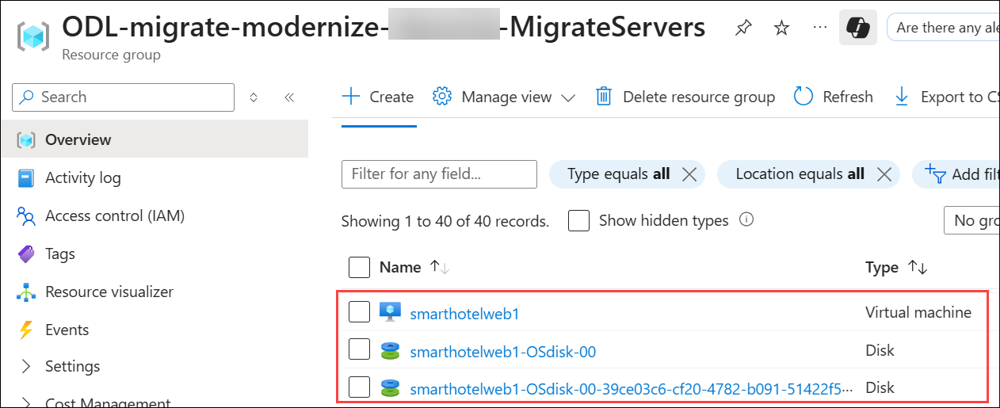

    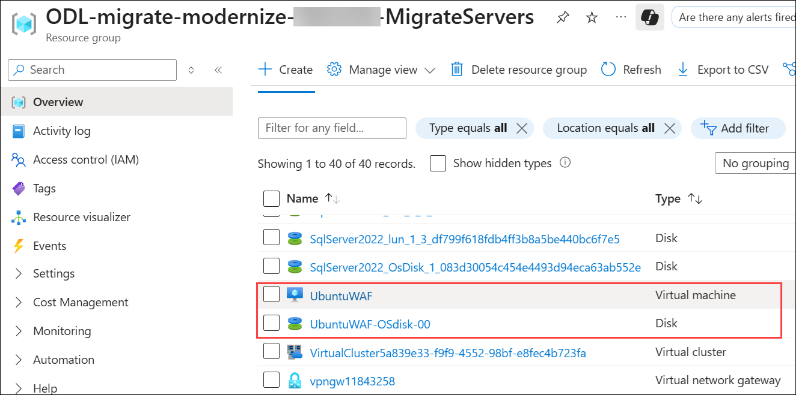

   > **Congratulations** on completing the task! Now, it's time to validate it. Here are the steps:
   > - Hit the Validate button for the corresponding task. If you receive a success message, you can proceed to the next task.
   > - If not, carefully read the error message and retry the step, following the instructions in the lab guide. 
   > - If you need any assistance, please contact us at cloudlabs-support@spektrasystems.com. We are available 24/7 to help you out.
 
   <validation step="a6af4d13-3e56-436d-9f97-10e2fb426e4c" />

## Summary 

In this exercise, you configured an Azure Migrate migration replication server, and configured the Azure Storage account for storing the metadata of the servers during replication and migration.

### You have completed the lab

Now, click on **Next** from the lower right corner to move to the next page.

