# Exercise 0: Deploy and Provision Required Azure Resources

## Overview

This exercise provisions all required Azure resources and sets up the web application running on your local machine (simulating an on-premises environment). By the end of this exercise, you will have:

- Azure infrastructure ready (Resource Group, VNet, Azure SQL Database)
- The Contoso Retail web application running locally on `http://localhost:8080`
- The application connecting to Azure SQL Database and displaying product data

This local setup simulates your on-premises data center. In Exercise 2, you will migrate this locally running application to Azure App Service.

## Task 1: Create the Azure Resource Group for Lab Resources

1. In the **Azure portal**, select **Resource groups**.

   

2. In the **Resource groups** page, select **+ Create**.

   

3. In the **Basics** tab, provide the following details and select **Review + create** **(4)**:

   - **Subscription**: Keep default Azure subscription
   - **Resource group name**: `rg-migration-lab` **(1)**
   - **Region**: <inject key="Region" enableCopy="false"></inject> 

     

4. In the **Review + create** tab, select **Create**.

   

Resource group `rg-migration-lab` is ready.

## Task 2: Deploy the Virtual Network and Subnets

1. In the Azure portal search bar, type **Virtual networks** **(1)** and select **Virtual networks** **(2)** under Services.

   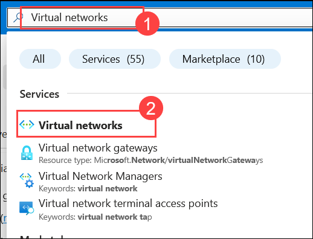

2. In the **Virtual networks** page, select **+ Create**.

   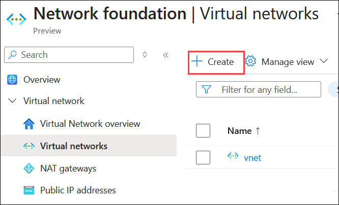

3. On the **Basics** tab, provide the following details:

   - **Subscription**: keep default Azure subscription
   - **Resource group**: `rg-migration-lab` **(1)**
   - **Virtual network name**: `vnet-migration-lab` **(2)**
   - **Region**: <inject key="Region" enableCopy="false"></inject> **(3)**

4. Select **Next (4)** to proceed to the **Security** tab. Leave defaults and select **Next**.

   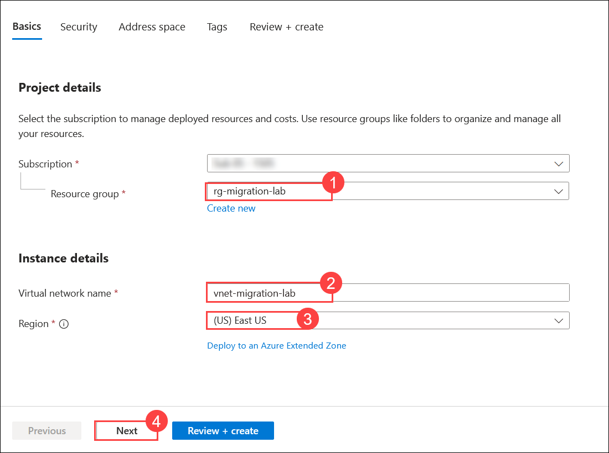

5. On the **IP Addresses** tab, configure the following:

   - **Address space**: `10.0.0.0/16` **(1)**

   - Click on edit icon  and remove any default subnets and add the following subnets:

   | Subnet name | Address range | Purpose |
   | --- | --- | --- |
   | `snet-default` | `10.0.0.0/24` | General-purpose subnet **(2)** |
   | `snet-appservice` | `10.0.1.0/24` | App Service VNet integration (delegated) **(3)** |
   | `snet-private` | `10.0.2.0/24` | Private endpoints for SQL and other services **(4)** |

   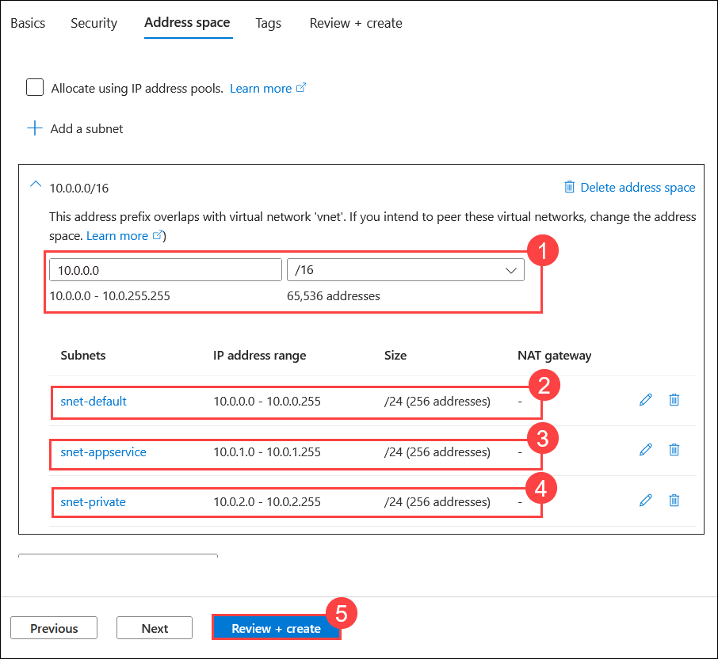

6. Select **Review + create (5)**, then select **Create**.

   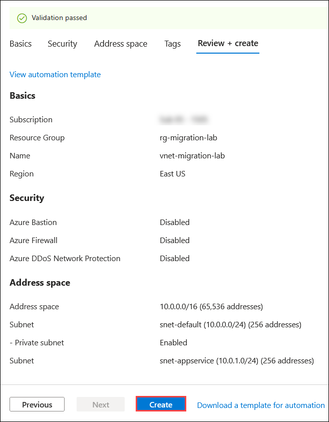

7. Wait for the deployment to complete (approximately 1 to 2 minutes) and select **Go to resource**.

   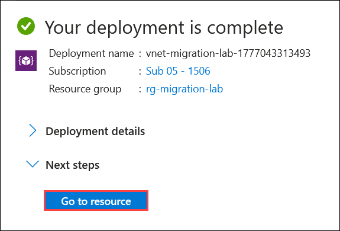

**Delegate the App Service subnet**

1. Open **vnet-migration-lab**, under **Settings** go to **Subnets (1)** from the left navigation, and select the **snet-appservice (2)** subnet.

   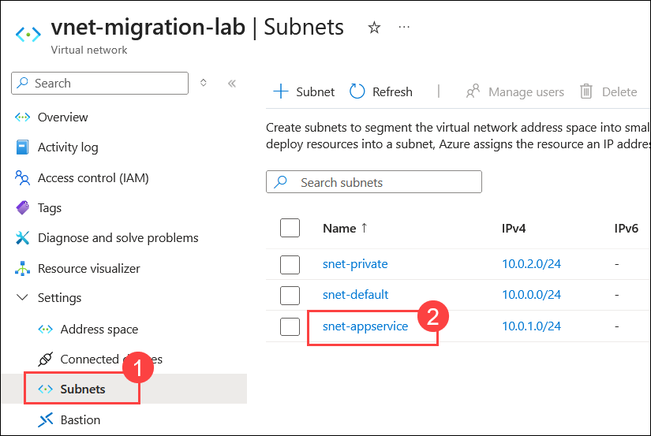

2. Scroll down, under **Subnet delegation** search & select **Microsoft.Web/serverFarms (1)**, and then click **Save (2)**.

   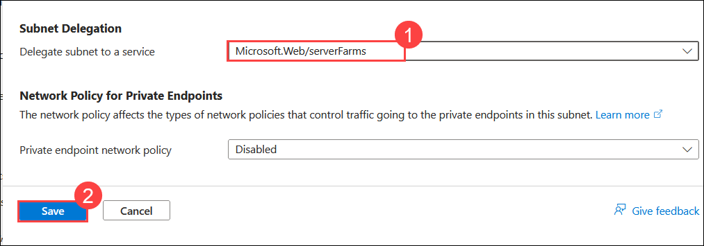

Virtual network and subnets are configured.

## Task 3: Deploy Azure SQL Server and Database

1. In the Azure portal search bar, type **SQL databases** **(1)** and select **Azure SQL Databases** **(2)** under Services.

   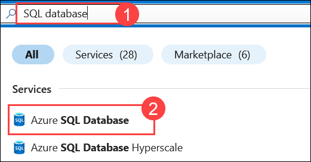

2. In the **SQL databases** page, select **+ Create (1)** a **SQL database (2)**.

   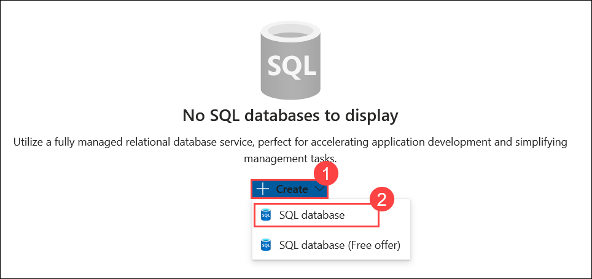

3. On the **Basics** tab, provide the following details:

   - **Subscription**: keep your default Azure subscription
   - **Resource group**: `rg-migration-lab` **(1)**
   - **Database name**: `contosodb` **(2)**
   - **Server**: select **Create new** **(3)**

   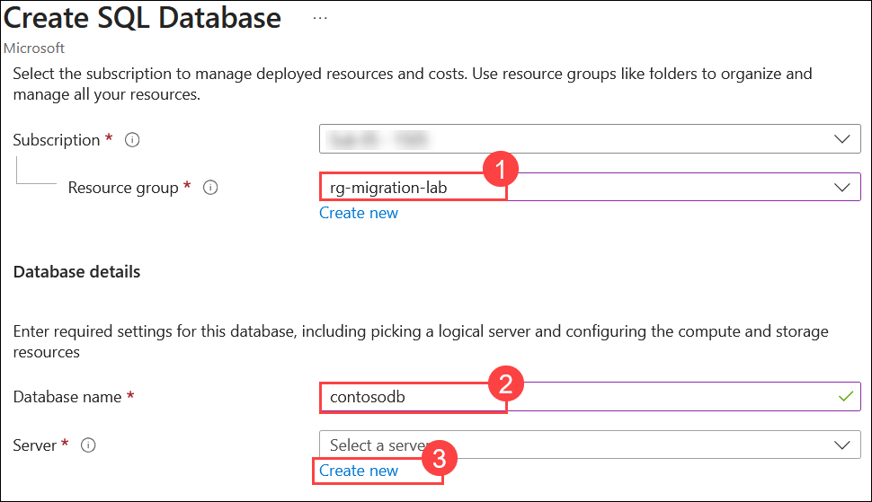

4. In the **Create SQL Database Server** panel:

   - **Server name**: `sql-contoso-<inject key="Deployment ID" enableCopy="false"></inject>` **(1)**
   - **Location**: <inject key="Region" enableCopy="false"></inject> **(2)**
   - **Authentication method**: select **Use SQL authentication** **(3)**
   - **Server admin login**: `sqladmin` **(4)**
   - **Password**: `P@ssw0rd2026!` **(5)**
   - **Confirm password**: `P@ssw0rd2026!` **(6)**
   - Select **OK** **(7)**

     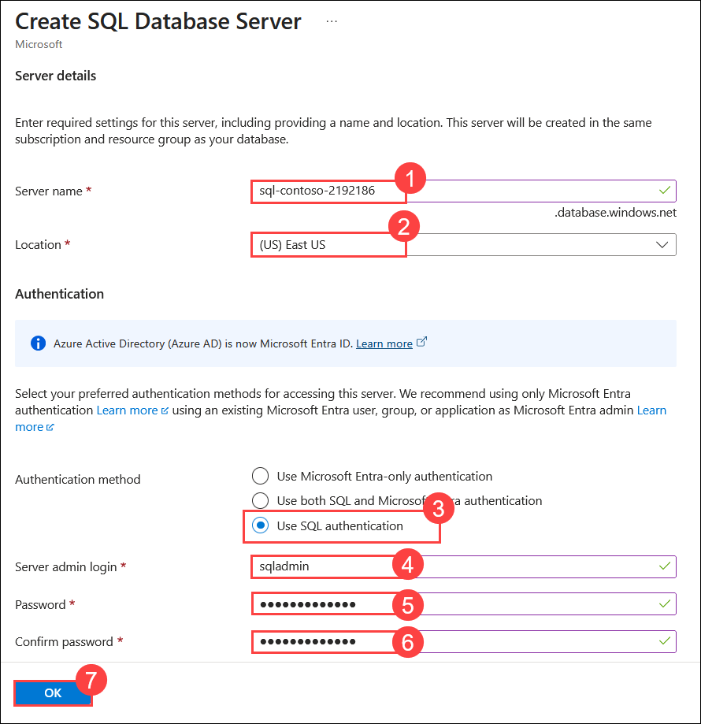

5. Back on the Basics tab:

   - **Want to use SQL elastic pool?**: No **(1)**
   - **Workload environment**: Development **(2)**
   - **Compute + storage**: select **Configure database** and choose **Basic** tier (2 GB storage) **(3)**
   - **Backup storage redundancy:** select **Locally-redundant backup storage (4)**

     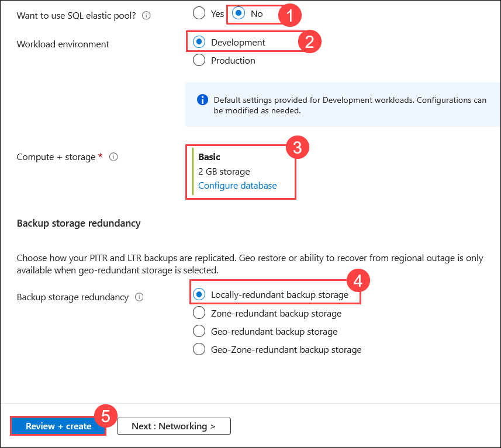

6. Select **Review + create (5)**, then select **Create**.

   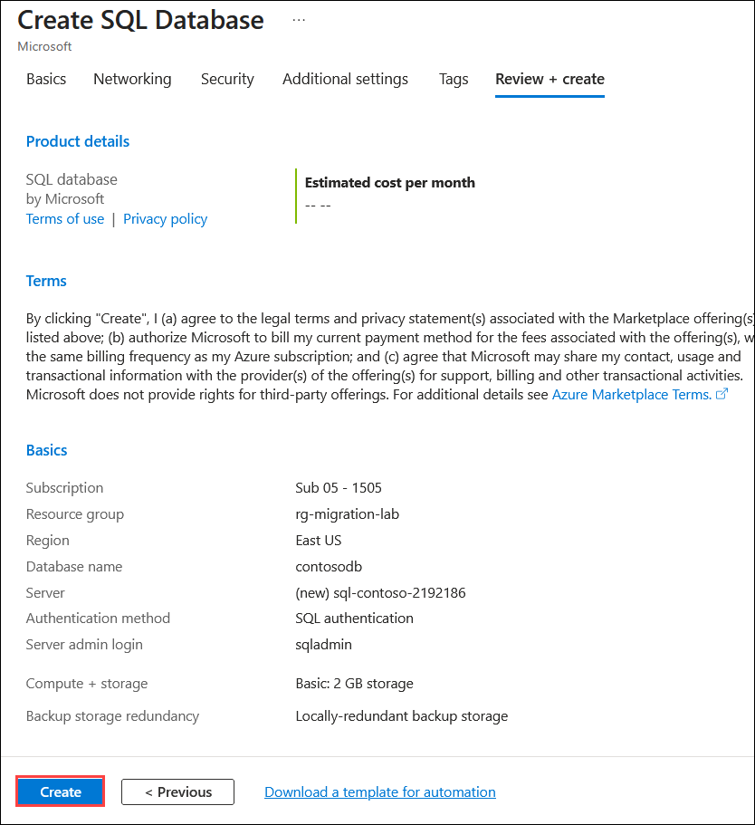

7. Wait for the deployment to complete (approximately 3 to 5 minutes) and select **Go to resource**.

**Configure the SQL Server firewall**
 
8. Navigate back to the SQL Server resource `sql-contoso-<inject key="DeploymentID" enableCopy="false"></inject>`.
 
9. In the left navigation, select **Networking (1)**.
 
10. Under **Public network access**, select **Selected networks (2)**.
 
11. Under **Firewall rules**, select **+ Add your client IPv4 address (3)** to allow access from the Azure portal session.
 
12. Under **Exceptions**, enable **Allow Azure services and resources to access this server (4)**.
 
13. Select **Save (5)**.
 
    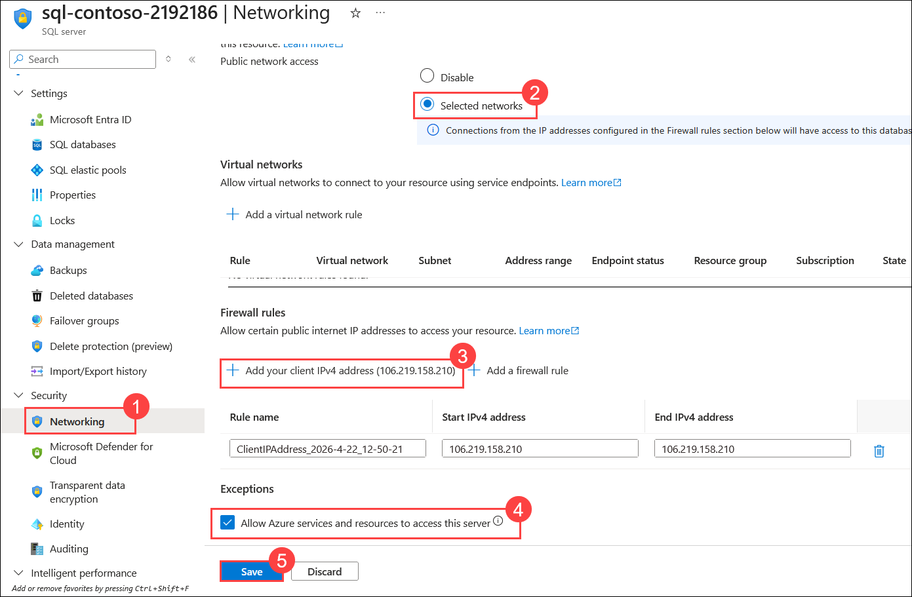
 
    > **Note**: You will also need to add the VM's public IP address. To find it: go to your VM in the portal → copy the **Public IP address** → add it as a new firewall rule in the same **Networking** page.
 
Azure SQL Database is provisioned with sample data.

**Seed the database with sample data**
 
14. In the left navigation of the `contosodb` database, select **Query editor (preview) (1)**.
 
15. Sign in using **SQL authentication (2)** and click on **Connect (5)**:
 
   - **Login**: `sqladmin` **(3)**
   - **Password**: `P@ssw0rd2026!` **(4)**

     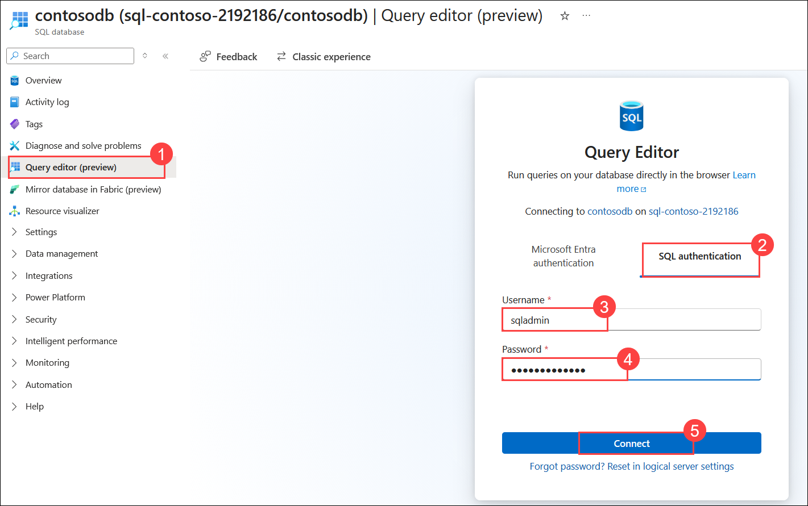

16. Click on **New query**.

17. Paste and **Run** the following SQL to create the tables and insert sample data:

      ```sql
      -- Create Products table
      CREATE TABLE Products (
         ProductId INT PRIMARY KEY IDENTITY(1,1),
         ProductName NVARCHAR(200) NOT NULL,
         Category NVARCHAR(100) NOT NULL,
         Price DECIMAL(10,2) NOT NULL,
         StockQuantity INT NOT NULL,
         CreatedAt DATETIME2 DEFAULT GETUTCDATE()
      );

      -- Create Orders table
      CREATE TABLE Orders (
         OrderId INT PRIMARY KEY IDENTITY(1,1),
         CustomerName NVARCHAR(200) NOT NULL,
         CustomerEmail NVARCHAR(200) NOT NULL,
         ProductId INT FOREIGN KEY REFERENCES Products(ProductId),
         Quantity INT NOT NULL,
         TotalAmount DECIMAL(10,2) NOT NULL,
         OrderDate DATETIME2 DEFAULT GETUTCDATE()
      );

      -- Insert sample products
      INSERT INTO Products (ProductName, Category, Price, StockQuantity) VALUES
      ('Laptop Pro 14', 'Electronics', 1499.99, 50),
      ('Wireless Mouse', 'Electronics', 39.99, 200),
      ('Office Chair', 'Furniture', 249.00, 75),
      ('Standing Desk', 'Furniture', 499.00, 30),
      ('Notebook Pack', 'Stationery', 12.50, 500),
      ('Noise Cancelling Headphones', 'Electronics', 199.00, 100),
      ('Water Bottle', 'Lifestyle', 18.00, 300),
      ('Desk Lamp', 'Furniture', 45.00, 150),
      ('USB-C Hub', 'Electronics', 69.00, 250),
      ('Backpack', 'Lifestyle', 79.99, 120);

      -- Insert sample orders
      INSERT INTO Orders (CustomerName, CustomerEmail, ProductId, Quantity, TotalAmount, OrderDate) VALUES
      ('Ava Patel', 'ava.patel@contoso.com', 1, 1, 1499.99, '2026-03-01'),
      ('Liam Nguyen', 'liam.nguyen@contoso.com', 2, 2, 79.98, '2026-03-02'),
      ('Noah Kim', 'noah.kim@contoso.com', 3, 1, 249.00, '2026-03-03'),
      ('Mia Garcia', 'mia.garcia@contoso.com', 4, 1, 499.00, '2026-03-04'),
      ('Ethan Singh', 'ethan.singh@contoso.com', 5, 10, 125.00, '2026-03-05'),
      ('Zoe Brown', 'zoe.brown@contoso.com', 6, 1, 199.00, '2026-03-06'),
      ('Lucas Lee', 'lucas.lee@contoso.com', 7, 3, 54.00, '2026-03-07'),
      ('Emma Davis', 'emma.davis@contoso.com', 8, 2, 90.00, '2026-03-08'),
      ('Ryan Martinez', 'ryan.martinez@contoso.com', 9, 1, 69.00, '2026-03-09'),
      ('Nora Wilson', 'nora.wilson@contoso.com', 10, 1, 79.99, '2026-03-10');
      ```

18. Verify the data was inserted correctly by running:

      ```sql
      SELECT COUNT(*) AS product_count FROM Products;
      SELECT COUNT(*) AS order_count FROM Orders;
      ```

      Both queries should return **10** rows.

## Task 4: Set Up and Run the Web Application Locally (On-Premises Simulation)

In this task, you will create the Contoso Retail web application on your local machine. This simulates the on-premises environment that you will migrate to Azure in Exercise 2.

1. Open a VS Code 

2. open a folder > lab files > contoso-retail-webapp > contoso-retail-webapp.

3. Open termainal 

   ```
   cd C:\LabFiles\contoso-retail-webapp\contoso-retail-webapp
   ```

4. Initialize the Node.js project:

   ```bash
   npm init -y
   ```

5. Install dependencies:

   ```bash
   npm install express ejs mssql dotenv
   ```

6. run the command 

   ```
   nmp fund
   ```

7. Run the command 

   ```
   npm audit fix --force
   ```

5. Go to `.env` file and update the **<DeploymentID>** for local testing (do not commit to source control):

   ```
   DB_SERVER=sql-contoso-<DeploymentID>.database.windows.net
   DB_NAME=contosodb
   DB_USER=sqladmin
   DB_PASSWORD=P@ssw0rd2026!
   PORT=8080
   ```

6. Test the application locally to simulate the on-premises environment:

   ```bash
   npm start
   ```

7. Open a browser and navigate to `http://localhost:8080`. Verify the following:

   | Validation | Expected Result |
   | --- | --- |
   | Home page loads | `http://localhost:8080` shows "Welcome to Contoso Retail" |
   | Products page loads | `http://localhost:8080/products` shows 10 products in a table |
   | Database connectivity | Product data (names, categories, prices) comes from Azure SQL |

   > **Important**: If the products page shows an error, verify:
   > - The `.env` file has the correct SQL Server name, database name, and credentials.
   > - Your local machine's IP address is allowed in the SQL Server firewall rules.
   > - Node.js and npm are installed on your machine (`node --version` and `npm --version`).

8. Keep the application running. You now have a web application running on your local machine at `http://localhost:8080` - this is your **on-premises environment** that will be migrated to Azure in Exercise 2.

   > **Migration Preview**: In Exercise 2, you will take this exact application and push it to Azure App Service. The app will then be accessible at `https://contoso-web-<DeploymentID>.azurewebsites.net` instead of `http://localhost:8080`.

The sample web application is running locally and ready for migration.

## Success Criteria

- Resource group `rg-migration-lab` created in the target region.
- Virtual network `vnet-migration-lab` deployed with three subnets (`snet-appservice`, `snet-private`, `snet-default`).
- `snet-appservice` subnet delegated to `Microsoft.Web/serverFarms`.
- Azure SQL Server and Database deployed with sample data (10 products, 10 orders).
- SQL Server firewall configured to allow Azure services and your local IP.
- **Sample web application running locally on `http://localhost:8080`** (on-premises simulation).
- Home page displays "Welcome to Contoso Retail" and Products page shows 10 products from the database.

## Learning Outcomes

- Provision foundational Azure infrastructure including resource groups, virtual networks, and subnets.
- Deploy and configure Azure SQL Database with firewall rules and sample data.
- Understand subnet delegation requirements for Azure App Service VNet integration.
- Prepare a sample Node.js web application for cloud migration.

## References

- Create a resource group: https://learn.microsoft.com/azure/azure-resource-manager/management/manage-resource-groups-portal
- Create a virtual network: https://learn.microsoft.com/azure/virtual-network/quick-create-portal
- Azure SQL Database quickstart: https://learn.microsoft.com/azure/azure-sql/database/single-database-create-quickstart
- App Service VNet integration: https://learn.microsoft.com/azure/app-service/overview-vnet-integration
