# Challenge 1: Migration Design (CAF)

### Estimated Duration : 60 Minutes

## Overview

In this challenge, you take on the role of a **Cloud Solutions Architect**. Your Windows Server VM - running the Contoso Retail app on `http://localhost:8080` - represents the on-premises data center. Your Azure subscription is the migration target.

Before any migration execution begins, you complete a **design phase** following the Microsoft Cloud Adoption Framework (CAF). This challenge produces three artefacts that drive all remaining challenges:

- A discovery report of the current environment
- A documented migration strategy
- A provisioned Azure Landing Zone

## Objectives

In this Exercise, you will complete the following task:

   - Task 1: Discover and Document the Existing Environment
   - Task 2: Define the Migration Strategy
   - Task 3: Provision the Azure Landing Zone
   - Task 4: Map Application Dependencies
   - Task 5: Validate Landing Zone Readiness

## Task 1: Discover and Document the Existing Environment

In this task, you run a single discovery script on the VM that captures the environment details and saves them automatically to a report file. This maps to the **Assess** phase of the CAF Migrate methodology.

All steps are run inside the **Windows Server VM** via **PowerShell (Admin)**.

1. Open **PowerShell as Administrator** on your VM.

    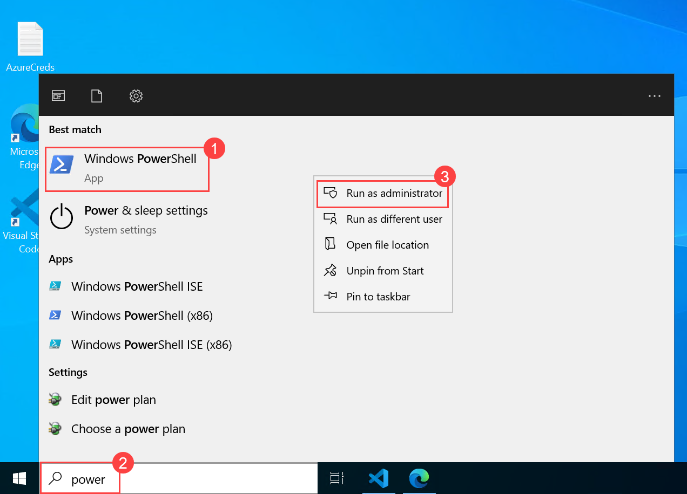

2. Run the following discovery script. It collects all environment details and saves the output automatically to `C:\LabFiles\discovery-report.txt`:

   ```powershell
   $report = @()
   $report += "CONTOSO RETAIL - ENVIRONMENT DISCOVERY REPORT"
   $report += "Generated: $(Get-Date -Format 'yyyy-MM-dd HH:mm')"
   $report += "=" * 50

   # OS and hardware
   $os  = Get-CimInstance Win32_OperatingSystem
   $cpu = Get-CimInstance Win32_Processor
   $ram = [math]::Round($os.TotalVisibleMemorySize / 1MB, 1)
   $report += "`nOS:       $($os.Caption) $($os.OSArchitecture)"
   $report += "Version:  $($os.Version)"
   $report += "CPU:      $($cpu.Name) ($($cpu.NumberOfCores) cores)"
   $report += "RAM:      $ram GB"

   # Disk
   $disk  = Get-CimInstance Win32_LogicalDisk -Filter "DriveType=3" | Select-Object -First 1
   $used  = [math]::Round(($disk.Size - $disk.FreeSpace) / 1GB, 1)
   $total = [math]::Round($disk.Size / 1GB, 1)
   $report += "Disk C:   $used GB used / $total GB total"

   # Runtime
   $report += "`nNode.js:  $(node --version)"
   $report += "npm:      $(npm --version)"

   # App dependencies
   $report += "`nAPPLICATION DEPENDENCIES"
   $report += "-" * 30
   Set-Location "C:\LabFiles\contoso-retail-webapp\contoso-retail-webapp"
   $report += (npm list --depth=0 2>$null)

   # Listening port
   $report += "`nLISTENING ON PORT 8080"
   $report += "-" * 30
   $report += (netstat -ano | findstr :8080)

   # .env contents
   $report += "`nENVIRONMENT CONFIGURATION (.env)"
   $report += "-" * 30
   $report += (Get-Content "C:\LabFiles\contoso-retail-webapp\contoso-retail-webapp\.env")

   # Save and display
   New-Item -ItemType Directory -Path "C:\LabFiles" -Force | Out-Null
   $report | Out-File -FilePath "C:\LabFiles\contoso-retail-webapp\discovery-report.txt" -Encoding utf8

   Write-Host "Discovery complete. Report saved to C:\LabFiles\contoso-retail-webapp\contoso-retail-webapp\discovery-report.txt" -ForegroundColor Green
   $report
   ```

3. Verify the report was created:

   ```powershell
   Get-Item "C:\LabFiles\contoso-retail-webapp\discovery-report.txt"
   ```

   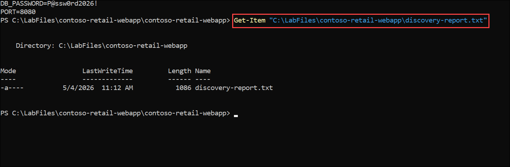

   > **Note**: In a production migration, this step would use **Azure Migrate** or **Service Map** with agents deployed across all on-premises servers to generate discovery data automatically at scale.

The environment is documented and the report is saved.

## Task 2: Define the Migration Strategy

In this task, you select the migration strategy using the **CAF 7 Rs** framework and save your decision as a formal strategy document.

**The 7 Rs of Migration - quick reference**

| Strategy | Description | Best Used When |
| --- | --- | --- |
| **Rehost** (Lift & Shift) | Move as-is to IaaS VMs | Speed is priority, minimal change |
| **Replatform** | Minor changes to use PaaS | App Service, Managed DB, no code rewrite |
| **Refactor** | Code redesign for cloud-native | Microservices, containers, event-driven |
| **Rebuild** | Rewrite from scratch | Legacy or end-of-life apps |
| **Replace** | Swap with SaaS product | Commodity workloads - email, HR, CRM |
| **Retire** | Decommission entirely | Unused or redundant apps |
| **Retain** | Keep on-premises intentionally | Compliance or dependency blockers |

**Strategy selected for Contoso Retail**

| Phase | Strategy | Target | Rationale |
| --- | --- | --- | --- |
| **Phase 1** - Challenge 2 | Rehost | Azure App Service | No code changes; Node.js runs natively; fastest path |
| **Phase 2** - Challenges 3 & 4 | Replatform | App Service + Key Vault + Managed Identity | Remove hardcoded credentials; private networking; Azure-native security |

> **Why App Service and not a VM?** Contoso Retail is a stateless Node.js app with no OS-level dependencies. App Service provides built-in TLS, auto-scaling, deployment slots, and zero infrastructure management - at lower cost than an IaaS VM.

1. Run the following to create and save the strategy document:

   ```powershell
   @"
   MIGRATION STRATEGY RECORD
   ==========================
   Application : Contoso Retail Web App
   Date        : $(Get-Date -Format 'yyyy-MM-dd')

   Selected Strategy : Rehost -> Replatform (PaaS-first)
   Target Service    : Azure App Service (Standard S1)
   Migration Method  : Azure CLI zip deploy

   Phase 1 - Challenge 2:
     - Deploy app to Azure App Service
     - Move .env values to App Service Application Settings
     - Enforce HTTPS-only
     - Validate at azurewebsites.net URL

   Phase 2 - Challenges 3 and 4:
     - VNet Integration for private SQL connectivity
     - Credentials moved to Azure Key Vault
     - Managed Identity for SQL authentication
     - Backup, DR, and regional failover
     - Azure Policy and RBAC governance

   Risks:
     - SQL firewall rules must be updated post-migration
     - .env file must NOT be included in the deployment zip
     - Port changes from 8080 (VM) to 443 (App Service HTTPS)

   Decision: APPROVED FOR EXECUTION
   "@ | Out-File -FilePath "C:\LabFiles\contoso-retail-webapp\migration-strategy.txt" -Encoding utf8

   Write-Host "Strategy saved to C:\LabFiles\contoso-retail-webapp\migration-strategy.txt" -ForegroundColor Green
   ```

    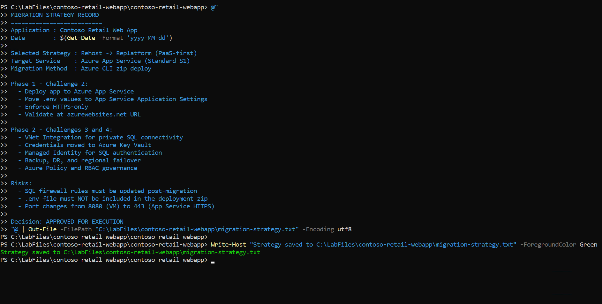

The migration strategy is defined and saved.

---

## Task 3: Provision the Azure Landing Zone

In this task, you will sign in to Azure CLI and set required environment variables to prepare the deployment environment.

An **Azure Landing Zone** is the target environment prepared to receive the migrated workload - the resource groups, networking, and guardrails that must exist before any application is deployed.

**Target architecture**

```
Azure Subscription
|
+-- rg-migration-lab                   (Created in Exercise 0)
|   +-- vnet-migration-lab             10.0.0.0/16
|   |   +-- snet-appservice            10.0.1.0/24  [Delegated: Microsoft.Web/serverFarms]
|   |   +-- snet-private               10.0.2.0/24  [Private endpoints]
|   |   +-- snet-default               10.0.0.0/24  [General purpose]
|   +-- nsg-contoso-app                <-- created in this task
|   +-- sql-contoso-<DeploymentID>
|       +-- contosodb
|
+-- rg-migration-lab-app               <-- created in this task
    +-- law-contoso-<DeploymentID>     <-- added in Challenge 2
    +-- ai-contoso-<DeploymentID>      <-- added in Challenge 2
    +-- asp-contoso-<DeploymentID>     <-- added in Challenge 2
    +-- app-contoso-<DeploymentID>     <-- added in Challenge 2
```

All steps use **Azure CLI from PowerShell on the VM**.

1. Sign in to Azure CLI on the VM:

   ```powershell
   az login
   ```

    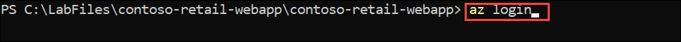

   A browser window opens inside the VM. Sign in with your Azure credentials.

   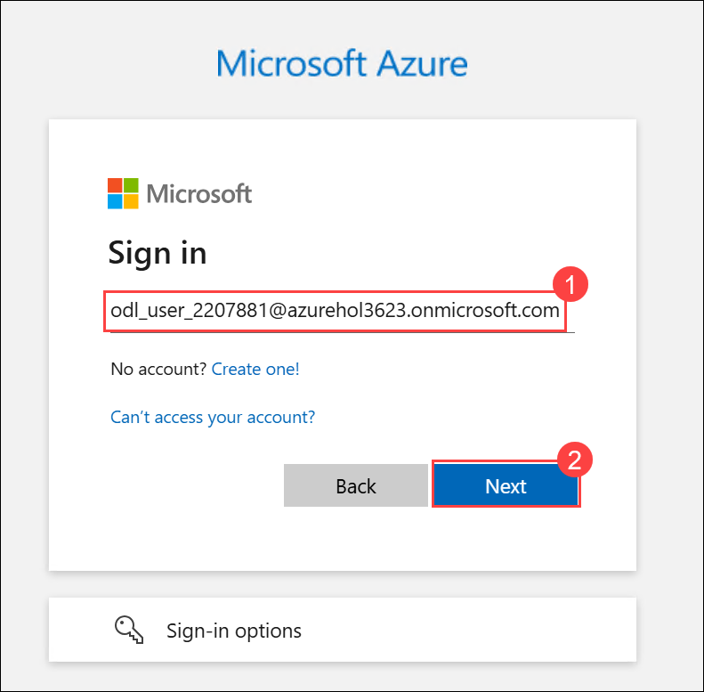

   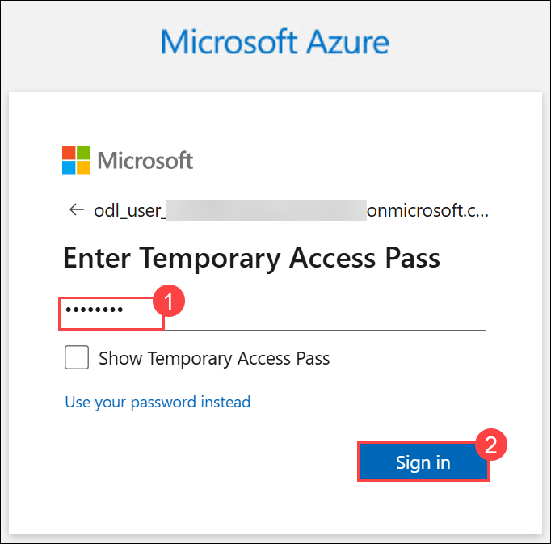

2. Set environment variables. Replace `<DeploymentID>` with your lab deployment ID. **Keep this PowerShell window open** - these variables are reused in all subsequent challenges:

   ```powershell
   $DEPLOYMENT_ID = "<DeploymentID>"
   $LOCATION      = "<inject key="Region" enableCopy="false"></inject>"
   $RG_CORE       = "rg-migration-lab"
   $RG_APP        = "rg-migration-lab-app"
   $VNET_NAME     = "vnet-migration-lab"
   $NSG_NAME      = "nsg-contoso-app"
   $APP_NAME      = "app-contoso-$DEPLOYMENT_ID"
   $APP_PLAN_NAME = "asp-contoso-$DEPLOYMENT_ID"
   $SQL_SERVER    = "sql-contoso-$DEPLOYMENT_ID"
   $LAW_NAME      = "law-contoso-$DEPLOYMENT_ID"
   $AI_NAME       = "ai-contoso-$DEPLOYMENT_ID"

   Write-Host "Variables set. App name: $APP_NAME" -ForegroundColor Green
   ```

    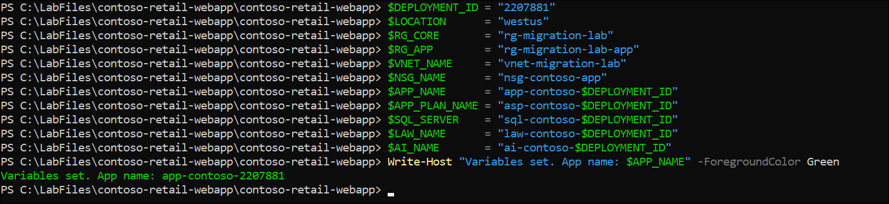

   > **Important**: These variables exist only for the current PowerShell session. If you close this window at any point, re-run this step before continuing.

3. Create the application resource group:

   ```powershell
   az group create `
     --name $RG_APP `
     --location $LOCATION `
     --tags Environment=Lab Project=ContosoMigration
   ```

    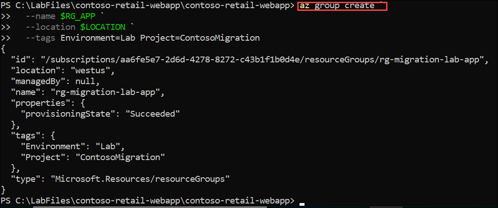

4. Verify both resource groups exist:

   ```powershell
   az group list `
     --query "[?contains(name,'migration-lab')]" `
     --output table
   ```

   You should see `rg-migration-lab` and `rg-migration-lab-app` both listed as `Succeeded`.

   

5. Verify the VNet and subnets from Exercise 0 are in place:

   ```powershell
   az network vnet subnet list `
     --resource-group $RG_CORE `
     --vnet-name $VNET_NAME `
     --output table
   ```

   Confirm all three subnets - `snet-appservice`, `snet-private`, `snet-default` - are listed.

   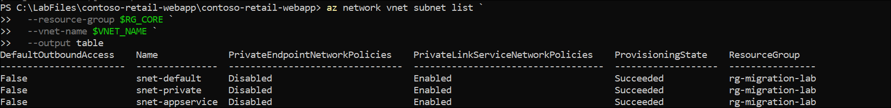

6. Create the Network Security Group:

   ```powershell
   az network nsg create `
     --resource-group $RG_CORE `
     --name $NSG_NAME `
     --location $LOCATION `
     --tags Environment=Lab Project=ContosoMigration
   ```

    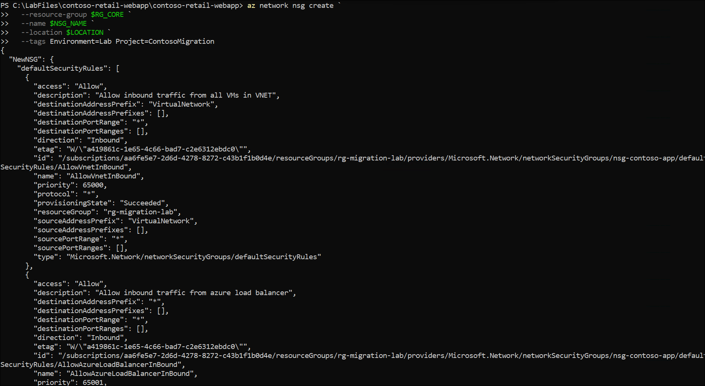

7. Add an inbound rule for HTTPS (port 443):

   ```powershell
   az network nsg rule create `
     --resource-group $RG_CORE `
     --nsg-name $NSG_NAME `
     --name "Allow-HTTPS-Inbound" `
     --protocol Tcp `
     --direction Inbound `
     --priority 100 `
     --source-address-prefix Internet `
     --source-port-range "*" `
     --destination-address-prefix "*" `
     --destination-port-range 443 `
     --access Allow
   ```

    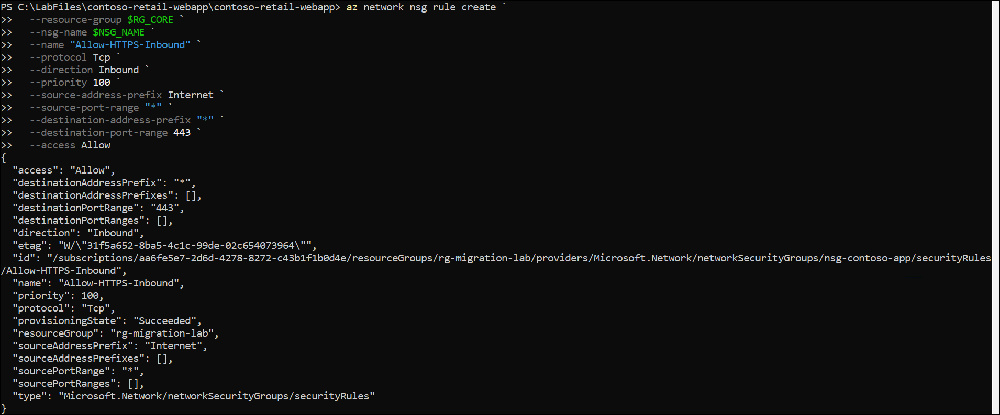

8. Add an inbound rule for HTTP (port 80) for redirect purposes:

   ```powershell
   az network nsg rule create `
     --resource-group $RG_CORE `
     --nsg-name $NSG_NAME `
     --name "Allow-HTTP-Inbound" `
     --protocol Tcp `
     --direction Inbound `
     --priority 110 `
     --source-address-prefix Internet `
     --source-port-range "*" `
     --destination-address-prefix "*" `
     --destination-port-range 80 `
     --access Allow
   ```

    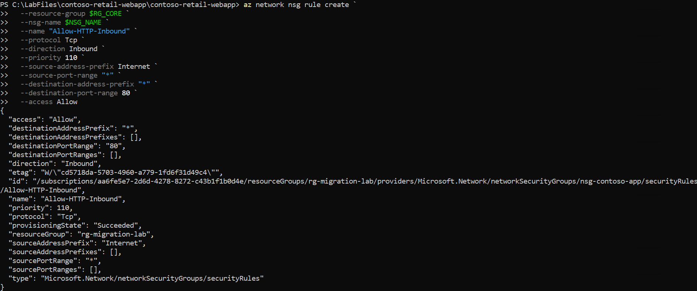

9. Associate the NSG with the `snet-appservice` subnet:

   ```powershell
   az network vnet subnet update `
     --resource-group $RG_CORE `
     --vnet-name $VNET_NAME `
     --name snet-appservice `
     --network-security-group $NSG_NAME
   ```

    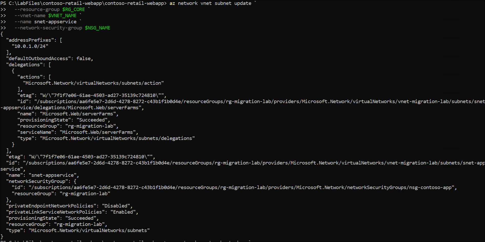

10. Confirm the association:

    ```powershell
    az network vnet subnet show `
      --resource-group $RG_CORE `
      --vnet-name $VNET_NAME `
      --name snet-appservice `
      --query "networkSecurityGroup.id" `
      --output tsv
    ```

     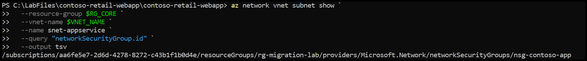

    The output should end with `/networkSecurityGroups/nsg-contoso-app`.

    

The Landing Zone is provisioned.

## Task 4: Map Application Dependencies

In this task, you produce a **Dependency Map** for Contoso Retail and save the App Service settings needed in Challenge 2.

**Dependency map**

| Dependency | Current (VM) | Azure Target | Action |
| --- | --- | --- | --- |
| **Runtime** | Node.js on Windows Server | App Service Node.js stack | Set runtime version in App Service |
| **Packages** | express, ejs, mssql, dotenv | Bundled in deployment zip | `npm install` runs on deploy |
| **Database** | Azure SQL `contosodb` | Same - no DB migration needed | Update connection string in App Settings |
| **DB Auth** | SQL login in `.env` file | App Settings - Key Vault (Phase 2) | Remove `.env` from deployment zip |
| **Config** | `.env` at `C:\apps\contoso-retail\.env` | App Service Application Settings | Re-create all variables as App Settings |
| **Port** | HTTP 8080, no TLS | HTTPS 443, Azure-managed cert | Enable HTTPS-only in App Service |
| **URL** | `http://localhost:8080` | `https://app-contoso-<ID>.azurewebsites.net` | No hardcoded localhost references in code |
| **Monitoring** | None | Application Insights (Challenge 2) | Add connection string in App Settings |
| **Secrets** | Plaintext `.env` on disk | Azure Key Vault (Challenge 4) | Never include `.env` in deployment zip |

1. Test SQL connectivity from the VM to confirm the database is reachable:

   ```powershell
   Test-NetConnection `
     -ComputerName "$SQL_SERVER.database.windows.net" `
     -Port 1433
   ```

    

   Confirm `TcpTestSucceeded : True`.

   > **If False**: In the Azure portal, go to the SQL Server - **Networking** - add the VM's public IP under **Firewall rules** - **Save**.

2. Save the App Service Application Settings to the strategy document for use in Challenge 2:

   ```powershell
   @"

   APP SERVICE APPLICATION SETTINGS (needed in Challenge 2)
   =========================================================
   DB_SERVER   = $SQL_SERVER.database.windows.net
   DB_NAME     = contosodb
   DB_USER     = sqladmin
   DB_PASSWORD = P@ssw0rd2026!
   PORT        = 8080
   "@ | Add-Content -Path "C:\LabFiles\contoso-retail-webapp\migration-strategy.txt"

   Write-Host "Settings saved to C:\LabFiles\contoso-retail-webapp\migration-strategy.txt" -ForegroundColor Green
   ```

The dependency map is complete and Challenge 2 inputs are saved.

---

## Task 5: Validate Landing Zone Readiness

Before moving to Challenge 2, run the readiness check to confirm all components are correctly in place.

1. Run the validation script:

   ```powershell
   Write-Host "=== LANDING ZONE READINESS CHECK ===" -ForegroundColor Cyan

   Write-Host "`n-- Resource Groups --" -ForegroundColor Yellow
   az group list `
     --query "[?contains(name,'migration-lab')]" `
     --output table

   Write-Host "`n-- VNet Subnets --" -ForegroundColor Yellow
   az network vnet subnet list `
     --resource-group $RG_CORE `
     --vnet-name $VNET_NAME `
     --output table

   Write-Host "`n-- NSG Rules --" -ForegroundColor Yellow
   az network nsg rule list `
     --resource-group $RG_CORE `
     --nsg-name $NSG_NAME `
     --output table

   Write-Host "`n-- NSG on snet-appservice --" -ForegroundColor Yellow
   az network vnet subnet show `
     --resource-group $RG_CORE `
     --vnet-name $VNET_NAME `
     --name snet-appservice `
     --query "{Subnet:name, NSG:networkSecurityGroup.id}" `
     --output table

   Write-Host "`n=== CHECK COMPLETE ===" -ForegroundColor Green
   ```

2. Confirm every item below matches your output before proceeding:

   | Resource | Expected Result |
   | --- | --- |
   | `rg-migration-lab` | `Succeeded` |
   | `rg-migration-lab-app` | `Succeeded` |
   | `snet-appservice`, `snet-private`, `snet-default` | All three listed |
   | `snet-appservice` delegation | `Microsoft.Web/serverFarms` |
   | NSG rules | `Allow-HTTPS-Inbound` and `Allow-HTTP-Inbound` both listed |
   | NSG on `snet-appservice` | Ends with `/nsg-contoso-app` |

3. Verify the strategy document is complete:

   ```powershell
   Get-Content "C:\LabFiles\contoso-retail-webapp\migration-strategy.txt"
   ```

   Confirm the file contains the migration strategy and the App Service Application Settings block.

   

The Landing Zone is validated and ready for Challenge 2.

## Summary

In this exercise you will discover and document the existing Contoso Retail environment, define a migration strategy using the Microsoft Cloud Adoption Framework (CAF), and provision a secure Azure Landing Zone for migration readiness. You will configure Azure networking resources, validate SQL connectivity, map application dependencies, and prepare App Service configuration settings required for the migration process. Finally, you will validate the Landing Zone readiness by reviewing resource groups, subnets, NSG rules, and migration strategy outputs to ensure the environment is ready for the next migration challenge.

Now, click on **Next** from the lower right corner to move on to the next page.

   
