# Challenge 3: Hybrid & Disaster Recovery

## Overview

In this challenge, you extend the migration with **hybrid connectivity** and **disaster recovery** capabilities. The Windows Server VM — still running the original on-premises application — will be connected to Azure using **Azure Arc**, making it a managed hybrid resource. You will then build a full DR strategy for the migrated App Service workload including backup and regional failover.

By the end of this challenge, you will have:

- The Windows Server VM onboarded as an Azure Arc-enabled server
- A backup policy configured for the App Service application
- A Traffic Manager profile routing traffic across two regions for failover
- Validated failover readiness for the web workload

> **Note**: This challenge uses a mix of the **Azure portal** and **Azure CLI on the VM**. Each task clearly states which method to use.

**Estimated Duration**: 75 minutes

**Prerequisites**:
- Challenge 2 completed — App Service running at `https://app-contoso-<DeploymentID>.azurewebsites.net`
- PowerShell session variables still set (`$APP_NAME`, `$RG_APP`, `$RG_CORE`, etc.)
- VM connected via RDP

> **If you opened a new PowerShell window**, re-run the variables block from Challenge 1, Task 3, Step 2 before continuing.

---

## Task 1: Connect the VM to Azure Arc

**Azure Arc** extends Azure management to resources outside Azure — including on-premises servers, VMs in other clouds, and edge devices. In this task, you onboard the Windows Server VM as an **Arc-enabled server**, making it visible and manageable from the Azure portal just like a native Azure resource.

This simulates the hybrid connectivity step in a real migration where some on-premises servers remain after the application migrates to Azure.

All steps in this task are performed in the **Azure portal** and then on the **Windows Server VM**.

1. In the **Azure portal**, type **Azure Arc (1)** in the search bar and select **Azure Arc (2)** under Services.

   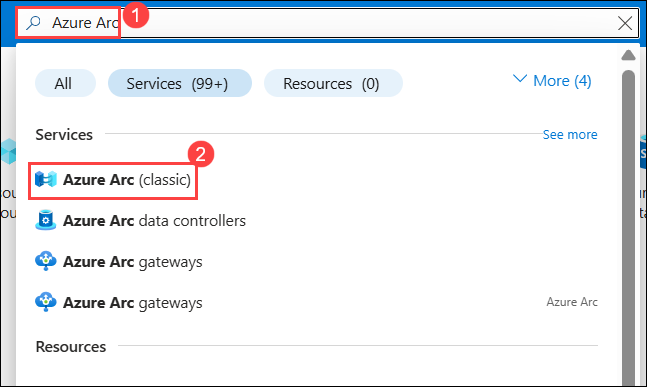

2. In the Azure Arc overview page, select **Infrastructure (1)** → **Machines (2)** from the left navigation. Select **+ Onboard/Create (3)** → **Onboard existing machines (4)**.

   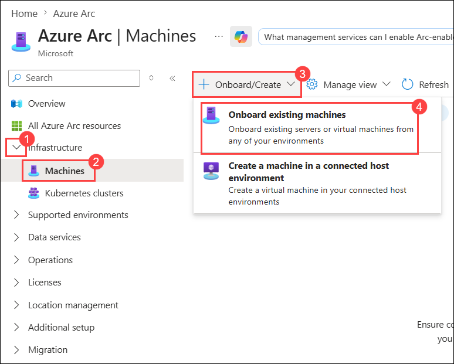

4. On the **Add servers with Azure Arc** page, under **Add a single server**, select **Generate script**.

   

5. On the **Prerequisites** tab, review the requirements and select **Next**.

6. On the **Resource details** tab, fill in the following and select **Next**:

   - **Subscription**: select your Azure subscription **(1)**
   - **Resource group**: `rg-migration-lab` **(2)**
   - **Region**: <inject key="Region" enableCopy="false"></inject> **(3)**
   - **Operating system**: **Windows** **(4)**
   - **Connectivity method**: **Public endpoint** **(5)**

      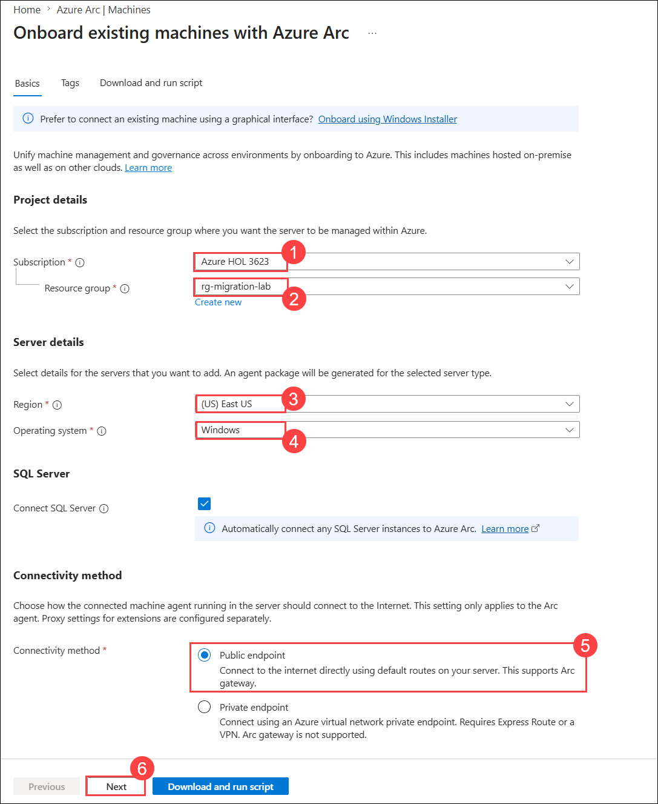

7. On the **Tags** tab, add the following tag and select **Next**:

   - **Name**: `Project` — **Value**: `ContosoMigration`

      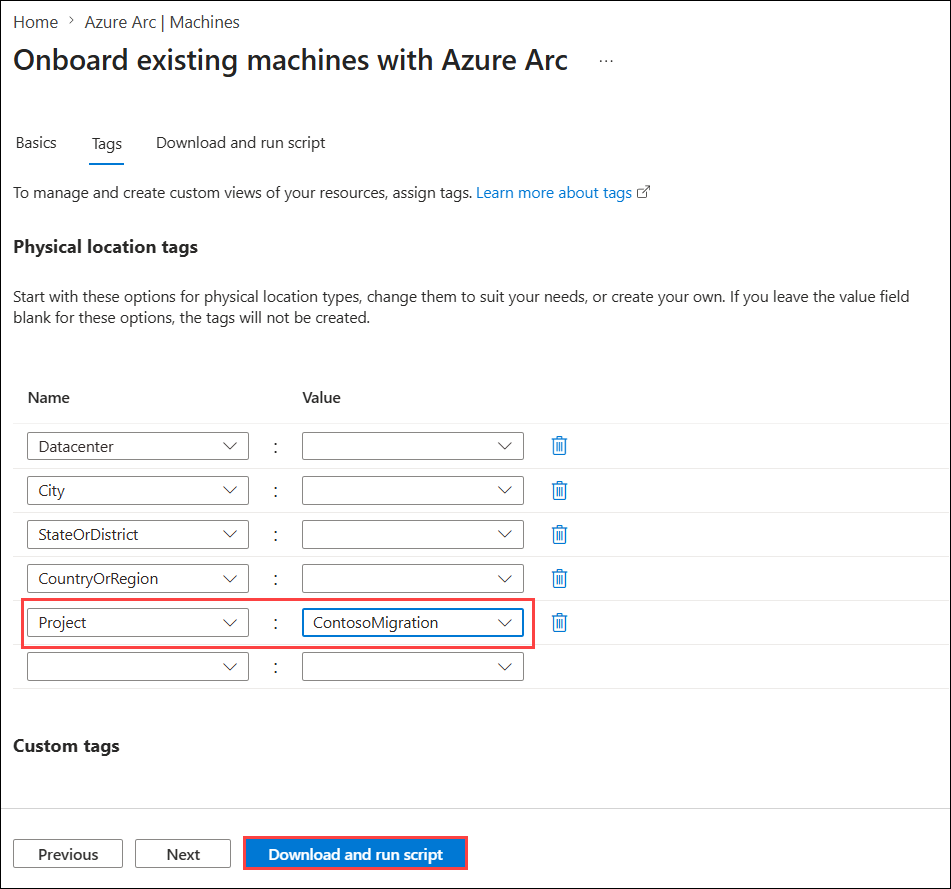

8. On the **Download and run script** tab, select **Download** to download the onboarding script (`OnboardingScript.ps1`).

   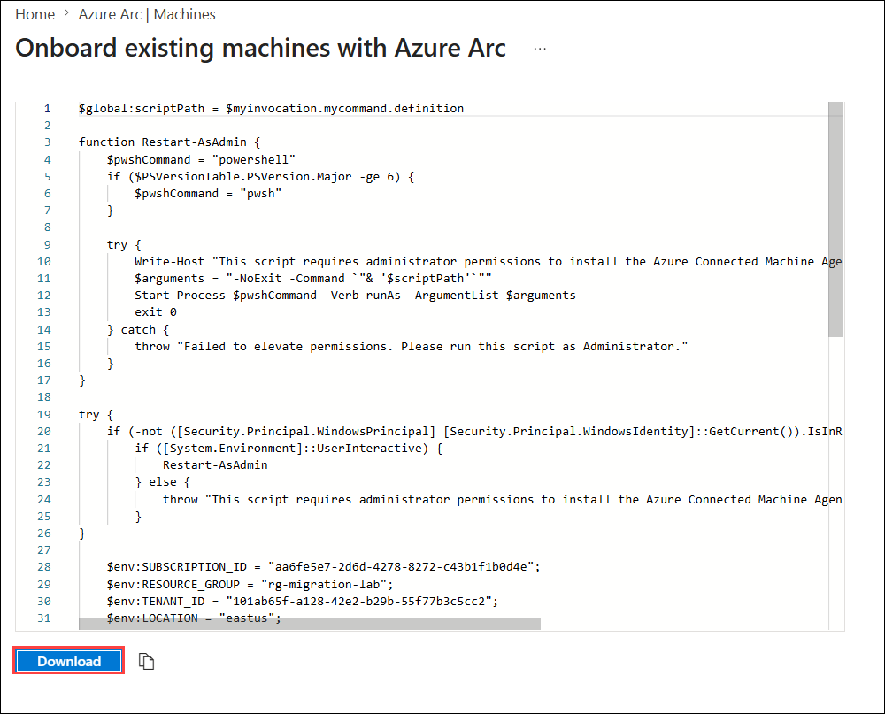

9. Copy the downloaded script file to your Windows Server VM. You can do this by:
   - Dragging and dropping the file into the RDP session window, or
   - Saving it to a network share or Azure Blob Storage and downloading it from the VM

1. Run the below command in Powershell.

   ```
   [System.Environment]::SetEnvironmentVariable("MSFT_ARC_TEST",'true', [System.EnvironmentVariableTarget]::Machine)
   ```

    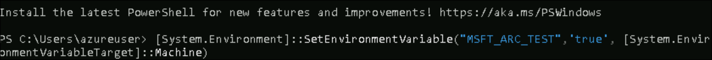

1. Run the below command in Powershell.

   ```
   Set-Service WindowsAzureGuestAgent -StartupType Disabled -Verbose
   Stop-Service WindowsAzureGuestAgent -Force -Verbose
   ```

    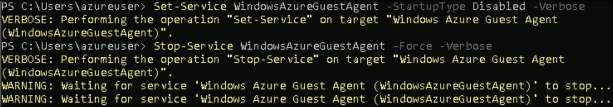

1. Run the below command in Powershell.


   ```
   New-NetFirewallRule -Name BlockAzureIMDS -DisplayName "Block access to Azure IMDS" -Enabled True -Profile Any -Direction Outbound -Action Block -RemoteAddress 169.254.169.254
   ```

    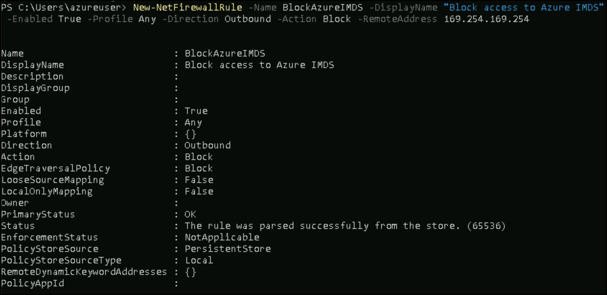


10. On the **Windows Server VM**, open **PowerShell as Administrator** and run the onboarding script:

    ```powershell
    Set-ExecutionPolicy -ExecutionPolicy Bypass -Scope Process -Force
    .\OnboardingScript.ps1
    ```

    > **Note**: The script installs the **Azure Connected Machine Agent** on the VM, registers it with Azure Arc, and establishes the management connection. This takes approximately 2–3 minutes.

11. When prompted, sign in with your Azure credentials in the browser window that opens.

12. Wait for the script to complete. You should see:

    ```
    Successfully onboarded machine to Azure Arc
    ```


13. Back in the **Azure portal**, navigate to **Azure Arc** → **Infrastructure** → **Machines**. Confirm your VM appears in the list with a **Connected** status.

    > **Note**: It may take 1–2 minutes for the VM to appear. Refresh the page if it does not show immediately.

14. Select the VM from the list and review the Arc-enabled server overview. Notice that you can now see the VM's **OS**, **CPU**, **memory**, and apply **Azure policies** and **extensions** to it — all from the Azure portal.

    

The Windows Server VM is now an Azure Arc-enabled server.

---

## Task 2: Configure Backup for the App Service

In this task, you configure an **Azure Backup** policy for the App Service to protect the migrated application. This ensures the application can be restored to a known good state in the event of accidental deletion, misconfiguration, or data corruption.

All steps are performed in the **Azure portal**.

> **Note**: App Service backup requires **Standard tier or higher**. Your App Service Plan is already at Standard S1 from Challenge 2.

**Create a Storage Account for backups**

1. In the **Azure portal**, type **Storage accounts (1)** in the search bar and select **Storage accounts (2)**.

    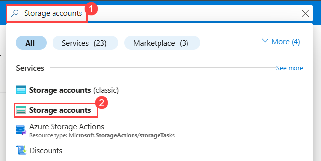

2. Select **+ Create**.

    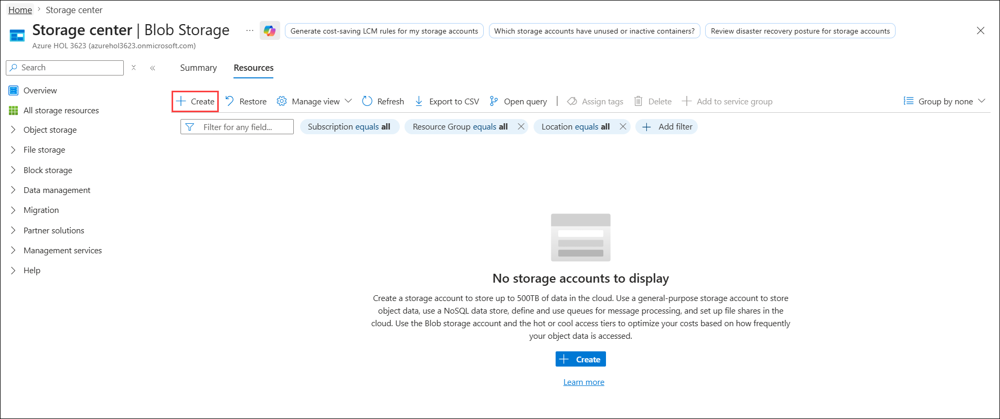

3. On the **Basics** tab, fill in the following and select **Review + create**:

   - **Subscription**: select your Azure subscription **(1)**
   - **Resource group**: `rg-migration-lab-app` **(2)**
   - **Storage account name**: `stcontoso<inject key="DeploymentID" enableCopy="false"></inject>` **(3)**
   - **Region**: <inject key="Region" enableCopy="false"></inject> **(4)**
   - **Performance**: **Standard** **(5)**
   - **Redundancy**: **Locally-redundant storage (LRS)** **(6)**

     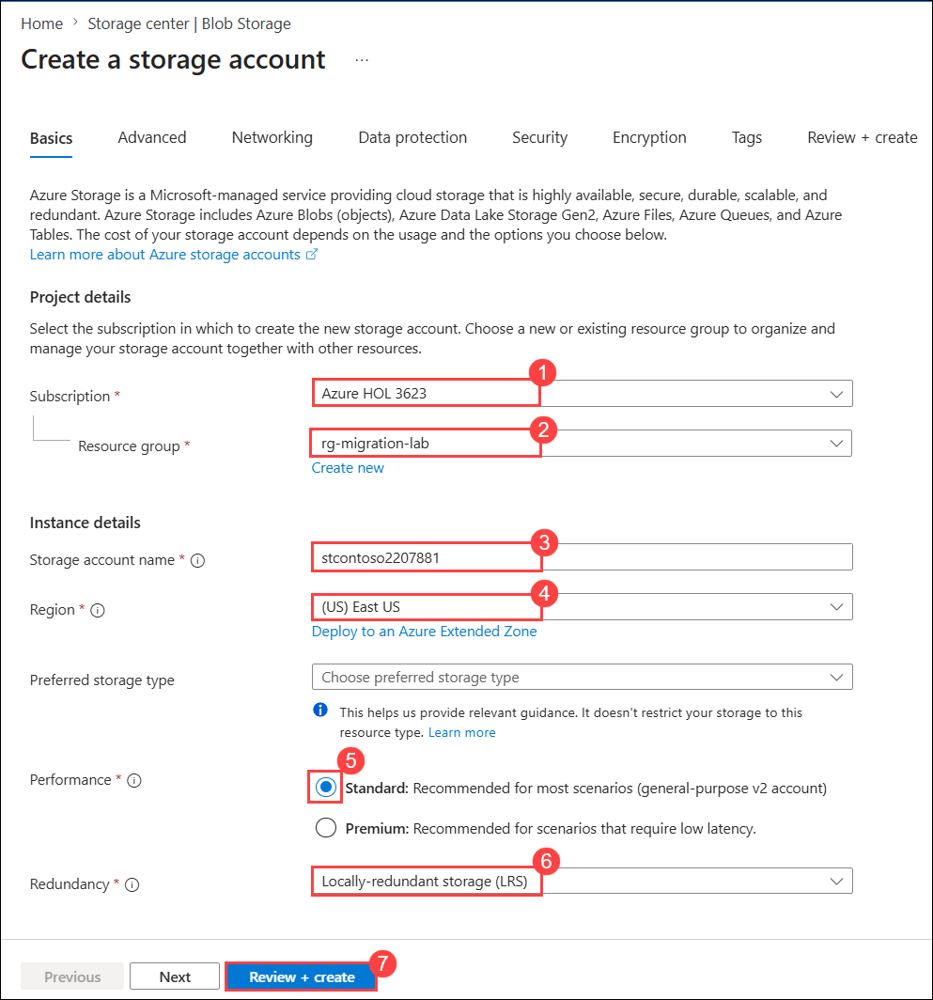

4. Select **Create** and wait for deployment to complete. Then select **Go to resource**.

    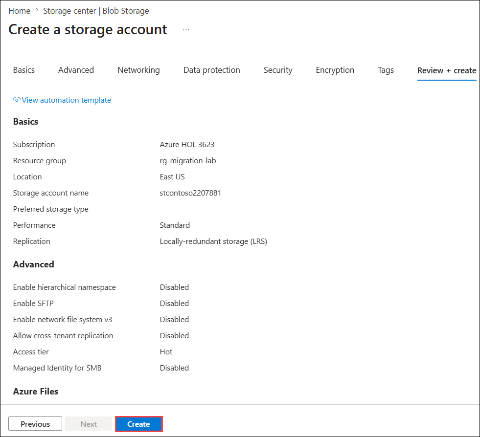

**Create a Blob Container for backup files**

5. In the storage account left navigation, select **Data storage** → **Containers**.

    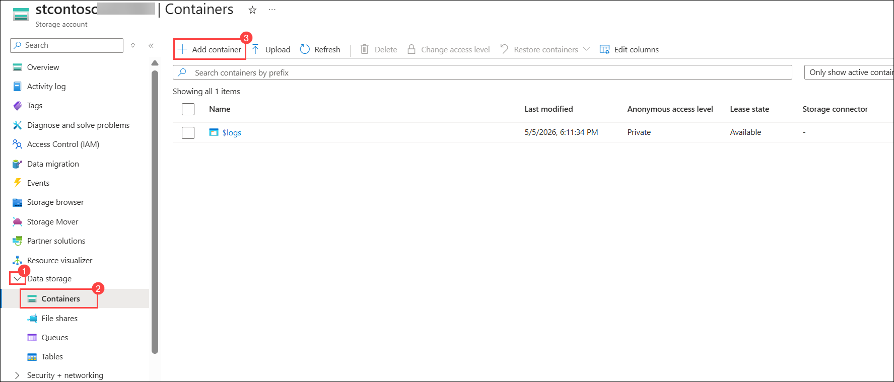

6. Select **+ Container**, enter the name `appbackups`, set **Anonymous access level** to **Private**, and select **Create**.

   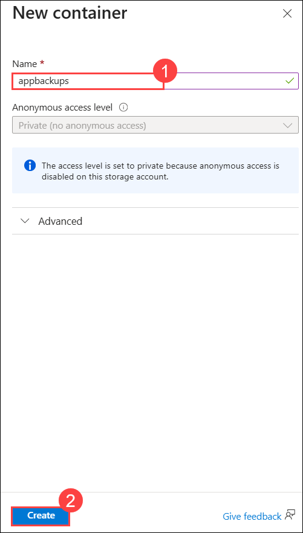

**Configure App Service Backup**

7. In the **Azure portal**, navigate to your App Service `app-contoso-<inject key="DeploymentID" enableCopy="false"></inject>`.

8. In the left navigation, select **Settings** → **Backups**. Select **Configure custom backups**.

   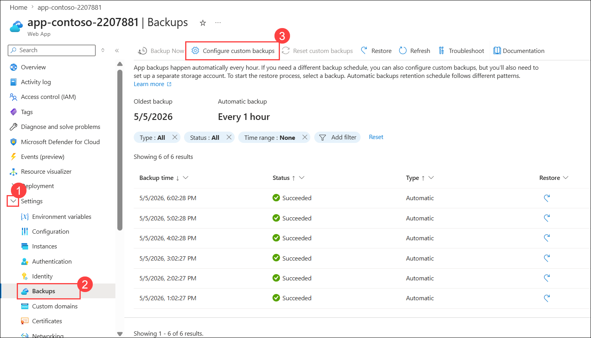

10. Under **Storage**, select **Select storage** and choose the storage account `stcontoso<inject key="DeploymentID" enableCopy="false"></inject>` and container `appbackups` you created above.

    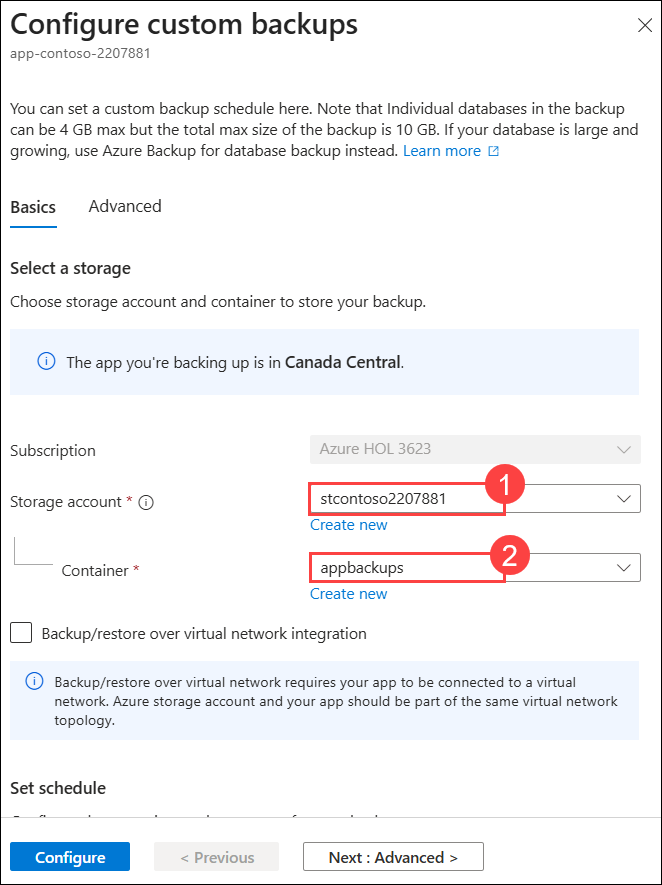

11. Configure the backup  set schedule:

    - **Backup every**: **1** day **(1)**
    - **Retention**: **7** days **(2)**
    - **Keep at least one backup**: **On** **(3)**

      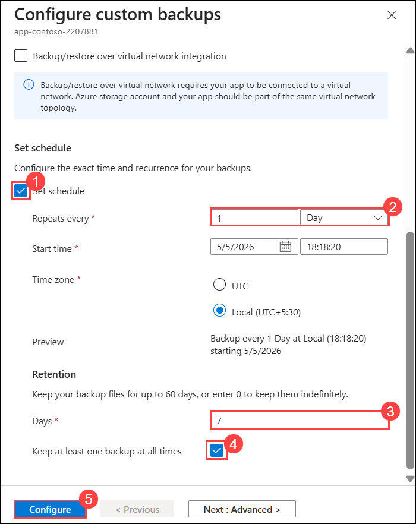

12. Select **Save**.

13. To take an immediate backup to verify the configuration, select **Backup Now**.


14. Wait approximately 1–2 minutes, then refresh the page. Confirm a backup entry appears with status **Succeeded**.


App Service backup is configured and a verified backup exists.

---

## Task 3: Implement Regional Failover with Traffic Manager

In this task, you implement a **regional failover strategy** using **Azure Traffic Manager**. Traffic Manager is a DNS-based load balancer that distributes traffic across multiple Azure regions. If the primary App Service becomes unavailable, Traffic Manager automatically routes users to the secondary region.

**Architecture for this task:**

```
Users
  |
  v
Traffic Manager Profile (contoso-tm-<DeploymentID>)
  |
  +-- Primary Endpoint    --> app-contoso-<DeploymentID>       (East US)
  +-- Secondary Endpoint  --> app-contoso-dr-<DeploymentID>    (West US) [created below]
```

**Create a secondary App Service for DR**

First, you need a secondary App Service in a different region to act as the failover target.

All steps use **Azure CLI from PowerShell on the VM**.

1. Open **PowerShell as Administrator** on the VM and set the DR region variable:

   ```powershell
   $DEPLOYMENT_ID  = Your DID
   $LOCATION_DR    = "westcentralus"
   $RG_DR          = "rg-migration-lab-dr"
   $APP_PLAN_DR    = "asp-contoso-dr-$DEPLOYMENT_ID"
   $APP_NAME_DR    = "app-contoso-dr-$DEPLOYMENT_ID"
   ```

    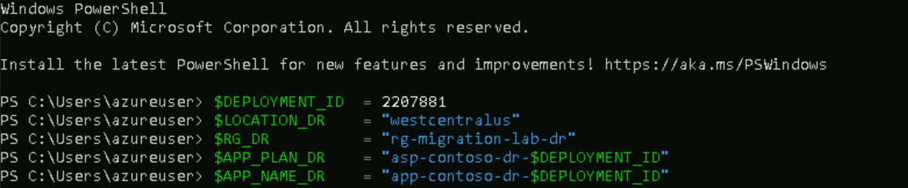

2. Create the DR resource group:

   ```powershell
   az group create `
     --name $RG_DR `
     --location $LOCATION_DR `
     --tags Environment=Lab Project=ContosoMigration Purpose=DisasterRecovery
   ```

    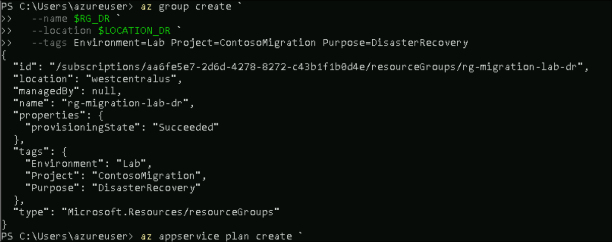

3. Create the DR App Service Plan:

   ```powershell
   az appservice plan create `
     --name $APP_PLAN_DR `
     --resource-group $RG_DR `
     --location $LOCATION_DR `
     --sku S1 `
     --is-linux
   ```

    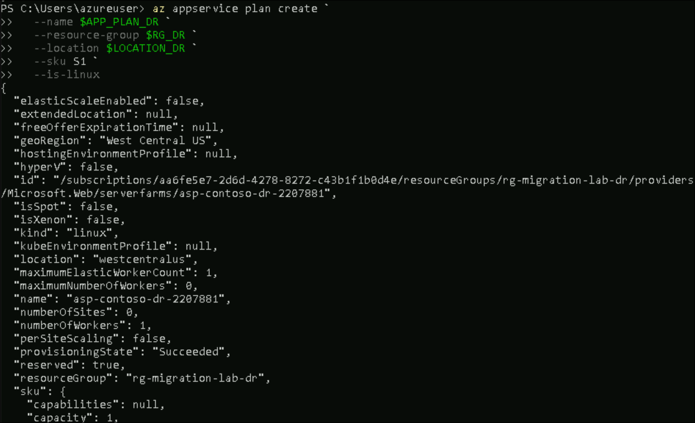

4. Create the DR App Service with the same runtime:

   ```powershell
   az webapp create `
     --name $APP_NAME_DR `
     --resource-group $RG_DR `
     --plan $APP_PLAN_DR `
     --runtime "NODE:22-lts"
   ```

    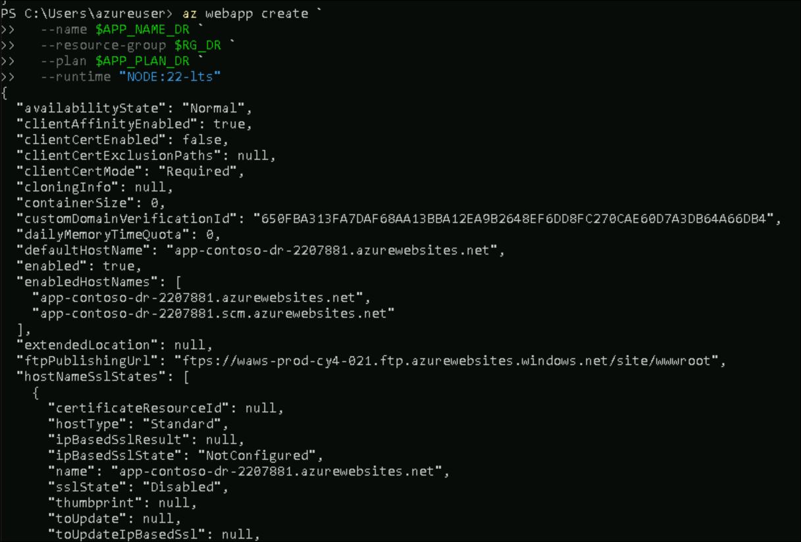

5. Copy the same application settings to the DR App Service:

   ```powershell
   az webapp config appsettings set `
     --name $APP_NAME_DR `
     --resource-group $RG_DR `
     --settings `
       DB_SERVER="$SQL_SERVER.database.windows.net" `
       DB_NAME="contosodb" `
       DB_USER="sqladmin" `
       DB_PASSWORD="P@ssw0rd2026!" `
       PORT="8080" `
       APPINSIGHTS_INSTRUMENTATIONKEY="$AI_KEY" `
       WEBSITE_NODE_DEFAULT_VERSION="~22"
   ```

    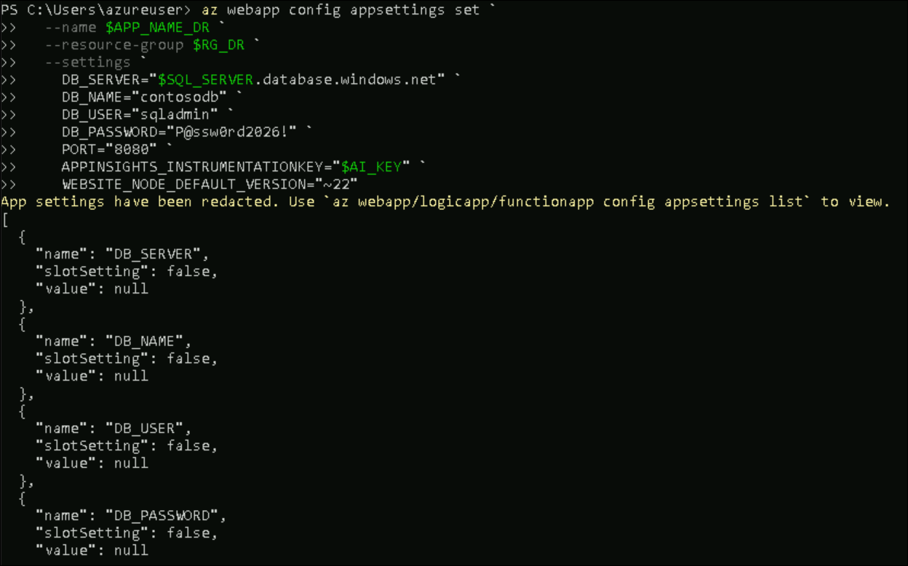

1. Navigate to your VS Code and right click on the **Contoso-retail** and deploy to azure and select the newely created web app.

   Open the DR URL in a browser and confirm the products page loads correctly.

   

**Create the Traffic Manager Profile**

The remaining steps are performed in the **Azure portal**.

10. In the **Azure portal**, type **Traffic Manager profiles (1)** in the search bar and select **Traffic Manager profiles (2)**.

    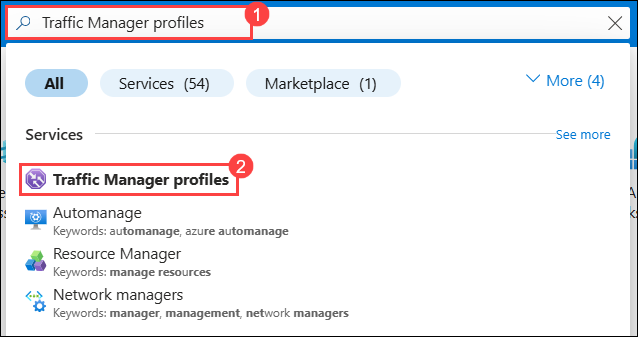

11. Select **+ Create**.

    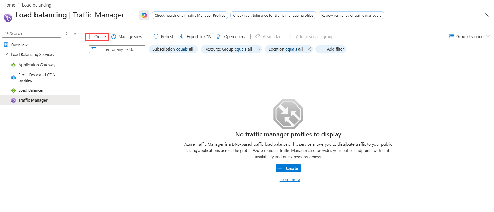

12. Fill in the following details and select **Create**:

    - **Name**: `contoso-tm-<inject key="DeploymentID" enableCopy="false"></inject>` **(1)**
    - **Routing method**: **Priority** **(2)**
    - **Subscription**: select your Azure subscription **(3)**
    - **Resource group**: `rg-migration-lab-app` **(4)**

      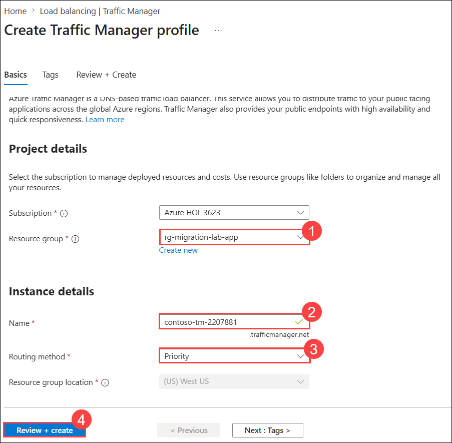

    > **Note**: **Priority** routing sends all traffic to the primary endpoint and only fails over to secondary when the primary is unhealthy. This is the correct mode for a DR failover scenario.

13. Once deployment completes, select **Go to resource**.

**Add the Primary Endpoint**

14. In the Traffic Manager profile left navigation, select **Settings** → **Endpoints**.

15. Select **+ Add**.

    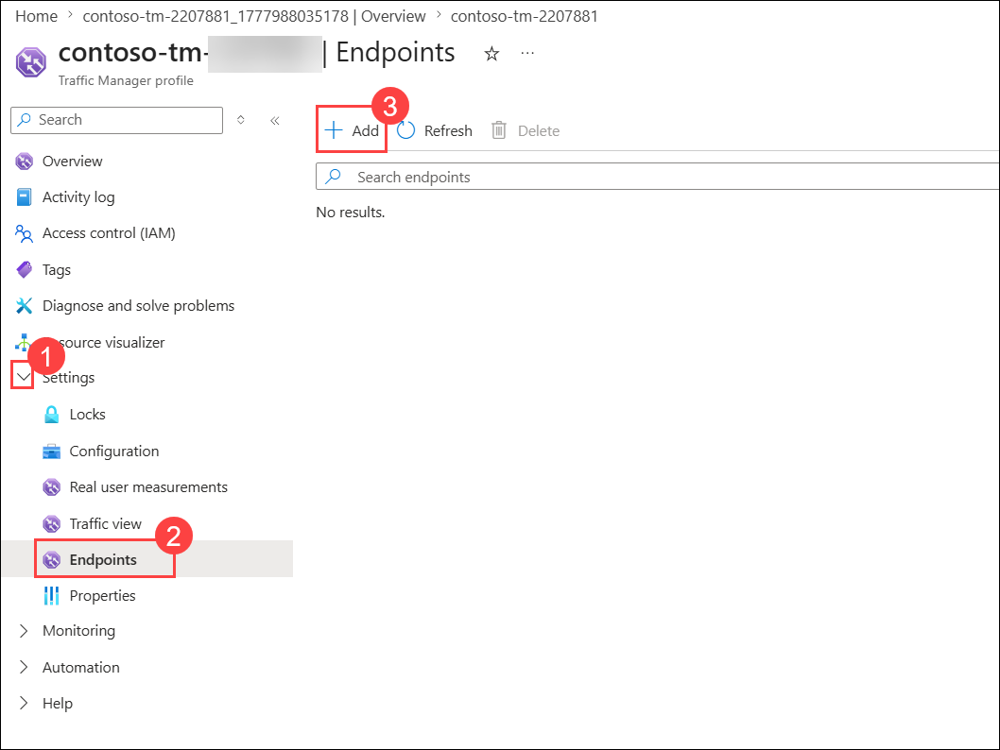

16. Fill in the following and select **Add**:

    - **Type**: **Azure endpoint** **(1)**
    - **Name**: `primary-eastus` **(2)**
    - **Target resource type**: **App Service** **(3)**
    - **Target resource**: `app-contoso-<inject key="DeploymentID" enableCopy="false"></inject>` **(4)**
    - **Priority**: `1` **(5)**

      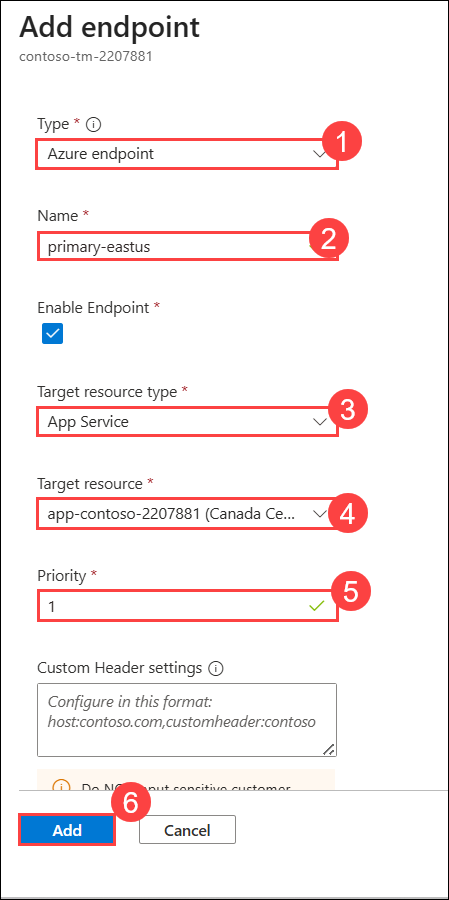

**Add the Secondary (DR) Endpoint**

17. Select **+ Add** again and fill in the following:

    - **Type**: **Azure endpoint** **(1)**
    - **Name**: `secondary-westcentralus` **(2)**
    - **Target resource type**: **App Service** **(3)**
    - **Target resource**: `app-contoso-dr-<inject key="DeploymentID" enableCopy="false"></inject>` **(4)**
    - **Priority**: `2` **(5)**

      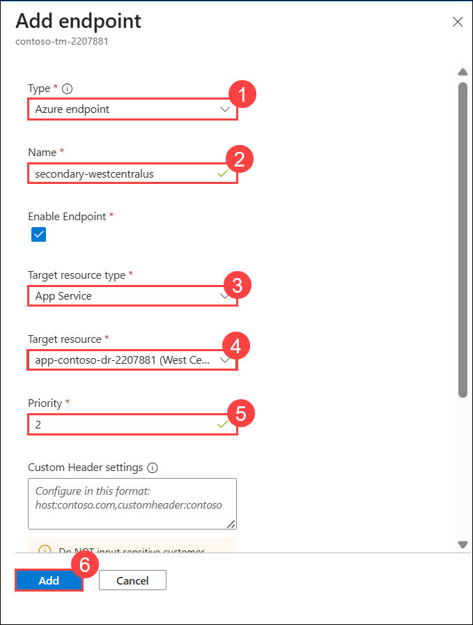

18. Select **Add**. Both endpoints should now appear with status **Enable**.

    > **Note**: If the status shows **Checking endpoint**, wait 1–2 minutes and refresh. Traffic Manager performs health checks before marking endpoints online.

1. If you are getting Monitor status as **Degraded** for Primary please select on pencil icon.

     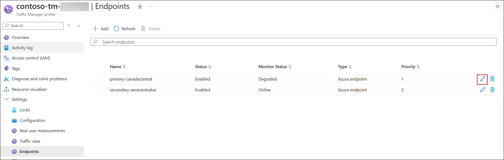

1. Select **Always serve traffic** under Health Checks and then click **Save**.

     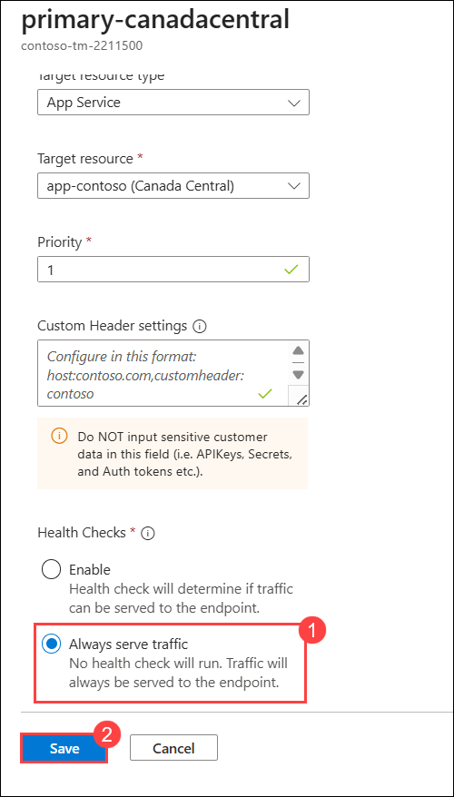

1. Again click pencil icon and Select **Enable** under Health Checks and then click **Save**.

     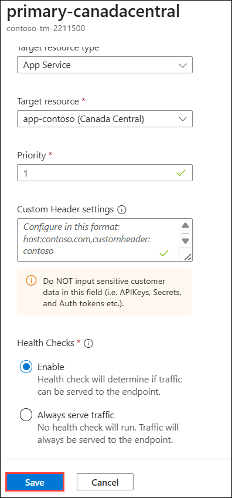

1. Then you will see the status as online.

     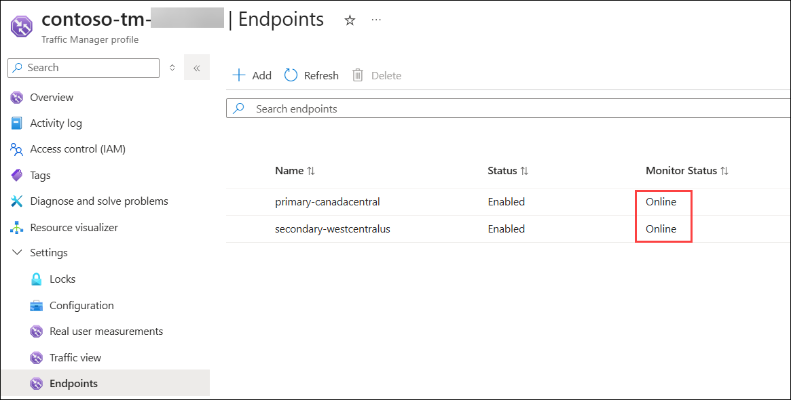

Traffic Manager is configured with primary and secondary endpoints.

---

## Task 4: Validate Failover Readiness

In this task, you test the Traffic Manager routing and simulate a failover to confirm the DR strategy works correctly.

**Verify Traffic Manager routing**

1. In the Traffic Manager profile overview page, note the **DNS name** — it follows the format `contoso-tm-<DeploymentID>.trafficmanager.net`.

   

2. Open **Microsoft Edge** on the VM and navigate to `http://contoso-tm-<DeploymentID>.trafficmanager.net`.

   Confirm the **Contoso Retail** home page loads and the products page shows 10 products.

   > **Note**: Traffic Manager works over HTTP/HTTPS. The browser may redirect to the primary App Service URL — this is expected behaviour.

   

3. In **PowerShell on the VM**, verify DNS resolution points to the primary endpoint:

   ```powershell
   Resolve-DnsName "contoso-tm-$DEPLOYMENT_ID.trafficmanager.net"
   ```

   Confirm the resolved address points to the primary App Service (`app-contoso-<DeploymentID>.azurewebsites.net`).

   

**Simulate a failover**

4. In the **Azure portal**, navigate to the Traffic Manager profile → **Settings** → **Endpoints**.

5. Select the **primary-eastus** endpoint and set **Status** to **Disabled**. Select **Save**.

   

   > **Note**: Disabling an endpoint simulates the primary region becoming unavailable. In a real DR event, this would happen automatically when Traffic Manager health checks fail.

6. Wait approximately 1–2 minutes for DNS TTL to expire and failover to propagate.

7. Back in **PowerShell**, run DNS resolution again:

   ```powershell
   Resolve-DnsName "contoso-tm-$DEPLOYMENT_ID.trafficmanager.net"
   ```

   Confirm the resolved address now points to the DR App Service (`app-contoso-dr-<DeploymentID>.azurewebsites.net`).


8. Open the Traffic Manager URL in the browser again. Confirm the application is still accessible — now being served from the **West US** DR region.


**Restore the primary endpoint**

9. In the Azure portal, navigate back to the Traffic Manager profile → **Endpoints** → select **primary-eastus** → set **Status** back to **Enabled** → **Save**.


10. Wait 1–2 minutes, then run the final readiness check from PowerShell:

    ```powershell
    Write-Host "=== DR READINESS CHECK ===" -ForegroundColor Cyan

    Write-Host "`n-- Primary App Service --" -ForegroundColor Yellow
    az webapp show `
      --name $APP_NAME `
      --resource-group $RG_APP `
      --query "{Name:name, State:state, URL:defaultHostName}" `
      --output table

    Write-Host "`n-- DR App Service --" -ForegroundColor Yellow
    az webapp show `
      --name $APP_NAME_DR `
      --resource-group $RG_DR `
      --query "{Name:name, State:state, URL:defaultHostName}" `
      --output table

    Write-Host "`n-- Traffic Manager Endpoints --" -ForegroundColor Yellow
    az network traffic-manager endpoint list `
      --profile-name "contoso-tm-$DEPLOYMENT_ID" `
      --resource-group $RG_APP `
      --output table

    Write-Host "`n=== CHECK COMPLETE ===" -ForegroundColor Green
    ```

11. Confirm all items in the table below match your output:

    | Resource | Expected Result |
    | --- | --- |
    | Primary App Service | `State: Running` |
    | DR App Service | `State: Running` |
    | `primary-eastus` endpoint | `Enabled`, priority `1` |
    | `secondary-westus` endpoint | `Enabled`, priority `2` |
    | App via Traffic Manager URL | Products page loads successfully |
    | DNS resolves back to primary | After re-enabling, resolves to primary App Service |

    

The failover strategy is validated and DR readiness is confirmed.

---

## Success Criteria

- Windows Server VM onboarded as an Azure Arc-enabled server with **Connected** status in the portal.
- Storage account `stcontoso<DeploymentID>` and container `appbackups` created.
- App Service backup configured with daily schedule and 7-day retention.
- Manual backup completed with **Succeeded** status.
- DR resource group `rg-migration-lab-dr` created in West US.
- DR App Service `app-contoso-dr-<DeploymentID>` deployed in West US with same application and settings.
- Traffic Manager profile `contoso-tm-<DeploymentID>` created with Priority routing.
- Primary endpoint (`primary-eastus`, priority 1) and secondary endpoint (`secondary-westus`, priority 2) both showing **Online**.
- Failover test completed — DNS resolved to DR endpoint when primary was disabled.
- Primary endpoint re-enabled and DNS resolved back to primary.
- DR readiness check script executed with all resources showing expected state.

---

## Learning Outcomes

- Onboard a Windows Server VM as an Azure Arc-enabled server for hybrid management.
- Configure App Service backup with a scheduled policy and verify a successful backup.
- Design and implement a regional failover strategy using Azure Traffic Manager with Priority routing.
- Simulate a failover event and validate DR behaviour using DNS resolution and browser testing.
- Use Azure CLI to provision and verify DR infrastructure across multiple regions.

---

## References

- Azure Arc overview: https://learn.microsoft.com/azure/azure-arc/servers/overview
- Onboard servers to Azure Arc: https://learn.microsoft.com/azure/azure-arc/servers/onboard-portal
- App Service backup and restore: https://learn.microsoft.com/azure/app-service/manage-backup
- Azure Traffic Manager overview: https://learn.microsoft.com/azure/traffic-manager/traffic-manager-overview
- Traffic Manager routing methods: https://learn.microsoft.com/azure/traffic-manager/traffic-manager-routing-methods
- App Service regional redundancy: https://learn.microsoft.com/azure/app-service/overview-disaster-recovery