# Challenge 4: Governance & Security

## Overview

This exercise applies governance controls and security hardening to the migrated web application. You will assign Azure Policies for App Service compliance, configure RBAC for application access, enable Microsoft Defender for Cloud and Azure Monitor with Application Insights, and secure application endpoints with HTTPS enforcement and access restrictions.

## Task 1: Apply Azure Policies for App Service Compliance

In this task, you will assign Azure Policies to enforce security and compliance rules for the App Service environment.

1. In the Azure portal, search for **Policy** **(1)** and select **Policy** **(2)**.

   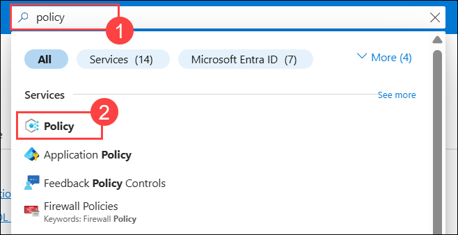

2. In the left navigation, select **Assignments**, then **Assign policy**.

   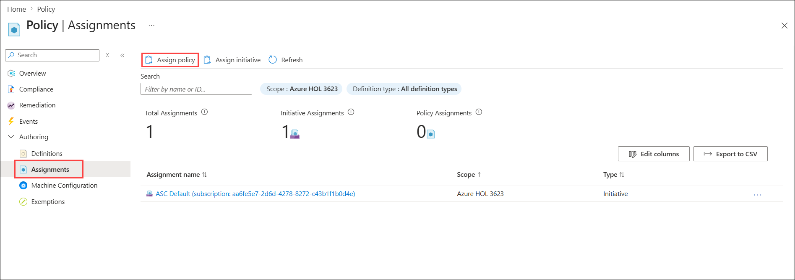

3. For each policy below, follow the assignment wizard:

**Policy 1: App Service apps should only be accessible over HTTPS**

1. On the **Basics** tab:
   - **Scope**: select the `rg-migration-lab` resource group **(1)**
   - **Policy definition**: search for and select `App Service apps should only be accessible over HTTPS` **(2)***

     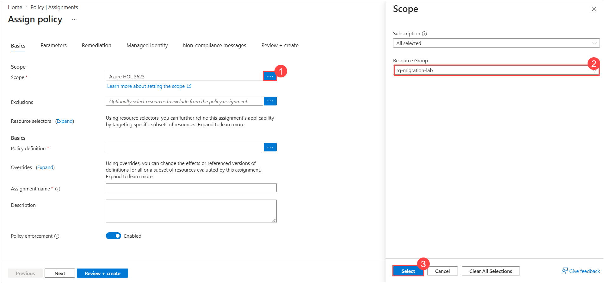

     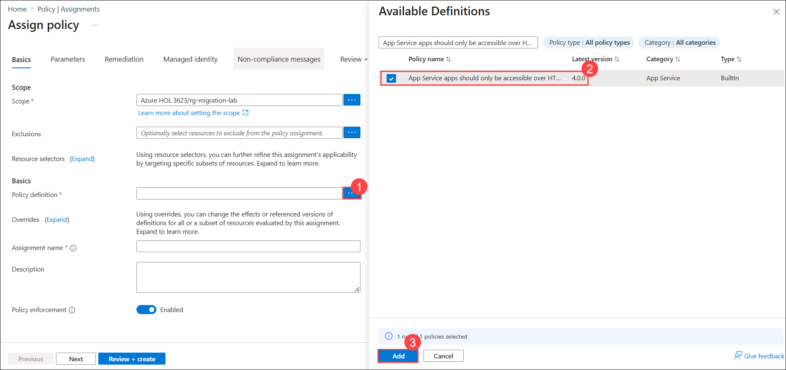

2. Select **Next** through **Parameters** and **Remediation** tabs.
3. On the **Non-compliance messages** tab, enter: `App Service must use HTTPS for all inbound traffic`. Select **Review + create**, then **Create**.

    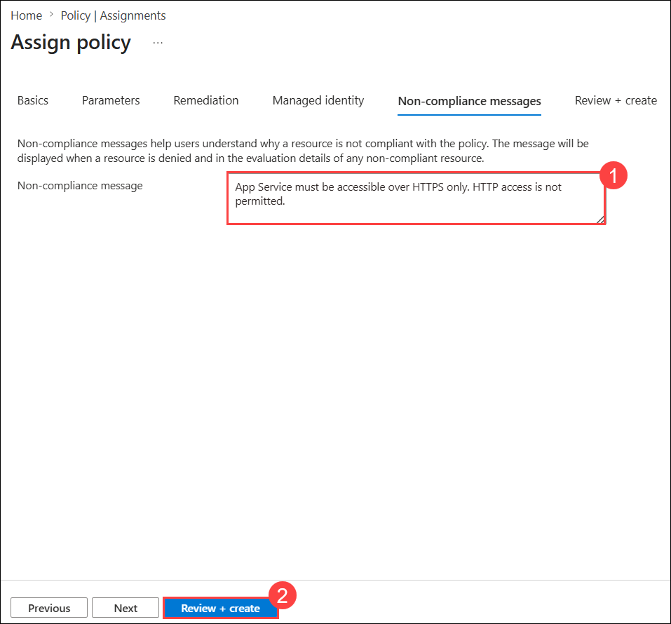

**Policy 2: App Service apps should use the latest TLS version**

1. Select **Assign policy** again.
2. On the **Basics** tab:
   - **Scope**: `rg-migration-lab`
   - **Policy definition**: search for `App Service apps should use the latest TLS version`

3. Select **Review + create**, then **Create**.

    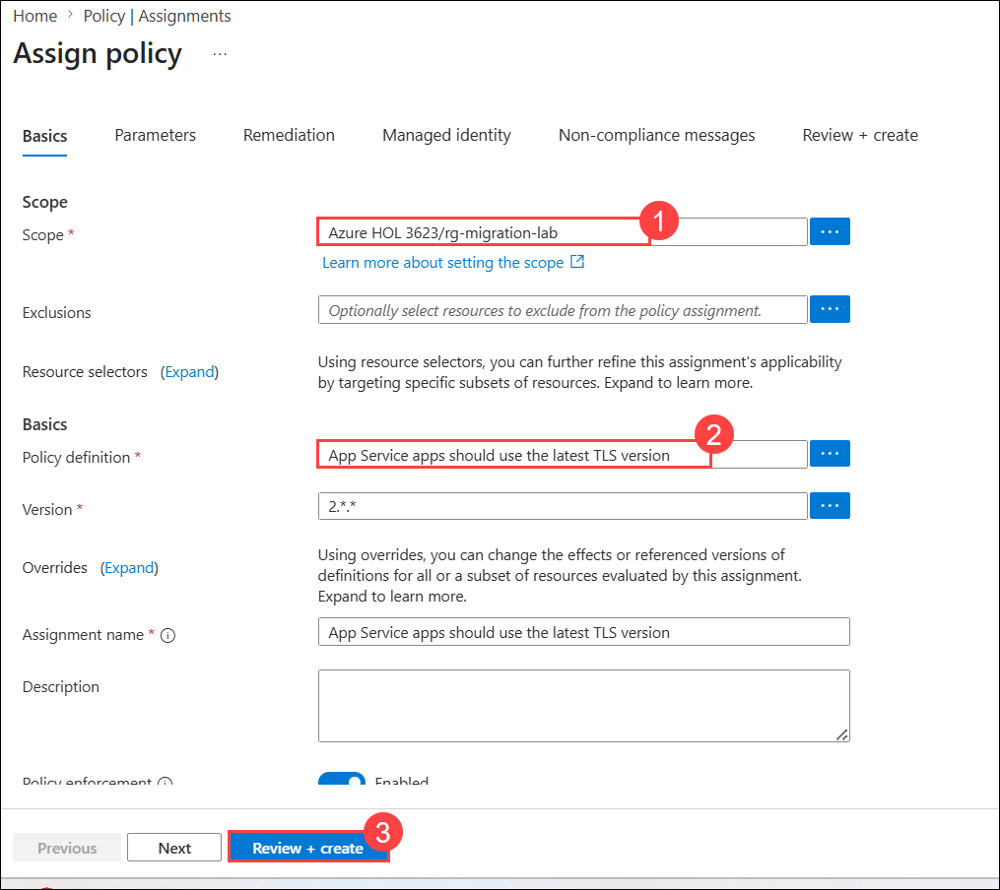

**Policy 3: App Service apps should have remote debugging turned off**

1. Select **Assign policy** again.
2. On the **Basics** tab:
   - **Scope**: `rg-migration-lab`
   - **Policy definition**: search for `App Service apps should have remote debugging turned off`

3. Select **Review + create**, then **Create**.

    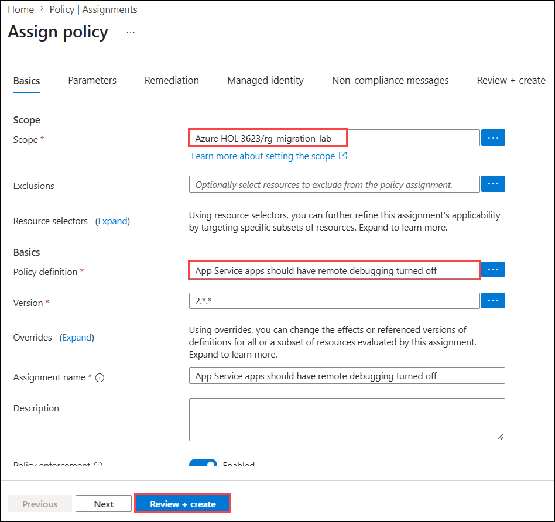

**Policy 4: App Service app slots should have resource logs enabled**

1. Select **Assign policy** again.
2. On the **Basics** tab:
   - **Scope**: `rg-migration-lab`
   - **Policy definition**: search for `App Service app slots should have resource logs enabled`

3. Select **Review + create**, then **Create**.

1. In **Policy**, select **Compliance** in the left navigation.
2. Filter by scope: `rg-migration-lab`.
3. Review the compliance state for each assigned policy.

    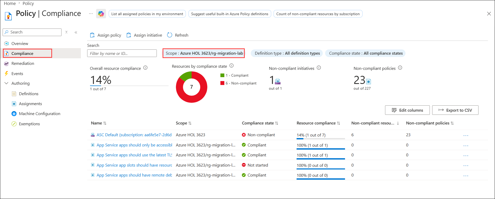

    > **Note:** Policy compliance evaluation can take up to 30 minutes for the initial scan. You may see **Not started** initially.

4. If any policy shows **Non-compliant**, navigate to the affected resource and remediate:
   - For HTTPS: In App Service > **Configuration** > **General settings**, set **HTTPS Only** to **On**
   - For TLS: Set **Minimum TLS Version** to **1.2**
   - For remote debugging: Set **Remote debugging** to **Off**

Azure Policies are assigned and compliance is being evaluated.

## Task 2: Configure RBAC for Application Access (Read Only)

**Step 1: Create a security group for application operators**

1. In the Azure portal, navigate to **Microsoft Entra ID** > **Groups**.
2. Select **New group**.
3. Configure:
   - **Group type**: Security
   - **Group name**: `AppServiceOperators`
   - **Membership type**: Assigned
4. Add lab user accounts that should have operational access to the App Service.
5. Select **Create**.

**Step 2: Assign RBAC roles at the resource group scope**

1. Open **rg-migration-lab** resource group.
2. Select **Access control (IAM)** in the left navigation.
3. Select **+ Add** > **Add role assignment**.

Assign the following roles:

| Role | Assignee | Purpose |
| --- | --- | --- |
| **Website Contributor** | `AppServiceOperators` group | Manage App Service resources (deploy, configure, restart) |
| **Reader** | All lab participants | View resources without modification rights |
| **SQL DB Contributor** | Database administrator account | Manage Azure SQL Database |
| **Monitoring Contributor** | `AppServiceOperators` group | Configure and manage monitoring settings |

For each role assignment:
1. Select the **Role** tab and search for the role name.
2. Select the role, then select **Next**.
3. On the **Members** tab, select **+ Select members**.
4. Search for and select the appropriate group or user.
5. Select **Review + assign**.

   

**Step 3: Verify RBAC assignments**

1. In **Access control (IAM)**, select **Role assignments** tab.
2. Verify all four role assignments appear in the list.
3. Select **Check access** and enter a user's name to verify their effective permissions.

   

RBAC is configured with least-privilege access.

## Task 3: Enable Microsoft Defender for Cloud and Azure Monitor

In this task, you will enable Microsoft Defender for Cloud and configure security monitoring for your Azure resources.

1. In the Azure portal, search for **Microsoft Defender for Cloud** **(1)** and select it **(2)**.

    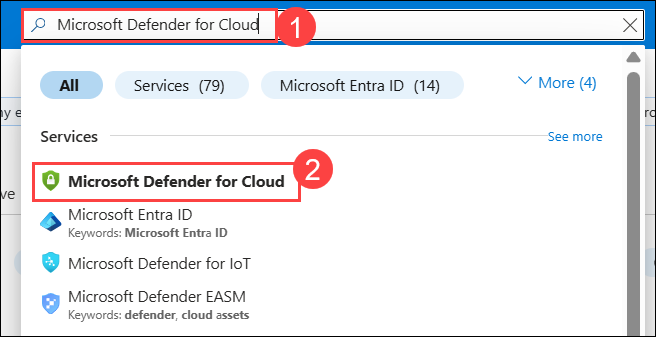

2. In the left navigation, select **Environment settings**.

3. Expand the management group/subscription tree and select your subscription.

    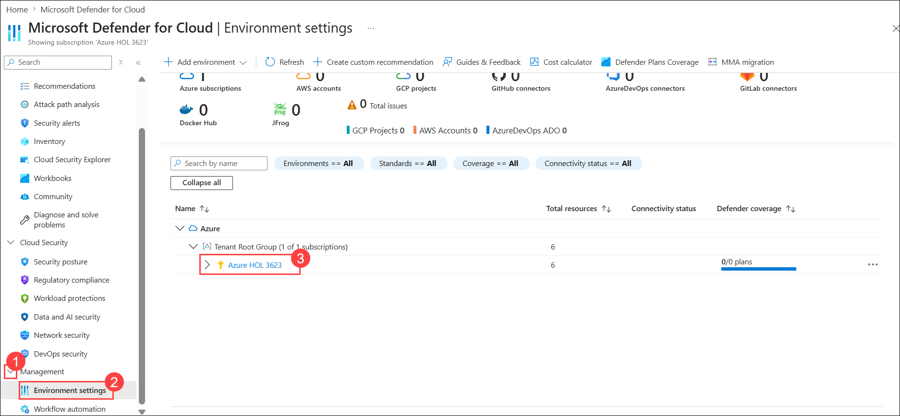

4. On the **Defender plans** page, ensure the following plans are **On**:

   | Plan | Status |
   | --- | --- |
   | **Defender for App Service** | On |
   | **Defender for Azure SQL** | On |
   | **Defender for Resource Manager** | On |

5. Select **Save**.

    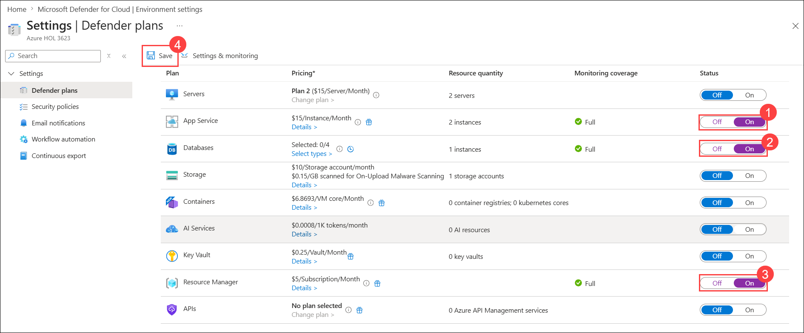

6. Return to **Defender for Cloud** > **Overview**.

7. Review the **Security posture** score and any recommendations for `rg-migration-lab` resources.

1. In the Azure portal, open **app-contoso-<inject key="Deployment ID" enableCopy="false"></inject>**.
2. In the left navigation, select **Alerts** under **Monitoring**.

3. Select **+ Create** > **Alert rule**.

    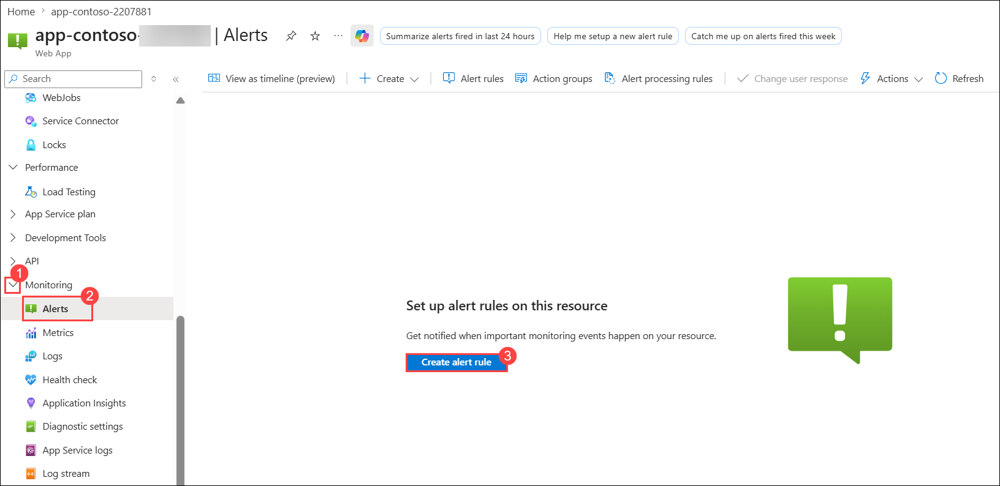

4. Configure the following alert:

   | Setting | Value |
   | --- | --- |
   | **Signal** | Http (4xx) |
   | **Threshold** | Greater than 5 |

     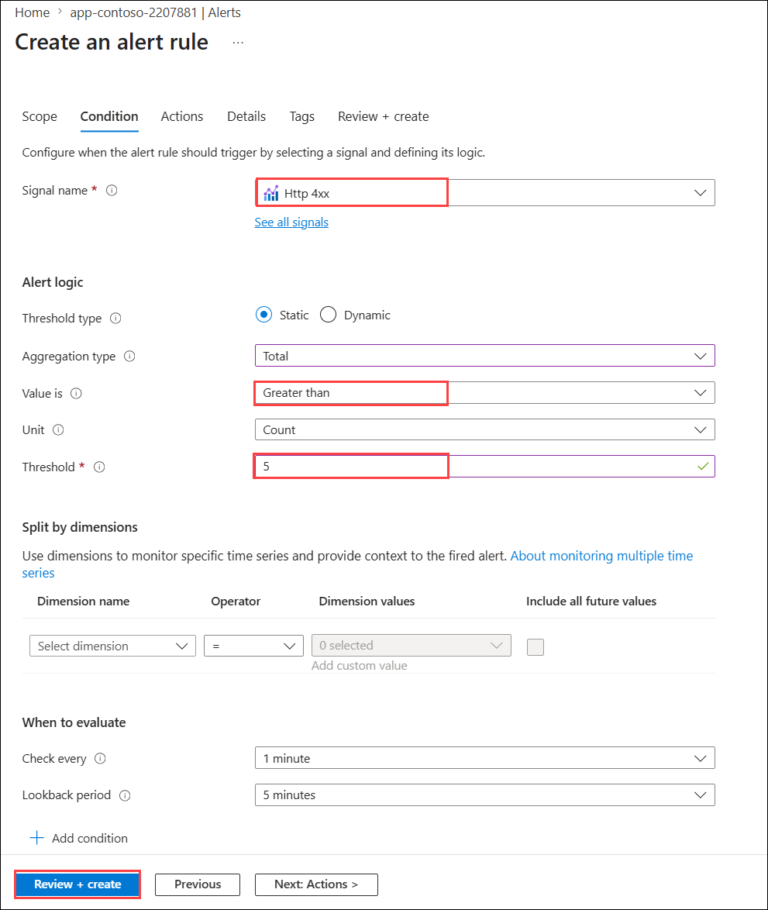

5. Under **Actions**, select **+ Create action group**:

   - **Action group name**: `ag-contoso-alerts`
   - **Notification type**: Email/SMS/Push/Voice
   - **Email**: enter a valid email address for alerts

     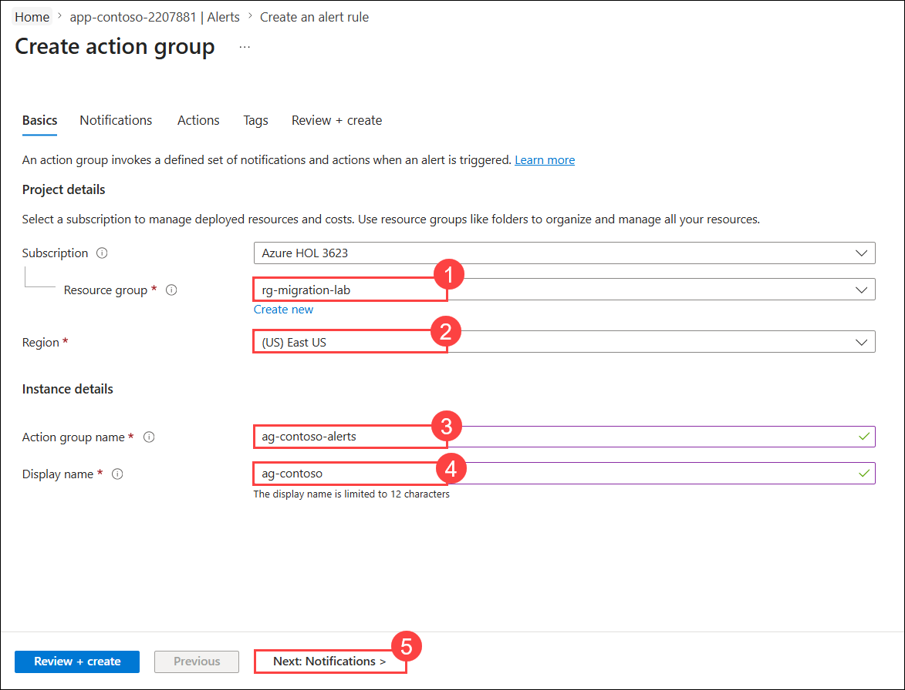

     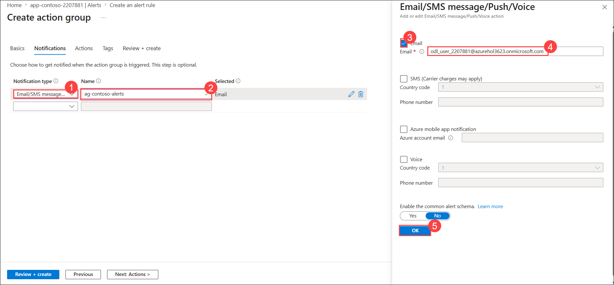

     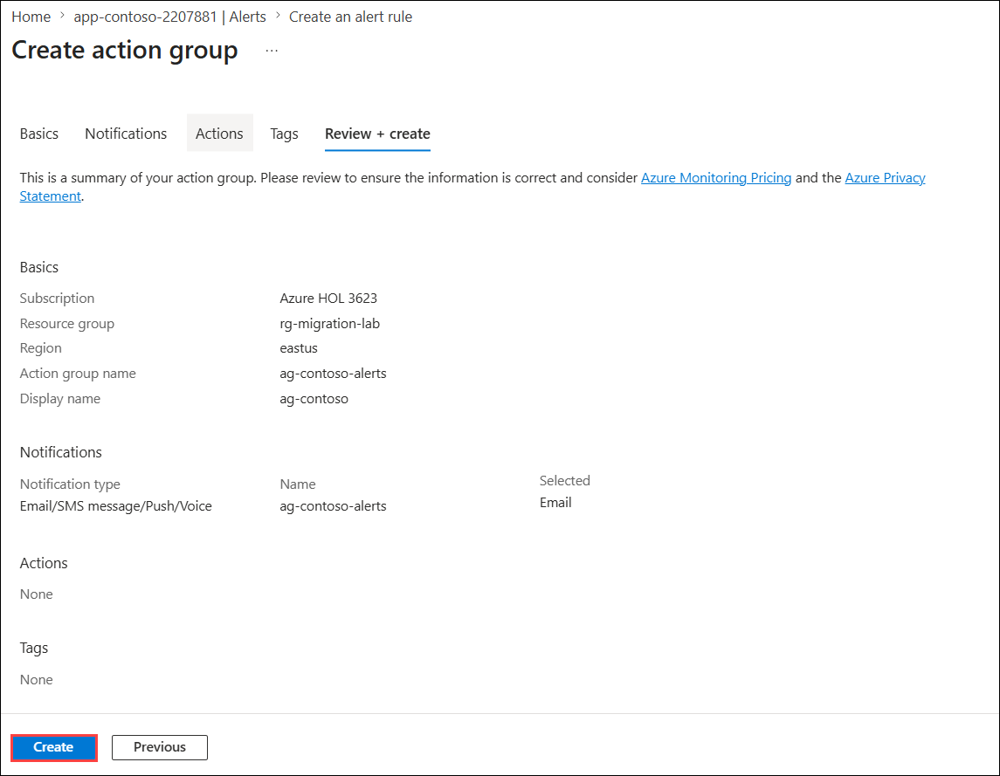

6. Under **Details**:

   - **Alert rule name**: `High 4xx Error Rate`

   - **Severity**: Sev 2 (Warning)

     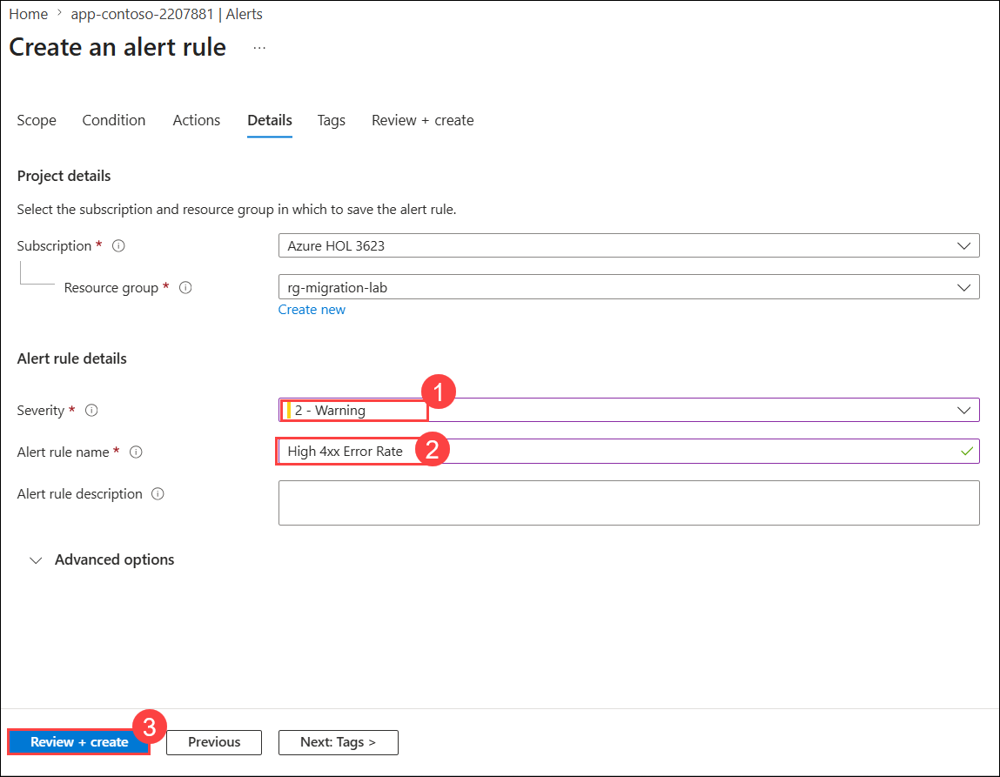

7. Select **Review + create**, then **Create**.

1. Open **Application Insights** > `ai-contoso-<inject key="Deployment ID" enableCopy="false"></inject>`.
2. Review the **Overview** page for:
   - **Server response time**
   - **Server requests**
   - **Failed requests**

      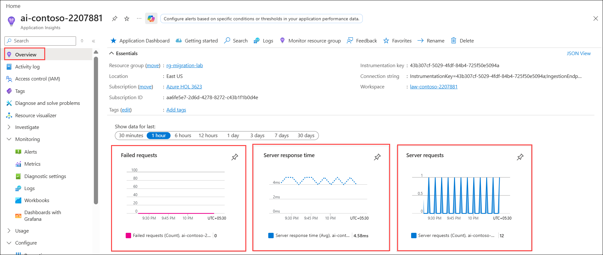

3. Select **Live Metrics** to view real-time telemetry.
4. Select **Application map** to visualize the application topology and dependencies.

Microsoft Defender for Cloud and Azure Monitor are fully configured.

## Task 4: Secure Application Endpoints

In this task, you will secure the application by enforcing HTTPS and setting the minimum TLS version.

1. In the Azure portal, open **ai-contoso-<inject key="Deployment ID" enableCopy="false"></inject>**.
2. In the left navigation, select **Configuration** > **General settings**.
3. Set **HTTPS Only** to **On**.
4. Set **Minimum TLS Version** to **1.2**.
5. Select **Save**.

1. Navigate to app service and click on default domain.

    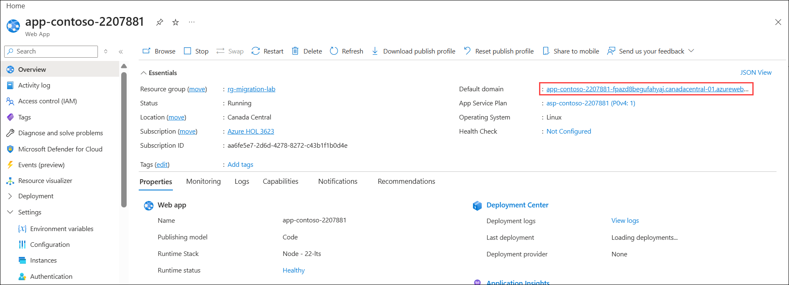

1. In the URL make it as http instead of https and hit enter.

    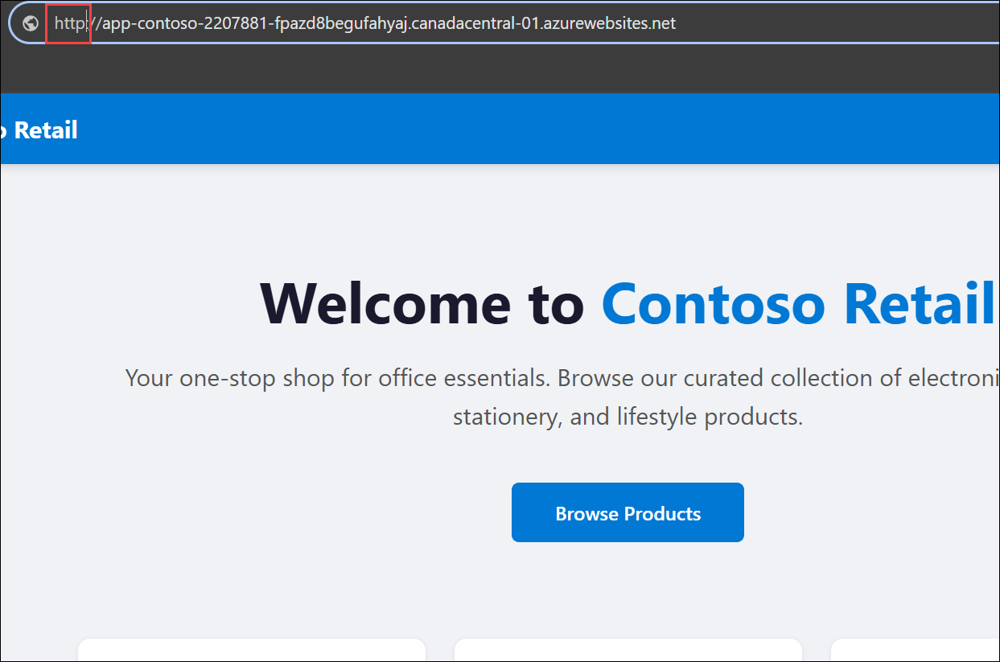

2. Verify the browser automatically redirects to `https://contoso-web-<DeploymentID>.azurewebsites.net`.

**Final security validation**

Run the following checks to confirm all security controls are in place:

| Check | Expected Status | How to Verify |
| --- | --- | --- |
| HTTPS Only | On | Configuration > General settings |
| Minimum TLS Version | 1.2 | Configuration > General settings |
| Remote debugging | Off | Configuration > General settings |
| VNet integration | Connected | Networking > VNet integration |
| Defender for App Service | On | Defender for Cloud > Environment settings |
| Application Insights | Connected | App Service > Application Insights |
| Alert rule | Active | Monitoring > Alerts |
| Azure Policy | Assigned (4 policies) | Policy > Assignments |

All security and governance controls are in place.

Evidence to capture:

- Screenshot of Azure Policy compliance page showing all four policies assigned.
- Screenshot of RBAC role assignments on the resource group.
- Screenshot of Defender for Cloud overview with security posture score.
- Screenshot of Application Insights overview dashboard.
- Screenshot of HTTPS Only configuration enabled.

## Success Criteria

- Four Azure Policies assigned to `rg-migration-lab`: HTTPS enforcement, latest TLS, remote debugging off, and resource logging.
- Policy compliance evaluation initiated (or fully compliant).
- `AppServiceOperators` security group created with appropriate RBAC roles.
- RBAC roles assigned: Website Contributor, Reader, SQL DB Contributor, and Monitoring Contributor.
- Microsoft Defender for Cloud enabled for App Service, Azure SQL, and Resource Manager.
- Application Insights resource created and connected to the App Service.
- Azure Monitor alert rule created for HTTP 5xx error rate.
- HTTPS Only set to **On** with minimum TLS version **1.2**.
- Remote debugging set to **Off**.
- Access restrictions configured with at least one Allow rule and default Deny.
- Final security validation checklist completed with all checks passing.

## Learning Outcomes

- Assign and evaluate built-in Azure Policies for App Service compliance.
- Configure role-based access control (RBAC) using least-privilege principles.
- Enable Microsoft Defender for Cloud plans for application and data security.
- Create and connect Application Insights for application performance monitoring.
- Configure Azure Monitor alert rules for proactive incident detection.
- Enforce HTTPS and TLS security on App Service endpoints.
- Perform a comprehensive security posture validation.

## References

- Azure Policy built-in definitions for App Service: https://learn.microsoft.com/azure/app-service/policy-reference
- Azure RBAC overview: https://learn.microsoft.com/azure/role-based-access-control/overview
- Azure RBAC built-in roles: https://learn.microsoft.com/azure/role-based-access-control/built-in-roles
- Microsoft Defender for Cloud: https://learn.microsoft.com/azure/defender-for-cloud/defender-for-cloud-introduction
- Defender for App Service: https://learn.microsoft.com/azure/defender-for-cloud/defender-for-app-service-introduction
- Application Insights overview: https://learn.microsoft.com/azure/azure-monitor/app/app-insights-overview
- Azure Monitor alerts: https://learn.microsoft.com/azure/azure-monitor/alerts/alerts-overview
- App Service security best practices: https://learn.microsoft.com/azure/app-service/overview-security
- Configure TLS mutual authentication: https://learn.microsoft.com/azure/app-service/app-service-web-configure-tls-mutual-auth
