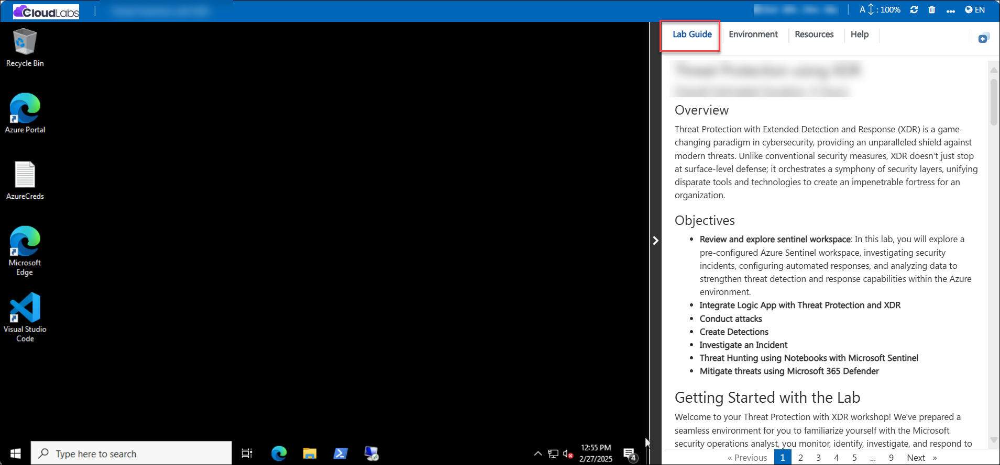
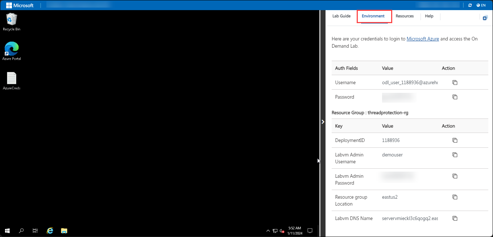
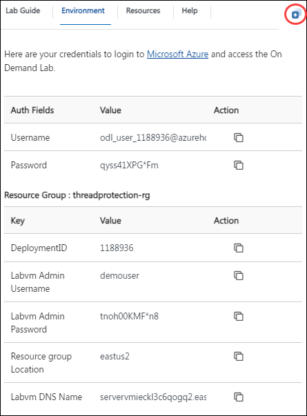
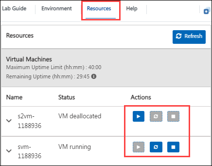
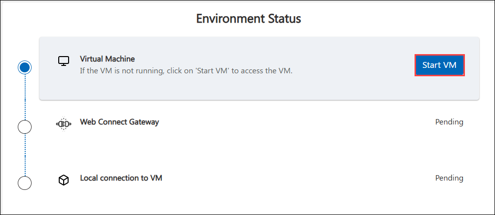
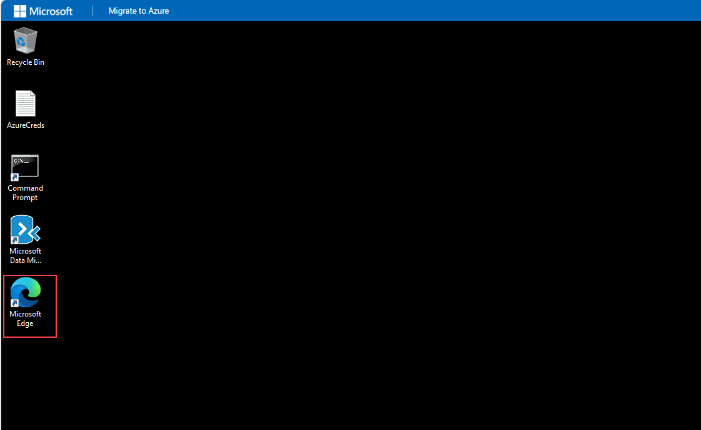
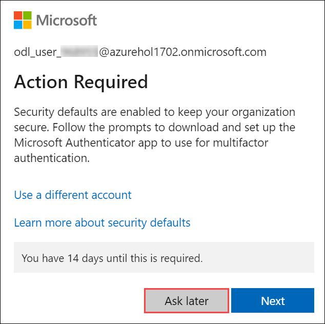
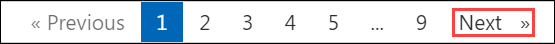

# Azure Migrate Tool Installation​ Workshop

## Overview
This hands-on workshop provides practical experience in migrating workloads to Azure using Azure Landing Zones, Azure Migrate, Azure Site Recovery, and related tools. Participants will deploy and configure Azure Landing Zones for governance and security, assess on-premises environments, migrate servers and applications, implement disaster recovery, and enable monitoring and security in Azure. The labs guide you through building a secure cloud foundation, assessing migration readiness, executing migrations, and ensuring business continuity with Azure services.

## Objectives

In this workshop, you will learn how to:

- Deploy and configure Azure Landing Zones with management groups, policies, and subscriptions.
- Understand Azure Landing Zone concepts, governance components, and automation benefits.
- Assess on-premises environments using Azure Migrate for discovery and dependency mapping.
- Migrate Windows and SQL Server workloads to Azure using Azure Migrate tools.
- Implement disaster recovery with Azure Site Recovery for Hyper-V VMs.
- Migrate web applications using App Service Migration Assistant and databases with Azure Database Migration Service.
- Onboard on-premises servers to Azure Arc for unified management.
- Enable security and monitoring with Microsoft Defender for Cloud, Microsoft Sentinel, and Azure Monitor.

## Day-by-Day Breakdown:

### **Day 1**
In these hands-on labs, you will deploy Azure Landing Zones, understand governance structures, add subscriptions, deploy application workloads in landing zones, and validate network configurations.

### **Day 2**
In these hands-on labs, you will assess migration readiness using Azure Migrate, configure environments for migration, evaluate business value and ROI, and perform server migrations to Azure.

### **Day 3**
In these hands-on labs, you will configure Azure Site Recovery for disaster recovery, perform test failovers, migrate applications and databases, onboard servers to Azure Arc, and enable security monitoring with Defender for Cloud and Sentinel.


## Getting Started with the Lab
 
Welcome to **Azure Migrate Tool Installation​** workshop! We've prepared a seamless environment for you to familiarize yourself with the Azure migration specialist, you monitor, assess, migrate, and optimize workloads in cloud environments and related Azure services. Let's begin by making the most of this experience:
 
## Accessing Your Lab Environment
 
Once you're ready to dive in, your virtual machine and lab guide will be right at your fingertips within your web browser.
 


## Virtual Machine & Lab Guide
 
Your virtual machine is your workhorse throughout the workshop. The lab guide is your roadmap to success.
 
## Exploring Your Lab Resources
 
To get a better understanding of your lab resources and credentials, navigate to the **Environment Details** tab.
 

 
## Utilizing the Split Window Feature
 
For convenience, you can open the lab guide in a separate window by selecting the **Split Window** button from the Top right corner.
 

 
## Managing Your Virtual Machine

1. Please note that the lab is available for **3 days (60 hours)** from the time it is launched. Within these 3 days, the **VM can be used for a total of 20 hours.**

1. Once the lab starts, the 60-hour access period begins. However, the VM will only run for up to 20 hours in total, and these hours are counted only when the VM is actively running.

1. We recommend stopping or pausing the VM whenever it is not in use. This will help save the remaining VM hours so they can be used later within the 3-day period. Also, we have implemented Idleness Tracking, if the VM is Idle for 60 minutes automatically VM goes to Stopped State.
 
1. Feel free to start, stop, or restart your virtual machine as needed from the **Resources** tab. Your experience is in your hands!
 
    

1. If the virtual machine is powered off, its status will be displayed as shown in the image below. In this case, click **Start VM** button to power it on. The startup process may take 2–5 minutes.

    

1. Once your VM loads, if the **Server Manager** opens, close the window by clicking the **X** button.

## Let's Get Started with Azure Portal
 
1. On your virtual machine, click on the Edge icon as shown below and open Azure Portal using the below link:

    ```
    https://portal.azure.com/
    ```
 
    

2. You'll see the **Sign into Microsoft Azure** tab. Here, enter your credentials:
 
   - **Email/Username:** <inject key="AzureAdUserEmail"></inject>
 
     
 
3. Next, provide your password:
 
   - **Temporary Access Pass:** <inject key="AzureAdUserPassword"></inject>
 
     

1. If you see the pop-up **Action Required**, click **Ask Later**.

     
 
4. If prompted to stay signed in, you can click **No**.

5. If a **Welcome to Microsoft Azure** pop-up window appears, simply click **Cancel** to skip the tour.

## Steps to Proceed with MFA Setup if "Ask Later" Option is Not Visible

1. At the **"More information required"** prompt, select **Next**.

1. On the **"Keep your account secure"** page, select **Next** twice.

1. **Note:** If you don’t have the Microsoft Authenticator app installed on your mobile device:

   - Open **Google Play Store** (Android) or **App Store** (iOS).
   - Search for **Microsoft Authenticator** and tap **Install**.
   - Open the **Microsoft Authenticator** app, select **Add account**, then choose **Work or school account**.

1. A **QR code** will be displayed on your computer screen.

1. In the Authenticator app, select **Scan a QR code** and scan the code displayed on your screen.

1. After scanning, click **Next** to proceed.

1. On your phone, enter the number shown on your computer screen in the Authenticator app and select **Next**.

1. If prompted to stay signed in, you can click "No."

1. If a **Welcome to Microsoft Azure** pop-up window appears, simply click "Maybe Later" to skip the tour.

1. If a **Welcome to Microsoft Azure** pop-up window appears, simply click **Cancel** to skip the tour.
 
1. Click **Next** from the bottom right corner to embark on your Lab journey!
 
     

Now you're all set to explore the powerful world of technology. Feel free to reach out if you have any questions along the way. Enjoy your workshop!
